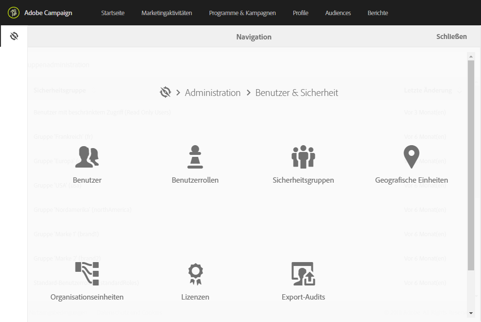
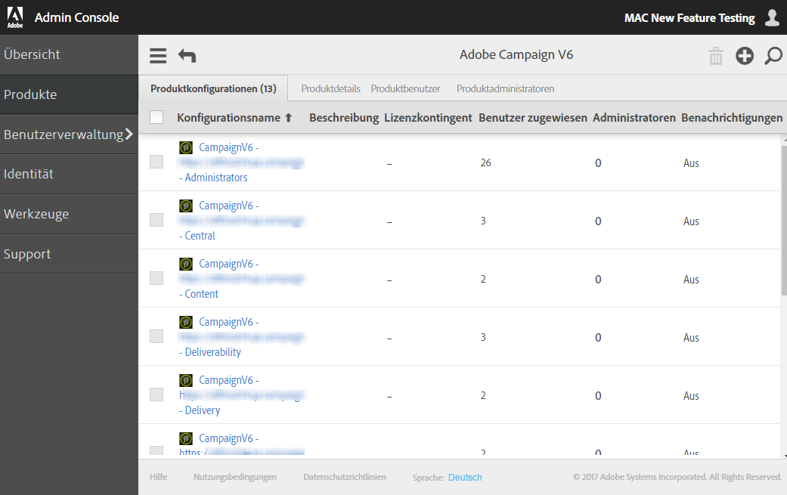

# Über die Zugriffsverwaltung{#about-access-management}

Adobe Campaign ermöglicht die Definition und Verwaltung von Genehmigungen, die den verschiedenen Benutzern erteilt werden können. Bei Genehmigungen handelt es sich um eine Gesamtheit an Rechten und Einschränkungen, die den Zugriff auf bestimmte Funktionalitäten oder Objekte der Benutzeroberfläche zulassen oder blockieren. Diese Genehmigungen beruhen auf zwei Konzepten:

* **Organisationseinheiten**: ermöglichen ein hierarchisches Genehmigungsmodell für verschiedene Plattformobjekte (E-Mails, Workflows, Vorlagen, Benutzer, Profile etc.). Lesen Sie diesbezüglich auch den Abschnitt [Organisationseinheiten](../../administration/using/organizational-units.md).
* **Benutzerrollen**: Gesamtheit an Einzelrechten zur Definition von Berechtigungen für Benutzer und Benutzergruppen. Lesen Sie diesbezüglich auch den Abschnitt [Liste der Rollen](../../administration/using/list-of-roles.md).

   Gemeinsam mit Organisationseinheiten bieten Rollen Benutzern eine gefilterte Ansicht der Benutzeroberfläche und definieren ihren Zugriff auf die unterschiedlichen Funktionen. Weiterführende Informationen hierzu finden Sie in der [Tabelle mit Berechtigungen](https://docs.campaign.adobe.com/doc/standard/en/Technotes/AdobeCampaign-ACSRights.pdf).

>[!IMPORTANT]
>
>Bitte beachten Sie, dass geografische Einheiten nicht weiterverwendet werden. Weiterführende Informationen hierzu finden Sie auf dieser [Seite](https://helpx.adobe.com/de/campaign/kb/acs-deprecated-and-removed-features.html).

Rollen, Gruppen und Organisationseinheiten können vom funktionalen Administrator der Plattform über das Menü **[!UICONTROL Administration > Benutzer &amp; Sicherheit]** verwaltet werden.

Die Verwaltung von Benutzern erfolgt über die Admin Console. Näheres hierzu finden Sie im Abschnitt [Gruppen und Benutzer verwalten](../../administration/using/managing-groups-and-users.md) oder der [Dokumentation zur Admin Console](https://helpx.adobe.com/de/enterprise/managing/user-guide.html).

>[!IMPORTANT]
>
>Nur Benutzer mit Administratorrechten haben Zugriff auf die Benutzerverwaltung.

**Verwandte Themen**

* [Organisationseinheiten](../../administration/using/organizational-units.md)
* [Liste der Rollen](../../administration/using/list-of-roles.md)
* [Gruppen und Benutzer verwalten](../../administration/using/managing-groups-and-users.md)

