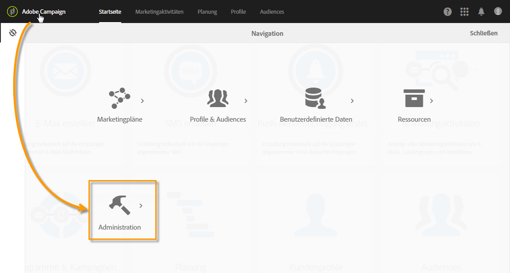
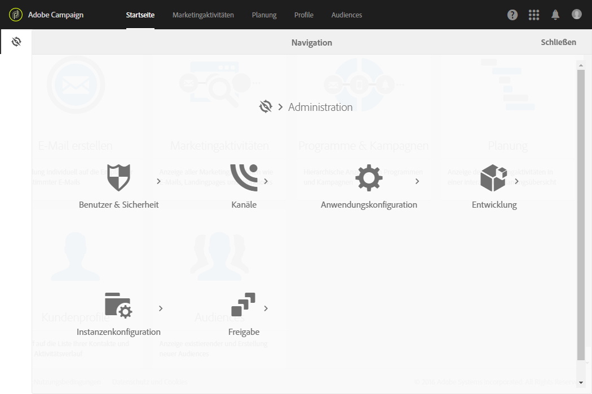

# Über die Verwaltung von Adobe Campaign{#about-administrating-adobe-campaign}

Als Cloud-basierte Lösung bietet Adobe Campaign Administratoren unterschiedliche Konfigurationsmöglichkeiten. Die Konfiguration der Infrastruktur erfolgt zwar durch Adobe, funktionale Administratoren haben aber dennoch folgende Möglichkeiten:

* Benutzer einladen, auf die Anwendung zuzugreifen, und Benutzergruppen sowie ihre Berechtigungen und Rollen verwalten
* Externe Konten konfigurieren, über die Adobe Campaign mit externen Servern verbunden werden kann
* Routing-Parameter für alle Kommunikationskanäle festlegen und konfigurieren
* Die Plattform mithilfe technischer Workflows überwachen
* Packages importieren und exportieren sowie das Datenmodell um neue Felder oder Ressourcen erweitern

>[!NOTE]
>
>Wenn Sie Fragen oder Anliegen zur Implementierung und Konfiguration haben, kontaktieren Sie Ihren Adobe-Kundenbetreuer.

Die verschiedenen Elemente zur Administration von Adobe Campaign sind über das Menü **[!UICONTROL Administration]** verfügbar. Auf diesen Bereich der Benutzeroberfläche können nur funktionale Plattform-Administratoren zugreifen.

Der Zugriff auf dieses Menü erfolgt über das **[!UICONTROL Adobe Campaign]**-Logo oben links im Bildschirm. Wählen Sie dann die Schaltfläche **[!UICONTROL Administration]**.

Folgende Menüs stehen zur Verfügung:

* [Benutzer &amp; Sicherheit](../../administration/using/about-access-management.md) - ermöglicht die Verwaltung der Zugriffsberechtigungen zur Plattform (Benutzer, Benutzerrollen, Sicherheitsgruppen, Geografische Einheiten und Organisationseinheiten).
* [Kanäle](../../administration/using/about-channel-configuration.md) - enthält die technischen Parameter in Bezug auf die Plattformkanäle (E-Mail, SMS) sowie die Typologie- und Quarantäneverwaltung.
* [Anwendungskonfiguration](../../administration/using/external-accounts.md) - ermöglicht die Konfiguration verschiedener Anwendungselemente (externe Konten, Optionen, technische Workflows).
* [Entwicklung](../../developing/using/data-model-concepts.md) - ermöglicht die Erstellung und Verwaltung benutzerdefinierter Ressourcen sowie den Zugriff auf Monitoring-Tools.
* [Instanzenkonfiguration](../../administration/using/branding.md) - erlaubt die Definition verschiedener Marken und ihrer Parameter (Logo, Trackingverwaltung, Domain der Landingpage-URLs etc.).
* [Freigabe](../../automating/using/managing-packages.md) - bietet Zugriff auf die Package-Exporte und -Importe.
* [Kundenmetriken](../../audiences/using/active-profiles.md): Adobe Campaign erstellt einen Bericht, in dem die Anzahl der aktiven Profile dargestellt wird. Dieser Bericht hat nur informativen Charakter und keine direkte Auswirkung auf die Rechnungsstellung.
* [Datenschutz-Tools](https://docs.campaign.adobe.com/doc/standard/getting_started/de/ACS_GDPR.html): In diesem Menü können Sie einen DSGVO-konformen Zugriff erstellen sowie Abfragen löschen und ihre Entwicklung verfolgen.

