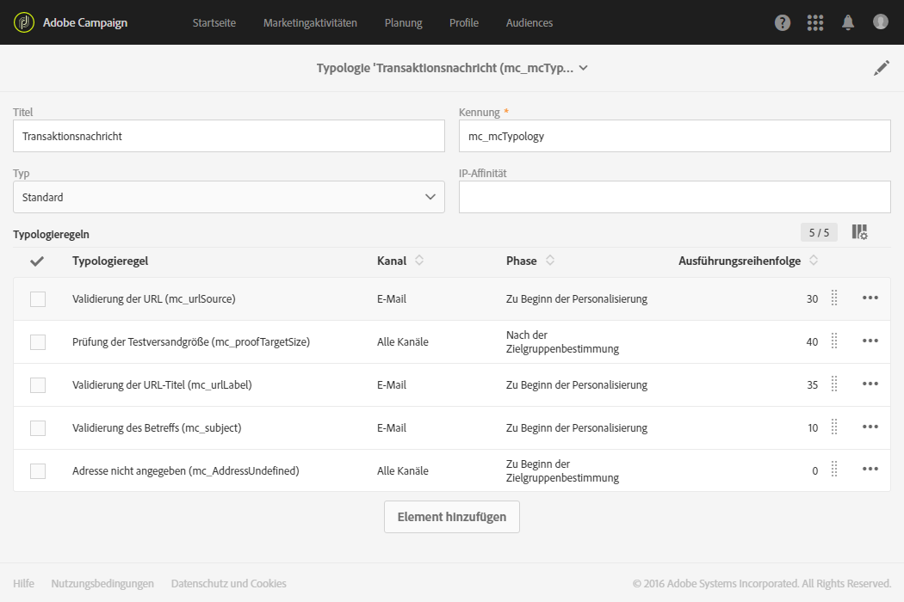
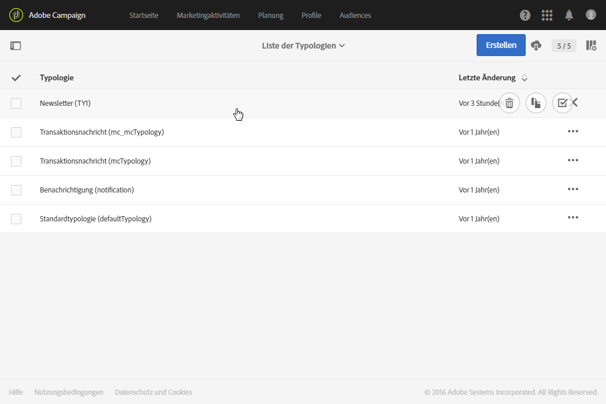
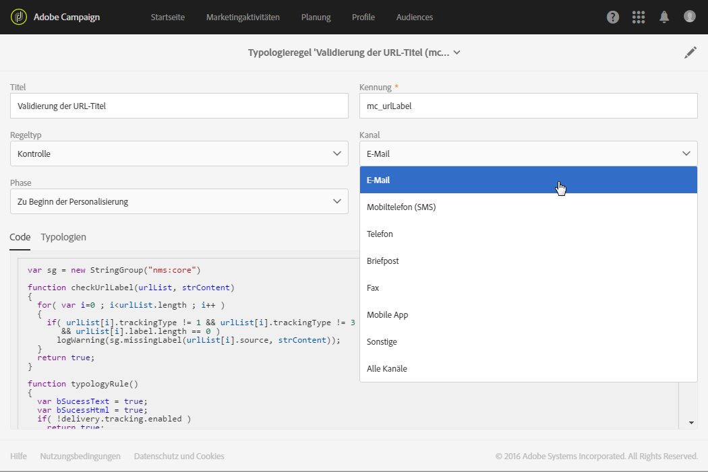
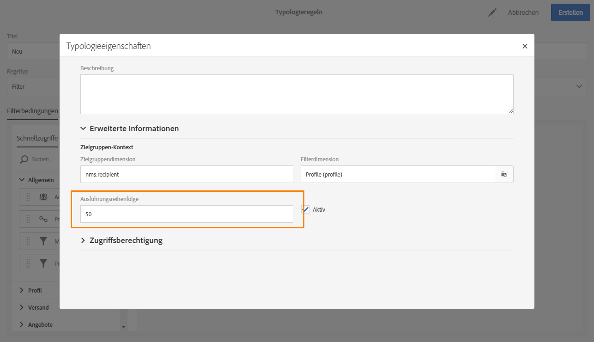
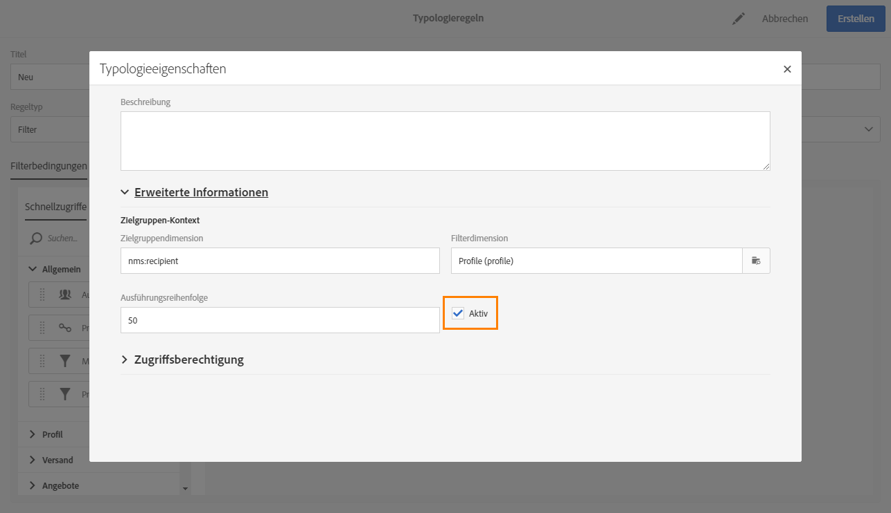
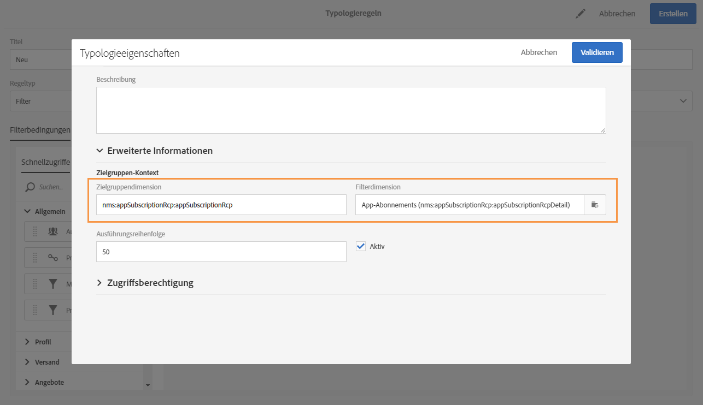

# Über Typologieregeln{#about-typology-rules}

Bei einer Typologie handelt es sich um eine Reihe von Regeln, die während der Nachrichten-Analysephase ausgeführt werden und die dazu dienen, Zielgruppe, Inhalt und Konfiguration diverser Elemente wie Betreff, URL, Bilder, Abmelde-Link, Testversandgröße etc. zu validieren.

In Adobe Campaign ist jede Nachricht mit einer Typologie verknüpft. Die Verknüpfung erfolgt in den erweiterten Parametern der Versandvorlageneigenschaften (weiterführende Informationen hierzu finden Sie im Abschnitt [Vorbereitung](../../administration/using/configuring-email-channel.md#preparation)).

>[!NOTE]
>
>Eine Nachricht kann jeweils nur mit einer Typologie verknüpft werden.

Für jede Typologie werden im Bereich **[!UICONTROL Typologieregeln]** die für diese Typologie gültigen Regeln aufgeführt.

## Typologien verwalten {#managing-typologies}

Standardmäßig sind mehrere Typologien in der Anwendung vorhanden. Sie können nach Bedarf auch eigene Typologien erstellen oder vorhandene abändern.

1. Öffnen Sie dazu die **[!UICONTROL Liste der Typologien]** über das Menü **[!UICONTROL Administration]** &gt; **[!UICONTROL Kanäle]** &gt; **[!UICONTROL Typologien]**.
1. Wählen Sie eine Typologie aus, um ihren Inhalt und ihre Eigenschaften zu bearbeiten oder erstellen Sie eine neue.

   

1. Definieren Sie den Typ der Typologie. Typologien können entweder Standard- oder Filtertypologien sein.
1. Fügen Sie die gewünschten Typologieregeln mithilfe der Schaltfläche **[!UICONTROL Element hinzufügen]** hinzu oder entfernen Sie diejenigen, die Sie nicht verwenden möchten.

   Sie können die Reihenfolge ändern, in der die Regeln für eine bestimmte Typologie angewendet werden. Verschieben Sie hierfür die Elemente auf dem Bildschirm in die gewünschte Reihenfolge. Dabei werden die Nummern für die Ausführungsreihenfolge automatisch neu berechnet. Der Regelanwendungsmodus wird im Abschnitt [Ausführungsreihenfolge von Typologieregeln](../../administration/using/about-typology-rules.md#typology-rules-execution-order) erläutert.

   Die in diesem Bildschirm angezeigten Regeln sind schreibgeschützt.

Ihre Typologie kann nun verwendet werden. Sie können sie über die Nachrichteneigenschaften oder die Nachrichtenvorlagen-Eigenschaften auswählen.

>[!NOTE]
>
>Mit dem Feld **[!UICONTROL IP-Affinität]** können Sie die Affinitäten Ihrer Konfiguration entsprechend verwalten. Diese sind in der Konfigurationsdatei der Instanz definiert. Wenn Sie die Affinitäten verwenden möchten, wenden Sie sich an Ihren Administrator.

## Typologieregeln    {#typology-rules}

Typologieregeln sind Unternehmensregeln, die während der Vorbereitung der Nachricht angewendet werden. Mithilfe dieser Regeln wird geprüft, ob eine Nachricht gültig ist und Ihre Qualitätskriterien erfüllt. Zudem wird festgestellt, ob jedes Mitglied der Ziel-Audience berechtigt ist, die jeweilige Nachricht zu erhalten.

Typologieregeln sind verfügbar über das Menü **[!UICONTROL Administration]** &gt; **[!UICONTROL Kanäle]** &gt; **[!UICONTROL Typologien]** &gt; **[!UICONTROL Typologieregeln]**.

Es gibt zwei Arten von Regeln:

* Mit **Filterregeln** können Sie einen Teil der Nachrichten-Zielgruppe anhand von in einer Abfrage definierten Kriterien ausschließen. Mögliche Kriterien sind zum Beispiel Profile in Quarantäne oder Profile, die bereits eine bestimmte Anzahl an E-Mails erhalten haben. Näheres dazu finden Sie unter [Filterregeln](../../administration/using/filtering-rules.md).
* Mit **Ermüdungsregeln** können Sie eine Höchstzahl an Nachrichten festlegen, die an jedes Profil gesendet wird. Auf diese Weise stellen Sie sicher, dass die einzelnen Profile nicht zu häufig angesprochen werden. Näheres dazu finden Sie unter [Ermüdungsregeln](../../administration/using/fatigue-rules.md).
* Mit **Kontrollregeln** kann der Benutzer die Gültigkeit und Qualität der Nachrichten vor dem Versand überprüfen. Dabei werden beispielsweise die Zeichenanzeige, die Größe von SMS-Nachrichten, das Adressformat etc. überprüft. Näheres dazu finden Sie unter [Kontrollregeln](../../administration/using/control-rules.md).

Eine Typologieregel kann auf nur einen Kanal oder auf alle Kanäle angewendet werden.

In den **[!UICONTROL Eigenschaften]** einer Typologieregel können Sie deren Ausführungsreihenfolge festlegen. Wenn mehrere Regeln angewendet werden müssen, wird durch die Ausführungsreihenfolge jeder Regel bestimmt, welche zuerst ausgeführt wird. Lesen Sie diesbezüglich auch den Abschnitt [Ausführungsreihenfolge von Typologieregeln](../../administration/using/about-typology-rules.md#typology-rules-execution-order).

Eine Typologieregel kann über **[!UICONTROL Eigenschaften]** deaktiviert werden, wenn die Regel zum Zeitpunkt der Analyse der von der Regel betroffenen Nachrichten nicht angewendet werden soll.

In der Kategorie **[!UICONTROL Zielgruppen-Kontext]** können Sie entsprechend den gewünschten Daten die **Zielgruppendimension** und die **Filterdimension** auswählen.

Standardmäßig werden für die Filterung **[!UICONTROL Profile]** herangezogen. Wenn sich die Regel beispielsweise auf eine Mobile App bezieht, kann für die **[!UICONTROL Filterdimension]** **[!UICONTROL App-Abonnements]** gewählt werden.

## Ausführungsreihenfolge von Typologieregeln    {#typology-rules-execution-order}

Die Typologieregeln werden in der Reihenfolge ausgeführt, die während der Zielgruppenbestimmung, Analyse und Nachrichtenpersonalisierung festgelegt wird.

Im Standard-Ausführungsmodus werden die Regeln in der folgenden Reihenfolge ausgeführt:

1. Kontrollregeln, wenn sie zu Beginn der Zielgruppenbestimmung angewendet werden
1. Filterregeln:

   * Nativ in der Anwendung enthaltene Regeln für die Adressenqualifizierung: definierte Adressen/nicht überprüfte Adressen/Adressen auf der Blacklist/Adressen in Quarantäne/Adressenqualität
   * Vom Benutzer definierte Filterregeln

1. Kontrollregeln, wenn sie am Ende der Zielgruppenbestimmung angewendet werden
1. Kontrollregeln, wenn sie zu Beginn der Personalisierung angewendet werden
1. Kontrollregeln, wenn sie am Ende der Personalisierung angewendet werden

Sie können die Ausführungsreihenfolge für Regeln desselben Typs jedoch in jeder Typologie anpassen. Wenn während einer Nachrichtenverarbeitungsphase mehrere Regeln ausgeführt werden, können Sie sogar wählen, in welcher Reihenfolge sie angewendet werden sollen.

Eine Filterregel, die in der Ausführungsreihenfolge an Position 20 steht, wird zum Beispiel vor einer Filterregel ausgeführt, die in der Ausführungsreihenfolge an Position 30 steht.
