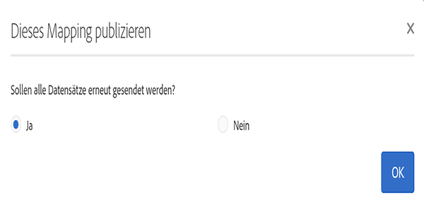

# Aktivierung zuordnen {#mapping-activation}

>[!IMPORTANT]
>
>Der Campaign Standard-Datendienst befindet sich derzeit in der Betaphase, die möglicherweise ohne Vorankündigung häufig aktualisiert wird. Kunden müssen auf Azurblau gehostet werden (derzeit nur in der Beta-Version für Nordamerika), um auf diese Funktionen zugreifen zu können. Wenden Sie sich an den Adobe-Kundendienst, wenn Sie Zugriff haben möchten.

Nach Abschluss der Zuordnungsdefinition können Sie die Zuordnung veröffentlichen. Nach der Bereitstellung wird die Datenreplikation zwischen Campaign Standard und Adobe Experience Platform automatisch gestartet. Sie können die Replizierung jederzeit beenden, indem Sie auf die Schaltfläche **[!UICONTROL Beenden]**klicken.

Je nach Ihren Zuordnungsänderungen können Sie festlegen, dass alle Ihre Datensätze an Adobe Experience Platform weitergeleitet werden.

Auf der Bereitstellungskachel können Sie auf das Veröffentlichungsprotokoll und die Exportprotokolle zugreifen.

Auf der Registerkarte &quot; **[!UICONTROL Exportaufträge]**&quot;können Sie den Exportauftrag für die veröffentlichte Zuordnung überwachen.

Wenn Sie alle Datenexportaufträge überwachen möchten, gehen Sie zu **[!UICONTROL Administration]**>**[!UICONTROL  Entwicklung]** > **[!UICONTROL Plattform]**>**[!UICONTROL  Status des Datenexports in das Plattformmenü]** .

Status des Datenerfassungsauftrags:

* **[!UICONTROL Erstellt]**: Es wird ein Datenerfassungsauftrag erstellt und die Datenerfassung wird ausgeführt.
* **[!UICONTROL Fehlgeschlagen]**: Ein Datenerfassungsauftrag ist fehlgeschlagen. Das Feld &quot;Grund&quot;beschreibt den Grund für den Fehler. Fehler können vorübergehend oder dauerhaft sein. Bei vorübergehenden Fehlern wird nach einem konfigurierten Intervall ein neuer Erfassungsauftrag erstellt. Als ersten Schritt zur Fehlerbehebung können Benutzer das Feld Grund des Fehlers überprüfen. Wenn der Grund einen Benutzer zur Adobe Experience Platform-Benutzeroberfläche weiterleitet, kann sich der Benutzer bei Adobe Experience Platform anmelden und den Stapelstatus im Datensatz prüfen, um den genauen Fehlergrund zu ermitteln.
* **[!UICONTROL Hochgeladen]**: Zuerst wird ein Stapel in Adobe Experience Platform erstellt und dann werden Daten in den Stapel aufgenommen. Das Feld Stapel-ID zeigt die Stapel-ID für den Stapel in Adobe Experience Platform an. Adobe Experience Platform führt auch eine Beitragsüberprüfung für den Stapel durch. Der Stapel wird zuerst als hochgeladen markiert, bis Adobe Experience Platform den Überprüfungsschritt abgeschlossen hat. Ein Auftrag fragt Adobe Experience Platform nach dem Hochladen nach dem Status des Stapels ab. Ein Stapel kann in Adobe Experience Platform entweder in der Beitragsvalidierung &quot;Fehlgeschlagen&quot;oder in der Beitragsvalidierung &quot;Erfolg&quot;ausgeführt werden.
* **[!UICONTROL Erfolg]**: Nach dem Hochladen eines Stapels auf die Adobe Experience Platform wird der Status des Auftrags (nach der Überprüfung in der Plattform) nach einem konfigurierten Intervall überprüft. Der Status &quot;Erfolg&quot;hat eine erfolgreiche Datenerfassung in Adobe Experience Platform identifiziert.
