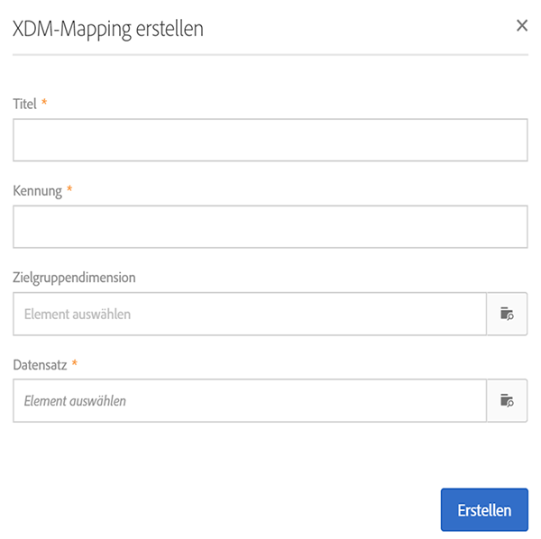
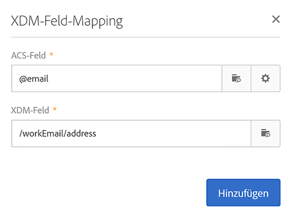
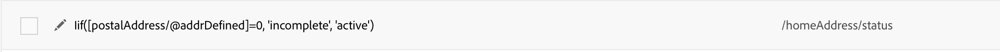
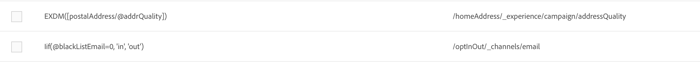

# Mapping-Definition {#mapping-definition}

>[!IMPORTANT]
>
>Der Campaign Standard-Datendienst befindet sich derzeit in der Betaphase, die häufig ohne Vorankündigung aktualisiert werden kann. Kunden müssen auf Azure gehostet werden (derzeit nur für Nordamerika in der Betaphase), um auf diese Funktionen zugreifen zu können. Wenden Sie sich an die Adobe-Kundenunterstützung, wenn Sie Zugriff haben möchten.

In diesem Abschnitt erfahren Sie, wie Sie ein Campaign Standard-Feld auf ein XDM-Feld (Experience-Datenmodell) abbilden.

Zur Durchführung dieser Aufgabe sind folgende Voraussetzungen erforderlich:

* XDM-Schemadefinition über die Oberfläche oder die REST-API, die XDM zugeordnet ist
* Datensatzerstellung anhand der XDM-Schemadefinition

1. Gehen Sie zu **[!UICONTROL Administration]** > **[!UICONTROL Development]** > **[!UICONTROL Platform]** und wählen Sie den **[!UICONTROL Data mappings]** Eintrag.

1. Click on **[!UICONTROL Create]** to start a new XDM mapping.

   

1. Füllen Sie die erforderlichen Felder aus und wählen Sie:

   * eine **Zielgruppendimension**: dies ist das Campaign Standard-Schema, das abgebildet werden soll
   * einen **Datensatz**: dies ist das Datenpaket, das einem XDM-Schema in Adobe Experience Platform zugeordnet ist.

>[!NOTE]
>
>Damit ein Batch in das Echtzeit-Kundenprofil oder den Identitätsdienst aufgenommen werden kann, muss der Datensatz für [Echtzeit-Kundenprofil aktiviert](https://docs.adobe.com/content/help/en/experience-platform/rtcdp/intro/get-started.html) werden.
>
>Wenn der ausgewählte Datensatz bereits in einem vorhandenen Daten-Mapping verwendet wird, wird ein Warnhinweis angezeigt, der Sie darüber informiert, dass Ihre Daten in Adobe Experience Platform möglicherweise überschrieben werden. Dies kann passieren, wenn es einige gemeinsame Empfänger in Daten-Mappings gibt, die den gleichen Datensatz verwenden.

The following screen presents the **[!UICONTROL Field mappings]** section where you can create a new mapping for each field in the Campaign Standard schema.

The **[!UICONTROL Create new field mapping]** button allows you to select the Campaign Standard field and the corresponding field path expression in the XDM schema.

Wenn Sie ein Campaign Standard-Feld nicht finden können, können Sie das Suchfeld verwenden, um nach dem Feld zu suchen. Derzeit funktioniert die Suche nur für Felder, die in der Hierarchie geöffnet sind.

Die in Campaign Standard definierten erweiterten Ressourcen werden wie alle nativen Felder abgebildet. Sie werden in der _customer/default“-Erweiterung in XDM definiert.

Sie können die XDM-Erweiterung über die API anpassen und Ihre eigene Erweiterung definieren, um die Kontrolle über das Mapping zu verbessern.

Weitere Informationen zur XDM-API finden Sie im [Tutorial zur Schema Registry-API](https://docs.adobe.com/content/help/en/experience-platform/xdm/api/getting-started.html).

Um ein Auflistungsfeld abzubilden, müssen Sie den Ausdruckseditor verwenden, um jeden Auflistungswert zu definieren, der dem XDM-Wert entspricht. So muss zum Beispiel postAdressfield wie folgt definiert werden:

Wenn der XDM-Wert als Auflistung im XDM-Schema definiert ist, können Sie die native EXDM-Funktion verwenden, die die **lif**-Syntax automatisch ersetzt.

Um ein XDM-Mapping zu bearbeiten, öffnen Sie es, ändern Sie die gewünschten Informationen und speichern Sie es.

>[!IMPORTANT]
>
>For now, if you edit a value in the **[!UICONTROL Field mappings]** section then click outside of the field, your change does not display in the interface until you click the **[!UICONTROL Save]** button. This behaviour occurs only once, when the edit on **[!UICONTROL Field Mappings]** is the first edit on the page.
