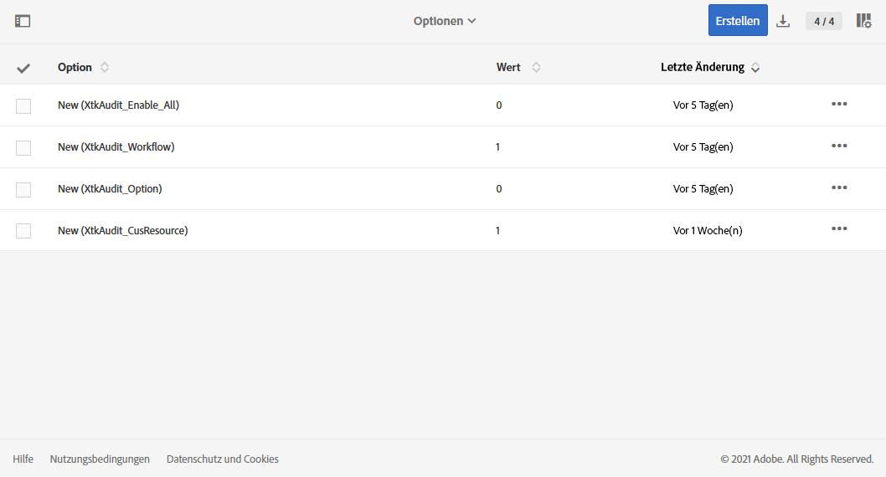

# Audit-Protokoll {#audit}

Das **[!UICONTROL Audit-Protokoll]** bietet Ihnen Zugriff auf den vollständigen Verlauf der Änderungen, die in Ihrer Instanz vorgenommen wurden.

Das **[!UICONTROL Audit-Protokoll]** erfasst in Echtzeit zahlreiche Aktionen und Ereignisse, die in Ihrer Adobe Campaign Standard-Instanz auftreten. Es bietet eine Möglichkeit für den Zugriff auf einen Datenverlauf, um zum Beispiel folgende Fragen zu beantworten: Was ist mit Ihren Workflows, benutzerdefinierten Ressourcen und Optionen geschehen und wer hat sie zuletzt aktualisiert? Was haben Ihre Benutzer in der Instanz getan?

**[!UICONTROL Audit-Protokoll]** besteht aus drei Komponenten:

* **Audit-Protokoll für benutzerdefinierte Ressourcen**: Überprüft die Aktivität und die letzte Änderung an den benutzerdefinierten Ressourcen.

  Weiterführende Informationen zu **[!UICONTROL benutzerdefinierten Ressourcen]** finden Sie auf dieser [Seite](../../developing/using/key-steps-to-add-a-resource.md).

* **Audit-Protokoll für Workflows**: Überprüft die Aktivität und die letzte Änderung an Workflows. Zusätzlich wird auch der Status Ihrer Workflows angezeigt, z. B.:

   * Erstellt
   * Geändert
   * Gelöscht
   * Workflow-Start
   * Workflow-Pause
   * Workflow-Stopp
   * Neustart des Workflows
   * Workflow-Bereinigung
   * Simulieren des Workflows
   * Workflow-Aktivierung
   * Sofortiger Stopp des Workflows
   * Workflow-Neustart mit gleichem Benutzer
   * Unbekannter Workflow-Neustart-Befehl

  Weiterführende Informationen zu **[!UICONTROL Workflows]** finden Sie auf dieser [Seite](../../automating/using/get-started-workflows.md).

* **Audit-Protokoll für Optionen**: Überprüft die Aktivität und die letzte Änderung an Optionen.

  Weiterführende Informationen zu **[!UICONTROL Optionen]** finden Sie auf dieser [Seite](../../administration/using/about-campaign-standard-settings.md).

Beachten Sie, dass die Beibehaltungsdauer standardmäßig 30 Tage beträgt.

## Zugriff auf das Audit-Protokoll {#audit-access}

So greifen Sie auf das Audit-Protokoll Ihrer Instanz zu:

1. Wählen Sie in Adobe Campaign Standard im erweiterten Menü **[!UICONTROL Administration]** > **[!UICONTROL Audit-Protokoll]** aus.

   

1. Das Fenster **[!UICONTROL Audit-Protokoll]** wird mit der Liste Ihrer Entitäten geöffnet. Adobe Campaign Standard prüft die Aktionen zum Erstellen, Bearbeiten und Löschen von Workflows, Optionen und benutzerdefinierten Ressourcen.

   Im Menü **[!UICONTROL Suche]** können Sie Ihre Entität nach folgenden Kriterien filtern:

   * **[!UICONTROL Startdatum]**
   * **[!UICONTROL Enddatum]**
   * **[!UICONTROL Typ]**: Entitätstyp, entweder &quot;Alle&quot;, &quot;Workflow&quot;, &quot;Benutzerdefinierte Ressource&quot; oder &quot;Option&quot;.
   * **[!UICONTROL Entitätsname]**: Kennung Ihres Workflows, Ihrer Option oder Ihrer benutzerdefinierten Ressource

   

1. Wählen Sie eine der Entitäten aus, um mehr über die letzten Änderungen zu erfahren.

1. Im Fenster &quot;Audit-Entität&quot; erhalten Sie detailliertere Informationen zu der ausgewählten Entität, z. B.:

   * **[!UICONTROL Entität]**: Kennung Ihres Workflows, Ihrer Option oder Ihrer benutzerdefinierten Ressource.
   * **[!UICONTROL Aktion]**: Letzte Aktion, die in dieser Entität ausgeführt wurde.
   * **[!UICONTROL Geändert von]**: Benutzername der Person, die diese Entität zuletzt geändert hat.
   * **[!UICONTROL Änderungsdatum]**: Datum der letzten Aktion, die auf dieser Entität durchgeführt wurde.
   * **[!UICONTROL Inhalt]**: Code-Block, der weitere Informationen darüber liefert, was in Ihrer Entität genau geändert wurde.

   In diesem Beispiel sehen wir, dass der Workflow WKF110 am 26. August vom Business-Administrator dieser Instanz gestartet wurde.

   

## Audit-Protokoll aktivieren/deaktivieren {#enable-disable-audit}

>[!NOTE]
>
> Nur funktionale Administratoren können das Audit-Protokoll aktivieren oder deaktivieren. Weiterführende Informationen hierzu finden Sie auf [dieser Seite](../../administration/using/users-management.md#functional-administrators).

Das Audit-Protokoll kann für eine bestimmte Aktivität einfach aktiviert oder deaktiviert werden.

Gehen Sie dabei folgendermaßen vor:

1. Wählen Sie in Adobe Campaign Standard im erweiterten Menü **[!UICONTROL Administration]** > **[!UICONTROL Anwendungskonfiguration]** > **[!UICONTROL Optionen]** aus.

   

1. Wählen Sie je nach zu deaktivierender Entität eine der folgenden Optionen aus:

   * **[!UICONTROL XtkAudit_ Workflows]** Option zur Verwaltung des Audit-Protokolls für Workflows.
   * **[!UICONTROL XtkAudit_Option]** Option zur Verwaltung des Audit-Protokolls für Optionen.
   * **[!UICONTROL XtkAudit_CusResource]** Option zur Verwaltung des Audit-Protokolls für benutzerdefinierte Ressourcen.
   * **[!UICONTROL XtkAudit_Enable_All]** Option zum Verwalten des Audit-Protokolls für alle Entitäten.

     >[!NOTE]
     >
     >Wenn die Option **[!UICONTROL XtkAudit_Enable_All]** auf 0 gesetzt ist, wird die Funktion **[!UICONTROL Audit-Protokoll]** unabhängig von anderen individuellen Optionswerten vollständig deaktiviert.

   

1. Wählen Sie auf der Seite **[!UICONTROL Optionen]** für den **[!UICONTROL Wert (ganze Zahl)]** &quot;0&quot;, um das **[!UICONTROL Audit-Protokoll]** zu deaktivieren, und &quot;1&quot;, um es zu aktivieren.

   

1. Klicken Sie auf **[!UICONTROL Speichern]**.
