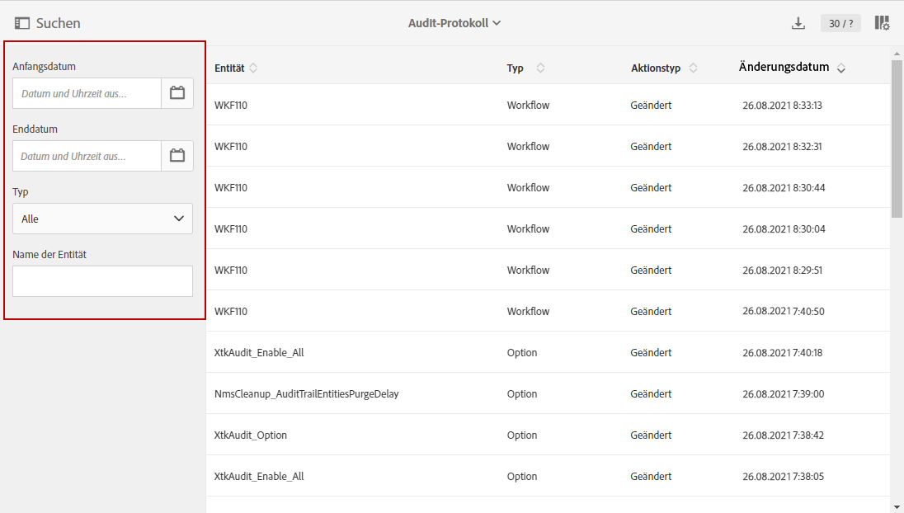
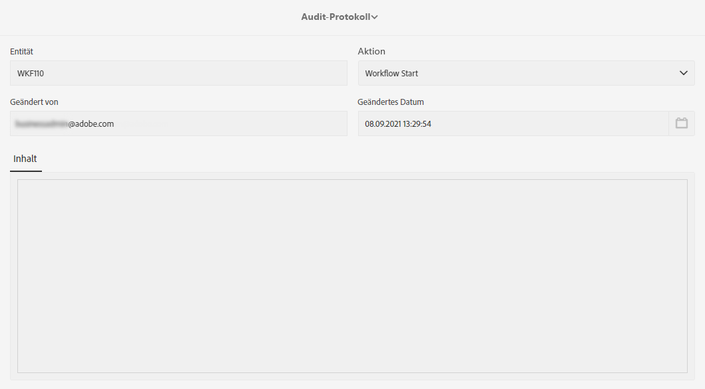

# Audit-Protokoll {#audit}

Das **[!UICONTROL Audit-Protokoll]** bietet Ihnen Zugriff auf den vollständigen Verlauf der Änderungen, die in Ihrer Instanz vorgenommen wurden.

**[!UICONTROL Audit-]** Trailcapturen erfassen in Echtzeit eine umfassende Liste von Aktionen und Ereignissen, die in Ihrer Adobe Campaign Standard-Instanz auftreten. Es bietet eine Self-Service-Möglichkeit, auf einen Datenverlauf zuzugreifen, um Fragen zu beantworten, z. B.: was mit Ihren Workflows, benutzerdefinierten Ressourcen und Optionen passiert ist, wer sie zuletzt aktualisiert hat oder was Ihre Benutzer in der Instanz getan haben.

**[!UICONTROL Audit-]** Trailt besteht aus drei Komponenten:

* **Audit-Protokoll für benutzerdefinierte Ressourcen**: Überprüfen Sie die Aktivität und die letzte Änderung an den benutzerdefinierten Ressourcen.

   Weitere Informationen zu **[!UICONTROL Benutzerdefinierte Ressourcen]** finden Sie auf dieser [Seite](../../developing/using/key-steps-to-add-a-resource.md).

* **Workflow-Audit-Protokoll**: Überprüfen Sie die Aktivität und die letzte Änderung an den Workflows sowie zusätzlich den Status Ihrer Workflows, z. B.:

   * Erstellt
   * Geändert
   * Gelöscht
   * Workflow-Start
   * Workflow-Pause
   * Workflow-Stopp
   * Neustart des Workflows
   * Workflow-Bereinigung
   * Simulieren des Workflows
   * Workflow-Wakeup
   * Sofortiger Stopp des Workflows
   * Workflow-Neustart mit gleichem Benutzer
   * Workflow neu starten Unbekannt, Befehl

   Weitere Informationen zu **[!UICONTROL Workflows]** finden Sie auf dieser [Seite](../../automating/using/get-started-workflows.md).

* **Option-Audit-Protokoll**: Überprüfen Sie die Aktivität und die letzte Änderung an den Optionen.

   Weitere Informationen zu **[!UICONTROL Options]** finden Sie auf dieser [Seite](../../administration/using/about-campaign-standard-settings.md).

Beachten Sie, dass die Aufbewahrungsfrist standardmäßig 30 Tage beträgt.

## Zugriff auf das Audit-Protokoll {#audit-access}

So greifen Sie auf das Audit-Protokoll Ihrer Instanz zu:

1. Wählen Sie in Adobe Campaign Standard im erweiterten Menü **[!UICONTROL Administration]** > **[!UICONTROL Audit-Protokoll]** aus.

   

1. Das Fenster **[!UICONTROL Audit trail]** wird mit der Liste Ihrer Entitäten geöffnet. Adobe Campaign Standard prüft die Aktionen zum Erstellen, Bearbeiten und Löschen von Workflows, Optionen und benutzerdefinierten Ressourcen.

   Im Menü **[!UICONTROL Suche]** können Sie Ihre Entität nach folgenden Kriterien filtern:

   * **[!UICONTROL Start date]**
   * **[!UICONTROL End date]**
   * **[!UICONTROL Typ]**: Entitätstyp zwischen &quot;Alle&quot;, &quot;Workflow&quot;, &quot;Benutzerdefinierte Ressource&quot;und &quot;Option&quot;.
   * **[!UICONTROL Entitätsname]**: Kennung Ihres Workflows, Ihrer Option oder Ihrer benutzerdefinierten Ressource

   

1. Wählen Sie eine der Entitäten aus, um mehr über die letzten Änderungen zu erfahren.

1. Im Fenster Prüfungsentität erhalten Sie detailliertere Informationen zu der ausgewählten Entität, z. B.:

   * **[!UICONTROL Entität]**: Kennung Ihres Workflows, Ihrer Option oder Ihrer benutzerdefinierten Ressource.
   * **[!UICONTROL Aktion]**: Letzte Aktion, die für diese Entität ausgeführt wurde.
   * **[!UICONTROL Geändert von]**: Benutzername der letzten Person, die diese Entität zuletzt geändert hat.
   * **[!UICONTROL Geändertes Datum]**: Datum der letzten Aktion, die für diese Entität durchgeführt wurde.
   * **[!UICONTROL Inhalt]**: Codeblock , der weitere Informationen darüber liefert, was in Ihrer Entität genau geändert wurde.

   In diesem Beispiel sehen wir, dass der Workflow WKF110 am 26. August vom Business-Administrator dieser Instanz gestartet wurde.

   

## Audit-Protokoll aktivieren/deaktivieren {#enable-disable-audit}

Das Audit-Protokoll kann für eine bestimmte Aktivität einfach aktiviert oder deaktiviert werden.

Gehen Sie dabei folgendermaßen vor:

1. Wählen Sie in Adobe Campaign Standard im erweiterten Menü **[!UICONTROL Administration]** > **[!UICONTROL Anwendungskonfiguration]** > **[!UICONTROL Optionen]** aus.

   

1. Wählen Sie je nach zu deaktivierender Entität eine der folgenden Optionen aus:

   * **[!UICONTROL XtkAudit_]** Workflows zur Verwaltung des Audit-Protokolls für Workflows.
   * **[!UICONTROL XtkAudit_]** Optional zur Verwaltung des Audit-Protokolls für Optionen.
   * **[!UICONTROL XtkAudit_]** CusResource zur Verwaltung des Audit-Protokolls für benutzerdefinierte Ressourcen.
   * **[!UICONTROL XtkAudit_Enable_]** Alloption zum Verwalten des Audit-Protokolls für jede Entität.

      >[!NOTE]
      >
      >Wenn die Option **[!UICONTROL XtkAudit_Enable_All]** auf 0 gesetzt ist, wird die Funktion **[!UICONTROL Audit trail]** unabhängig von anderen individuellen Optionswerten vollständig deaktiviert.
   

1. Legen Sie auf Ihrer Seite **[!UICONTROL Options]** den Wert **[!UICONTROL Wert (integer)]** auf 0 fest, wenn Sie das **[!UICONTROL Audit-Protokoll]** deaktivieren oder auf 1 setzen möchten, um es zu aktivieren.

   

1. Klicken Sie auf **[!UICONTROL Speichern]**.