# Branding{#branding}

## Über Markenidentitäten {#about-brand-identity}

Jedes Unternehmen verfügt über Richtlinien bezüglich der Darstellung und technischen Charakteristika seiner Marke. Mit Adobe Campaign können Sie Spezifikationen festlegen, um Ihre Marke Ihren Kunden einheitlich zu präsentieren, von Logos bis hin zu technischen Aspekten, wie E-Mail-Absendern, URLs oder Domains.

Technische Administratoren haben die Möglichkeit, eine oder mehrere Marken zu definieren und auf die Identität der jeweiligen Marken bezogene Parameter zentral anzugeben, z. B.: das Logo der Marke, die Domain der Zugangs-URL zu den Landingpages, Einstellungen zum Nachrichten-Tracking. Mit Adobe Campaign können diese Marken erstellt und mit verschiedenen Nachrichten oder Landingpages verknüpft werden. Diese Konfiguration wird in Vorlagen vorgenommen.

## Marken konfigurieren und verwenden             {#configuring-and-using-brands}

Konfiguration und Verwendung von Marken basieren auf den folgenden Grundprinzipien:

1. Erstellung und Konfiguration der Marke – dieser Vorgang erfordert spezielle Berechtigungen und ist dem technischen Adobe Campaign-Administrator vorbehalten. Die Schritte zur Einführung einer neuen Marke in Campaign sind [in diesem Abschnitt](#creating-a-brand) beschrieben.
1. Erstellung einer oder mehrerer Versand- und Landingpage-Vorlagen für die Marke. Lesen Sie diesbezüglich auch den Abschnitt [Vorlagen erstellen](../../start/using/marketing-activity-templates.md).
1. Erstellung von auf den Vorlagen basierenden Nachrichten und Landingpages. Lesen Sie diesbezüglich auch die Abschnitte [E-Mails erstellen](../../channels/using/creating-an-email.md) und [Landingpages erstellen](../../channels/using/designing-a-landing-page.md).

>[!IMPORTANT]
>
>Marken können nicht vom Endnutzer erstellt oder geändert werden. Diese Aktionen müssen von einem technischen Adobe Campaign-Administrator vorgenommen werden. Bei Fragen wenden Sie sich an die Adobe-Kundenunterstützung.
>
>Multibranding kann nicht in Verbindung mit Transaktionsnachrichten verwendet werden. Weiterführende Informationen dazu finden Sie im Abschnitt [Transaktionsnachrichten und Branding](../../channels/using/transactional-messaging-limitations.md#permissions-and-branding).

Der Zugriff auf Marken erfolgt über das Menü **[!UICONTROL Administration > Instanzenkonfiguration > Markenkonfiguration]**.

Eine neu erstellte Marke ist standardmäßig nur für Benutzer sichtbar, denen der Administrator die entsprechenden Berechtigungen zugewiesen hat.

Eine **Marke** wird durch die folgenden Eigenschaften definiert:

* eine **Identität**, durch die Ihre Marke definiert und personalisiert wird. Dieser Bereich weist folgende Felder auf:

  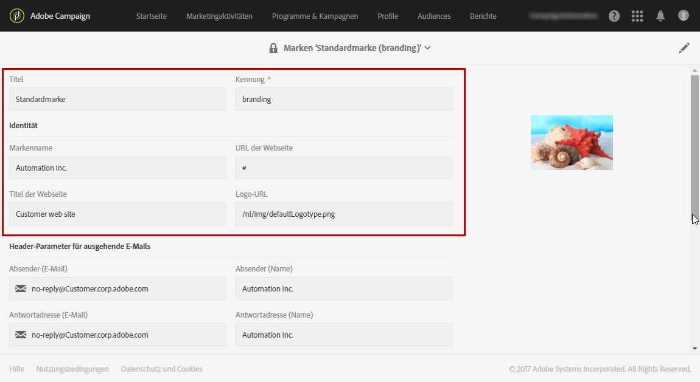

   * **Titel** (in der Benutzeroberfläche sichtbar)
   * **Markenname**
   * **URL** und **Titel** der Marken-Website
   * **Markenlogo**

* **[!UICONTROL In Header-Parameter für ausgehende E-Mails]** kann der Inhalt für die Empfänger Ihrer Kampagnen personalisiert werden. Dieser Bereich weist folgende Felder auf:

  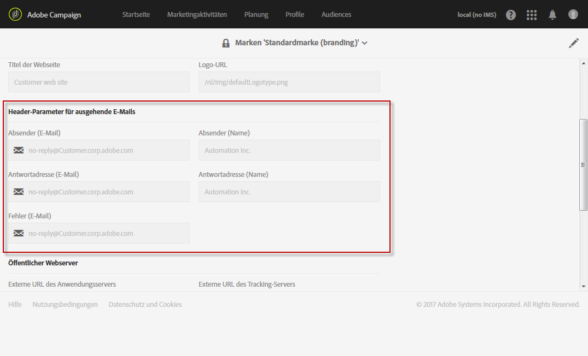

   * **Absender (E-Mail)** mit der E-Mail-Adresse der Marke.
   * **Absender (Name)** mit dem Namen der Marke.
   * **Antwortadresse (E-Mail)** mit der E-Mail-Adresse, an die der Kunde eine Antwort senden kann.
   * **Antwortadresse (Name)** mit dem Namen der Marke.
   * **Fehler (E-Mail)** mit der E-Mail-Adresse, die im Falle eines Fehlers verwendet werden soll.

  >[!IMPORTANT]
  >
  >Sollten nach der Aktualisierung der E-Mail-Header-Parameter Name und E-Mail-Adresse des Absenders in einer neuen, auf dieser Vorlage basierenden E-Mail nicht geändert sein, überprüfen Sie die erweiterten Parameter der Vorlage.

* **Öffentlicher Webserver** wird sowohl zu Tracking-Zwecken als auch für den Zugriff auf die Landingpage verwendet. Dieser Bereich weist folgende Felder auf:

  

   * Die **externe URL des Anwendungs-Servers**, die verwendet wird, um die verschiedenen erstellten Landingpages zu hosten und darauf zuzugreifen.
   * Die **Externe URL des Tracking-Servers**, die bei den Sendungen als getrackte URL verwendet werden soll.
   * Die **Externe URL des Mirrorseiten-Servers**, die bei Ihren Sendungen als standardmäßige Mirrorseite verwendet werden soll.

  >[!NOTE]
  >
  >Um die Vorschau der Landingpage und das Rendering der Mirrorseite in der Campaign-Benutzeroberfläche anzuzeigen, müssen die URLs für den Anwendungs-Server und den Server der Mirrorseite sicher sein. Verwenden Sie in diesem Fall beim Einrichten dieser URLs https:// anstelle von http://.

* **[!UICONTROL In Konfiguration der Tracking-URLs (Web Analytics)]** wird das Tracking der URLs Ihrer Marke konfiguriert.

  Geben Sie hier die zusätzlichen Parameter an, die das Tracking von Links mithilfe externer Systeme, insbesondere Web-Analytics-Tools wie beispielsweise Adobe Analytics oder Google Analytics, ermöglichen.

  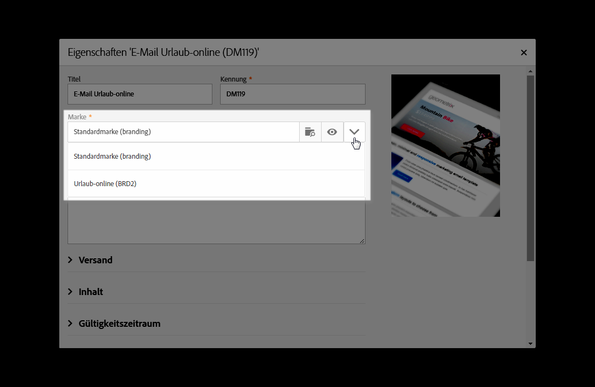

## Neue Marke erstellen {#creating-a-brand}

Sie können in Campaign neue Entitäten Ihrer Organisation hinzufügen oder einen neuen E-Mail-Typ erstellen, den Sie unter einer anderen Subdomain senden müssen. Gehen Sie dazu wie folgt vor:

1. **Neue Subdomain konfigurieren**: Damit eine neue Subdomain von Adobe verwendet werden kann, müssen Sie sie zunächst konfigurieren. Sie können dies über das [Control Panel](https://experienceleague.adobe.com/docs/control-panel/using/subdomains-and-certificates/subdomains-branding.html?lang=de) in Campaign durchführen oder sich an Ihren technischen Ansprechpartner bei Adobe wenden. Weitere Informationen zur Konfiguration von Subdomains finden Sie [in diesem Artikel](https://experienceleague.adobe.com/docs/deliverability-learn/deliverability-best-practice-guide/additional-resources/campaign/ac-domain-name-setup.html?lang=de).

   >[!NOTE]
   >
   >Das Control Panel steht allen Administratoren zur Verfügung. Die Schritte, um einem Benutzer Administratorzugriff zu gewähren, finden Sie auf [dieser Seite](https://experienceleague.adobe.com/docs/control-panel/using/discover-control-panel/managing-permissions.html?lang=de#discover-control-panel).

1. **Ticket erstellen** - Sobald die Subdomain konfiguriert wurde, richtet Adobe sie in Ihrer Produktionsumgebung ein. Um dies anzufordern, [erstellen Sie ein Kundenunterstützungs-Ticket](https://helpx.adobe.com/de/enterprise/using/support-for-experience-cloud.html) mit den folgenden Informationen:

   * Betreff: Einrichtung einer neuen Marke in ACS

   * Inhalt: Es wurde eine neue Domain konfiguriert, die wir in unserer Campaign-Plattform einrichten möchten

   * Domain: XXX

   * Produktions-URL: XXX.campaign.adobe.com

1. **Versandvorlage erstellen**: Sobald die neue Marke verfügbar ist, sollten Sie mindestens eine neue leere Versandvorlage erstellen, die auf diese neue Marke verweist. [Mehr dazu](#linking-a-brand-to-a-template).

1. **Zustellbarkeitsrichtlinien prüfen**: Bevor Sie mit der Verwendung der neuen Domain beginnen, sollte die Strategie mit dem Adobe Zustellbarkeits-Team besprochen werden. Es hilft bei der Definition der Best Practices, wenn eine neue Affinität erstellt werden soll, um beispielsweise die IPs zwischen Domains aufzuteilen, bzw. wenn ein Hochlaufplan definiert werden soll. Weitere Informationen zu Best Practices für die Zustellbarkeit finden Sie [in diesem Abschnitt](../../sending/using/about-deliverability.md).

## Marke einer E-Mail zuweisen             {#assigning-a-brand-to-an-email}

### Marken mit einer Vorlage verknüpfen {#linking-a-brand-to-a-template}

Um die für eine Marke definierten Parameter nutzen zu können, muss sie mit einer Versand- oder Landingpage-Vorlage verknüpft sein. Dafür ist die Erstellung oder Anpassung einer Vorlage erforderlich.

>[!NOTE]
>
>Weiterführende Informationen zur Erstellung von Vorlagen finden Sie im Abschnitt [Vorlagen erstellen](../../start/using/marketing-activity-templates.md).

Nach der Erstellung Ihrer Vorlage können Sie sie mit einer Marke verknüpfen. Gehen Sie wie folgt vor:

1. Greifen Sie mithilfe der Schaltfläche **[!UICONTROL Eigenschaften bearbeiten]** auf die Eigenschaften Ihrer Vorlage zu.

   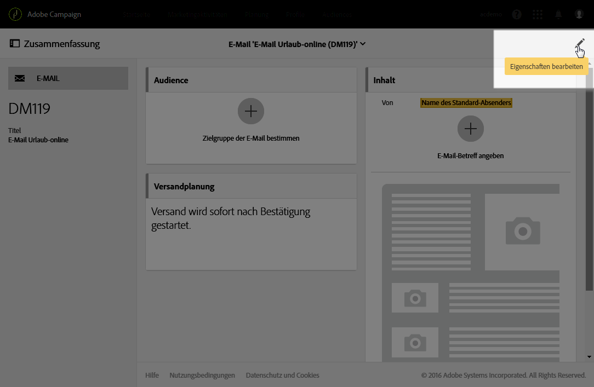

1. Wählen Sie mithilfe der Dropdown-Liste die Marke aus, die Sie mit der Vorlage verknüpfen möchten.

   >[!NOTE]
   >
   >Standardmäßig ist die **[!UICONTROL Standardmarke (branding)]** ausgewählt.

   

   Verwenden Sie das Symbol **[!UICONTROL Zur Detailansicht des ausgewählten Elements weiterleiten]**, um genauere Informationen zur Markenkonfiguration angezeigt zu bekommen.

   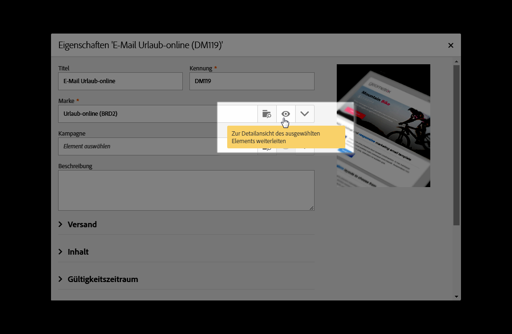

1. Bestätigen Sie Ihre Auswahl und speichern Sie die Vorlage.

Ihre Vorlage ist nun mit der Marke verknüpft. Im E-Mail-Editor werden die für die Marke konfigurierten Daten in den Feldern **Standard-E-Mail-Adresse des Absenders**, **Name des Standard-Absenders** oder **Logo** verwendet.

### Anwendungsbeispiel für Branding             {#branding-use-case}

Im folgenden Beispiel geht es um die Erstellung einer neuen Marke zum Thema Reisen und ihre anschließende Verwendung in einer E-Mail.

#### Schritt 1: Neue Marke konfigurieren             {#configure-a-new-brand}

>[!IMPORTANT]
>
>Die Markenkonfiguration wird ausschließlich von Adobe verwaltet, da dies spezielle Berechtigungen und technische Einstellungen erfordert.

1. Der Adobe Campaign-Administrator erstellt die Marke zunächst im Menü **[!UICONTROL Administration > Instanzeneinstellungen > Markenkonfiguration]** und fügt das Element **Urlaub in den Tropen** hinzu und konfiguriert die **[!UICONTROL ID]** und die **[!UICONTROL Header-Parameter der gesendeten E-Mails]** der Marke.

   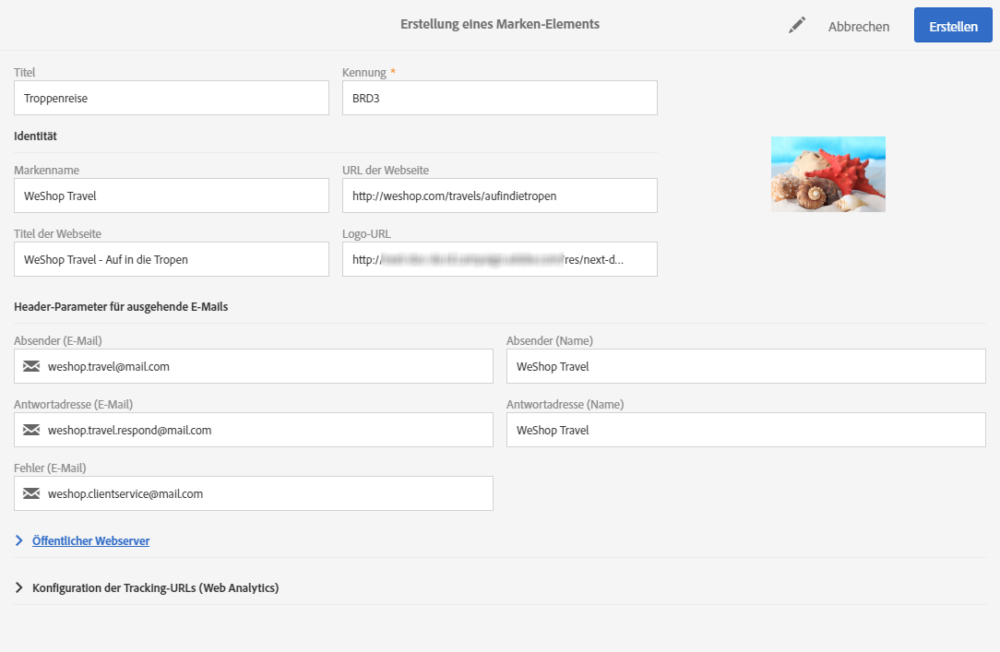

1. Anschließend konfiguriert er für den Fall der Verwendung von Landingpages die URL für **Öffentlicher Webserver** und schließlich die Tracking-URLs.

   Das in unserem Beispiel verwendete **Web-Analytics**-Tool ist **Google Analytics**. Der Administrator konfiguriert die Tracking-URLs folgendermaßen:

   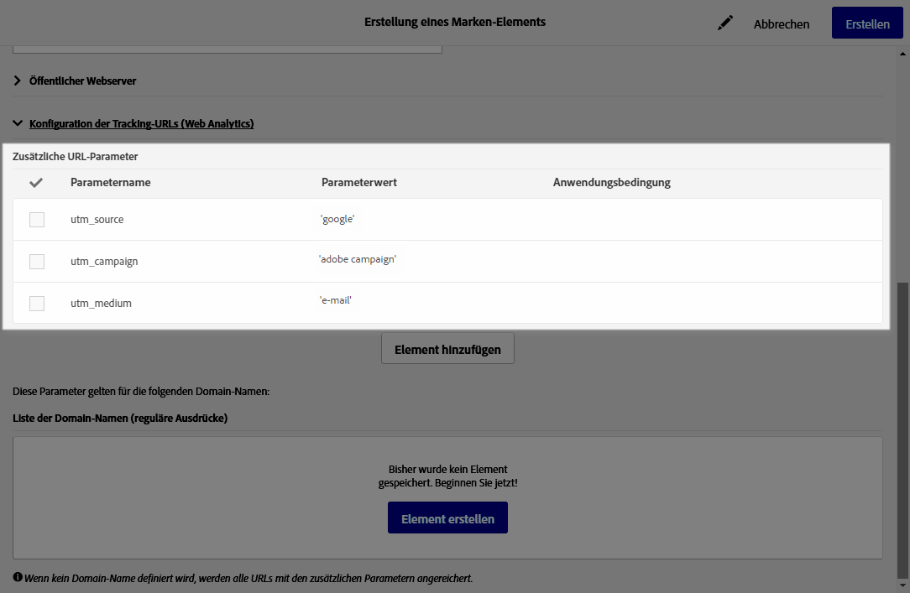

Die Marke wurde korrekt erstellt und konfiguriert. Sie ist nun zur Verwendung durch Marketing-Teams verfügbar.

#### Schritt 2: Neue Marke implementieren             {#implement-a-new-brand}

Der Versandbeauftragte ist für die Erstellung der Versandvorlagen verantwortlich, in denen die neue Marke verwendet wird. Gehen Sie dazu wie folgt vor:

1. Ausgehend vom erweiterten Menü duplizieren Sie in **[!UICONTROL Ressourcen > Vorlagen > Versandvorlagen]** eine native Vorlage, um daraufhin eine neue Versandvorlage zu konfigurieren.

   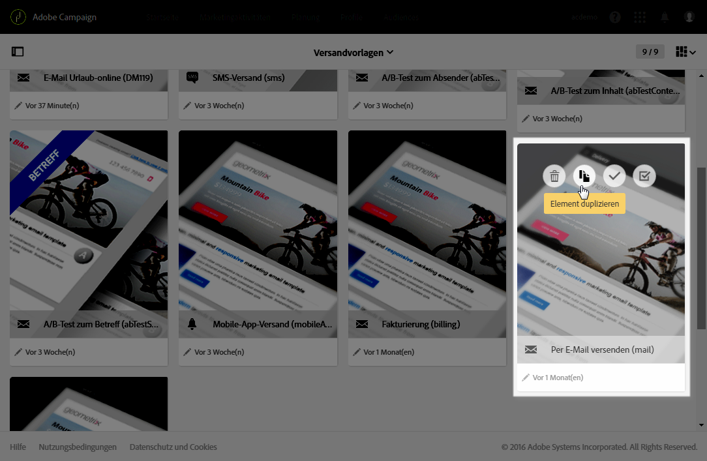

1. Um diese Vorlage mit der Marke **Tropenreise** zu verknüpfen, bearbeiten Sie die Eigenschaften der Vorlage und wählen Sie die Marke aus der Dropdown-Liste aus.

   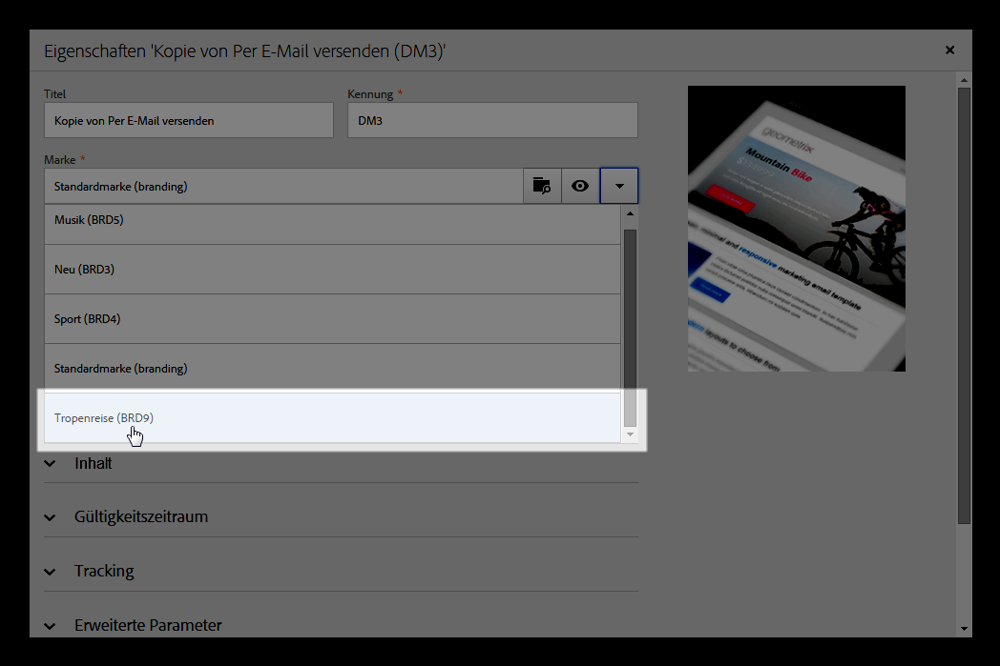

1. Konfigurieren Sie diese E-Mail-Vorlage entsprechend der Markenidentität.
1. Nach Fertigstellung der Vorlage kann sie gespeichert werden.

   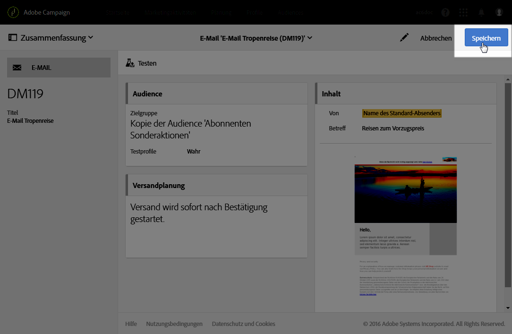

   Die Versandvorlage lässt sich nun zur Erstellung von E-Mails verwenden, die an eine Audience gesendet werden.

#### Schritt 3: Neue Marke in einem Versand verwenden             {#use-the-new-brand-in-a-delivery}

Um eine mit einer Marke verknüpfte E-Mail zu erstellen, gehen Sie wie folgt vor:

1. Wählen Sie die Schaltfläche **[!UICONTROL Erstellen]** im Menü **[!UICONTROL Marketing-Aktivitäten]** aus.

   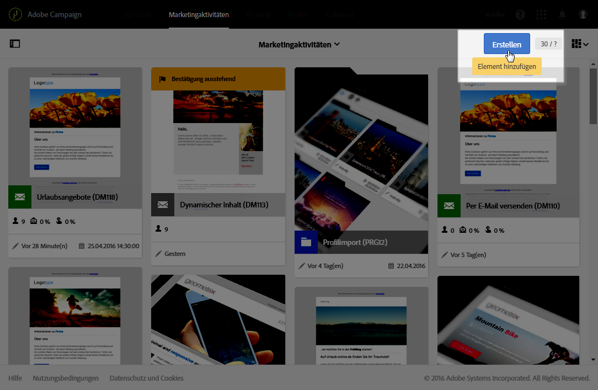

1. Wählen Sie die Aktivität **[!UICONTROL E-Mail]** und dann die mit der neuen Marke verknüpfte Vorlage aus.

   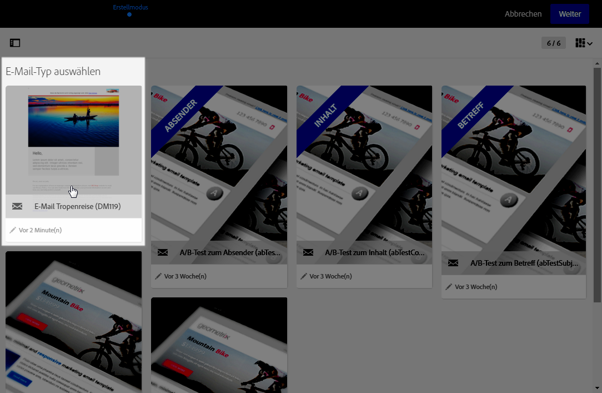

1. Ihre E-Mail ist bereits konfiguriert. Sie haben die Möglichkeit, die Informationen der E-Mail zu überprüfen, bevor Sie sie mithilfe von Testprofilen testen und anschließend an Ihre Audience senden.

   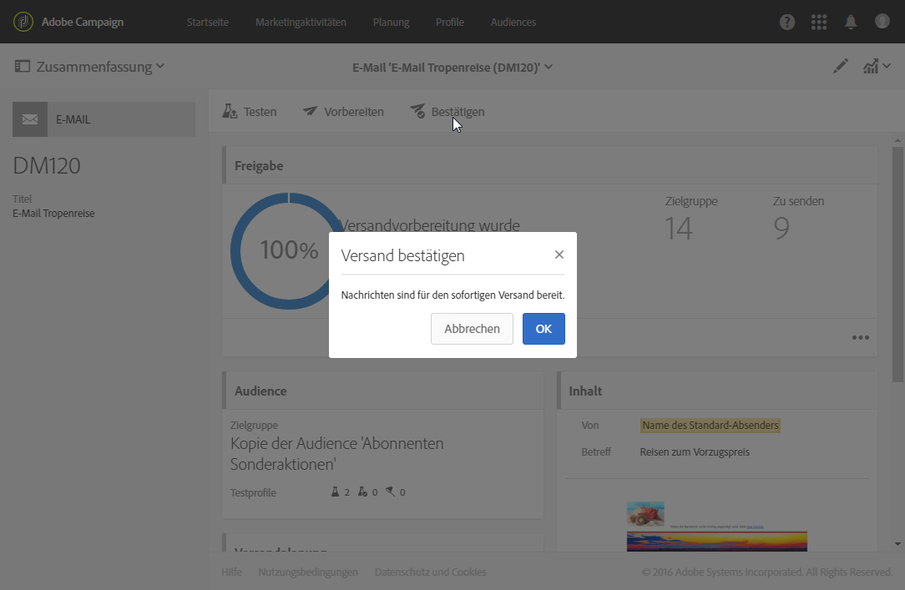
