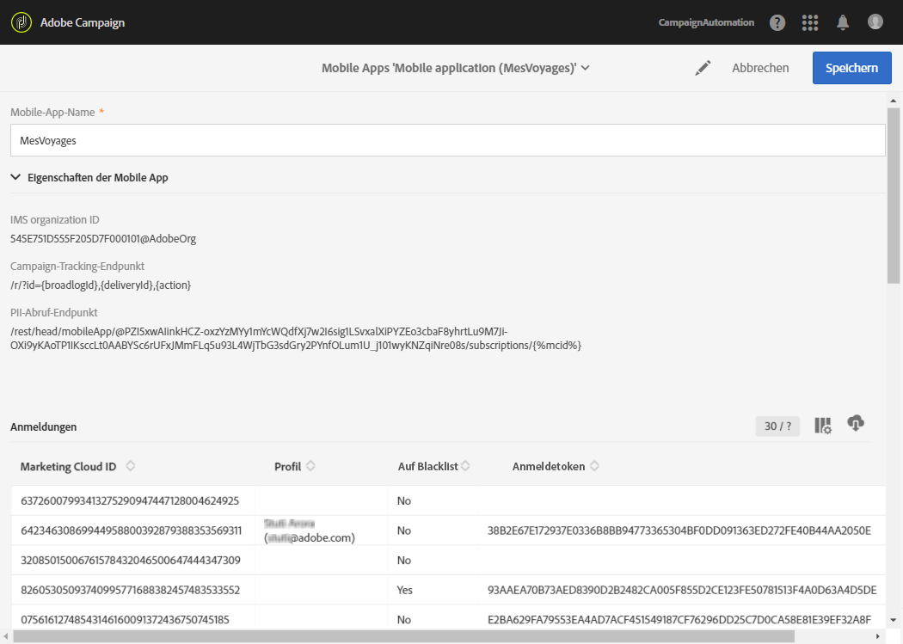
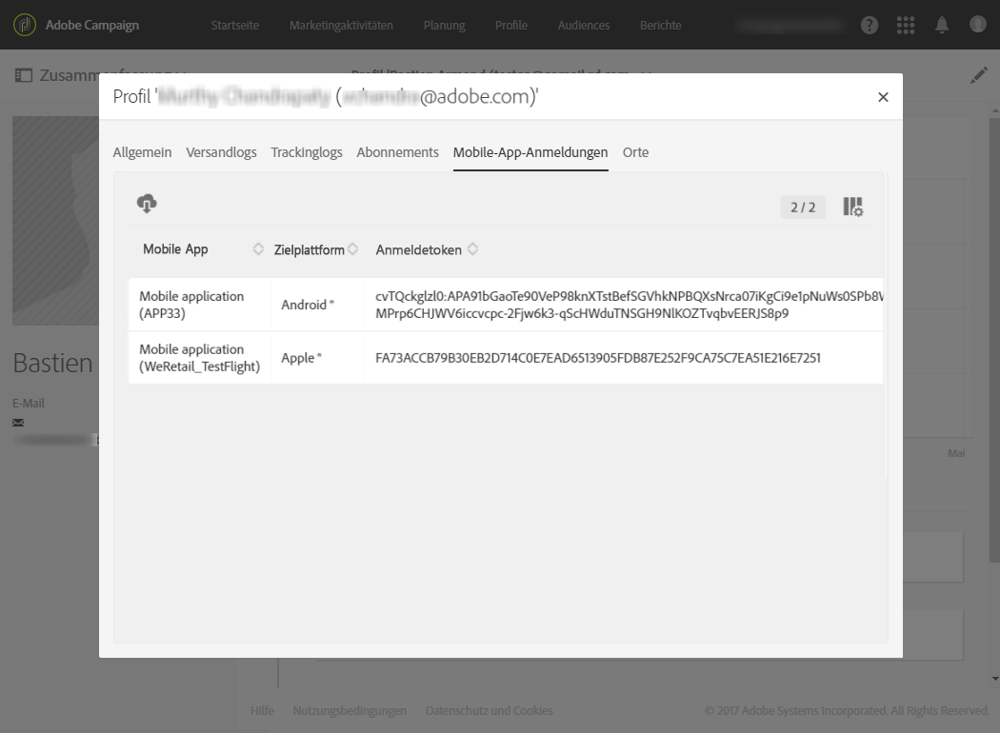

# Mobile App konfigurieren{#configuring-a-mobile-application}

Push-Benachrichtigungen oder In-App-Nachrichten werden in Mobile Apps empfangen, die je nach gewünschtem Kanal zuerst in den Adobe Mobile Services konfiguriert werden müssen.

* Zum Versand von In-App-Nachrichten und Push-Benachrichtigungen müssen Ihre Mobile Apps in Adobe Campaign unter Verwendung von Adobe Experience Platform SDKs eingerichtet werden. Siehe [Adobe Experience Platform SDK verwenden](#using-adobe-experience-platform-sdk).

* Wenn Sie ausschließlich Push-Benachrichtigungen senden möchten, können Sie die Integration zwischen Adobe Campaign und Adobe Mobile Service mithilfe von SDK V4 konfigurieren. Siehe [SDK V4 verwenden](#using-sdk-v4).

Nachdem Ihre Mobile Apps in Adobe Campaign mithilfe des Experience Cloud Mobile SDK V4 oder des Experience Platform SDK eingerichtet wurden, folgt die Konfiguration der Mobile Apps durch einen Administrator im Menü [!UICONTROL Administration] &gt; [!UICONTROL Kanäle] &gt; [!UICONTROL Mobile App].

>[!CAUTION]
>
>Die Implementierung von Push-Benachrichtigungen und In-App-Nachrichten muss von erfahrenen Benutzern vorgenommen werden. Wenn Sie Hilfe brauchen, kontaktieren Sie bitte Ihren Adobe-Kundenbetreuer oder Professional Services-Partner.

Nach der Einrichtung einer Mobile App können Sie die von ihr erfassten personenbezogenen bzw. PII-Daten abrufen, um Profile aus Ihrer Datenbank zu erstellen oder zu aktualisieren. Weitere Informationen finden Sie unter [Erstellen und Aktualisieren von Profilinformationen auf Basis der von einer Mobile App erfassten Daten](../../channels/using/updating-profile-with-mobile-app-data.md).

## Adobe Experience Platform SDK verwenden {#using-adobe-experience-platform-sdk}

>[!NHinweis]
>
>Weiterführende Informationen zu den verschiedenen Anwendungsfällen für Mobilgeräte, die in Adobe Campaign Standard in Kombination mit dem Adobe Experience Platform SDK unterstützt werden, finden Sie auf dieser [Seite](https://helpx.adobe.com/de/campaign/kb/configure-launch-rules-acs-use-cases.html).

Um Push-Benachrichtigungen und In-App-Nachrichten mithilfe der Experience Platform SDK-Anwendung zu senden, muss in Adobe Experience Platform Launch eine Mobile App eingerichtet und diese in Adobe Campaign konfiguriert werden. Eine detaillierte Anleitung zur Konfiguration einer Mobile App mithilfe des Experience Platform SDK finden Sie auf dieser [Seite](https://helpx.adobe.com/de/campaign/kb/configuring-app-sdkv4.html).

Führen Sie zur Konfiguration die folgenden Schritte aus:

1. Stellen Sie sicher, dass Sie Zugriff auf die folgenden **[!UICONTROL Mobile]**-Kanäle haben: Push-Benachrichtigung und In-App-Nachricht in Adobe Campaign. Ist dies nicht der Fall, kontaktieren Sie das für Ihr Konto zuständige Team.

   

1. Erstellen Sie in Experience Platform Launch eine Mobile App, indem Sie eine Eigenschaft vom Typ Mobile erstellen. Weiterführende Informationen dazu finden Sie in der [Experience Platform Launch](https://aep-sdks.gitbook.io/docs/getting-started/create-a-mobile-property#create-a-new-mobile-property)-Dokumentation.
1. Installieren Sie für Ihre Mobile App in Experience Platform Launch die **[!UICONTROL Adobe Campaign Standard]**-Erweiterung:

   Weiterführende Informationen zu Erweiterungen finden Sie in der [Experience Platform Launch](https://aep-sdks.gitbook.io/docs/using-mobile-extensions/adobe-campaign-standard)-Dokumentation.

1. Konfigurieren Sie in Adobe Launch Regeln für Ihre Anwendung. Informationen dazu finden Sie im Abschnitt [Anwendung in Adobe Launch konfigurieren](https://helpx.adobe.com/de/campaign/kb/config-app-in-launch.html#Step1Createdataelements).
1. Konfigurieren Sie Ihre Adobe Launch-Anwendung in Adobe Campaign Standard. Informationen dazu finden Sie im Abschnitt [Adobe Launch-App in Adobe Campaign einrichten](https://helpx.adobe.com/de/campaign/kb/configuring-app-sdk.html#SettingupyourAdobeLaunchapplicationinAdobeCampaign).
1. Fügen Sie zu Ihrer Mobile App eine kanalspezifische Konfiguration hinzu. Informationen dazu finden Sie im Abschnitt [Kanalspezifische Anwendungskonfiguration in Adobe Campaign](https://helpx.adobe.com/de/campaign/kb/configuring-app-sdk.html#ChannelspecificapplicationconfigurationinAdobeCampaign).

   

## SDK V4 verwenden {#using-sdk-v4}

Im Gegensatz zu In-App-Nachrichten werden Push-Benachrichtigungen von SDK V4 und Adobe Experience Platform SDKs unterstützt. Eine detaillierte Anleitung zur Verwendung von Push-Benachrichtigungen mit einer Mobile App finden Sie auf dieser [Seite](https://helpx.adobe.com/de/campaign/kb/configuring-app-sdkv4.html).

Mobile Apps, über die Push-Benachrichtigungen empfangen werden, müssen von einem Administrator in der Adobe-Campaign-Benutzeroberfläche konfiguriert werden. Durch die Konfiguration von sowohl Adobe Campaign als auch Adobe Mobile Services können Sie die Daten Ihrer Mobile Apps für Ihre Kampagnen verwenden.

Für den Versand von Push-Benachrichtigungen müssen folgende Voraussetzungen gegeben sein:

1. Stellen Sie sicher, dass Sie auf den **[!UICONTROL Mobile App]**-Kanal in Adobe Campaign zugreifen können.
1. Konfigurieren Sie Ihre Mobile App:

   * [Adobe Campaign](https://helpx.adobe.com/de/campaign/kb/configuring-app-sdkv4.html#SettingupamobileapplicationinAdobeCampaign)
   * [Adobe Mobile Services](https://helpx.adobe.com/de/campaign/kb/configuring-app-sdkv4.html#ConfiguringamobileapplicationinAdobeMobileServices)

1. Richten Sie die Mobile App ein:

   * Verpacken Sie die von der Adobe-Mobile-Services-Benutzeroberfläche heruntergeladene Konfigurationsdatei mit der Mobile App.
   * Integrieren Sie das Experience Cloud Mobile SDK in Ihre Mobile App.

1. Definieren Sie die Daten, die Sie über die Abonnenten Ihrer App abrufen möchten. Die Abonnenten der Mobile App, deren Profil in der Datenbank von Adobe Campaign gespeichert ist, werden entsprechend den von Ihnen definierten Kriterien abgeglichen.

   Weiterführende Informationen hierzu finden Sie auf dieser [Seite](https://helpx.adobe.com/de/campaign/kb/configuring-app-sdkv4.html#Collectingsubscribersdatafromamobileapplication).

1. Stellen Sie sicher, dass die Einrichtung erfolgreich abgeschlossen wurde. Starten Sie zu diesem Zweck Ihre Mobile App auf Ihrem Gerät und melden Sie sich an. Aktivieren Sie dabei den Empfang von Benachrichtigungen.
1. Wählen Sie dann im erweiterten Menü von Adobe Campaign **[!UICONTROL Administration]** &gt; **[!UICONTROL Kanäle]** &gt; **[!UICONTROL Mobile App]**.
1. Wählen Sie Ihre Mobile App aus der Liste aus, um ihre Eigenschaften anzuzeigen. Ihre Abonnementinformationen werden unter der Liste der Abonnenten aufgeführt.

   

1. Um die Mobile Apps zu prüfen, für die sich ein Profil angemeldet hat, wählen Sie im Menü **[!UICONTROL Profile &amp; Audiences &gt; Profile]** ein Profil aus und verwenden Sie rechts die Schaltfläche **[!UICONTROL Profileigenschaften bearbeiten]**. Die Mobile Apps werden im Tab **[!UICONTROL Mobile-App-Anmeldungen]** aufgeführt.

   