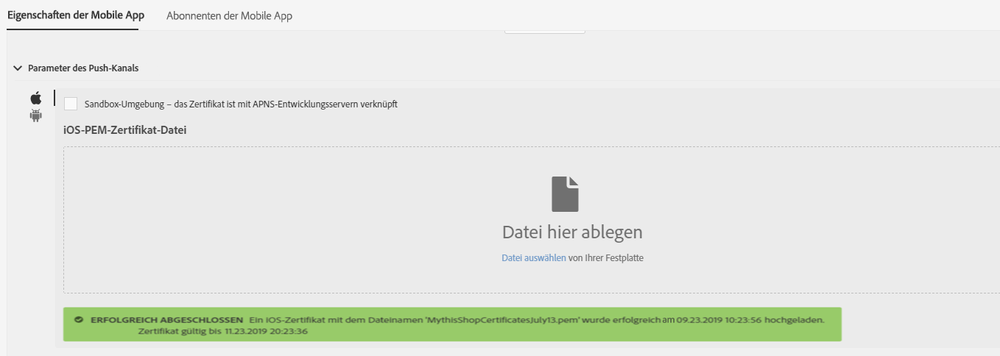

# Mobile App konfigurieren{#configuring-a-mobile-application}

## Configuring a mobile application using Adobe Experience Platform SDKs {#using-adobe-experience-platform-sdk}

>[!IMPORTANT]
>
>Die Implementierung von Push-Benachrichtigungen und In-App-Nachrichten muss von erfahrenen Benutzern vorgenommen werden. Wenn Sie Hilfe brauchen, kontaktieren Sie bitte Ihren Adobe-Kundenbetreuer oder Professional Services-Partner.

Um Push-Benachrichtigungen und In-App-Nachrichten mithilfe der Experience Platform SDK-Anwendung zu senden, muss in Adobe Experience Platform Launch eine Mobile App eingerichtet und diese in Adobe Campaign konfiguriert werden.

Weitere Informationen zu nicht mehr unterstützten Mobile Version 4 SDKs finden Sie auf dieser [Seite](https://helpx.adobe.com/campaign/kb/configuring-app-sdkv4-deprecated.html).

Nach der Einrichtung einer Mobile App können Sie die von ihr erfassten personenbezogenen bzw. PII-Daten abrufen, um Profile aus Ihrer Datenbank zu erstellen oder zu aktualisieren. Weitere Informationen finden Sie unter [Erstellen und Aktualisieren von Profilinformationen auf Basis der von einer Mobile App erfassten Daten](../../channels/using/updating-profile-with-mobile-app-data.md).

Weiterführende Informationen zu den verschiedenen Anwendungsfällen für Mobilgeräte, die in Adobe Campaign Standard in Kombination mit dem Adobe Experience Platform SDK unterstützt werden, finden Sie auf dieser [Seite](https://helpx.adobe.com/de/campaign/kb/configure-launch-rules-acs-use-cases.html).

Führen Sie die folgenden Schritte aus, um die Konfiguration abzuschließen:

1. Stellen Sie in Adobe Campaign sicher, dass Sie auf Folgendes zugreifen können:
   * **[!UICONTROL Push notification]**
   * **[!UICONTROL In-App-Nachricht]**
   * **[!UICONTROL Adobe Places]**
   Ist dies nicht der Fall, kontaktieren Sie das für Ihr Konto zuständige Team.

1. Überprüfen Sie, ob Ihr Benutzer über die erforderlichen Berechtigungen in Adobe Campaign Standard und Experience Platform Launch verfügt.
   * Stellen Sie in Adobe Campaign Standard sicher, dass der IMS-Benutzer zu den Standard-Profilen für Benutzer und Administratoren gehört. Dieser Schritt ermöglicht es dem Benutzer, sich bei Adobe Campaign Standard anzumelden, zur Experience Platform SDK-Seite für mobile Apps zu navigieren und die Eigenschaften der mobilen App Ansicht, die Sie in Experience Platform Launch erstellt haben.

   * Stellen Sie sicher, dass Ihr IMS-Benutzer in Experience Platform Launch-Profil enthalten ist.
Dieser Schritt ermöglicht es dem Benutzer, sich beim Experience Platform Launch anzumelden, um die Eigenschaften zu erstellen und zu Ansicht. Weitere Informationen zu Produkt-Profilen in Experience Platform Launch finden Sie unter Produkt-Profil erstellen. Im Profil &quot;product&quot;sollten keine Berechtigungen für die Firma oder die Eigenschaften festgelegt sein, der Benutzer sollte sich aber dennoch anmelden können.
   Um weitere Aufgaben wie das Installieren einer Erweiterung, das Veröffentlichen einer App, das Konfigurieren von Umgebung usw. durchzuführen, müssen Sie Berechtigungen im Profil &quot;product&quot;festlegen.

1. Erstellen Sie in Experience Platform Launch eine **[!UICONTROL Mobile-Eigenschaft]**. Weitere Informationen finden Sie unter [Einrichten einer mobilen Eigenschaft](https://aep-sdks.gitbook.io/docs/getting-started/create-a-mobile-property).

1. Klicken Sie in Experience Platform Launch auf die Registerkarte **[!UICONTROL Erweiterungen]** , gehen Sie zum **[!UICONTROL Katalog]** und suchen Sie nach der Erweiterung **[!UICONTROL Adobe Campaign Standard]** . Weitere Informationen finden Sie unter [Adobe Campaign Standard](https://aep-sdks.gitbook.io/docs/using-mobile-extensions/adobe-campaign-standard).

1. Um Standortverwendungsfälle in Campaign Standard zu unterstützen, installieren Sie die **[!UICONTROL Platzierungs]** - und die **[!UICONTROL Platzierungsmonitor]** -Erweiterung.
   * Installieren Sie die Erweiterung **[!UICONTROL Orte]** in Experience Platform Launch. Mehr dazu erfahren Sie auf [dieser Seite](https://docs.adobe.com/content/help/de-DE/places/using/places-ext-aep-sdks/places-extension/places-extension.html).
   * Installieren Sie die Erweiterung **[!UICONTROL Places Monitor]** in Experience Platform Launch. Mehr dazu erfahren Sie auf [dieser Seite](https://docs.adobe.com/content/help/de-DE/places/using/places-ext-aep-sdks/places-monitor-extension/using-places-monitor-extension.html)

1. Konfigurieren Sie in Adobe Campaign Standard die mobile Eigenschaft, die Sie in Experience Platform Launch erstellt haben. Weitere Informationen finden Sie unter [Einrichten der Adobe Experience Platform Launch-Anwendung in Adobe Campaign](../../administration/using/configuring-a-mobile-application.md#set-up-campaign).

1. Hinzufügen Sie die Kanal-spezifische Konfiguration für Ihre Mobilanwendung einrichten.
Weitere Informationen finden Sie unter Anwendungskonfiguration für [Kanal in Adobe Campaign](../../administration/using/configuring-a-mobile-application.md#channel-specific-config).

1. Bei Bedarf können Sie Ihre Experience Platform Launch-Eigenschaft löschen.
Weitere Informationen finden Sie unter [Löschen der Experience Platform Launch-Anwendung](../../administration/using/configuring-a-mobile-application.md#delete-app).

## Synchronisieren Sie Mobile App AEPSDK vom technischen Arbeitsablauf beim Start {#aepsdk-workflow}

>[!IMPORTANT]
>
>Diese Funktion ist seit Version 20.3 in Adobe Campaign eine Betafunktion. Sie müssen ein Ticket an die Adobe-Kundenunterstützung senden (entweder direkt oder über Ihren Adobe-Kontakt), damit die **[!UICONTROL Synchronisierung der Mobile App AEPSDK vom technischen Arbeitsablauf beim Start]** in Ihrer Adobe Campaign-Instanz aktiviert wird.

Nach dem Erstellen und Konfigurieren Ihrer mobilen Eigenschaft im Experience Platform Launch synchronisiert der Arbeitsablauf für die **[!UICONTROL Synchronisierung der mobilen App AEPSDK vom Start]** jetzt die mobilen Adobe Launch-Eigenschaften, die in Adobe Campaign Standard importiert wurden.

Standardmäßig erfolgt der technische Workflow alle 15 Beginn. Bei Bedarf können Sie den Vorgang manuell neu starten:

1. Wählen Sie in Adobe Campaign Standard im erweiterten Menü **[!UICONTROL Administration]** > **[!UICONTROL Anwendungseinstellungen]** > **[!UICONTROL Workflows]**.
1. Öffnen Sie den Arbeitsablauf für die **[!UICONTROL Synchronisierung der mobilen App AEPSDK aus dem Start-Arbeitsablauf (syncWithLaunch)]** .

   

1. Klicken Sie auf die Aktivität **[!UICONTROL Planung]** .

1. Wählen Sie **[!UICONTROL Sofortige Ausführung]**.

   

Ihr Workflow wird jetzt neu gestartet und die mobilen Adobe Launch-Eigenschaften synchronisiert, die in Adobe Campaign Standard importiert wurden.

## Setting up your Adobe Experience Platform Launch application in Adobe Campaign {#set-up-campaign}

Um eine mobile Experience Platform Launch-Eigenschaft in Kampagne zu verwenden, müssen Sie diese Eigenschaft auch in Adobe Campaign konfigurieren. Stellen Sie in Adobe Campaign sicher, dass der IMS-Benutzer Teil der Standard-Profil für Benutzer und Administratoren ist.

Für Benutzer, für die die Funktion zum Starten des technischen Workflows für die Synchronisierung der mobilen App AEPSDK aktiviert ist, müssen Sie warten, bis der technische Arbeitsablauf ausgeführt wird, und die Eigenschaft zum Starten des mobilen Geräts mit Adobe Campaign synchronisieren. Sie können es dann im Adobe Campaign konfigurieren.

Weitere Informationen zum Synchronisieren von Mobile App AEPSDK über das Flag Technische Workflow-Funktion starten finden Sie in diesem [Abschnitt](../../administration/using/configuring-a-mobile-application.md#aepsdk-workflow).

>[!NOTE]
>
>Standardmäßig können Administratoren, deren Organisationseinheit auf ALL eingestellt ist, die Mobilanwendung bearbeiten.

1. From the advanced menu, select **[!UICONTROL Administration]** > **[!UICONTROL Channels]** > **[!UICONTROL Mobile app (AEP SDK)]**.

   

1. Wählen Sie die Mobilanwendung aus, die Sie in Experience Platform Launch erstellt haben.
Ihr **[!UICONTROL Property Status]** sollte **[!UICONTROL Ready to configure]** lauten.

   >[!NOTE]
   >
   >Um die Liste der in Adobe Launch erstellten Mobilanwendungen abzurufen, verwendet Campaign Standard standardmäßig den in der Option NmsServer_URL definierten Wert, um nach übereinstimmenden Eigenschaften zu suchen.
In einigen Fällen kann sich der Endpunkt der Kampagne für eine Mobilanwendung von dem in NmsServer_URL definierten unterscheiden. Definieren Sie in diesem Fall den Endpunkt in der Option Launch_URL_Kampagne. Kampagne verwendet den Wert dieser Option, um in Adobe Launch nach übereinstimmenden Eigenschaften zu suchen.

   

1. Sie können die Organisationseinheit Ihrer mobilen Anwendung im Abschnitt **[!UICONTROL Zugriffsgenehmigung]** ändern, um den Zugriff auf diese mobile Anwendung auf bestimmte Unternehmenseinheiten zu beschränken. Weiterführende Informationen dazu finden Sie auf dieser Seite.

   Hier kann der Administrator untergeordnete Einheiten zuweisen, indem er sie aus der Dropdownliste auswählt.

   

1. To make the connection between Campaign and Experience Platform Launch, click **[!UICONTROL Save]**.

1. Vergewissern Sie sich, dass der Status der mobilen App von &quot; **[!UICONTROL Bereit zum Konfigurieren]** &quot;in &quot; **[!UICONTROL Konfiguriert]**&quot;geändert wurde.

   Wenn die Erweiterung Experience Platform Launch Kampagne zeigt, dass der Schlüssel erfolgreich eingerichtet wurde, können Sie auch überprüfen, ob die Eigenschaft in Kampagne erfolgreich eingerichtet wurde.

   

1. Damit diese Konfiguration wirksam wird, müssen die Änderungen im Experience Platform Launch veröffentlicht werden.

   Weitere Informationen finden Sie unter [Veröffentlichungskonfiguration](https://aep-sdks.gitbook.io/docs/getting-started/create-a-mobile-property#publish-configuration).

## Anwendungskonfiguration für Kanal in Adobe Campaign {#channel-specific-config}

Ihre Mobile App kann jetzt in Campaign für Push-Benachrichtigungen oder In-App-Sendungen verwendet werden. Sie können sie jetzt bei Bedarf weiter konfigurieren, um Ereignisse zu erstellen, die Ihre In-App-Nachrichten auslösen und/oder Push-Zertifikate hochladen.

1. From the advanced menu, select **[!UICONTROL Administration]** > **[!UICONTROL Channels]** > **[!UICONTROL Mobile app (AEP SDK)]**.

1. Wählen Sie die Mobilanwendung aus, die Sie in Experience Platform Launch erstellt und konfiguriert haben.

1. On the **[!UICONTROL Mobile application properties]** tab, you can start adding events that are available in your mobile application for your in-app messages.

1. Klicken Sie zum Konfigurieren der Ereignis auf Element **[!UICONTROL erstellen]**.

   

1. Geben Sie einen Namen und eine Beschreibung ein.

   

1. Wählen Sie **[!UICONTROL Hinzufügen]** aus.

   Ihr Ereignis ist jetzt auf der Registerkarte &quot;Auslöser&quot;verfügbar, wenn Sie eine In-App-Nachricht erstellen. Weitere Informationen finden Sie unter [Vorbereiten und Senden einer In-App-Nachricht](../../channels/using/preparing-and-sending-an-in-app-message.md).

1. Geben Sie im Mobile-App-Dashboard im Bereich **[!UICONTROL Device-specific settings]** die Anwendungsdetails für jedes Gerät an, einschließlich des Zertifikats für iOS und des Server-Schlüssels für Android.

   Nach dem Hochladen des Zertifikats werden Sie in einer Meldung darüber informiert, dass der Upload erfolgreich war, und das Ablaufdatum Ihres Zertifikats wird angezeigt.

   >[!NOTE]
   >
   >Nachdem Sie das Zertifikat in Adobe Campaign Standard erfolgreich hinzugefügt haben, können Sie Ihre Einstellungen nicht mehr ändern, da der MCPNS-App nur eine APNS-Plattform (Produktions- oder Sandbox) hinzugefügt werden kann.

   

1. Klicken Sie auf die Registerkarte **[!UICONTROL Mobilanwendungs-Abonnenten]** , um eine Liste mit Abonnenten und anderen Informationen zu diesen Abonnenten anzuzeigen, z. B. ob sie Ihre Benachrichtigungen abbestellt haben.

## Löschen der Adobe Experience Platform Launch-Anwendung {#delete-app}

Das Löschen der Experience Platform Launch-Anwendung kann nicht rückgängig gemacht werden.

>[!CAUTION]
>
>Das Löschen der Experience Platform Launch-Anwendung kann nicht rückgängig gemacht werden.

Um Ihre Experience Platform Launch-Anwendung zu löschen, führen Sie die Schritte unter [Löschen von mobilen Eigenschaften](https://aep-sdks.gitbook.io/docs/using-mobile-extensions/adobe-campaign-standard#deleting-mobile-properties-in-experience-platform-launch)aus.

Nachdem Sie Ihre Anwendung gelöscht haben, überprüfen Sie im Adobe Campaign, ob der Status Eigenschaften der Anwendung ordnungsgemäß auf Gelöscht beim Starten aktualisiert wurde.

Wenn Sie im Adobe Campaign auf Ihre Anwendung klicken, können Sie diese Anwendung ganz aus dem Adobe Campaign entfernen, indem Sie auf Aus Kampagne löschen klicken.

    
