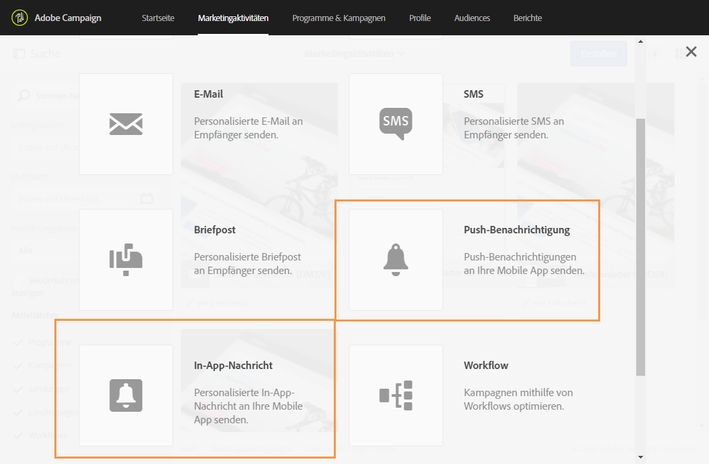
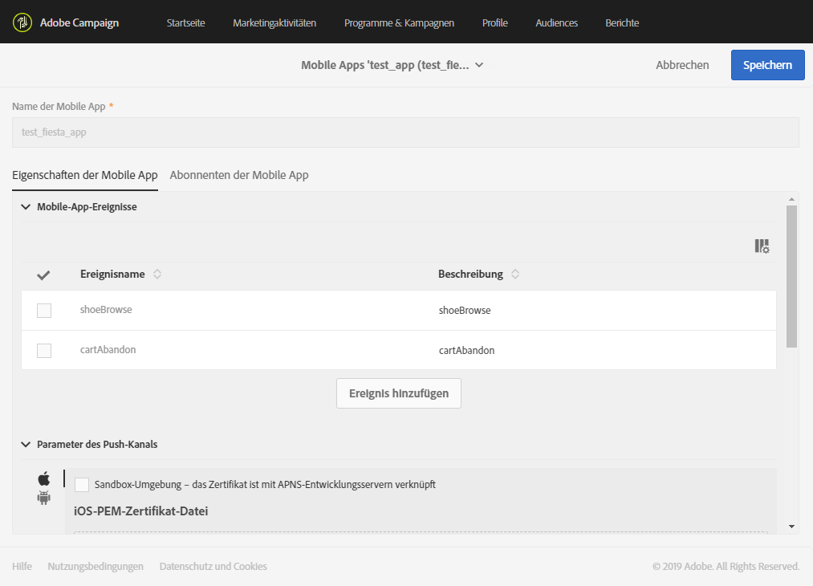

# Mobile App konfigurieren{#configuring-a-mobile-application}

Push-Benachrichtigungen oder In-App-Nachrichten werden in Mobile Apps empfangen, die je nach gewünschtem Kanal zuerst in Adobe Campaign Standard konfiguriert werden müssen.

Zum Versand von In-App-Nachrichten und Push-Benachrichtigungen müssen Ihre Mobile Apps in Adobe Campaign unter Verwendung von Adobe Experience Platform SDKs eingerichtet werden. Siehe [Adobe Experience Platform SDK verwenden](#using-adobe-experience-platform-sdk).

Nachdem Ihre Mobile Apps in Adobe Campaign mithilfe des Experience Cloud Mobile SDK V4 oder des Experience Platform SDK eingerichtet wurden, folgt die Konfiguration der Mobile Apps durch einen Administrator im Menü [!UICONTROL Administration] > [!UICONTROL Kanäle] > [!UICONTROL Mobile App].

>[!CAUTION]
>
>Die Implementierung von Push-Benachrichtigungen und In-App-Nachrichten muss von erfahrenen Benutzern vorgenommen werden. Wenn Sie Hilfe brauchen, kontaktieren Sie bitte Ihren Adobe-Kundenbetreuer oder Professional Services-Partner.

Nach der Einrichtung einer Mobile App können Sie die von ihr erfassten personenbezogenen bzw. PII-Daten abrufen, um Profile aus Ihrer Datenbank zu erstellen oder zu aktualisieren. Weitere Informationen finden Sie unter [Erstellen und Aktualisieren von Profilinformationen auf Basis der von einer Mobile App erfassten Daten](../../channels/using/updating-profile-with-mobile-app-data.md).

Allgemeine Richtlinien für Mobilzustellungen in Adobe Campaign Standard finden Sie auf dieser [Seite](https://helpx.adobe.com/campaign/kb/acs-mobile.html)

## Adobe Experience Platform SDK verwenden {#using-adobe-experience-platform-sdk}

>[!NHinweis]
>
>Weiterführende Informationen zu den verschiedenen Anwendungsfällen für Mobilgeräte, die in Adobe Campaign Standard in Kombination mit dem Adobe Experience Platform SDK unterstützt werden, finden Sie auf dieser [Seite](https://helpx.adobe.com/campaign/kb/configure-launch-rules-acs-use-cases.html).

Um Push-Benachrichtigungen und In-App-Nachrichten mithilfe der Experience Platform SDK-Anwendung zu senden, muss in Adobe Experience Platform Launch eine Mobile App eingerichtet und diese in Adobe Campaign konfiguriert werden. Eine detaillierte Anleitung zur Konfiguration einer Mobile App mithilfe des Experience Platform SDK finden Sie auf dieser [Seite](https://helpx.adobe.com/campaign/kb/configuring-app-sdkv4.html).

Führen Sie zur Konfiguration die folgenden Schritte aus:

1. Stellen Sie sicher, dass Sie Zugriff auf die folgenden **[!UICONTROL Mobile]**-Kanäle haben: Push-Benachrichtigung und In-App-Nachricht in Adobe Campaign. Ist dies nicht der Fall, kontaktieren Sie das für Ihr Konto zuständige Team.

   

1. Erstellen Sie in Experience Platform Launch eine Mobile App, indem Sie eine Eigenschaft vom Typ Mobile erstellen. Weiterführende Informationen dazu finden Sie in der [Experience Platform Launch](https://aep-sdks.gitbook.io/docs/getting-started/create-a-mobile-property#create-a-new-mobile-property)-Dokumentation.
1. Installieren Sie für Ihre Mobile App in Experience Platform Launch die **[!UICONTROL Adobe Campaign Standard]**-Erweiterung:

   Weiterführende Informationen zu Erweiterungen finden Sie in der [Experience Platform Launch](https://aep-sdks.gitbook.io/docs/using-mobile-extensions/adobe-campaign-standard)-Dokumentation.

1. Konfigurieren Sie in Adobe Launch Regeln für Ihre Anwendung. Informationen dazu finden Sie im Abschnitt [Anwendung in Adobe Launch konfigurieren](https://helpx.adobe.com/campaign/kb/config-app-in-launch.html#Step1Createdataelements).
1. Konfigurieren Sie Ihre Adobe-Launch-Anwendung in Adobe Campaign Standard. Informationen dazu finden Sie im Abschnitt [Adobe-Launch-App in Adobe Campaign einrichten](https://helpx.adobe.com/campaign/kb/configuring-app-sdk.html#SettingupyourAdobeLaunchapplicationinAdobeCampaign).
1. Fügen Sie zu Ihrer Mobile App eine kanalspezifische Konfiguration hinzu. Informationen dazu finden Sie im Abschnitt [Kanalspezifische Anwendungskonfiguration in Adobe Campaign](https://helpx.adobe.com/campaign/kb/configuring-app-sdk.html#ChannelspecificapplicationconfigurationinAdobeCampaign).

   
