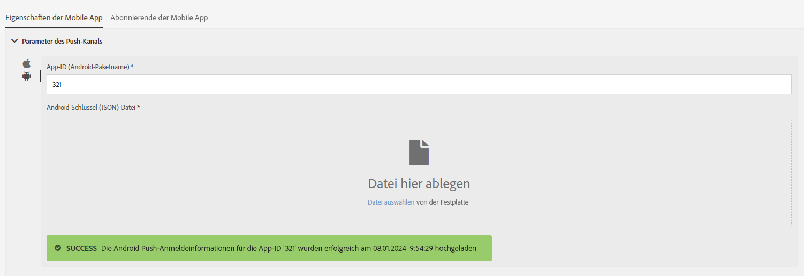

# Mobile App konfigurieren{#configuring-a-mobile-application}

## Konfiguration einer Mobile App mithilfe von Adobe Experience Platform SDKs {#using-adobe-experience-platform-sdk}

>[!IMPORTANT]
>
> Adobe Experience Platform Launch wurde als Suite mit Datenerfassungstechnologien in Adobe Experience Platform umbenannt. Infolgedessen wurden in der gesamten Produktdokumentation mehrere Aktualisierungen der Terminologie vorgenommen. Weiterführende Informationen finden Sie im [folgenden Dokument](https://experienceleague.adobe.com/docs/experience-platform/tags/term-updates.html?lang=de){target="_blank"}. Hier erhalten Sie eine Zusammenfassung zur veränderten Terminologie.

Hinweis: Die Implementierung von Push-Benachrichtigungen und In-App-Nachrichten muss von erfahrenen Benutzern vorgenommen werden. Um Unterstützung zu erhalten, kontaktieren Sie Ihren Adobe-Kundenbetreuer oder Professional Services-Partner.

Um Push-Benachrichtigungen und In-App-Nachrichten mithilfe der Experience-Platform-SDK-Anwendung zu senden, muss in der Datenerfassungs-UI eine Mobile App eingerichtet und in Adobe Campaign konfiguriert werden.

Nach der Einrichtung einer Mobile App können Sie die von ihr erfassten personenbezogenen bzw. PII-Daten abrufen, um Profile aus Ihrer Datenbank zu erstellen oder zu aktualisieren. Weitere Informationen finden Sie unter [Erstellen und Aktualisieren von Profilinformationen auf Basis der von einer Mobile App erfassten Daten](../../channels/using/updating-profile-with-mobile-app-data.md).

Weiterführende Informationen zu den verschiedenen Anwendungsfällen für Mobilgeräte, die in Adobe Campaign Standard in Kombination mit dem Adobe Experience Platform SDK unterstützt werden, finden Sie auf dieser [Seite](../../administration/using/supported-mobile-use-cases.md).

Führen Sie die folgenden Schritte aus, um die Konfiguration abzuschließen:

1. Stellen Sie in Adobe Campaign sicher, dass Sie auf Folgendes zugreifen können:
   * **[!UICONTROL Push-Benachrichtigung]**
   * **[!UICONTROL In-App-Nachricht]**
   * **[!UICONTROL Adobe Places]**

   Ist dies nicht der Fall, kontaktieren Sie das für Ihr Konto zuständige Team.

1. Prüfen Sie, ob Ihr Anwender über die erforderlichen Berechtigungen in Adobe Campaign Standard und Tags in Adobe Experience Platform verfügt.

   * Stellen Sie in Adobe Campaign Standard sicher, dass der IMS-Benutzer zu den Standardbenutzer- und Administratorproduktprofilen gehört. In diesem Schritt kann sich der Anwender bei Adobe Campaign Standard anmelden, zur Seite &quot;Experience Platform SDK&quot; der Mobile App navigieren und die Mobile-App-Eigenschaften anzeigen, die Sie in der Datenerfassungs-UI erstellt haben.

   * Stellen Sie in der Datenerfassungs-UI sicher, dass Ihr IMS-Benutzer Teil eines Experience Platform Launch-Produktprofils ist.
In diesem Schritt kann sich der Benutzer bei der Datenerfassungs-UI anmelden, um die Eigenschaften zu erstellen und anzuzeigen. Weiterführende Informationen zu Produktprofilen in der Datenerfassungs-UI finden Sie unter [Produktprofil erstellen](https://experienceleague.adobe.com/docs/experience-platform/tags/admin/manage-permissions.html?lang=de#gain-admin-rights-for-a-tags-product-profile). Im Produktprofil sollten keine Berechtigungen für das Unternehmen oder die Eigenschaften festgelegt sein, aber der Benutzer sollte sich trotzdem anmelden können.

   Um zusätzliche Aufgaben wie die Installation einer Erweiterung, die Veröffentlichung einer Anwendung, die Konfiguration von Umgebungen usw. durchzuführen, müssen Sie im Produktprofil Berechtigungen festlegen.

1. Erstellen Sie in der Datenerfassungs-UI eine **[!UICONTROL Eigenschaft für Mobilgeräte]**. Weiterführende Informationen finden Sie unter [Eigenschaft für Mobilgeräte einrichten](https://developer.adobe.com/client-sdks/documentation/getting-started/create-a-mobile-property).

1. Klicken Sie in der Datenerfassungs-UI auf die Registerkarte **[!UICONTROL Erweiterungen]**, wechseln Sie zum **[!UICONTROL Katalog]** und suchen Sie nach der Erweiterung **[!UICONTROL Adobe Campaign Standard]**. Weitere Informationen finden Sie unter [Adobe Campaign Standard](https://developer.adobe.com/client-sdks/documentation/adobe-campaign-standard).

1. Um Anwendungsfälle für Standorte in Campaign Standard zu unterstützen, installieren Sie die Erweiterung **[!UICONTROL Places]** in der Datenerfassungs-Benutzeroberfläche. Mehr dazu erfahren Sie auf [dieser Seite](https://developer.adobe.com/client-sdks/solution/places).

1. Konfigurieren Sie in Adobe Campaign Standard die Eigenschaft für Mobilgeräte, die Sie in der Datenerfassungs-UI erstellt haben. Weitere Informationen finden Sie unter [Adobe Experience Platform Launch-App in Adobe Campaign einrichten &#x200B;](../../administration/using/configuring-a-mobile-application.md#set-up-campaign).

1. Fügen Sie die kanalspezifische Konfiguration für Ihre Mobile-App-Einrichtung hinzu.
Weiterführende Informationen finden Sie unter [Kanalspezifische Anwendungskonfiguration in Adobe Campaign](../../administration/using/configuring-a-mobile-application.md#channel-specific-config).

1. Bei Bedarf können Sie Ihre Tag-Eigenschaft löschen.
Weiterführende Informationen finden Sie unter [Anwendung löschen](../../administration/using/configuring-a-mobile-application.md#delete-app).

## Technischer Workflow &quot;Mobile App AEPSDK von Launch synchronisieren&quot;  {#aepsdk-workflow}

Nachdem Sie Ihre Eigenschaft für Mobilgeräte in der Datenerfassungs-UI erstellt und konfiguriert haben, synchronisiert der technische Workflow **[!UICONTROL Mobile App AEPSDK von Launch synchronisieren]** die in Adobe Campaign Standard importierten Tag-Eigenschaften für Mobilgeräte.

Standardmäßig startet der technische Workflow alle 15 Minuten. Bei Bedarf können Sie den Vorgang manuell neu starten:

1. Wählen Sie in Adobe Campaign Standard im erweiterten Menü **[!UICONTROL Administration]** > **[!UICONTROL Anwendungskonfiguration]** > **[!UICONTROL Workflows]** aus.
1. Öffnen Sie den Workflow **[!UICONTROL Mobile App AEPSDK von Launch synchronisieren (syncWithLaunch)]**.

   

1. Klicken Sie auf die Aktivität **[!UICONTROL Planung]**.

1. Wählen Sie **[!UICONTROL Vorgezogene Ausführung]** aus.

   

Ihr Workflow wird jetzt neu gestartet. Zudem werden die in Adobe Campaign Standard importierten Tag-Eigenschaften für Mobilgeräte synchronisiert.

## Einrichten Ihrer Mobile App in Adobe Campaign {#set-up-campaign}

Um eine Eigenschaft für Mobilgeräte in Campaign verwenden zu können, müssen Sie diese Eigenschaft auch in Adobe Campaign konfigurieren. Stellen Sie in Adobe Campaign sicher, dass der IMS-Benutzer zu den Standardbenutzer- und Administratorproduktprofilen gehört.

Warten Sie, bis der technische Workflow ausgeführt und die Tag-Eigenschaft für Mobilgeräte mit Adobe Campaign synchronisiert wurde. Sie können sie dann in Adobe Campaign konfigurieren.

Weitere Informationen zum technischen Workflow &quot;Mobile App AEPSDK von Launch synchronisieren&quot; finden Sie in diesem [Abschnitt](../../administration/using/configuring-a-mobile-application.md#aepsdk-workflow).

>[!NOTE]
>
>Standardmäßig können Administratoren, deren Organisationseinheit auf &quot;ALL&quot; eingestellt ist, die Mobile App bearbeiten.

1. Wählen Sie im erweiterten Menü **[!UICONTROL Administration]** > **[!UICONTROL Kanäle]** > **[!UICONTROL Mobile App (AEP SDK)]** aus.

   

1. Wählen Sie die Mobile App aus, die Sie in der Datenerfassungs-UI erstellt haben.
Ihr **[!UICONTROL Property Status]** sollte **[!UICONTROL Bereit zum Konfigurieren]** lauten.

   >[!NOTE]
   >
   >Um die Liste der in der Datenerfassungs-UI erstellten Mobile Apps abzurufen, verwendet Campaign Standard standardmäßig den in der Option NmsServer_URL definierten Wert, um nach übereinstimmenden Eigenschaften zu suchen.
   >
   >In einigen Fällen kann sich der Campaign-Endpunkt für eine Mobile App von dem in NmsServer_URL definierten unterscheiden. Definieren Sie in dem Fall den Endpunkt in der Option `Launch_URL_Campaign`. Campaign verwendet den Wert dieser Option, um in der Datenerfassungs-UI nach übereinstimmenden Eigenschaften zu suchen.

   

1. Sie können die Organisationseinheit Ihrer Mobile App im Abschnitt **[!UICONTROL Zugriffsberechtigung]** ändern, um den Zugriff auf diese Mobile App auf bestimmte Organisationseinheiten zu beschränken. Weiterführende Informationen dazu finden Sie auf dieser Seite.

   Hier kann der Administrator untergeordnete Organisationseinheiten zuweisen, indem er sie aus der Dropdown-Liste auswählt.

   

1. Um eine Verbindung zwischen Campaign und Tags in Adobe Experience Platform herzustellen, wählen Sie **[!UICONTROL Speichern]**.

1. Vergewissern Sie sich, dass der Status der Mobile App von **[!UICONTROL Bereit zum Konfigurieren]** in **[!UICONTROL Konfiguriert]** geändert wurde.

   Wenn die Campaign-Erweiterung anzeigt, dass der pkey erfolgreich eingerichtet wurde, können Sie auch überprüfen, ob die Eigenschaft in Campaign erfolgreich eingerichtet wurde.

   

1. Damit diese Konfiguration wirksam werden kann, müssen die Änderungen in der Datenerfassungs-UI veröffentlicht werden.

   Weitere Informationen finden Sie unter [Konfiguration veröffentlichen](https://developer.adobe.com/client-sdks/documentation/getting-started/create-a-mobile-property/#publish-the-configuration)

## Kanalspezifische Mobile-App-Konfiguration in Adobe Campaign {#channel-specific-config}

Ihre mobile App kann jetzt in Campaign für Push-Benachrichtigungen oder In-App-Sendungen verwendet werden. Sie können sie jetzt bei Bedarf weiter konfigurieren, um Ereignisse zu erstellen, die Ihre In-App-Nachrichten auslösen und/oder Push-Zertifikate hochladen.

1. Wählen Sie im erweiterten Menü **[!UICONTROL Administration]** > **[!UICONTROL Kanäle]** > **[!UICONTROL Mobile App (AEP SDK)]** aus.

1. Wählen Sie die von Ihnen erstellte und in der Datenerfassungs-UI konfigurierte Mobile App aus.

1. Fügen Sie auf der Registerkarte **[!UICONTROL Eigenschaften der Mobile App]** Ereignisse hinzu, die in Ihrer mobilen App für Ihre In-App-Nachrichten verfügbar sind.

1. Klicken Sie zum Konfigurieren Ihrer Ereignisse auf **[!UICONTROL Element erstellen]**.

   

1. Geben Sie einen Namen und eine Beschreibung ein.

   

1. Wählen Sie **[!UICONTROL Hinzufügen]** aus.

   Das entsprechende Ereignis ist jetzt bei der Erstellung einer In-App-Nachricht auf der Registerkarte „Triggers“ verfügbar. Weitere Informationen finden Sie unter [In-App-Nachricht vorbereiten und senden](../../channels/using/preparing-and-sending-an-in-app-message.md).

1. Im Abschnitt **[!UICONTROL Gerätespezifische Einstellungen]** im Dashboard einer Mobile App können Sie für jedes Gerät die Anwendungsdetails angeben.

   +++ Für iOS

   Geben Sie die folgenden Anwendungsdetails ein:

   * **App-ID (iOS Bundle ID)**: Siehe [Apple-Dokumentation](https://developer.apple.com/documentation/appstoreconnectapi/bundle_ids){target="_blank"} für weitere Informationen zur Bundle-ID.
   * **Datei mit iOS-Zertifikat (P8)**: Ziehen Sie den .p8-Authentifizierungsschlüssel per Drag-and-Drop. Anweisungen zum Generieren der .p8-Authentifizierungsdatei finden Sie in Ihrem [Apple-Entwicklerkonto](https://developer.apple.com/account/ios/authkey/create){target="_blank"}.
   * **Schlüssel-ID**: Siehe [Apple-Dokumentation](https://developer.apple.com/help/account/manage-keys/get-a-key-identifier/){target="_blank"} für weitere Informationen zur Schlüssel-ID.
   * **iOS-Team-ID**: Siehe [Apple-Dokumentation](https://developer.apple.com/help/account/manage-your-team/locate-your-team-id/){target="_blank"} für weitere Informationen zur iOS-Team-ID.

         
     +++

   +++ Für Android

   Geben Sie die folgenden Anwendungsdetails ein:

   * **App-ID (Android-Paketname)**: Siehe [Android-Dokumentation](https://support.google.com/admob/answer/9972781?hl=en#:~:text=The%20package%20name%20of%20an,supported%20third%2Dparty%20Android%20stores){target="_blank"} für weitere Informationen zum Paketnamen.
   * **Android-Schlüssel-Datei (JSON)**: Ziehen Sie die JSON-Datei mit dem privaten Schlüssel per Drag-and-Drop. Anweisungen zum Generieren der .json-Datei mit privatem Schlüssel finden Sie im Abschnitt [Entwicklerdokumentation für Firebase](https://firebase.google.com/docs/admin/setup#initialize_the_sdk_in_non-google_environments){target="_blank"}.

     
   +++

1. Nach dem Hochladen Ihres Zertifikats werden Sie in einer Nachricht benachrichtigt, dass der Upload erfolgreich war. Außerdem wird das Ablaufdatum Ihres Zertifikats angezeigt.

1. Klicken Sie auf die Registerkarte **[!UICONTROL Abonnenten der Mobile App]**, um eine Liste mit Abonnierenden und anderen Informationen zu diesen Abonnierenden anzuzeigen, z. B. ob sie sich von Ihren Benachrichtigungen abgemeldet haben.

## Löschen einer Mobile App {#delete-app}

>[!CAUTION]
>
>Das Löschen einer Mobile App kann nicht rückgängig gemacht werden.

Um Ihre Mobile App zu löschen, führen Sie die Schritte unter [Eigenschaften für Mobilgeräte löschen](https://developer.adobe.com/client-sdks/documentation/adobe-campaign-standard/#deleting-mobile-properties-in-the-data-collection-ui) aus.

Überprüfen Sie nach dem Löschen Ihrer App in Adobe Campaign, ob der Status der Eigenschaften Ihrer App korrekt auf &quot;In Launch gelöscht&quot; aktualisiert wurde.

Wenn Sie diese App vollständig aus Adobe Campaign entfernen möchten, wählen Sie zunächst Ihre App in Adobe Campaign aus und danach &quot;Aus Campaign löschen&quot;.

