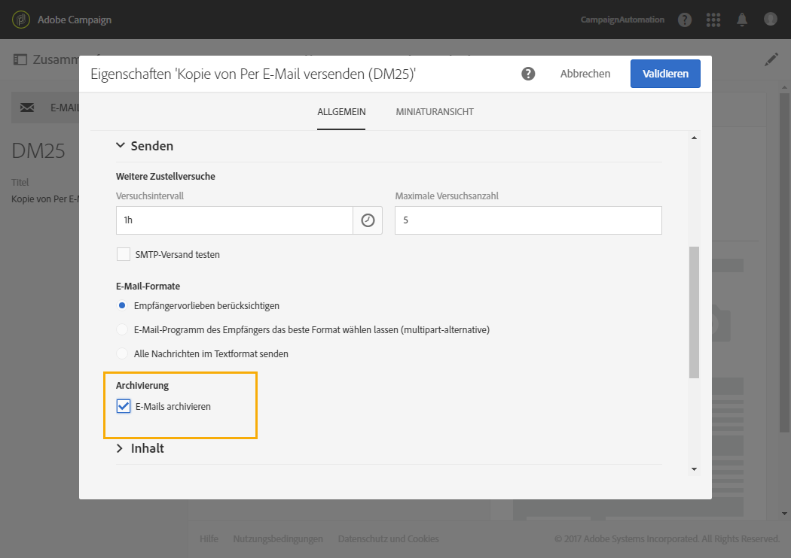

# E-Mail-Kanal konfigurieren{#configuring-email-channel}

## Parameter für den E-Mail-Kanal {#email-channel-parameters}

Im E-Mail-Konfigurationsfenster können Sie die Parameter für den E-Mail-Kanal definieren.

* **Header-Parameter für ausgehende E-Mails**

   In diesem Bereich können Sie **[!UICONTROL Zulässige Masken]**für die Absender- und Fehleradressen definieren. Bei Angabe von mehr als einer Maske sind die Masken durch Kommata zu trennen. Hierbei handelt es sich um eine optionale Konfiguration. Wenn diese Felder ausgefüllt sind, prüft Adobe Campaign im Zuge der Nachrichtenvorbereitung, dass die in der E-Mail angegebenen Adressen gültig sind. Auf diese Weise vermeiden Sie die Verwendung von Adressen, die Probleme bei der Zustellbarkeit bereiten könnten. Absenderadressen sind auf dem Versandserver zu konfigurieren.

* **Zustellbarkeit**

   Diese Kennung wird Ihnen vom Support mitgeteilt. Sie ist für die korrekte Funktionsweise der Zustellbarkeitsberichte erforderlich.

* **Versandparameter**

   Adobe Campaign versendet Nachrichten ab dem Datum des Versandstarts. Im Feld **[!UICONTROL Dauer des Nachrichtenversands]**lässt sich die Dauer festlegen, innerhalb derer Nachrichten verschickt werden können.

   Das Feld **[!UICONTROL Gültigkeit der Online-Ressourcen]**wird für Ressourcen verwendet, die online verfügbar sind, insbesondere für Mirrorseiten und Bilder. Die Gültigkeitsdauer der Ressourcen auf dieser Seite ist begrenzt, um Speicherkapazität zu sparen.

* **Weitere Zustellversuche**

   Nachrichten, die vorläufig nicht zugestellt werden können, werden automatisch für einen erneuten Versuch vorgesehen. Geben Sie in diesem Bereich an, wie viele weitere Zustellversuche am ersten Tag nach dem Versandstart unternommen werden sollen (**Anzahl weiterer Versuche**), sowie die minimale Zeitspanne zwischen zwei Versuchen (**Versuchsintervall**).

   Standardmäßig sind innerhalb der ersten 24 Stunden fünf erneute Versuche im Abstand von mindestens einer Stunde vorgesehen. An den folgenden Tagen und bis zum Ablauf der Versandgültigkeit, die im Bereich **[!UICONTROL Versandparameter]**angegeben wird, wird jeweils ein Zustellversuch unternommen.

* **Quarantäne-Parameter der E-Mails**

   Geben Sie im Feld **[!UICONTROL Intervall zwischen zwei signifikanten Fehlern]**einen Wert an, um die Wartezeit zu definieren, bevor der Fehlerzähler im Fall eines Fehlschlagens um einen Wert erhöht wird. Standardwert:**&quot;1d&quot;**für 1 Tag.

   Wenn der Wert **[!UICONTROL Maximale Anzahl an Fehlern vor der Quarantäne]**erreicht ist, wird die E-Mail-Adresse unter Quarantäne gestellt. Standardwert:**&quot;5&quot;**: Die Adresse wird beim sechsten Fehler unter Quarantäne gestellt. Dies bedeutet, dass der Kontakt automatisch von den nächsten Sendungen ausgeschlossen wird.

**Verwandtes Thema**:

[Funktionsweise der Quarantäneverwaltung](../../sending/using/understanding-quarantine-management.md)

## E-Mail-Routing-Konten {#email-routing-accounts}

Das externe Konto **[!UICONTROL Integriertes E-Mail-Routing]**wird standardmäßig bereitgestellt. Es enthält die technischen Parameter, die es der Anwendung erlauben, E-Mails zu senden.

Dabei ist der Kontotyp mit **[!UICONTROL Routing]**, der Kanal mit**[!UICONTROL  E-Mail]** und der Versandmodus mit **[!UICONTROL Gebündelter Versand]**zu konfigurieren.

**Verwandtes Thema**:

[Externe Konten](../../administration/using/external-accounts.md)

## Regeln zum Umgang mit E-Mails {#email-processing-rules}

Auf die **[!UICONTROL E-Mail-Verarbeitungsregeln]**können Administratoren über das Menü &quot;**[!UICONTROL  Administration&quot;> &quot;Kanäle&quot;> &quot;E-Mail]** &quot;zugreifen.

In den Regeln sind die von Remote-Servern potenziell zurückgegebenen Strings enthalten, die die Qualifizierung der Fehler in **Hardbounce**, **Softbounce** oder **Ignoriert** erlauben.

Folgende Regeln sind in der Standardkonfiguration vorgesehen:

### Bounce Messages {#bounce-mails}

Wenn die Zustellung einer E-Mail fehlschlägt, gibt der Remote-Server eine Fehlermeldung an die in den Plattform-Parametern angegebene Bounce-Adresse zurück. Adobe Campaign vergleicht den Inhalt jeder Bounce-E-Mail mit den in der Regelliste verzeichneten Strings und ordnet einen der drei Fehlertypen zu.

Der Benutzer kann eigene Regeln erstellen.

>[!IMPORTANT]
>
>Beim Import eines Packages und bei der Aktualisierung von Daten durch den **Zustellbarkeit**-Workflow werden benutzerdefinierte E-Mail-Regeln überschrieben.

>[!IMPORTANT]
>
>Nach der Aktualisierung auf die erweiterte MTA werden die Absprungqualifikationen in der Qualifizierungstabelle für **[!UICONTROL Kampagnenmeldungen]**nicht mehr verwendet. Bei Meldungen mit Fehlern bei synchroner Bereitstellung bestimmt die erweiterte MTA den Absprungtyp und die Qualifikation und sendet diese Informationen an Kampagne zurück. Asynchrone Absprünge werden weiterhin vom InMail-Prozess qualifiziert.
>
>Weitere Informationen zur erweiterten MTA-Datei für Adobe Campaign finden Sie in diesem [Dokument](https://helpx.adobe.com/campaign/kb/campaign-enhanced-mta.html).

### E-Mail-Domain-Verwaltung {#managing-email-domains}

Domain-Verwaltungsregeln ermöglichen die Regulierung des Volumens der ausgehenden E-Mails nach Domains. Sie analysieren die Bounce Messages und blockieren falls nötig den Versand. Der Adobe-Campaign-E-Mail-Server wendet zunächst die spezifischen Domain-Regeln an und im Anschluss jene, die den Normalfall repräsentieren (durch * gekennzeichnet). 

Um eigene Domain-Verwaltungsregeln zu erstellen, sind die Angabe einer Schwelle und die Auswahl gewisser SMTP-Parameter erforderlich. Die **Schwelle** entspricht einem Prozentsatz an Fehlern, der bei Überschreiten den Versand an die betroffene Domain unterbricht.

Die **SMTP-Parameter** agieren wie die im Falle einer Blockierungsregel angewendeten Filter.

* Sie haben die Möglichkeit, gewisse Authentifizierungsnormen und Verschlüsselungsschlüssel zu aktivieren, um den Domain-Namen zu prüfen: **Sender ID**, **DomainKeys**, **DKIM**, **S/MIME**.
* **SMTP-Relais**: Zur Konfiguration der IP-Adresse und des Relais-Server-Ports für eine bestimmte Domain.

>[!IMPORTANT]
>
>Nach der Aktualisierung auf die erweiterte MTA erfolgt die Signatur der DKIM-E-Mail-Authentifizierung (DomainKeys Identified Mail) durch die erweiterte MTA. Das DKIM-Signieren durch die native Kampagnen-MTA wird im Rahmen des erweiterten MTA-Upgrades in der Tabelle **[!UICONTROL Domänenverwaltung]**deaktiviert.
>
>Weitere Informationen zur erweiterten MTA-Datei für Adobe Campaign finden Sie in diesem [Dokument](https://helpx.adobe.com/campaign/kb/campaign-enhanced-mta.html).

### MX-Verwaltung {#mx-management}

>[!IMPORTANT]
>
>Nach der Aktualisierung auf die erweiterte MTA werden die **MX-Verwaltungsregeln** für Adobe Campaign nicht mehr verwendet. Die erweiterte MTA verwendet ihre eigenen MX-Regeln, die es ermöglichen, Ihren Durchsatz nach Domäne basierend auf Ihrem eigenen historischen E-Mail-Ruf und dem Echtzeit-Feedback, das von den Domänen stammt, von denen Sie E-Mails senden, anzupassen.
>
>Weitere Informationen zur erweiterten MTA-Datei für Adobe Campaign finden Sie in diesem [Dokument](https://helpx.adobe.com/campaign/kb/campaign-enhanced-mta.html).

Jede Regel definiert eine Adressenmaske des MX. Jeder MX, dessen Name dieser Adressenmaske entspricht, kommt somit infrage. Die Maske kann die Joker &quot;*&quot; und &quot;?&quot; enthalten.

So sind die Adressen

* a.mx.yahoo.com
* b.mx.yahoo.com
* c.mx.yahoo.com

mit folgenden Masken kompatibel:

* *.yahoo.com
* ?.mx.yahoo.com

Die erste Regel, deren MX-Maske mit dem gewünschten MX kompatibel ist, wird angewendet.

Folgende Parameter stehen für jede einzelne Regel zur Verfügung:

* **[!UICONTROL Öffentliche Kennungen]**: Diese Option ermöglicht die Angabe der von der Regel betroffenen öffentlichen Kennungen (publicId). Folgende Angaben sind möglich:

   * Eine Ziffer: Die Regel wird nur für diese publicId angewendet.
   * Ein Ziffernbereich (Ziffer1-Ziffer2): Die Regel wird für alle in diesem Bereich enthaltenen publicId angewendet.
   Wenn nicht anders angegeben, wird die Regel für alle Kennungen angewendet.

* **[!UICONTROL Freigegeben]**: Diese Option ermöglicht die Angabe, ob die Obergrenze an Nachrichten pro Stunde und an zulässigen Verbindungen für alle der Regel zugeordneten MX angewendet wird oder nicht.
* **[!UICONTROL Maximale Verbindungsanzahl]**: Maximale Anzahl an simultanen Verbindungen mit einem MX von einer Adresse ausgehend.
* **Maximale Nachrichtenanzahl**: Maximale Anzahl an Nachrichten, die von einer Verbindung aus gesendet werden können. Bei der Übersteigung der zulässigen Höchstwerte wird die Verbindung geschlossen und eine neue hergestellt.
* **[!UICONTROL Nachrichten pro Stunde]**: Maximale Anzahl an Nachrichten, die pro Stunde ausgehend von einer Adresse an einen MX gesendet werden können.

>[!IMPORTANT]
>
>* Nach Änderungen in der Konfiguration muss der Versandserver (MTA) neu gestartet werden.
>* Neuerstellung und Änderungen von Verwaltungsregeln sollten erfahrenen Benutzern vorbehalten bleiben.
>

## Liste der E-Mail-Eigenschaften {#list-of-email-properties}

Dieser Abschnitt behandelt die Liste von Parametern, die in den Eigenschaften einer E-Mail oder einer E-Mail-Vorlage verfügbar sind.

>[!NOTE]
>
>Manche Parameter sind ausschließlich über die Vorlagen verfügbar. Die Parameter, auf die Sie zugreifen können, [hängen von Ihrer Zugriffsberechtigung ab](../../administration/using/users-management.md).

Zur Änderung der Eigenschaften einer E-Mail bzw. einer E-Mail-Vorlage verwenden Sie die Schaltfläche **[!UICONTROL Eigenschaften bearbeiten]**.

### Allgemeine Parameter {#general-parameters}

Identifizieren Sie am oberen Rand des E-Mail-Parameter-Fensters die E-Mail unter Verwendung der Felder **[!UICONTROL Titel]**und**[!UICONTROL  ID]**. Diese Informationen erscheinen in der Benutzeroberfläche, sind aber für die Empfänger nicht sichtbar.

>[!IMPORTANT]
>
>Die Kennung muss eindeutig sein.

Das Feld **[!UICONTROL Marke]**dient der Auswahl der dem Versand zugeordneten Marke. Weiterführende Informationen zur Verwendung und Konfiguration von Marken finden Sie im Abschnitt[Marken](../../administration/using/branding.md).

Im Feld **[!UICONTROL Kampagne]**kann die der E-Mail übergeordnete Kampagne eingetragen werden.

Außerdem kann man im entsprechenden Feld eine **[!UICONTROL Beschreibung]**hinzufügen und das Bild ändern, das auf der E-Mail-Karte innerhalb der Listen angezeigt wird.

### Versandparameter {#sending-parameters}

Der Bereich **[!UICONTROL Senden]**ist nur für E-Mail-Vorlagen verfügbar. Darin sind die folgenden Parameter enthalten:

#### Parameter für weitere Zustellversuche {#retries-parameters}

Nachrichten, die vorläufig nicht zugestellt werden können, werden automatisch für einen erneuten Versuch vorgesehen. Geben Sie in diesem Bereich an, wie viele weitere Zustellversuche am ersten Tag nach dem Versandstart unternommen werden sollen (**[!UICONTROL Maximale Versuchsanzahl]**), sowie die Mindestzeitspanne zwischen zwei Versuchen (**[!UICONTROL  Versuchsintervall]** ).

Standardmäßig sind innerhalb der ersten 24 Stunden fünf erneute Versuche im Abstand von mindestens einer Stunde vorgesehen. An den folgenden Tagen und bis zum Ablauf der Versandgültigkeit, die im Bereich [Parameter für den Gültigkeitszeitraum](#validity-period-parameters) angegeben ist, wird jeweils ein Zustellversuch unternommen.

Die Anzahl weiterer Versuche kann global geändert werden (kontaktieren Sie Ihren technischen Administrator von Adobe) oder einzeln für jeden Versand oder jede Versandvorlage.

#### Parameter für E-Mail-Format {#email-format-parameters}

Sie können das Format der zu sendenden E-Mails konfigurieren. Dabei stehen drei Optionen zur Verfügung:

* **Empfängervorlieben berücksichtigen** (Standardmodus): Das Nachrichtenformat wird auf der Grundlage der im Empfängerprofil gespeicherten Daten definiert und standardmäßig im Feld **E-Mail-Format** (@emailFormat) gespeichert. Falls ein Empfänger Nachrichten in einem bestimmten Format erhalten möchte, werden sie in diesem Format gesendet. Ohne Angabe in diesem Feld wird eine Nachricht vom Typ „Multipart-Alternative“ gesendet, wie im Anschluss erläutert.
* **E-Mail-Programm des Empfängers das beste Format wählen lassen (multipart-alternative)**: Die Meldung enthält sowohl das Text- als auch das HTML-Format. Welches Format beim Empfänger angezeigt wird, hängt von der Konfiguration des E-Mail-Programms des Empfängers ab (Multipart-Alternative).

   >[!IMPORTANT]
   >
   >Diese Option umfasst beide Versionen der Nachricht. Dies hat Auswirkungen auf den Versanddurchsatz, da die Nachricht dadurch größer wird.

* **Alle Nachrichten im Textformat senden**: Die Nachricht wird im Textformat gesendet. Das HTML-Format wird nicht gesendet und lediglich für die Mirrorseite verwendet, wenn der Empfänger auf den Link in der Nachricht klickt.

#### SMTP-Testmodus {#smtp-test-mode}

Mit der Option **[!UICONTROL SMTP-Testmodus aktivieren]**können Sie den Versand von E-Mails über eine SMTP-Verbindung testen, ohne tatsächlich Nachrichten zu senden.
Die Nachrichten werden verarbeitet, bis eine Verbindung mit dem SMTP-Server hergestellt wurde, sie werden aber nicht gesendet.

Diese Option steht für E-Mails und E-Mail-Vorlagen zur Verfügung.

Wenn Sie die SMTP-Testmodus-Option für eine E-Mail-Vorlage aktivieren, ist diese Option in allen mit dieser Vorlage erstellten E-Mail-Nachrichten aktiviert.

>[!IMPORTANT]
>
>Wenn diese Option für eine E-Mail aktiviert ist, werden keine Nachrichten gesendet, bis sie deaktiviert wird.
>Im Dashboard der E-Mail oder E-Mail-Vorlage wird ein Warnhinweis angezeigt.

Weiterführende Informationen zur SMTP-Konfiguration finden Sie im Abschnitt [Liste der E-Mail-SMTP-Parameter](#list-of-email-smtp-parameters).

### Parameter für den Gültigkeitszeitraum {#validity-period-parameters}

The **[!UICONTROL Validity period]**section contains the following parameters:

* **[!UICONTROL Gültigkeit explizit festlegen]**: Wenn diese Option nicht angekreuzt ist, müssen die Felder**[!UICONTROL  Versandlaufzeit]** und **[!UICONTROL Ressourcen-Gültigkeit]**mit einer Dauer versehen werden. Kreuzen Sie diese Option an, wenn Sie Datum und Uhrzeit genau festlegen möchten.

   

* **[!UICONTROL Versandlaufzeit]**: Nachrichten werden von Adobe Campaign ab dem Datum des Versandstarts versendet. In diesem Feld lässt sich die Dauer festlegen, innerhalb derer Nachrichten verschickt werden können.

   >[!IMPORTANT]
   >
   >Nach der Aktualisierung auf die erweiterte MTA wird der Parameter **[!UICONTROL Bereitstellungsdauer] ** in Ihren Kampagnenauslieferungen nur verwendet, wenn er auf 3,5 Tage oder weniger festgelegt ist. Wenn Sie einen Wert von mehr als 3,5 Tagen definieren, wird dieser nicht berücksichtigt. Alle Auswirkungen sind im Dokument [Adobe Campaign Enhanced MTA](https://helpx.adobe.com/campaign/kb/campaign-enhanced-mta.html) ausführlich beschrieben.

* **[!UICONTROL Ressourcen-Gültigkeit]**: An dieser Stelle wird die Gültigkeit der Online-Ressourcen (vor allem Mirrorseite und Bilder) festgelegt. Die Gültigkeitsdauer der Ressourcen auf dieser Seite ist begrenzt, um Speicherkapazität zu sparen.
* **[!UICONTROL Verwaltung der Mirrorseite]**: Bei der Mirrorseite handelt es sich um eine HTML-Seite, auf die online über einen Webbrowser zugegriffen werden kann. Sie hat den gleichen Inhalt wie die E-Mail. Standardmäßig wird die Mirrorseite automatisch generiert, wenn der entsprechende Link in den Inhalt der E-Mail eingefügt wurde. Die Erzeugung der Seite lässt sich in diesem Feld konfigurieren:

   >[!IMPORTANT]
   >
   >Die Erstellung der Mirrorseite setzt voraus, dass für die E-Mail ein HTML-Inhalt bestimmt worden ist.

   * **[!UICONTROL Mirrorseite erzeugen, wenn der Link im E-Mail-Inhalt erscheint]**(Standardmodus): Die Mirrorseite wird erstellt, wenn der entsprechende Link in den Inhalt der E-Mail eingefügt wird.
   * **Mirrorseitenerzeugung forcieren**: Erstellt eine Mirrorseite, selbst wenn im Versandinhalt kein entsprechender Link enthalten ist.
   * **Keine Mirrorseite erzeugen**: Generiert keine Mirrorseite, selbst wenn in den Nachrichten der entsprechende Link enthalten ist.
   * **Über die Nachrichtenkennung zugängliche Mirrorseite erzeugen**: Diese Option ermöglicht den Zugriff auf den Inhalt der Mirrorseite (einschließlich aller Personalisierungsinformationen) über das Versandlog-Fenster.

>[!NOTE]
>
>Der Parameter **[!UICONTROL Lieferdauer]**gilt nicht für Transaktionsmeldungen. Weiterführende Informationen zu Transaktionsnachrichten finden Sie in[diesem Abschnitt](../../channels/using/about-transactional-messaging.md).

### Tracking-Parameter {#tracking-parameters}

Im Abschnitt **[!UICONTROL Tracking]**sind folgende Parameter verfügbar:

* **[!UICONTROL Tracking aktivieren]**: Aktivierung/Deaktivierung des Trackings der in den Nachrichten enthaltenen URLs. Über das Symbol**[!UICONTROL  Links]** in der Symbolleiste von Email Designer können Sie das Tracking der einzelnen in Nachrichten enthaltenen URLs verwalten. Siehe [Über getrackte URLs](../../designing/using/links.md#about-tracked-urls).
* **[!UICONTROL Ablaufdatum des Trackings]**: Festlegung der Dauer, für die das URL-Tracking aktiv sein soll.
* **[!UICONTROL Ersatz-URL für abgelaufene URLs]**: Hier kann die URL für eine Webseite eingetragen werden, die nach dem Ablauf des Trackings angezeigt wird.

### Erweiterte Parameter {#advanced-parameters}

Der Abschnitt **[!UICONTROL Erweiterte Parameter]**enthält folgende Informationen:

In den ersten Feldern können Sie die Informationen eingeben, die zum Ausarbeiten der Kopfzeilen von E-Mail-Nachrichten erforderlich sind. Hier können Sie die Antwortadresse und den Text sowie die Absenderadresse (die das Feld &quot;Von:&quot; ausfüllt) verwalten. Diese Informationen können personalisiert werden.

Klicken Sie auf die Schaltfläche rechts neben dem Feld, das geändert werden soll, und fügen Sie dann das Personalisierungsfeld, den Inhaltsblock oder den dynamischen Text hinzu.

Das Einfügen und Verwenden des Personalisierungsinhalts ist in der Dokumentation zum [Personalisieren von E-Mail-Inhalten](../../designing/using/personalization.md) ausführlich beschrieben.

#### Zielgruppen-Kontext {#target-context}

Im Zielgruppen-Kontext werden die für die Zielgruppenbestimmung (im Bildschirm zur Audience-Erstellung) und die Personalisierung (Definition von Personalisierungsfeldern, im HTML-Inhaltseditor) der E-Mail verwendeten Tabellen angegeben.

#### Routing {#routing}

In diesem Feld wird der zu verwendende Routing-Modus definiert. Hierzu wird auf ein externes Konto verwiesen. Dies kann zum Beispiel von Nutzen sein, wenn Sie ein externes Konto mit speziellen Branding-Einstellungen verwenden möchten.

>[!NOTE]
>
>Zu den externen Konten gelangen Sie über das Menü **Administration** > **Anwendungskonfiguration** > **Externe Konten**.

#### Vorbereitung {#preparation}

Die Vorbereitung von Nachrichten ist im Abschnitt [Nachrichten validieren](../../sending/using/preparing-the-send.md) beschrieben.

* **[!UICONTROL Typologie]**: Vor jedem Versand müssen Nachrichten insofern vorbereitet werden, als ihr Inhalt und ihre Konfiguration zu validieren sind. Die in der Vorbereitungsphase anzuwendenden Validierungsregeln sind in einer** Typologie **festgelegt. Zum Beispiel betrifft die Vorbereitung für E-Mails die Validierung von Betreff, URL und Bildern etc. Wählen Sie in diesem Feld die anzuwendende Typologie aus.

   >[!NOTE]
   >
   >Die Typologien, zu denen Sie über das Menü **[!UICONTROL Administration]**>**[!UICONTROL  Kanäle]** > **[!UICONTROL Typologien]**gelangen, werden im Abschnitt[Typologien](../../administration/using/about-typology-rules.md)beschrieben.

* **[!UICONTROL Label-Berechnung während der Bereitstellungsvorbereitung]**: Ermöglicht die Berechnung des Titel-Werts der E-Mail während der Nachrichtenvorbereitung mithilfe von Personalisierungsfeldern, Inhaltsbausteinen und dynamischem Text.

   Sie können auch den Versandtitel mit Ereignisvariablen personalisieren, die in der Aktivität &quot;Externes Signal&quot; des Workflows deklariert wurden. Weiterführende Informationen hierzu finden Sie in [diesem Abschnitt](../../automating/using/calling-a-workflow-with-external-parameters.md).

* **[!UICONTROL SQL-Abfragen im Protokoll speichern]**: Bei dieser Option werden in der Vorbereitungsphase SQL-Abfragelogs im Protokoll gespeichert.

### Liste der E-Mail-SMTP-Parameter {#list-of-email-smtp-parameters}

Im Abschnitt **[!UICONTROL SMTP]**sind folgende Parameter verfügbar:

* **[!UICONTROL Zeichenkodierung]**: Aktivieren Sie die Option**[!UICONTROL  Kodierung erzwingen]**, wenn Sie die Nachrichtenkodierung erzwingen möchten, und wählen Sie dann die gewünschte Kodierungsmethode aus.
* **[!UICONTROL Bounce Messages]**: Bounce Messages werden standardmäßig in der Fehler-Inbox der Plattform empfangen (definiert unter**[!UICONTROL  Administration]** > **[!UICONTROL Kanäle]** >**[!UICONTROL  E-Mail]** > **[!UICONTROL Konfiguration).]**Um eine bestimmte Fehleradresse für eine E-Mail zu definieren, geben Sie die jeweilige Adresse im Feld**[!UICONTROL  Fehleradresse]** ein.
* **[!UICONTROL Zusätzliche SMTP-Header]**: Mit dieser Option können Sie Ihren Nachrichten zusätzliche SMTP-Header hinzufügen. Das im Feld**[!UICONTROL  Header]** eingegebene Skript muss pro Zeile auf einen einzelnen Header (im Format **Name:Wert**) verweisen. Werte werden bei Bedarf automatisch verschlüsselt.

   >[!IMPORTANT]
   >
   >Das Hinzufügen zusätzlicher SMTP-Header ist eine Aufgabe für erfahrene Benutzer. Die Syntax des Skripts muss die Anforderungen für diesen Inhaltstyp (keine überflüssigen Leerzeichen, keine Leerzeilen usw.) erfüllen.

### Liste der Parameter für Zugriffsberechtigung {#list-of-access-authorization-parameters}

Im Abschnitt **[!UICONTROL Zugriffsberechtigungen]**sind folgende Parameter verfügbar:

* Das Feld **[!UICONTROL Organisationseinheit]**ermöglicht es, den Zugang für diese E-Mail auf bestimmte Nutzer zu begrenzen. Die der spezifizierten Einheit oder den übergeordneten Einheiten zugeteilten Nutzer haben Lese- und Schreibzugriff auf diese E-Mail. Der Zugriff der den untergeordneten Einheiten zugeteilten Nutzer auf diese E-Mail ist schreibgeschützt.

   >[!NOTE]
   >
   >Zur Konfiguration von Organisationseinheiten gehen Sie in das Menü **Administration** > **Benutzer &amp; Sicherheit**.

* Die Felder **[!UICONTROL Erstellt von]**,**[!UICONTROL  Erstellt am]**, **[!UICONTROL Geändert von]**und**[!UICONTROL  Geändert am]** werden automatisch ausgefüllt.

## E-Mails archivieren {#archiving-emails}

Sie können Adobe Campaign so konfigurieren, dass von den von der Plattform gesendeten E-Mails eine Kopie beibehalten wird.

Adobe Campaign selbst ermöglicht zwar nicht die Verwaltung von archivierten Dateien, Sie können aber die gewünschten Nachrichten an eine bestimmte Adresse senden, wo sie mithilfe eines externen Systems verarbeitet und archiviert werden.

Wenn diese Funktion in der Versandvorlage aktiviert wird, können Sie eine exakte Kopie der gesendeten Nachrichten an eine von Ihnen bestimmte BCC-E-Mail-Adresse senden (unsichtbar für die Nachrichtenempfänger).

### Empfehlungen und Einschränkungen {#recommendations-and-limitations}

* Hierbei handelt es sich um eine optionale Funktion. Bitte prüfen Sie Ihren Lizenzvertrag und kontaktieren Sie den Ansprechpartner für Ihr Konto, um diese Funktion zu aktivieren.
* Sie können nur eine einzige BCC-E-Mail-Adresse verwenden.
* Nur erfolgreich gesendete E-Mails werden berücksichtigt. Bounces werden nicht berücksichtigt.
* Aus Datenschutzgründen müssen BCC-E-Mails von einem Archivierungssystem bearbeitet werden, in dem personenbezogene Daten (PII, Personally Identifiable Information) sicher aufbewahrt werden.
* Bei der Erstellung einer neuen Versandvorlage ist E-Mail-BCC nicht standardmäßig aktiviert, selbst wenn diese Option erworben wurde. Sie muss manuell in jeder Versandvorlage aktiviert werden, in der sie verwendet werden soll.

### E-Mail-Archivierung aktivieren {#activating-email-archiving}

E-Mail-BCC wird in der [E-Mail-Vorlage](../../start/using/marketing-activity-templates.md) über die folgende Option aktiviert:

1. Gehen Sie in den Knoten **Ressourcen** > **Vorlagen** > **Versandvorlagen**.
1. Duplizieren Sie die Standardvorlage **[!UICONTROL Per E-Mail versenden]**.
1. Wählen Sie die duplizierte Vorlage aus.
1. Bearbeiten Sie mithilfe der Schaltfläche **[!UICONTROL Eigenschaften bearbeiten]**die Eigenschaften Ihrer Vorlage.
1. Maximieren Sie den Abschnitt **[!UICONTROL Senden]**.
1. Aktivieren Sie die Option **[!UICONTROL E-Mails archivieren]**, um eine Kopie aller gesendeten, auf dieser Vorlage basierenden Nachrichten aufzubewahren.

   

>[!NOTE]
>
>Wenn die an eine BCC-Adresse gesendeten E-Mails geöffnet und angeklickt werden, wird dies in **[!UICONTROL Gesamtöffnungen]**und**[!UICONTROL  Klicks]** der Versandanalyse berücksichtigt, was zu falschen Berechnungen führen könnte.
