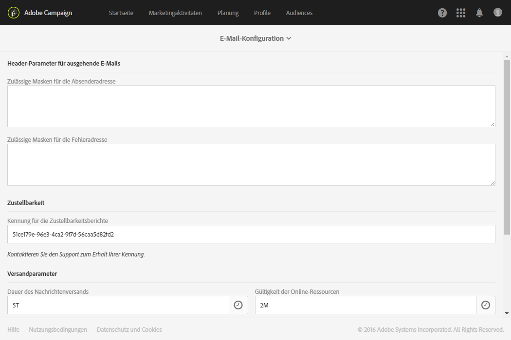
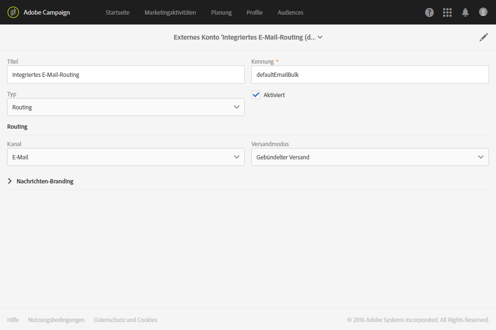
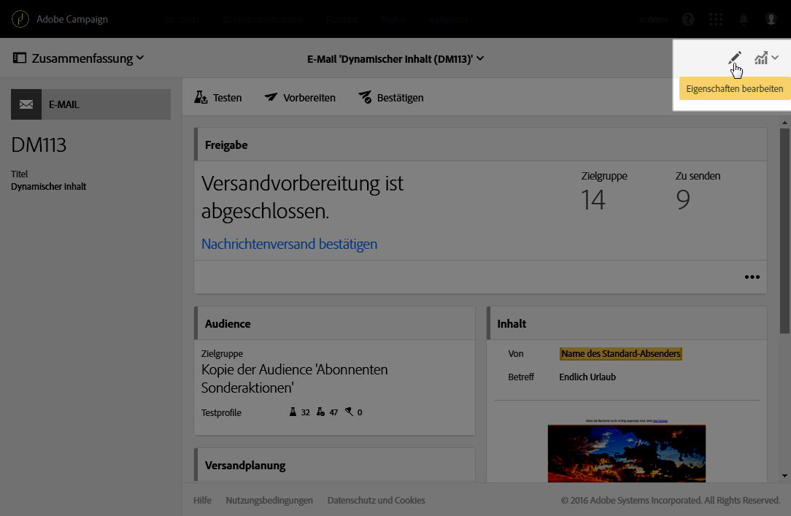
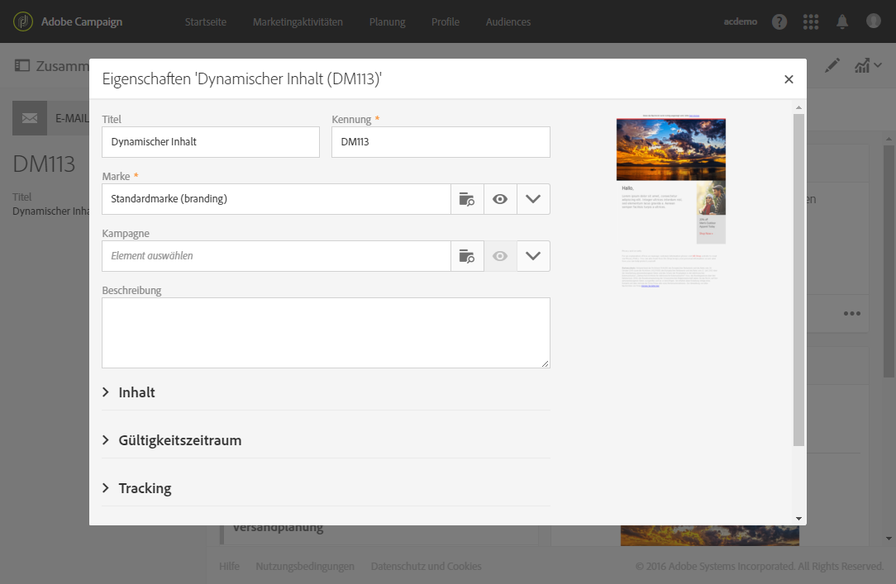
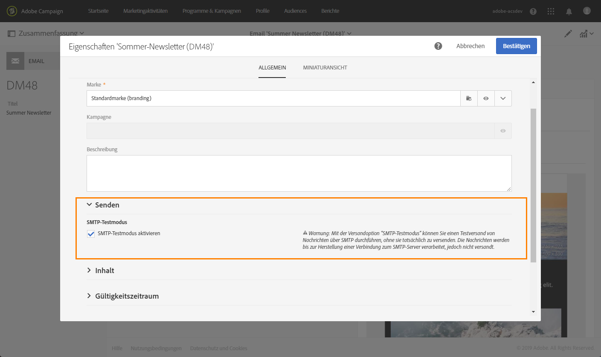
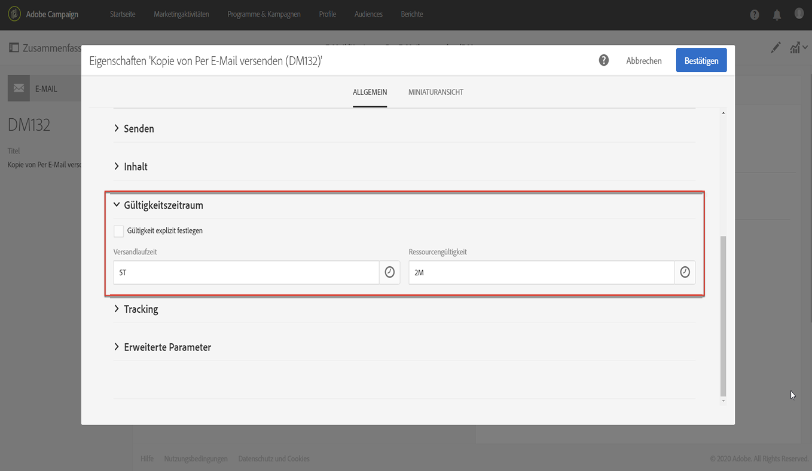
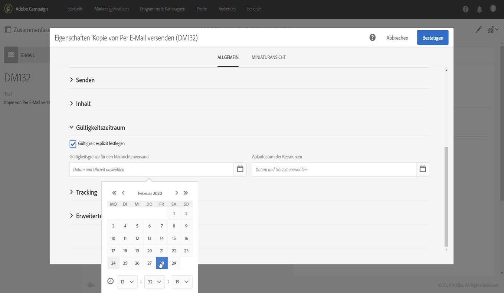
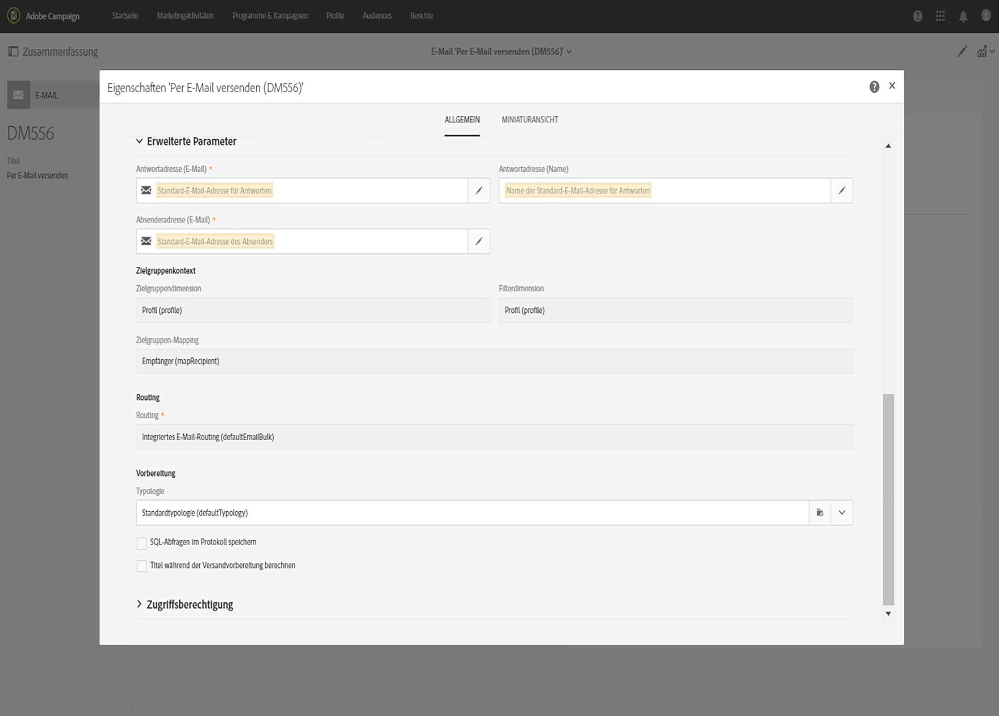

# E-Mail-Kanal konfigurieren{#configuring-email-channel}

Als [Administrator](../../administration/using/users-management.md#functional-administrators)der Kampagne können Sie die Einstellungen für E-Mail-Kanal konfigurieren. Zu diesen erweiterten Einstellungen gehören allgemeine E-Mail-Kanal-Parameter, E-Mail-Routing-Konten, E-Mail-Verarbeitungsregeln und E-Mail-Eigenschaften. Auf dieser Seite erfahren Sie, wie Sie die Standardwerte für die allgemeinen E-Mail- und Senden-Parameter bearbeiten.

Beachten Sie, dass einige E-Mail-Einstellungen jetzt vom Adobe Campaign Enhanced MTA verwaltet werden. Daher
* Einige Konfigurationen in der Benutzeroberfläche der Kampagne werden nicht mehr angewendet:
   * Die Einstellungen für **[!UICONTROL Weitere Zustellversuche]** im Menü [&quot;](#email-channel-parameters) Konfiguration&quot;und in den [Sendeparametern](#retries-parameters) der E-Mail-Eigenschaften.
   * Die **[!UICONTROL MX-Management]** - und **[!UICONTROL Domänenverwaltungsregeln]** im Menü der [E-Mail-Verarbeitungsregeln](#email-processing-rules).

* Andere Parameter werden jetzt teilweise von Enhanced MTA verwaltet, während einige Konfigurationen innerhalb der Kampagne noch möglich sind. Die betroffenen Einstellungen lauten wie folgt:
   * Der Parameter für die Dauer **[!UICONTROL des]** Message-Versands im Menü &quot; **[!UICONTROL Konfiguration]** &quot;. Weiterführende Informationen hierzu finden Sie in [diesem Abschnitt](#email-channel-parameters).
   * Die **[!UICONTROL Gültigkeitsdauer]** oder **[!UICONTROL Gültigkeit für das Senden von Nachrichten]** im Abschnitt **[!UICONTROL Gültigkeitsdauer]** . Weiterführende Informationen hierzu finden Sie in [diesem Abschnitt](#validity-period-parameters).
   * Die Regeln für **[!UICONTROL Absprung-Mails]** in den **[!UICONTROL E-Mail-Verarbeitungsregeln]**. Weiterführende Informationen hierzu finden Sie in [diesem Abschnitt](#email-processing-rules).

## Parameter für den E-Mail-Kanal {#email-channel-parameters}

Im Anzeigebereich &quot;E-Mail-Konfiguration&quot;können Sie die Parameter für den E-Mail-Kanal definieren. Administrators can access these configurations in the **[!UICONTROL Administration]>[!UICONTROL Channels]>[!UICONTROL Email]>[!UICONTROL Configuration]** menu.

* **Felder für autorisierte Masken**

   Die **[!UICONTROL Header-Parameter des Abschnitts &quot;Senden von E-Mails]** &quot;enthalten die autorisierten E-Mail-Adressen, mit denen Sie E-Mails an Ihre Empfänger senden können (Absenderadresse) und die es ihnen ermöglichen, automatisierte Antworten wie asynchrone Absprünge, Abwesenheitsantworten usw. zurückzusenden. (Fehleradresse).  Adobe Campaign prüft, ob die eingegebenen Adressen während der Vorbereitung der Nachricht gültig sind. Auf diese Weise vermeiden Sie die Verwendung von Adressen, die Probleme bei der Zustellbarkeit bereiten könnten.
   * Sowohl Absender- als auch Fehleradressen werden von Adobe eingerichtet. Diese Felder dürfen nicht leer sein.
   * Sie können diese Felder nicht bearbeiten. Wenden Sie sich zum Aktualisieren einer Adresse an das Adobe-Kundendienstteam.
   * Um eine weitere Adresse hinzuzufügen, können Sie über die [Systemsteuerung](https://docs.adobe.com/content/help/de-DE/control-panel/using/subdomains-and-certificates/setting-up-new-subdomain.html) eine neue Subdomäne einrichten oder sich an das Adobe-Kundendienstteam wenden. Beachten Sie, dass mehrere Masken durch Kommas getrennt werden.
   * Es empfiehlt sich, Adressen mit einem Stern wie *@yourdomain.com festzulegen: Sie können jede Adresse verwenden, die mit Ihrem Subdomänennamen endet.

* **Zustellbarkeit**

   Die **[!UICONTROL Versandberichte-ID]** wird vom Adobe-Kundenservice-Team bereitgestellt. Er identifiziert jede Instanz mit einer Auslieferungs-ID, die in den technischen Auslieferungsberichten verwendet wird.
   <!--The Technical Deliverability report is not accessible through the UI in ACS. It will be replaced with 250ok in the future (project starting).-->

* **Versandparameter**

   Adobe Campaign versendet Nachrichten ab dem Datum des Versandstarts. Im Feld für die Dauer **[!UICONTROL des]** Message-Versands können Sie den Zeitraum angeben, in dem alle Meldungen im Versand, bei denen ein vorübergehender Fehler oder ein Soft-Absprung auftritt, erneut versucht werden.

   >[!IMPORTANT]
   >
   >**Dieser Parameter in Kampagne wird jetzt nur verwendet, wenn er auf 3,5 Tage oder weniger festgelegt ist.** Wenn Sie einen Wert definieren, der länger als 3,5 Tage ist, wird er nicht berücksichtigt, da er nun vom Adobe Campaign Enhanced MTA verwaltet wird.

   Das Feld **[!UICONTROL Gültigkeit der Online-Ressourcen]** wird für Ressourcen verwendet, die online verfügbar sind, insbesondere für Mirrorseiten und Bilder. Die Gültigkeitsdauer der Ressourcen auf dieser Seite ist begrenzt, um Speicherkapazität zu sparen.

* **Weitere Zustellversuche**

   Nachrichten, die vorläufig nicht zugestellt werden können, werden automatisch für einen erneuten Versuch vorgesehen. Weiterführende Informationen dazu finden Sie in Abschnitt [Weitere Zustellversuche nach einem vorübergehend fehlgeschlagenen Versand](../../sending/using/understanding-delivery-failures.md#retries-after-a-delivery-temporary-failure).

   >[!NOTE]
   >
   >Die maximale Anzahl der auszuführenden weitere Zustellversuche und die minimale Verzögerung zwischen den weiteren Zustellversuchen werden nun vom Adobe Campaign Enhanced MTA verwaltet, basierend darauf, wie gut eine IP sowohl historisch als auch aktuell in einer bestimmten Domäne läuft. Die Einstellungen für **Weitere Zustellversuche** in der Kampagne werden ignoriert.

   <!--This section indicates how many retries should be performed the day after the send is started (**Number of retries**) and the minimum delay between retries (**Retry period**). By default, five retries are scheduled for the first day with a minimum interval of one hour, spread out over the 24 hours of the day. One retry per day is programmed after that and until the delivery deadline, which is defined in the **[!UICONTROL Delivery parameters]** section.-->

* **Quarantäne-Parameter der E-Mails**

   In the **[!UICONTROL Time between two significant errors]** field, enter a value to define the time the application waits before incrementing the error counter in case of a soft-bounced failure. Der Standardwert ist **&quot;1d&quot;**, für 1 Tag.

   Wenn der Wert **[!UICONTROL Maximale Anzahl an Fehlern vor der Quarantäne]** erreicht ist, wird die E-Mail-Adresse unter Quarantäne gestellt. The default value is **&quot;5&quot;**: the address will be quarantined on the fifth error. Dies bedeutet, dass der Kontakt automatisch von den nächsten Sendungen ausgeschlossen wird.
   <!--Actually the way ACS works is that the address is already on the quarantine list on the first bounce, but with a different status meaning that the error count has started.-->

   For more on quarantines, see [Understanding quarantine management](../../sending/using/understanding-quarantine-management.md).

## E-Mail-Routing-Konten     {#email-routing-accounts}

Das externe Konto **[!UICONTROL Integriertes E-Mail-Routing]** wird standardmäßig bereitgestellt. Es enthält die technischen Parameter, die es der Anwendung erlauben, E-Mails zu senden.

Dabei ist der Kontotyp mit **[!UICONTROL Routing]**, der Kanal mit **[!UICONTROL E-Mail]** und der Versandmodus mit **[!UICONTROL Gebündelter Versand]** zu konfigurieren.

**Verwandtes Thema**:

[Externe Konten](../../administration/using/external-accounts.md)

## Regeln zum Umgang mit E-Mails     {#email-processing-rules}

The **[!UICONTROL Email processing rules]** can be accessed by administrators through the **[!UICONTROL Administration > Channels > Email]** menu.

Beachten Sie, dass die E-Mail-Domänen und die MX-Regeln jetzt vom Adobe Campaign Enhanced MTA verwaltet werden:
* Die Signierung zur E-Mail-Authentifizierung mit **DKIM (DomainKeys Identified Mail)** erfolgt durch den Enhanced MTA für alle Nachrichten mit allen Domains. Die Signierung erfolgt nicht mit **Sender ID**, **DomainKeys** oder **S/MIME**, es sei denn, auf der Ebene des Enhanced MTA ist etwas anderes angegeben.
* Die erweiterte MTA verwendet ihre eigenen MX-Regeln, die es ermöglichen, Ihren Durchsatz nach Domäne basierend auf Ihrem eigenen historischen E-Mail-Ruf und dem Echtzeit-Feedback, das von den Domänen stammt, von denen Sie E-Mails senden, anzupassen.

### Bounce Messages {#bounce-mails}

Asynchronous bounces are still qualified by the Campaign inMail process through the **[!UICONTROL Bounce mails]** rules.

In den Regeln sind die von Remote-Servern potenziell zurückgegebenen Strings enthalten, die die Qualifizierung der Fehler in **Hardbounce**, **Softbounce** oder **Ignoriert** erlauben.

>[!NOTE]
>
>Bei Fehlermeldungen mit synchronen Versänden bestimmt die erweiterte MTA des Adobe Campaigns den Absprungtyp und die Absprungberechtigung und sendet diese Informationen an die Kampagne zurück.

Weiterführende Informationen zur Qualifizierung von Bounce Messages finden Sie in diesem [Abschnitt](../../sending/using/understanding-delivery-failures.md#bounce-mail-qualification).

<!--Because they are now managed by the Enhanced MTA, the bounce qualifications in the Campaign **[!UICONTROL Message qualification]** table are no longer used. For more on bounce mail qualification, see this [section](../../sending/using/understanding-delivery-failures.md#bounce-mail-qualification).

### Management of email domains {#managing-email-domains}

The email domains are now managed by the Adobe Campaign Enhanced MTA. The Adobe Campaign **[!UICONTROL Domain management]** rules are no longer used.

**DKIM (DomainKeys Identified Mail)** email authentication signing is done by the Enhanced MTA for all messages with all domains. It does not sign with **Sender ID**, **DomainKeys**, or **S/MIME** unless otherwise specified at the Enhanced MTA level.

### MX management {#mx-management}

The MX rules are now managed by the Adobe Campaign Enhanced MTA. The Adobe Campaign **[!UICONTROL MX management]** delivery throughput rules are no longer used.

The Enhanced MTA uses its own MX rules that allow it to customize your throughput by domain based on your own historical email reputation, and on the real-time feedback coming from the domains where you are sending emails.-->

## Liste der E-Mail-Eigenschaften     {#list-of-email-properties}

Dieser Abschnitt behandelt die Liste von Parametern, die in den Eigenschaften einer E-Mail oder einer E-Mail-Vorlage verfügbar sind.

>[!NOTE]
>
>Manche Parameter sind ausschließlich über die Vorlagen verfügbar. Die Parameter, auf die Sie zugreifen können, [hängen von Ihrer Zugriffsberechtigung ab](../../administration/using/users-management.md).

Zur Änderung der Eigenschaften einer E-Mail bzw. einer E-Mail-Vorlage verwenden Sie die Schaltfläche **[!UICONTROL Eigenschaften bearbeiten]**.

### Allgemeine Parameter {#general-parameters}

Identifizieren Sie am oberen Rand des E-Mail-Parameter-Fensters die E-Mail unter Verwendung der Felder **[!UICONTROL Titel]** und **[!UICONTROL ID]**. Diese Informationen erscheinen in der Benutzeroberfläche, sind aber für die Empfänger nicht sichtbar.

>[!IMPORTANT]
>
>Die Kennung muss eindeutig sein.

Das Feld **[!UICONTROL Marke]** dient der Auswahl der dem Versand zugeordneten Marke. Weiterführende Informationen zur Verwendung und Konfiguration von Marken finden Sie im Abschnitt [Marken](../../administration/using/branding.md).

Im Feld **[!UICONTROL Kampagne]** kann die mit der E-Mail verknüpfte Kampagne eingetragen werden.

Außerdem kann im entsprechenden Feld eine **[!UICONTROL Beschreibung]** eingetragen werden. Das Bild, das in der Miniaturansicht der E-Mail innerhalb der Listen angezeigt wird, kann ebenfalls geändert werden.

### Versandparameter {#sending-parameters}

Der Bereich **[!UICONTROL Senden]** ist nur für E-Mail-Vorlagen verfügbar. Darin sind die folgenden Parameter enthalten:

#### Parameter für weitere Zustellversuche {#retries-parameters}

Nachrichten, die vorläufig nicht zugestellt werden können, werden automatisch für einen erneuten Versuch vorgesehen. Weiterführende Informationen dazu finden Sie in Abschnitt [Weitere Zustellversuche nach einem vorübergehend fehlgeschlagenen Versand](../../sending/using/understanding-delivery-failures.md#retries-after-a-delivery-temporary-failure).

>[!NOTE]
>
>Die minimale Verzögerung zwischen weiteren Zustellversuchen und die maximale Anzahl der auszuführenden weitere Zustellversuche wird nun vom Adobe Campaign Enhanced MTA verwaltet, basierend darauf, wie gut eine IP sowohl historisch als auch aktuell in einer bestimmten Domäne läuft. Die Einstellungen für die Kampagne **Weitere Zustellversuche** werden ignoriert.

<!--This section indicates how many retries should be performed the day after the send is started ( **[!UICONTROL Max. number of retries]** ) and the minimum delay between retries ( **[!UICONTROL Retry period]** ).

By default, five retries are scheduled for the first day with a minimum interval of one hour, spread out over the 24 hours of the day. One retry per day is programmed after that and until the delivery deadline, which is defined in the [Validity period parameters](#validity-period-parameters) section.

The number of retries can be changed globally (contact your Adobe technical administrator) or for each delivery or delivery template.-->

Die in der Kampagne **eingerichtete Einstellung** für die Dauer des [Versands (die im Abschnitt](#validity-period-parameters) Gültigkeitszeitparameter **definiert ist) wird weiterhin berücksichtigt, jedoch nur bis zu 3,5 Tage**. An diesem Punkt wird jede Meldung in der Warteschlange zum Wiederholen aus der Warteschlange entfernt und als Absprung zurückgesendet. For more on delivery failures, see this [section](../../sending/using/understanding-delivery-failures.md#about-delivery-failures).

#### Parameter für E-Mail-Format     {#email-format-parameters}

Sie können das Format der zu sendenden E-Mails konfigurieren. Dabei stehen drei Optionen zur Verfügung:

* **Empfängervorlieben berücksichtigen** (Standardmodus): Das Nachrichtenformat wird auf der Grundlage der im Empfängerprofil gespeicherten Daten definiert und standardmäßig im Feld **E-Mail-Format** (@emailFormat) gespeichert. Falls ein Empfänger Nachrichten in einem bestimmten Format erhalten möchte, werden sie in diesem Format gesendet. Ohne Angabe in diesem Feld wird eine Nachricht vom Typ „Multipart-Alternative“ gesendet, wie im Anschluss erläutert.
* **E-Mail-Programm des Empfängers das beste Format wählen lassen (multipart-alternative)**: Die Meldung enthält sowohl das Text- als auch das HTML-Format. Welches Format beim Empfänger angezeigt wird, hängt von der Konfiguration des E-Mail-Programms des Empfängers ab (Multipart-Alternative).

   >[!IMPORTANT]
   >
   >Diese Option umfasst beide Versionen der Nachricht. Dies hat Auswirkungen auf den Versanddurchsatz, da die Nachricht dadurch größer wird.

* **Alle Nachrichten im Textformat senden**: Die Nachricht wird im Textformat gesendet. Das HTML-Format wird nicht gesendet und lediglich für die Mirrorseite verwendet, wenn der Empfänger auf den Link in der Nachricht klickt.

#### SMTP-Testmodus {#smtp-test-mode}

Mit der Option **[!UICONTROL SMTP-Testmodus aktivieren]** können Sie den Versand von E-Mails über eine SMTP-Verbindung testen, ohne tatsächlich Nachrichten zu senden.
Die Nachrichten werden verarbeitet, bis eine Verbindung mit dem SMTP-Server hergestellt wurde, sie werden aber nicht gesendet.

Diese Option steht für E-Mails und E-Mail-Vorlagen zur Verfügung.

Wenn Sie die SMTP-Testmodus-Option für eine E-Mail-Vorlage aktivieren, ist diese Option in allen mit dieser Vorlage erstellten E-Mail-Nachrichten aktiviert.

>[!IMPORTANT]
>
>Wenn diese Option für eine E-Mail aktiviert ist, werden keine Nachrichten gesendet, bis sie deaktiviert wird.
>Im Dashboard der E-Mail oder E-Mail-Vorlage wird ein Warnhinweis angezeigt.

Weiterführende Informationen zur SMTP-Konfiguration finden Sie im Abschnitt [Liste der E-Mail-SMTP-Parameter](#list-of-email-smtp-parameters).

### Parameter für den Gültigkeitszeitraum     {#validity-period-parameters}

Im Abschnitt **[!UICONTROL Gültigkeitszeitraum]** sind folgende Parameter verfügbar:

* **[!UICONTROL Gültigkeit explizit festlegen]**: Wenn diese Option nicht angekreuzt ist, müssen die Felder **[!UICONTROL Versandlaufzeit]** und **[!UICONTROL Ressourcen-Gültigkeit]** mit einer Dauer versehen werden.

   Kreuzen Sie diese Option an, wenn Sie Datum und Uhrzeit genau festlegen möchten.

   

* **[!UICONTROL Dauer]** / **[!UICONTROL Gültigkeit des Versands zum Senden von Nachrichten]**: Adobe Campaign sendet die Meldungen, die am Tag des Beginns beginnen. In diesem Feld lässt sich die Dauer festlegen, innerhalb derer Nachrichten verschickt werden können.

   >[!IMPORTANT]
   >
   >Dieser Parameter wird nun vom Adobe Campaign Enhanced MTA verwaltet. **Sie müssen einen Wert bis zu 3,5 Tage definieren.** Wenn Sie einen Wert von mehr als 3,5 Tagen definieren, wird dieser nicht berücksichtigt.

* **[!UICONTROL Gültigkeitsdauer]** der Ressource / **[!UICONTROL Gültigkeit für Ressourcen]**: Dieses Feld wird für hochgeladene Ressourcen verwendet, hauptsächlich für die Mirrorseite und Bilder. Die Gültigkeitsdauer der Ressourcen auf dieser Seite ist begrenzt, um Speicherkapazität zu sparen.
* **[!UICONTROL Verwaltung der Mirrorseite]**: Bei der Mirrorseite handelt es sich um eine HTML-Seite, auf die online über einen Webbrowser zugegriffen werden kann. Sie hat den gleichen Inhalt wie die E-Mail. Standardmäßig wird die Mirrorseite automatisch generiert, wenn der entsprechende Link in den Inhalt der E-Mail eingefügt wurde. Die Erzeugung der Seite lässt sich in diesem Feld konfigurieren:

   >[!IMPORTANT]
   >
   >HTML-Inhalt muss für die E-Mail definiert sein, damit die Mirrorseite erstellt werden kann.

   * **[!UICONTROL Mirrorseite erzeugen, wenn der Link im E-Mail-Inhalt erscheint]** (Standardmodus): Die Mirrorseite wird erstellt, wenn der entsprechende Link in den Inhalt der E-Mail eingefügt wird.
   * **Mirrorseitenerzeugung forcieren**: Erstellt eine Mirrorseite, selbst wenn im Versandinhalt kein entsprechender Link enthalten ist.
   * **Keine Mirrorseite erzeugen**: Generiert keine Mirrorseite, selbst wenn in den Nachrichten der entsprechende Link enthalten ist.
   * **Über die Nachrichtenkennung zugängliche Mirrorseite erzeugen**: Diese Option ermöglicht den Zugriff auf den Inhalt der Mirrorseite (einschließlich aller Personalisierungsinformationen) über das Versandlog-Fenster.

>[!NOTE]
>
>Der Parameter **[!UICONTROL Versandlaufzeit]** gilt nicht für Transaktionsnachrichten. Weiterführende Informationen zu Transaktionsnachrichten finden Sie in [diesem Abschnitt](../../channels/using/about-transactional-messaging.md).

### Tracking-Parameter     {#tracking-parameters}

Im Abschnitt **[!UICONTROL Tracking]** sind folgende Parameter verfügbar:

* **[!UICONTROL Tracking aktivieren]**: Aktivierung/Deaktivierung des Trackings der in den Nachrichten enthaltenen URLs. Über das Symbol **[!UICONTROL Links]** in der Symbolleiste von Email Designer können Sie das Tracking der einzelnen in Nachrichten enthaltenen URLs verwalten. Siehe [Über getrackte URLs](../../designing/using/links.md#about-tracked-urls).
* **[!UICONTROL Ablaufdatum des Trackings]**: Festlegung der Dauer, für die das URL-Tracking aktiv sein soll.
* **[!UICONTROL Ersatz-URL für abgelaufene URLs]**: Hier kann die URL für eine Webseite eingetragen werden, die nach dem Ablauf des Trackings angezeigt wird.

### Erweiterte Parameter {#advanced-parameters}

Der Abschnitt **[!UICONTROL Erweiterte Parameter]** enthält folgende Informationen:

Die ersten Felder dienen zur Eingabe der für die Header von E-Mail-Nachrichten erforderlichen Informationen. Hier können Sie die Antwortadresse und den Text sowie die Absenderadresse (die das Feld „Von:“ ausfüllt) verwalten. Diese Informationen können personalisiert werden.

Klicken Sie auf die Schaltfläche rechts neben dem Feld, das geändert werden soll, und fügen Sie dann das Personalisierungsfeld, den Inhaltsblock oder den dynamischen Text hinzu.

Das Einfügen und Verwenden des Personalisierungsinhalts ist in der Dokumentation zum [Personalisieren von E-Mail-Inhalten](../../designing/using/personalization.md) ausführlich beschrieben.

#### Zielgruppen-Kontext     {#target-context}

Im Zielgruppen-Kontext werden die für die Zielgruppenbestimmung (im Bildschirm zur Audience-Erstellung) und die Personalisierung (Definition von Personalisierungsfeldern, im HTML-Inhaltseditor) der E-Mail verwendeten Tabellen angegeben.

#### Routing     {#routing}

In diesem Feld wird der zu verwendende Routing-Modus definiert. Hierzu wird auf ein externes Konto verwiesen. Dies kann zum Beispiel von Nutzen sein, wenn Sie ein externes Konto mit speziellen Branding-Einstellungen verwenden möchten.

>[!NOTE]
>
>Zu den externen Konten gelangen Sie über das Menü **Administration** > **Anwendungskonfiguration** > **Externe Konten**.

#### Vorbereitung     {#preparation}

Die Vorbereitung von Nachrichten ist im Abschnitt [Nachrichten validieren](../../sending/using/preparing-the-send.md) beschrieben.

* **[!UICONTROL Typologie]**: Vor jedem Versand müssen Nachrichten insofern vorbereitet werden, als ihr Inhalt und ihre Konfiguration zu validieren sind. Die in der Vorbereitungsphase anzuwendenden Validierungsregeln sind in einer **Typologie** festgelegt. Zum Beispiel betrifft die Vorbereitung für E-Mails die Validierung von Betreff, URL und Bildern etc. Wählen Sie in diesem Feld die anzuwendende Typologie aus.

   >[!NOTE]
   >
   >Typologies, which can be accessed via the **[!UICONTROL Administration]** > **[!UICONTROL Channels]** > **[!UICONTROL Typologies]** menu, are presented in [this section](../../sending/using/about-typology-rules.md).

* **[!UICONTROL Titel während der Versandvorbereitung berechnen]**: Ermöglicht die Berechnung des Titelwerts der E-Mail während der Nachrichtenvorbereitung mithilfe von Personalisierungsfeldern, Inhaltsbausteinen und dynamischem Text.

   Sie können auch den Versandtitel mit Ereignisvariablen personalisieren, die in der Aktivität &quot;Externes Signal&quot; des Workflows deklariert wurden. Weiterführende Informationen hierzu finden Sie in [diesem Abschnitt](../../automating/using/calling-a-workflow-with-external-parameters.md).

* **[!UICONTROL SQL-Abfragen im Protokoll speichern]**: Bei dieser Option werden in der Vorbereitungsphase SQL-Abfragelogs im Protokoll gespeichert.

#### Testversandeinstellungen {#proof-settings}

In diesem Abschnitt können Sie das Standardpräfix konfigurieren, das in der Betreffzeile des Testversands verwendet werden soll. Weiterführende Informationen hierzu finden Sie in [diesem Abschnitt](../../sending/using/sending-proofs.md).

### Liste der E-Mail-SMTP-Parameter {#list-of-email-smtp-parameters}

Im Abschnitt **[!UICONTROL SMTP]** sind folgende Parameter verfügbar:

* **[!UICONTROL Zeichenkodierung]**: Aktivieren Sie die Option **[!UICONTROL Kodierung erzwingen]**, wenn Sie die Nachrichtenkodierung erzwingen möchten, und wählen Sie dann die gewünschte Kodierungsmethode aus.
* **[!UICONTROL Bounce Messages]**: Bounce Messages werden standardmäßig in der Fehler-Inbox der Plattform empfangen (definiert unter **[!UICONTROL Administration]** > **[!UICONTROL Kanäle]** > **[!UICONTROL E-Mail]** > **[!UICONTROL Konfiguration).]** Um eine bestimmte Fehleradresse für eine E-Mail zu definieren, geben Sie die jeweilige Adresse im Feld **[!UICONTROL Fehleradresse]** ein.
* **[!UICONTROL Zusätzliche SMTP-Header]**: Mit dieser Option können Sie Ihren Nachrichten zusätzliche SMTP-Header hinzufügen. Das im Feld **[!UICONTROL Header]** eingegebene Skript muss pro Zeile auf einen einzelnen Header (im Format **Name:Wert**) verweisen. Werte werden bei Bedarf automatisch verschlüsselt.

   >[!IMPORTANT]
   >
   >Das Hinzufügen zusätzlicher SMTP-Header ist eine Aufgabe für erfahrene Benutzer. Die Syntax des Skripts muss die Anforderungen für diesen Inhaltstyp (keine überflüssigen Leerzeichen, keine Leerzeilen usw.) erfüllen.

### Liste der Parameter für Zugriffsberechtigung     {#list-of-access-authorization-parameters}

Im Abschnitt **[!UICONTROL Zugriffsberechtigungen]** sind folgende Parameter verfügbar:

* Das Feld **[!UICONTROL Organisationseinheit]** ermöglicht es, den Zugang für diese E-Mail auf bestimmte Nutzer zu begrenzen. Die der spezifizierten Einheit oder den übergeordneten Einheiten zugeteilten Nutzer haben Lese- und Schreibzugriff auf diese E-Mail. Der Zugriff der den untergeordneten Einheiten zugeteilten Nutzer auf diese E-Mail ist schreibgeschützt.

   >[!NOTE]
   >
   >Zur Konfiguration von Organisationseinheiten gehen Sie in das Menü **Administration** > **Benutzer &amp; Sicherheit**.

* Die Felder **[!UICONTROL Erstellt von]**, **[!UICONTROL Erstellt am]**, **[!UICONTROL Geändert von]** und **[!UICONTROL Geändert am]** werden automatisch ausgefüllt.
