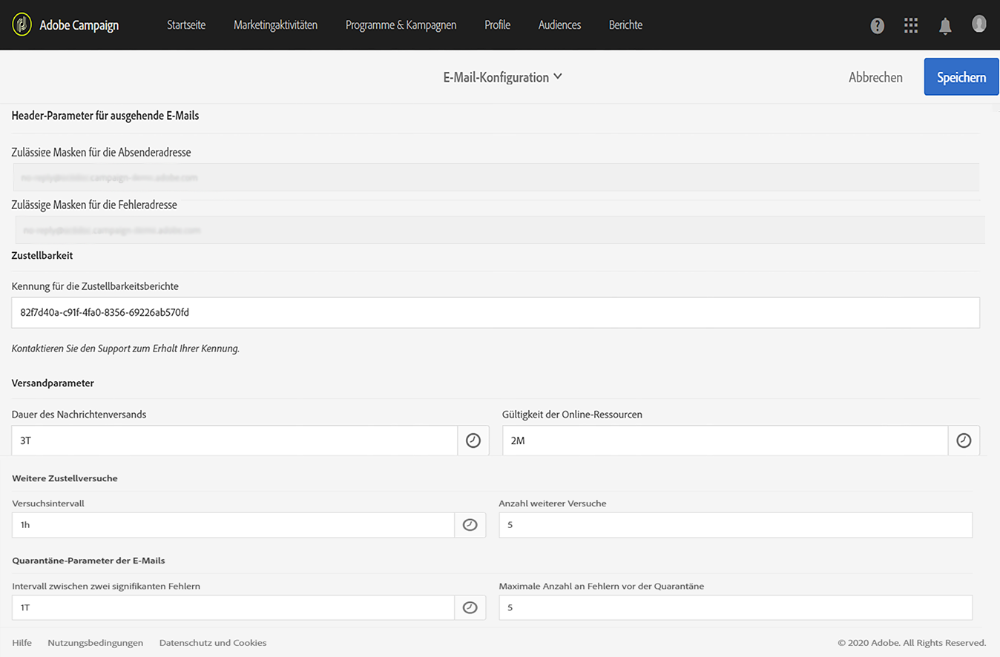

# E-Mail-Kanal konfigurieren{#configuring-email-channel}

Als Campaign-[Administrator](../../administration/using/users-management.md#functional-administrators) können Sie Einstellungen für den E-Mail-Kanal konfigurieren. Zu den erweiterten Einstellungen gehören allgemeine E-Mail-Kanal-Parameter, E-Mail-Routing-Konten, Regeln zum Umgang mit E-Mails sowie E-Mail-Eigenschaften. Auf dieser Seite erfahren Sie, wie Sie die Standardwerte der allgemeinen E-Mail- und Versandparameter bearbeiten können.

## Parameter für den E-Mail-Kanal {#email-channel-parameters}

Im E-Mail-Konfigurationsfenster können Sie die Parameter für den E-Mail-Kanal definieren. Administratoren können auf diese Konfigurationen über das Menü **[!UICONTROL Administration] > [!UICONTROL Kanäle] > [!UICONTROL E-Mail] > [!UICONTROL Konfiguration]** zugreifen.

* **Felder für zulässige Masken**

   Im Abschnitt **[!UICONTROL Header-Parameter für ausgehende E-Mails]** werden die autorisierten E-Mail-Adressen aufgelistet, mit denen Sie E-Mails an Ihre Empfänger senden können (Absenderadresse) und diese in die Lage versetzen können, automatisierte Antworten wie asynchrone Bounces, Abwesenheitsantworten usw. (Fehleradresse) zurückzusenden. Adobe Campaign prüft während der Vorbereitung der Nachricht, ob die eingegebenen Adressen gültig sind. Auf diese Weise vermeiden Sie die Verwendung von Adressen, die Probleme bei der Zustellbarkeit bereiten könnten.
   * Sowohl Absender- als auch Fehleradressen werden von Adobe eingerichtet. Diese Felder dürfen nicht leer sein.
   * Sie können diese Felder nicht bearbeiten. Wenden Sie sich zum Aktualisieren einer Adresse an das Team der Kundenunterstützung von Adobe.
   * Um eine weitere Adresse hinzuzufügen, können Sie über das [Control Panel in Campaign](https://experienceleague.adobe.com/docs/control-panel/using/subdomains-and-certificates/setting-up-new-subdomain.html?lang=de) eine neue Subdomain einrichten oder sich an das Team der Kundenunterstützung von Adobe wenden. Beachten Sie, dass bei Verwendung mehrerer Masken diese durch Kommas getrennt werden.
   * Es wird empfohlen, Adressen mit einem Stern wie *@yourdomain.com festzulegen: Sie können jede Adresse verwenden, die mit Ihrem Subdomain-Namen endet.

* **Zustellbarkeit**

   Die **[!UICONTROL Kennung für die Zustellbarkeitsberichte]** wird vom Team der Kundenunterstützung von Adobe bereitgestellt. Sie identifiziert jede Instanz mit einer Zustellbarkeits-ID, die in den technischen Zustellberichten verwendet wird.
   <!--The Technical Deliverability report is not accessible through the UI in ACS. It will be replaced with 250ok in the future (project starting).-->

* **Versandparameter**

   Adobe Campaign versendet Nachrichten ab dem Datum des Versandstarts.

   Wenn eine Nachricht in einem Versand aufgrund eines temporären Fehlers oder eines Softbounce zurückgewiesen wird, versucht Campaign, diese Nachricht jeden Tag erneut zu senden. Verwenden Sie das Feld **[!UICONTROL Dauer des Nachrichtenversands]**, um den Zeitrahmen anzugeben, während dessen weitere Zustellversuche durchgeführt werden können.

   >[!IMPORTANT]
   >
   >**Dieser Parameter in Campaign wird jetzt nur noch verwendet, wenn er auf 3,5 Tage oder weniger gesetzt ist.** Wenn Sie einen Wert von mehr als 3,5 Tagen definieren, wird dieser nicht berücksichtigt.

   Das Feld **[!UICONTROL Gültigkeit der Online-Ressourcen]** wird für Ressourcen verwendet, die online verfügbar sind, insbesondere für Mirrorseiten und Bilder. Die Gültigkeitsdauer der Ressourcen auf dieser Seite ist begrenzt, um Speicherkapazität zu sparen.

* **Weitere Zustellversuche**

   Nachrichten, die vorläufig nicht zugestellt werden können, werden automatisch für einen erneuten Versuch vorgesehen. Weiterführende Informationen dazu finden Sie in Abschnitt [Weitere Zustellversuche nach einem vorübergehend fehlgeschlagenen Versand](../../sending/using/understanding-delivery-failures.md#retries-after-a-delivery-temporary-failure).

   >[!IMPORTANT]
   >
   >Die maximale Anzahl erneuter Versuche und das Mindestintervall zwischen erneuten Versuchen basieren nun sowohl auf der historischen als auch der aktuellen Leistung einer IP-Adresse bei einer bestimmten Domain. Die Einstellungen **[!UICONTROL Versuchsintervall]** und **[!UICONTROL Anzahl weiterer Versuche]** in Campaign werden ignoriert.

   <!--This section indicates how many retries should be performed the day after the send is started (**Number of retries**) and the minimum delay between retries (**Retry period**). By default, five retries are scheduled for the first day with a minimum interval of one hour, spread out over the 24 hours of the day. One retry per day is programmed after that and until the delivery deadline, which is defined in the **[!UICONTROL Delivery parameters]** section.-->

* **Quarantäne-Parameter der E-Mails**

   Geben Sie im Feld **[!UICONTROL Intervall zwischen zwei signifikanten Fehlern]** einen Wert an, um die Zeit zu definieren, die die Anwendung im Falle eines Softbounce-Fehlers wartet, bevor sie den Fehlerzähler inkrementiert. Der Standardwert lautet **1d** (für einen Tag).

   Wenn der Wert **[!UICONTROL Maximale Anzahl an Fehlern vor der Quarantäne]** erreicht ist, wird die E-Mail-Adresse unter Quarantäne gestellt. Der Standardwert lautet **&quot;5&quot;**: Die Adresse wird beim fünften Fehler unter Quarantäne gestellt. Dies bedeutet, dass der Kontakt automatisch von den nächsten Sendungen ausgeschlossen wird.
   <!--Actually the way ACS works is that the address is already on the quarantine list on the first bounce, but with a different status meaning that the error count has started.-->

   Weiterführende Informationen zur Quarantäne finden Sie unter [Funktionsweise der Quarantäneverwaltung](../../sending/using/understanding-quarantine-management.md).

## E-Mail-Routing-Konten  {#email-routing-accounts}

Das externe Konto **[!UICONTROL Integriertes E-Mail-Routing]** wird standardmäßig bereitgestellt. Es enthält die technischen Parameter, die es der Anwendung erlauben, E-Mails zu senden.

Dabei ist der Kontotyp mit **[!UICONTROL Routing]**, der Kanal mit **[!UICONTROL E-Mail]** und der Versandmodus mit **[!UICONTROL Gebündelter Versand]** zu konfigurieren.

**Verwandtes Thema**:

[Externe Konten](../../administration/using/external-accounts.md)

## Regeln zum Umgang mit E-Mails  {#email-processing-rules}

Auf die **[!UICONTROL Regeln zum Umgang mit E-Mails]** können Administratoren über das Menü **[!UICONTROL Administration > Kanäle > E-Mail]** zugreifen.

>[!IMPORTANT]
>
>Die E-Mail-Domains und die MX-Regeln werden jetzt automatisch verwaltet<!--by the Adobe Campaign Enhanced MTA (Message Transfer Agent)--> und können nicht mehr geändert werden.

* Die Signierung zur E-Mail-Authentifizierung mit **DKIM (DomainKeys Identified Mail)** erfolgt für alle Nachrichten mit allen Domains. Die Signierung erfolgt nicht mit **Sender ID**, **DomainKeys** oder **S/MIME**.
* MX-Regeln passen Ihren Durchsatz automatisch nach Domain an, basierend auf Ihrer eigenen historischen E-Mail-Reputation und dem Echtzeit-Feedback der Domains, in denen Sie E-Mails senden.

<!--Note that the email domains and the MX rules are now managed by the Adobe Campaign Enhanced MTA:
* **DKIM (DomainKeys Identified Mail)** email authentication signing is done by the Enhanced MTA for all messages with all domains. It does not sign with **Sender ID**, **DomainKeys**, or **S/MIME** unless otherwise specified at the Enhanced MTA level.
* The Enhanced MTA uses its own MX rules that allow it to customize your throughput by domain based on your own historical email reputation, and on the real-time feedback coming from the domains where you are sending emails.-->

### Bounce Messages {#bounce-mails}

Asynchrone Bounces werden weiterhin mit dem inMail-Verfahren von Campaign durch die Regel **[!UICONTROL Bounce Messages]** qualifiziert.

In den Regeln sind die von Remote-Servern potenziell zurückgegebenen Strings enthalten, die die Qualifizierung der Fehler in **Hardbounce**, **Softbounce** oder **Ignoriert** erlauben.

>[!IMPORTANT]
>
>Bei Fehlermeldungen, bei denen der synchrone Versand fehlgeschlagen ist, bestimmt der erweiterte MTA von Adobe Campaign jetzt den Bounce-Typ und die Qualifizierung und sendet diese Informationen an Campaign zurück.

Weiterführende Informationen zur Qualifizierung von Bounce Messages finden Sie in diesem [Abschnitt](../../sending/using/understanding-delivery-failures.md#bounce-mail-qualification).

<!--Because they are now managed by the Enhanced MTA, the bounce qualifications in the Campaign **[!UICONTROL Message qualification]** table are no longer used. For more on bounce mail qualification, see this [section](../../sending/using/understanding-delivery-failures.md#bounce-mail-qualification).

### Management of email domains {#managing-email-domains}

The email domains are now managed by the Adobe Campaign Enhanced MTA. The Adobe Campaign **[!UICONTROL Domain management]** rules are no longer used.

**DKIM (DomainKeys Identified Mail)** email authentication signing is done by the Enhanced MTA for all messages with all domains. It does not sign with **Sender ID**, **DomainKeys**, or **S/MIME** unless otherwise specified at the Enhanced MTA level.

### MX management {#mx-management}

The MX rules are now managed by the Adobe Campaign Enhanced MTA. The Adobe Campaign **[!UICONTROL MX management]** delivery throughput rules are no longer used.

The Enhanced MTA uses its own MX rules that allow it to customize your throughput by domain based on your own historical email reputation, and on the real-time feedback coming from the domains where you are sending emails.-->

## Liste der E-Mail-Eigenschaften  {#list-of-email-properties}

Dieser Abschnitt behandelt die Liste von Parametern, die in den Eigenschaften einer E-Mail oder einer E-Mail-Vorlage verfügbar sind.

>[!NOTE]
>
>Manche Parameter sind ausschließlich über die Vorlagen verfügbar. Die Parameter, auf die Sie zugreifen können, [hängen von Ihrer Zugriffsberechtigung ab](../../administration/using/users-management.md).

Zur Änderung der Eigenschaften einer E-Mail bzw. einer E-Mail-Vorlage verwenden Sie die Schaltfläche **[!UICONTROL Eigenschaften bearbeiten]**.

### Allgemeine Parameter {#general-parameters}

Identifizieren Sie am oberen Rand des E-Mail-Parameter-Fensters die E-Mail unter Verwendung der Felder **[!UICONTROL Titel]** und **[!UICONTROL ID]**. Diese Informationen erscheinen in der Benutzeroberfläche, sind aber für die Empfänger nicht sichtbar.

>[!IMPORTANT]
>
>Die Kennung muss eindeutig sein.

Das Feld **[!UICONTROL Marke]** dient der Auswahl der dem Versand zugeordneten Marke. Weiterführende Informationen zur Verwendung und Konfiguration von Marken finden Sie im Abschnitt [Marken](../../administration/using/branding.md).

Geben Sie in das Feld **[!UICONTROL Kampagne]** die Kampagne ein, zu der die E-Mail gehört.

Außerdem kann im entsprechenden Feld eine **[!UICONTROL Beschreibung]** eingetragen werden. Das Bild, das in der Miniaturansicht der E-Mail innerhalb der Listen angezeigt wird, kann ebenfalls geändert werden.

### Versandparameter {#sending-parameters}

Der Bereich **[!UICONTROL Senden]** ist nur für E-Mail-Vorlagen verfügbar. Darin sind die folgenden Parameter enthalten:

#### Parameter für weitere Zustellversuche {#retries-parameters}

Nachrichten, die vorläufig nicht zugestellt werden können, werden automatisch für einen erneuten Versuch vorgesehen. Weiterführende Informationen dazu finden Sie in Abschnitt [Weitere Zustellversuche nach einem vorübergehend fehlgeschlagenen Versand](../../sending/using/understanding-delivery-failures.md#retries-after-a-delivery-temporary-failure).

>[!IMPORTANT]
>
>Das Mindestintervall zwischen erneuten Zustellversuchen und die maximale Anzahl weiterer Zustellversuche basieren nun sowohl auf der historischen als auch aktuellen Leistung einer IP-Adresse in einer bestimmten Domain. Die Einstellungen **[!UICONTROL Versuchsintervall]** und **[!UICONTROL Maximale Versuchsanzahl]** in Campaign werden ignoriert.

Die in Campaign eingerichtete Einstellung **Versandlaufzeit** (definiert im Bereich [Parameter für den Gültigkeitszeitraum](#validity-period-parameters)) wird **weiterhin berücksichtigt, jedoch nur für bis zu 3,5 Tage**. An diesem Punkt wird jede Nachricht in der Warteschlange für weitere Versuche aus der Warteschlange entfernt und als Bounce zurückgesendet. Weiterführende Informationen zu Versandfehlern finden Sie in [diesem Abschnitt](../../sending/using/understanding-delivery-failures.md#about-delivery-failures).

#### Parameter für E-Mail-Format  {#email-format-parameters}

Sie können das Format der zu sendenden E-Mails konfigurieren. Dabei stehen drei Optionen zur Verfügung:

* **Empfängervorlieben berücksichtigen** (Standardmodus): Das Nachrichtenformat wird auf der Grundlage der im Empfängerprofil gespeicherten Daten definiert und standardmäßig im Feld **E-Mail-Format** (@emailFormat) gespeichert. Falls ein Empfänger Nachrichten in einem bestimmten Format erhalten möchte, werden sie in diesem Format gesendet. Ohne Angabe in diesem Feld wird eine Nachricht vom Typ „Multipart-Alternative“ gesendet, wie im Anschluss erläutert.
* **E-Mail-Programm des Empfängers das beste Format wählen lassen (multipart-alternative)**: Die Meldung enthält sowohl das Text- als auch das HTML-Format. Welches Format beim Empfänger angezeigt wird, hängt von der Konfiguration des E-Mail-Programms des Empfängers ab (Multipart-Alternative).

   >[!IMPORTANT]
   >
   >Diese Option umfasst beide Versionen der Nachricht. Dies hat Auswirkungen auf den Versanddurchsatz, da die Nachricht dadurch größer wird.

* **Alle Nachrichten im Textformat senden**: Die Nachricht wird im Textformat gesendet. Das HTML-Format wird nicht gesendet und lediglich für die Mirrorseite verwendet, wenn der Empfänger auf den Link in der Nachricht klickt.

#### SMTP-Testmodus {#smtp-test-mode}

Mit der Option **[!UICONTROL SMTP-Testmodus aktivieren]** können Sie den Versand von E-Mails über eine SMTP-Verbindung testen, ohne tatsächlich Nachrichten zu senden. Der Versand wird bis zur Verbindung mit dem SMTP-Server verarbeitet, aber nicht gesendet: Für jeden Empfänger des Versands stellt Campaign eine Verbindung mit dem Server des SMTP-Anbieters her, führt den SMTP-Befehl RCPT TO aus und schließt die Verbindung vor dem SMTP-Befehl DATA.

Diese Option steht für E-Mails und E-Mail-Vorlagen zur Verfügung.

Wenn Sie die SMTP-Testmodus-Option für eine E-Mail-Vorlage aktivieren, ist diese Option in allen mit dieser Vorlage erstellten E-Mail-Nachrichten aktiviert.

>[!IMPORTANT]
>
>Wenn diese Option für eine E-Mail aktiviert ist, werden keine Nachrichten gesendet, bis sie deaktiviert wird.
>Im Dashboard der E-Mail oder E-Mail-Vorlage wird ein Warnhinweis angezeigt.

Weiterführende Informationen zur SMTP-Konfiguration finden Sie im Abschnitt [Liste der E-Mail-SMTP-Parameter](#list-of-email-smtp-parameters).

### Parameter für den Gültigkeitszeitraum  {#validity-period-parameters}

Im Abschnitt **[!UICONTROL Gültigkeitszeitraum]** sind folgende Parameter verfügbar:

* **[!UICONTROL Gültigkeit explizit festlegen]**: Wenn diese Option nicht angekreuzt ist, müssen die Felder **[!UICONTROL Versandlaufzeit]** und **[!UICONTROL Ressourcen-Gültigkeit]** mit einer Dauer versehen werden.

   Kreuzen Sie diese Option an, wenn Sie Datum und Uhrzeit genau festlegen möchten.

   

* **[!UICONTROL Versandlaufzeit]** / **[!UICONTROL Gültigkeitsgrenze für den Nachrichtenversand]**: Adobe Campaign versendet Nachrichten ab dem Datum des Versandstarts. In diesem Feld lässt sich die Dauer festlegen, während der Nachrichten gesendet werden können.

   >[!IMPORTANT]
   >
   >**Sie müssen einen Wert von bis zu 3,5 Tagen definieren.** Wenn Sie einen Wert von mehr als 3,5 Tagen festlegen, wird dieser nicht berücksichtigt.
   >
   >Der Parameter **[!UICONTROL Versandlaufzeit]** gilt nicht für Transaktionsnachrichten. Weiterführende Informationen zu Transaktionsnachrichten finden Sie in [diesem Abschnitt](../../channels/using/getting-started-with-transactional-msg.md).

* **[!UICONTROL Ressourcen-Gültigkeit]** / **[!UICONTROL Ressourcen]**: In diesem Feld wird die Gültigkeit der hochgeladenen Ressourcen (insbesondere Mirrorseite und Bilder) festgelegt. Die Gültigkeitsdauer der Ressourcen auf dieser Seite ist begrenzt, um Speicherkapazität zu sparen.
* **[!UICONTROL Verwaltung der Mirrorseite]**: Bei der Mirrorseite handelt es sich um eine HTML-Seite, auf die online über einen Webbrowser zugegriffen werden kann. Sie hat den gleichen Inhalt wie die E-Mail. Standardmäßig wird die Mirrorseite automatisch generiert, wenn der entsprechende Link in den Inhalt der E-Mail eingefügt wurde. Mit diesem Feld können Sie festlegen, wie diese Seite generiert wird:

   * **[!UICONTROL Mirrorseite erzeugen, wenn der Link im E-Mail-Inhalt erscheint]** (Standardmodus): Die Mirrorseite wird erstellt, wenn der entsprechende Link in den Inhalt der E-Mail eingefügt wird.
   * **Mirrorseitenerzeugung forcieren**: Erstellt eine Mirrorseite, selbst wenn im Versandinhalt kein entsprechender Link enthalten ist.
   * **Keine Mirrorseite erzeugen**: Generiert keine Mirrorseite, selbst wenn in den Nachrichten der entsprechende Link enthalten ist.
   * **Über die Nachrichtenkennung zugängliche Mirrorseite erzeugen**: Diese Option ermöglicht den Zugriff auf den Inhalt der Mirrorseite (einschließlich aller Personalisierungsinformationen) über das Versandlog-Fenster.

   >[!IMPORTANT]
   >
   >Die Mirror-Seite wird nur erzeugt, wenn für die E-Mail ein HTML-Inhalt definiert wurde.

### Tracking-Parameter  {#tracking-parameters}

Im Abschnitt **[!UICONTROL Tracking]** sind folgende Parameter verfügbar:

* **[!UICONTROL Tracking aktivieren]**: Verwenden Sie diese Option, um das Tracking der Nachrichten-URLs zu aktivieren/deaktivieren. Über das Symbol **[!UICONTROL Links]** in der Symbolleiste von Email Designer können Sie das Tracking der einzelnen in Nachrichten enthaltenen URLs verwalten. Siehe [Über getrackte URLs](../../designing/using/links.md#about-tracked-urls).
* **[!UICONTROL Ablaufdatum des Trackings]**: Verwenden Sie diese Option, um die Dauer zu definieren, für die das URL-Tracking aktiv sein soll.
* **[!UICONTROL Ersatz-URL für abgelaufene URLs]**: Verwenden Sie diese Option, um eine Fallback-URL für eine Web-Seite einzugeben: Sie wird angezeigt, wenn das Tracking abgelaufen ist.
* **[!UICONTROL Tracking-Pixel oben in der E-Mail verwenden]**: Verwenden Sie diese Option, um das Tracking-Pixel an den Anfang der E-Mail statt an das Ende zu setzen. Standardmäßig befindet sich dieses Pixel am unteren Rand Ihrer E-Mails. Wenn Sie große Nachrichten senden, sollten Sie dieses Pixel anstatt an das Ende an den Anfang Ihrer E-Mails setzen, um das Öffnungs-Tracking zu verbessern. Andernfalls könnte nämlich das Tracking-Pixel von einigen E-Mail-Anbietern abgeschnitten werden.

### Erweiterte Parameter {#advanced-parameters}

Der Abschnitt **[!UICONTROL Erweiterte Parameter]** enthält folgende Informationen:

Die ersten Felder dienen zur Eingabe der für die Header von E-Mail-Nachrichten erforderlichen Informationen. Hier können Sie die Antwortadresse und den Text sowie die Absenderadresse (die das Feld „Von:“ ausfüllt) verwalten. Diese Informationen können personalisiert werden.

Klicken Sie auf die Schaltfläche rechts neben dem Feld, das geändert werden soll, und fügen Sie dann das Personalisierungsfeld, den Inhaltsblock oder den dynamischen Text hinzu.

Das Einfügen und Verwenden des Personalisierungsinhalts ist in der Dokumentation zum [Personalisieren von E-Mail-Inhalten](../../designing/using/personalization.md) ausführlich beschrieben.

#### Zielgruppen-Kontext  {#target-context}

Verwenden Sie den Zielgruppenkontext, um Tabellen zu definieren, die für die E-Mail-Zielgruppenbestimmung (im Bildschirm für die Zielgruppendefinition) und für die Personalisierung (Definition der Personalisierungsfelder im HTML-Inhaltseditor) verwendet werden.

#### Routing {#routing}

In diesem Feld wird der zu verwendende Routing-Modus definiert. Hierzu wird auf ein externes Konto verwiesen. Dies kann zum Beispiel von Nutzen sein, wenn Sie ein externes Konto mit speziellen Branding-Einstellungen verwenden möchten.

>[!NOTE]
>
>Zu den externen Konten gelangen Sie über das Menü **Administration** > **Anwendungskonfiguration** > **Externe Konten**.

#### Vorbereitung {#preparation}

Die Vorbereitung von Nachrichten ist im Abschnitt [Nachrichten validieren](../../sending/using/preparing-the-send.md) beschrieben.

* **[!UICONTROL Typologie]**: Vor jedem Versand müssen Nachrichten insofern vorbereitet werden, als ihr Inhalt und ihre Konfiguration zu validieren sind. Die in der Vorbereitungsphase anzuwendenden Validierungsregeln sind in einer **Typologie** festgelegt. Zum Beispiel betrifft die Vorbereitung für E-Mails die Validierung von Betreff, URL und Bildern etc. Wählen Sie in diesem Feld die anzuwendende Typologie aus.

   >[!NOTE]
   >
   >Typologien, zu denen Sie über das Menü **[!UICONTROL Administration]** > **[!UICONTROL Kanäle]** > **[!UICONTROL Typologien]** gelangen, werden [in diesem Abschnitt](../../sending/using/about-typology-rules.md) beschrieben.

* **[!UICONTROL Titel während der Versandvorbereitung berechnen]**: Verwenden Sie diese Option, um den Titelwert der E-Mail während der Vorbereitungsphase der Nachricht mithilfe von Personalisierungsfeldern, Inhaltsbausteinen und dynamischem Text zu berechnen.

   Sie können auch den Versandtitel mit Ereignisvariablen personalisieren, die in der Aktivität &quot;Externes Signal&quot; des Workflows deklariert wurden. Weiterführende Informationen hierzu finden Sie in [diesem Abschnitt](../../automating/using/calling-a-workflow-with-external-parameters.md).

* **[!UICONTROL SQL-Abfragen im Protokoll speichern]**: Verwenden Sie diese Option, um während der Vorbereitungsphase SQL-Abfrageprotokolle zum Protokoll hinzuzufügen.

#### Testversandeinstellungen {#proof-settings}

In diesem Abschnitt können Sie das Standardpräfix konfigurieren, das in der Betreffzeile der Testversand-Nachrichten verwendet werden soll. Weitere Informationen zu Testsendungen finden Sie in [diesem Abschnitt](../../sending/using/sending-proofs.md).

### Liste der E-Mail-SMTP-Parameter {#list-of-email-smtp-parameters}

Im Abschnitt **[!UICONTROL SMTP]** sind folgende Parameter verfügbar:

* **[!UICONTROL Zeichenkodierung]**: Aktivieren Sie die Option **[!UICONTROL Kodierung erzwingen]**, wenn Sie die Nachrichtenkodierung erzwingen möchten, und wählen Sie dann die gewünschte Kodierungsmethode aus.
* **[!UICONTROL Bounce Messages]**: Bounce Messages werden standardmäßig in der Fehler-Inbox der Plattform empfangen (definiert unter **[!UICONTROL Administration]** > **[!UICONTROL Kanäle]** > **[!UICONTROL E-Mail]** > **[!UICONTROL Konfiguration).]** Um eine bestimmte Fehleradresse für eine E-Mail zu definieren, geben Sie die jeweilige Adresse im Feld **[!UICONTROL Fehleradresse]** ein.
* **[!UICONTROL Zusätzliche SMTP-Header]**: Mit dieser Option können Sie Ihren Nachrichten zusätzliche SMTP-Header hinzufügen. Das im Feld **[!UICONTROL Header]** eingegebene Script muss pro Zeile auf einen einzelnen Header (im Format **Name:Wert**) verweisen. Werte werden bei Bedarf automatisch verschlüsselt.

   >[!IMPORTANT]
   >
   >Das Hinzufügen eines Scripts für zusätzliche SMTP-Header ist eine Aufgabe für erfahrene Benutzer. Die Syntax des Scripts muss die Anforderungen für diesen Inhaltstyp (keine überflüssigen Leerzeichen, keine Leerzeilen usw.) erfüllen.

### Liste der Parameter für Zugriffsberechtigung  {#list-of-access-authorization-parameters}

Im Abschnitt **[!UICONTROL Zugriffsberechtigungen]** sind folgende Parameter verfügbar:

* Das Feld **[!UICONTROL Organisationseinheit]** ermöglicht es, den Zugriff auf diese E-Mail auf bestimmte Nutzer zu begrenzen. Die der spezifizierten Einheit oder den übergeordneten Einheiten zugeteilten Nutzer haben Lese- und Schreibzugriff auf diese E-Mail. Der Zugriff der den untergeordneten Einheiten zugeteilten Nutzer auf diese E-Mail ist schreibgeschützt.

   >[!NOTE]
   >
   >Zur Konfiguration von Organisationseinheiten gehen Sie in das Menü **Administration** > **Benutzer &amp; Sicherheit**.

* Die Felder **[!UICONTROL Erstellt von]**, **[!UICONTROL Erstellt am]**, **[!UICONTROL Geändert von]** und **[!UICONTROL Zuletzt geändert]** werden automatisch ausgefüllt.

## Alte Einstellungen {#legacy-settings}

Auch wenn Sie **NICHT** die neueste Version von Campaign verwenden, gelten die im Folgenden beschriebenen Parameter und Abschnitte der Benutzeroberfläche für Sie.

### Weitere Zustellversuche {#legacy-retries}

Die Einstellungen **[!UICONTROL Weitere Zustellversuche]** im [Konfigurationsmenü](#email-channel-parameters) und in den [Versandparametern](#retries-parameters) der E-Mail-Eigenschaften geben an, wie viele weitere Versuche am Tag nach dem Start des Versands ausgeführt werden sollen (**[!UICONTROL Anzahl weiterer Versuche]** / **[!UICONTROL Maximale Versuchsanzahl]**), sowie das minimale Intervall zwischen Verarbeitungsversuchen (**[!UICONTROL Versuchsintervall]**).

Die Anzahl weiterer Versuche kann global (kontaktieren Sie Ihren technischen Adobe-Administrator) oder einzeln für jeden Versand oder jede Versandvorlage geändert werden.

Standardmäßig sind innerhalb der ersten 24 Stunden fünf erneute Versuche im Abstand von mindestens einer Stunde vorgesehen. Danach und bis zum Ablauf der Versandfrist, die global im Abschnitt **[!UICONTROL Versandparameter]** des Menüs **[!UICONTROL Konfiguration]** oder im Abschnitt **[!UICONTROL Versandlaufzeit]** auf der Versandebene definiert ist, ist ein erneuter Versuch pro Tag programmiert (siehe den Abschnitt [Versandlaufzeit ](#legacy-delivery-duration) unten).

### Versandlaufzeit {#legacy-delivery-duration}

Mit dem Parameter **[!UICONTROL Dauer des Nachrichtenversands]** im [Konfigurationsmenü](#email-channel-parameters) können Sie den Zeitrahmen festlegen, in dem für jede Nachricht in dem Versand, bei der ein temporärer Fehler oder ein Softbounce auftritt, ein neuer Zustellversuch unternommen wird.

Mit dem Parameter **[!UICONTROL Versandlaufzeit]** oder **[!UICONTROL Gültigkeitsgrenze für den Nachrichtenversand]** im Abschnitt [Parameter für den Gültigkeitszeitraum](#validity-period-parameters) können Sie die Dauer festlegen, während der die Nachrichten versendet werden können.

### Regeln zum Umgang mit E-Mails  {#legacy-email-processing-rules}

Die Regeln **[!UICONTROL MX-Verwaltung]**, **[!UICONTROL Bounce-Mails]** und **[!UICONTROL Domain-Verwaltung]** können von Administratoren über das Menü **[!UICONTROL Administration > Kanäle > E-Mail > E-Mail-Verarbeitungsregeln]** aufgerufen und geändert werden. [Weitere Informationen](#email-processing-rules).

### Qualifizierung von Bounce-Mails {#legacy-bounce-mail-qualification}

Um die unterschiedlichen Bounces und ihre jeweiligen Fehlertypen und -ursachen aufzulisten, klicken Sie auf das **Adobe**-Logo oben links und anschließend auf **[!UICONTROL Administration > Kanäle > Quarantänen > Nachrichtenqualifizierung]**.

Folgende Qualifikationsstatus von Bounces treten auf:

* **[!UICONTROL Zu qualifizieren]**: Die Bounce Message konnte nicht qualifiziert werden. Die Qualifikation muss dem Zustellbarkeitsteam unterbreitet werden, um die korrekte Steuerung der Zustellbarkeit der Plattform zu gewährleisten. Nicht qualifizierte Bounce Messages werden nicht zur Anreicherung der E-Mail-Regeln herangezogen.
* **[!UICONTROL Beibehalten]**: Die Bounce Message wurde qualifiziert und wird vom Workflow **Zustellbarkeit** verwendet, um mit den existierenden E-Mail-Regeln verglichen zu werden und eventuell die Liste zu ergänzen.
* **[!UICONTROL Ignorieren]**: Die Bounce Message wurde qualifiziert, wird jedoch nicht vom Workflow **Zustellbarkeit** verwendet. Sie wird somit nicht an die Client-Instanzen weitergeleitet.

>[!NOTE]
>
>Bei Ausfall eines ISP werden über Campaign gesendete E-Mails fälschlicherweise als Bounces gekennzeichnet. Um dies zu korrigieren, müssen Sie die Bounce-Qualifizierung aktualisieren. [Weitere Informationen](../../administration/using/update-bounce-qualification.md).

<!--Bounces are qualified through the **[!UICONTROL Bounce mails]** processing rule. For more on accessing this rule, refer to this [section](#legacy-bounce-mail-qualification).-->

### Reporting zum Zugestellt-Indikator {#legacy-delivered-status-report}

In der Ansicht **[!UICONTROL Zusammenfassung]** jeder Nachricht steigt der Prozentsatz **[!UICONTROL Zugestellt]** während des Gültigkeitszeitraums des Versands schrittweise an, da die Soft- und Hardbounces zurückgemeldet werden.

Nachrichten mit Softbounces werden am ersten Tag nach dem Versand als **[!UICONTROL Fehlgeschlagen]** angezeigt. Für diese Nachrichten wird jeden Tag ein neuer Zustellversuch unternommen, bis die Gültigkeitsdauer des Versands endet.
