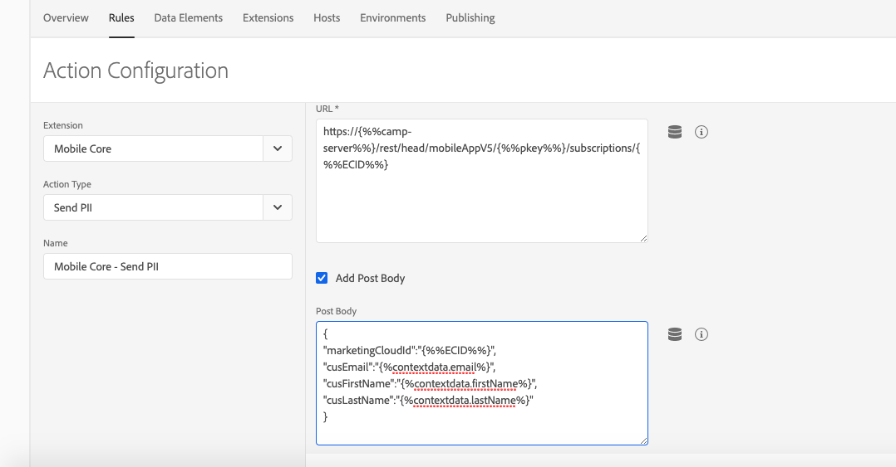

# Launch-Regeln zur Unterstützung von Adobe Campaign Standard-Anwendungsfällen konfigurieren {#configuring-rules-launch}

Sie müssen in [!DNL Adobe Experience Platform Launch] Datenelemente und Regeln erstellen, damit personenbezogene Daten und andere Informationen von mobilen Apps an [!DNL Adobe Campaign Standard] gesendet werden können.

Damit alle Konfigurationsänderungen in [!DNL Adobe Experience Platform Launch] in Kraft treten können, müssen Sie diese Änderungen publizieren. Weitere Informationen finden Sie unter [Publizieren](https://aep-sdks.gitbook.io/docs/getting-started/create-a-mobile-property#publish-the-configuration).

Gehen Sie wie folgt vor, um Regeln in [!DNL Experience Platform Launch] zu erstellen:

1. [Datenelemente erstellen](../../administration/using/configuring-rules-launch.md#create-data-elements)
2. [Regeln für Anwendungsfälle erstellen](../../administration/using/configuring-rules-launch.md#create-data-elements), die Sie unterstützen möchten:
   * [PII-Postback](../../administration/using/configuring-rules-launch.md#pii-postback)
   * [In-App-Tracking-Postback](../../administration/using/configuring-rules-launch.md#inapp-tracking-postback)
   * [Tracking-Postback für Push-Benachrichtigungen](../../administration/using/configuring-rules-launch.md#push-tracking-postback)
   * [Standort-Postback](../../administration/using/configuring-rules-launch.md#location-postback)

## Datenelemente erstellen {#create-data-elements}

Wir empfehlen Ihnen, die folgenden Datenelemente in [!DNL Experience Platform Launch] zu erstellen.
Je nach Bedarf können Sie zusätzliche Datenelemente erstellen.

* **[!UICONTROL Experience-Cloud-ID]**
* **[!UICONTROL Pkey]**
* **[!UICONTROL Campaign-Server]**

So erstellen Sie diese Datenelemente:

1. Klicken Sie in [!DNL Experience Platform Launch] in Ihrem Dashboard für mobile Apps auf die Registerkarte **[!UICONTROL Datenelemente]**.

1. Um das Datenelement **[!UICONTROL Experience-Cloud-ID]** zu erstellen, klicken Sie auf **[!UICONTROL Neues Datenelement erstellen]**.

1. Geben Sie im Feld **[!UICONTROL Name]** beispielsweise **mcid** ein.

1. Wählen Sie aus der Dropdown-Liste **[!UICONTROL Erweiterung]** die Option **[!UICONTROL Mobile Core]** aus. Wählen Sie anschließend **[!UICONTROL Experience-Cloud-ID]** aus der Dropdown-Liste **[!UICONTROL Datenelement]** aus.

   

1. Klicken Sie auf **[!UICONTROL Datenelement hinzufügen]**, um das Datenelement „Pkey“ zu erstellen.

1. Geben Sie im Feld **[!UICONTROL Name]** beispielsweise **pkey** ein.

1. Wählen Sie aus der Dropdown-Liste **[!UICONTROL Erweiterung]** die Option **[!UICONTROL Adobe Campaign Standard]** aus. Wählen Sie anschließend **[!UICONTROL pkey]** aus der Dropdown-Liste **[!UICONTROL Datenelement]** aus.

1. Klicken Sie auf **[!UICONTROL Datenelement hinzufügen]**, um das Datenelement „Campaign Server“ zu erstellen.

1. Geben Sie im Feld **[!UICONTROL Name]** einen Namen ein, beispielsweise **camp-server**.

1. Wählen Sie aus der Dropdown-Liste **[!UICONTROL Erweiterung]** die Option **[!UICONTROL Adobe Campaign Standard]** aus. Wählen Sie anschließend **[!UICONTROL Campaign Server]** aus der Dropdown-Liste **[!UICONTROL Datenelement]** aus.

## Regeln erstellen {#creating-rules}

Sie müssen Regeln für Folgendes erstellen:

* [PII-Postback](../../administration/using/configuring-rules-launch.md#pii-postback)
* [In-App-Tracking-Postback](../../administration/using/configuring-rules-launch.md#inapp-tracking-postback)
* [Tracking-Postback für Push-Benachrichtigungen](../../administration/using/configuring-rules-launch.md#push-tracking-postback)
* [Standort-Postback](../../administration/using/configuring-rules-launch.md#location-postback)

### PII-Postback {#pii-postback}

>[!NOTE]
>
>Um PII-Informationen von einer mobilen App an Adobe Campaign zu senden, müssen Sie eine SDK-API implementieren. Weitere Informationen finden Sie unter [CollectPII](https://aep-sdks.gitbook.io/docs/using-mobile-extensions/mobile-core/mobile-core-api-reference#collect-pii).

Um PII-Daten an [!DNL Adobe Campaign Standard] zu senden, erstellen Sie eine Regel in [!DNL Experience Platform Launch]:

1. Klicken Sie in [!DNL Experience Platform Launch] im Dashboard Ihrer mobilen App auf die Registerkarte **[!UICONTROL Regeln]** und anschließend auf **[!UICONTROL Neue Regel erstellen]**.

1. Geben Sie einen Namen ein, beispielsweise **Mobile Core – Collect PII**.

1. Klicken Sie im Bereich **[!UICONTROL Ereignisse]** auf **[!UICONTROL Hinzufügen]**.

1. Wählen Sie aus der Dropdown-Liste **[!UICONTROL Erweiterung]** die Option **[!UICONTROL Mobile Core]** aus. Wählen Sie anschließend **[!UICONTROL PII abrufen]** aus der Dropdown-Liste **[!UICONTROL Ereignistyp]** aus.

1. Klicken Sie auf **[!UICONTROL Änderungen beibehalten]**.

1. Klicken Sie im Bereich **[!UICONTROL Aktionen]** auf **[!UICONTROL Hinzufügen]**.

1. Wählen Sie aus der Dropdown-Liste **[!UICONTROL Erweiterung]** die Option **[!UICONTROL Mobile Core]** aus. Wählen Sie anschließend **[!UICONTROL PII senden]** aus der Dropdown-Liste **[!UICONTROL Aktionstyp]** aus.

1. Geben Sie die folgende URL in **[!UICONTROL URL]** ein:

   ```
   https://{%%camp-server%%}/rest/head/mobileAppV5/{%%pkey%%}/subscriptions/{%%mcid%%}
   ```

1. Aktivieren Sie das Kontrollkästchen **[!UICONTROL POST-Hauptteil hinzufügen]**.

1. Geben Sie Folgendes in **[!UICONTROL POST-Hauptteil]** ein:

   ```
   {
   "marketingCloudId":
   "{%%mcid%%}",
   "cusEmail":
   "",
   "cusFirstName":
   "",
   "cusLastName":
   "" }
   ```

   Die ID für Marketing Cloud ermöglicht Ihnen den Abgleich Ihrer App-Abonnenten mit den Empfängern in der Datenbank und ist daher erforderlich. Sie können je nach Ihren Geschäftsanforderungen weitere Schlüssel-Werte-Paare angeben. Im obigen Beispiel werden E-Mail, Vorname und Nachname von der App übergeben.

   Die Schlüssel (z. B. cusEmail, cusFirstName und cusLastName) sollten mit den Feld-IDs übereinstimmen, die in Ihrer benutzerdefinierten Ressource in der Adobe Campaign Standard-Instanz definiert sind. Die Wertvariablen (z. B. E-Mail, Vorname und Nachname) sollten mit den Schlüsseln in den JSON-Daten übereinstimmen, die von der mobilen App gesendet werden, während die collectPII-API von AMS aus dem App-Code aufgerufen wird.

   Sie können auch abhängig von Ihren Ereignisauslösern Lebenszyklusdaten im Collect PII-Postback oder einem anderen Postback übergeben. Hier ist ein Beispiel für die Lebenszyklusdaten-JSON:

   ```
   {
   "marketingCloudId":"{%%mcid%%}",
   "cusDayslastlaunch": "{%%DaysSinceLastUse%%}", 
   "cusDaysfirstlaunch": "{%%DaysSinceFirstUse%%}", 
   "cusLaunches": "{%%Launches%%}"
   }
   ```

   Die Datenelemente, die in [!DNL Experience Platform Launch] definiert sind, sollten in doppelte Prozentzeichen (z. B. %%mcid%%) und die Kontextvariablen der App in einfache Prozentzeichen (z. B. %contextdata.email%) eingeschlossen sein.

1. Geben Sie unter **[!UICONTROL Content-Typ]** den Wert **application/json** ein.

1. Wählen Sie „0“ als **[!UICONTROL Zeitüberschreitung]** aus.

   

Ihre Benutzerdaten sind nun konfiguriert und können an Campaign gesendet werden.

### In-App-Tracking-Postback {#inapp-tracking-postback}

Um Tracking-Daten zur Berichtserstellung über die Interaktion Ihrer Benutzer mit In-App-Nachrichten an [!DNL Adobe Campaign Standard] zu senden, erstellen Sie die folgende Regel in [!DNL Experience Platform Launch]:

1. Wählen Sie in [!DNL Experience Platform Launch] im Dashboard Ihrer mobilen App die Registerkarte **[!UICONTROL Regeln]** und klicken Sie auf **[!UICONTROL Regel hinzufügen]**.

1. Geben Sie einen Namen ein, beispielsweise **Adobe Campaign - In-App Klick-Tracking**.

1. Klicken Sie im Bereich **[!UICONTROL Ereignisse]** auf **[!UICONTROL Hinzufügen]**.

1. Wählen Sie aus der Dropdown-Liste **[!UICONTROL Erweiterung]** die Option **[!UICONTROL Adobe Campaign Standard]** aus. Wählen Sie anschließend **[!UICONTROL In-App Klick-Tracking]** aus der Dropdown-Liste **[!UICONTROL Ereignistyp]** aus.

1. Klicken Sie auf **[!UICONTROL Änderungen beibehalten]**.

1. Klicken Sie im Bereich **[!UICONTROL Aktionen]** auf **[!UICONTROL Hinzufügen]**.

1. Wählen Sie aus der Dropdown-Liste **[!UICONTROL Erweiterung]** die Option **[!UICONTROL Mobile Core]** aus. Wählen Sie anschließend **[!UICONTROL Postback senden]** aus der Dropdown-Liste **[!UICONTROL Ereignistyp]** aus.

1. Geben Sie die folgende URL in **[!UICONTROL URL]** ein:

   ```
   https://{%%camp-server%%}/r/?id=&mcid={%%mcid%%}
   ```

1. Aktivieren Sie das Kontrollkästchen **[!UICONTROL POST-Hauptteil hinzufügen]**.

1. Geben Sie in **[!UICONTROL POST-Hauptteil]** **{}** ein.

1. Geben Sie unter **[!UICONTROL Content-Typ]** den Wert **application/json** ein.

1. Wählen Sie „0“ als **[!UICONTROL Zeitüberschreitung]** aus.

   

### Tracking-Postback für Push-Benachrichtigungen {#push-tracking-postback}

Um Tracking-Daten an [!DNL Adobe Campaign Standard] zu senden, damit Ihre Push-Benachrichtigung und die Benutzerinteraktionen mit Ihrer Mobile App getrackt werden können, müssen Sie eine Regel in [!DNL Experience Platform Launch] erstellen.

Weitere Informationen zum Push-Tracking finden Sie im Abschnitt [Push-Tracking](../../administration/using/push-tracking.md).

Verwenden Sie die trackAction-API, um App-Aktionen zu tracken. Weitere Informationen finden Sie unter [App-Aktionen tracken](https://app.gitbook.com/@aep-sdks/s/docs/using-mobile-extensions/mobile-core/mobile-core-api-reference#track-app-actions).

1. Klicken Sie in [!DNL Experience Platform Launch] im Dashboard Ihrer mobilen App auf die Registerkarte **[!UICONTROL Regeln]** und dann auf **[!UICONTROL Regel hinzufügen]**.

1. Geben Sie einen Namen ein, beispielsweise **Adobe Campaign - push click tracking**.

1. Klicken Sie im Bereich **[!UICONTROL Ereignisse]** auf **[!UICONTROL Hinzufügen]**.

1. Wählen Sie aus der Dropdown-Liste **[!UICONTROL Erweiterung]** die Option **[!UICONTROL Mobile Core]** aus. Wählen Sie anschließend **[!UICONTROL Aktion tracken]** aus der Dropdown-Liste **[!UICONTROL Ereignistyp]** aus.

1. Wählen Sie aus der Dropdown-Liste **[!UICONTROL Aktion]** die Option **[!UICONTROL Aktion]** aus. Wählen Sie **[!UICONTROL ist gleich]** aus und geben Sie **Tracking** ein.

1. Klicken Sie auf **[!UICONTROL Änderungen beibehalten]**. Klicken Sie anschließend im Bereich **[!UICONTROL Aktionen]** auf **[!UICONTROL Hinzufügen]**.

1. Wählen Sie aus der Dropdown-Liste **[!UICONTROL Erweiterung]** die Option **[!UICONTROL Mobile Core]** aus. Wählen Sie anschließend **[!UICONTROL Postback senden]** aus der Dropdown-Liste **[!UICONTROL Aktionstyp]** aus.

1. Geben Sie die folgende URL in **[!UICONTROL URL]** ein:

   ```
   https://{%%camp-server%%}/r/?id=,,&mcId={%%mcid%%}
   ```

1. Aktivieren Sie das Kontrollkästchen **[!UICONTROL POST-Hauptteil hinzufügen]**.

1. Geben Sie Ihren POST-Hauptteil ein, beispielsweise „{ }“.

1. Geben Sie unter **[!UICONTROL Content-Typ]** den Wert **application/json** ein.

1. Wählen Sie „0“ als **[!UICONTROL Zeitüberschreitung]** aus.

### Standort-Postback {#location-postback}

1. Klicken Sie in [!DNL Experience Platform Launch] im Dashboard Ihrer mobilen App auf die Registerkarte **[!UICONTROL Regeln]** und dann auf **[!UICONTROL Regel hinzufügen]**.

1. Geben Sie einen Namen ein, beispielsweise **Standort-Postback**.

1. Klicken Sie im Bereich **[!UICONTROL Ereignisse]** auf **[!UICONTROL Hinzufügen]**.

1. Erstellen Sie ein Ereignis, beispielsweise „Enter POI“ oder „Exit POI“. Wählen Sie aus der Dropdown-Liste **[!UICONTROL Erweiterung]** die Option **Places – Beta** aus. Wählen Sie anschließend **Enter POI** oder **Exit POI** aus der Dropdown-Liste **[!UICONTROL Ereignistyp]** aus.

1. Geben Sie einen Namen ein, beispielsweise **Places - Beta - Enter POI** oder **Exit POI**.

1. Klicken Sie im Bereich **[!UICONTROL Aktionen]** auf **[!UICONTROL Hinzufügen]**.

1. Wählen Sie aus der Dropdown-Liste **[!UICONTROL Erweiterung]** die Option **[!UICONTROL Mobile Core]** aus. Wählen Sie anschließend **[!UICONTROL Postback senden]** aus der Dropdown-Liste **[!UICONTROL Aktionstyp]** aus.

1. Geben Sie einen Namen ein, beispielsweise **Mobile Core - Send Location Postback**.

1. Geben Sie die folgende URL in **[!UICONTROL URL]** ein:

   ```
   https://{%%camp-server%%}/rest/head/mobileAppV5/{%%pkey%%}/locations/
   ```

1. Aktivieren Sie das Kontrollkästchen **[!UICONTROL POST-Hauptteil hinzufügen]** und geben Sie Ihren POST-Hauptteil ein, beispielsweise:

   ```
   {
   "locationData": {
       "distances": "{%%Distance%%}",
       "poiLabel": "{%%POILabel%%}",
       "latitude": "{%%Latitude%%}",
       "longitude": "{%%Longitude%%}",
       "appId": "{%%AppId%%}",
       "marketingCloudId": "{%%ECID%%}"
   }
   }
   ```

   >[!NOTE]
   >
   >Im obigen Beispiel müssen die Datenelemente auf der rechten Seite in [!DNL Experience Platform Launch] konfiguriert werden. Nutzen Sie dazu die Schritte unter [Datenelemente erstellen ](../../administration/using/configuring-rules-launch.md#create-data-elements). Die Datenelemente auf der linken Seite werden in [!DNL Adobe Campaign Standard] unterstützt und müssen nicht konfiguriert werden. Wenn Sie zusätzliche Daten benötigen, müssen Sie in [!DNL Adobe Campaign Standard] benutzerdefinierte Ressourcenerweiterungen ausführen.

1. Geben Sie unter **[!UICONTROL Content-Typ]** den Wert **application/json** ein.

1. Wählen Sie „5“ als **[!UICONTROL Zeitüberschreitung]** aus.

   
