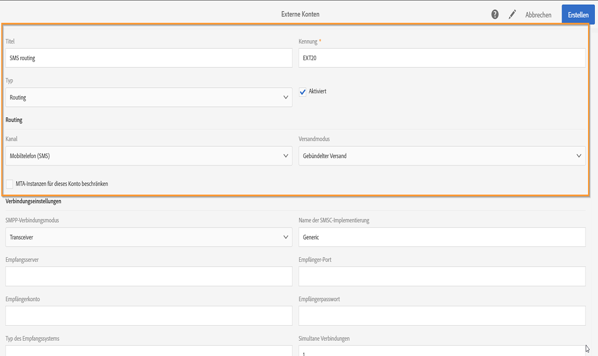
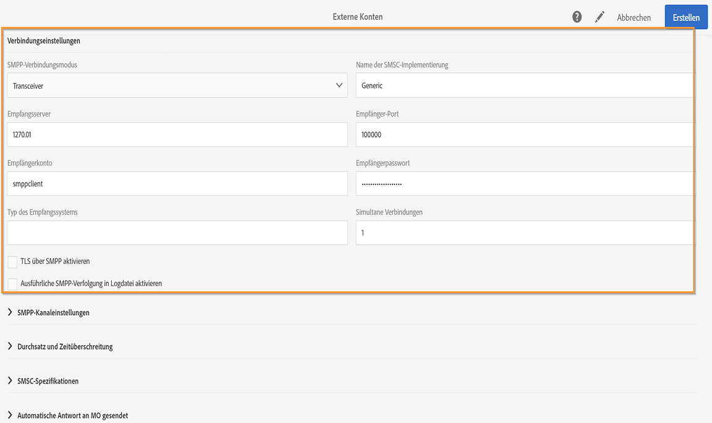
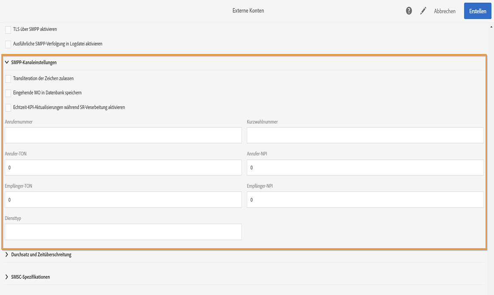
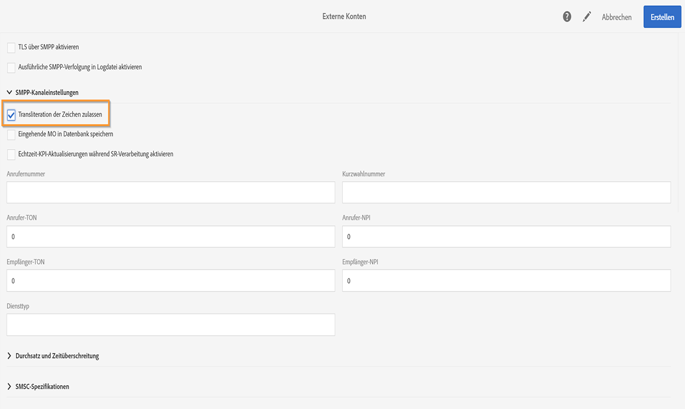
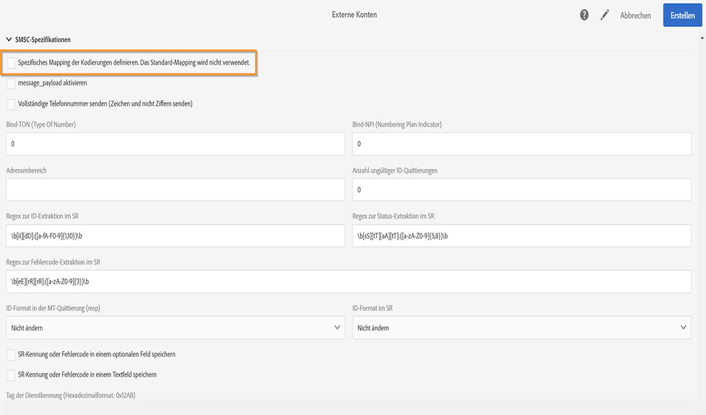
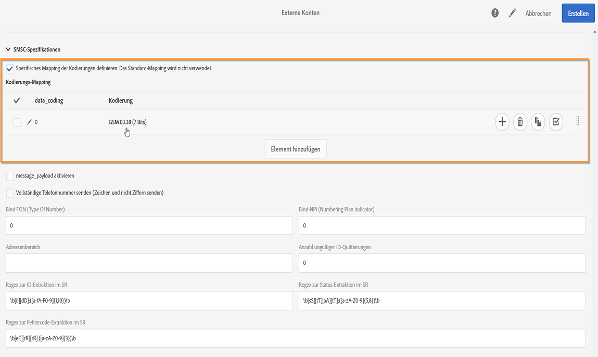

# SMS-Kanal konfigurieren{#configuring-sms-channel}

Für den Versand von SMS-Nachrichten muss mindestens ein externes Konto von einem Administrator im Menü **[!UICONTROL Administration]** > **[!UICONTROL Kanäle]** > **[!UICONTROL SMS]** > **[!UICONTROL SMS-Konten]** konfiguriert werden.

Weiterführende Informationen zur Erstellung und Bearbeitung von externen Konten finden Sie im Abschnitt [Externe Konten. ](../../administration/using/external-accounts.md) Der folgende Absatz behandelt die spezifischen Parameter externer Konten, die dem SMS-Versand dienen.

## SMS-Routing definieren  {#defining-an-sms-routing}

>[!IMPORTANT]
>
>Die Verwendung desselben Kontos und Kennworts für mehrere externe SMS-Konten kann zu Konflikten und Überschneidungen zwischen den Konten führen. Siehe die [Seite zur SMS-Fehlerbehebung](troubleshooting-sms.md#external-account-conflict).

Standardmäßig enthält die Anwendung das externe Konto **[!UICONTROL SMS-Routing durch SMPP]**. Die Erstellung weiterer Konten kann jedoch von Nutzen sein.

Wenn Sie das SMPP-Protokoll verwenden möchten, können Sie auch ein neues externes Konto erstellen. Weitere Informationen zum SMS-Protokoll und zu den Einstellungen finden Sie in dieser [Technote](../../administration/using/sms-protocol.md).

1. Ein neues externes Konto können Sie über **[!UICONTROL Administration > Anwendungskonfiguration > Externe Konten]** erstellen.
1. Definieren Sie den Kontotyp mit **[!UICONTROL Routing]**, den Kanal mit **[!UICONTROL Mobiltelefon (SMS)]** und den Versandmodus mit **[!UICONTROL Gebündelter Versand]**.

   

1. Definieren Sie die Verbindungsparameter.

   Wenden Sie sich zur Konfiguration der für den SMS-Versand spezifischen Verbindungsparameter an Ihren Provider. Dieser kann Ihnen die für das externe Konto erforderlichen Angaben kommunizieren.

   

   Die Option **[!UICONTROL TLS über SMPP aktivieren]** ermöglicht die Verschlüsselung des SMPP-Traffics.

   Mithilfe von **[!UICONTROL Ausführliche SMPP-Verfolgung in Logdatei aktivieren]** können Sie den gesamten SMPP-Traffic in Logdateien speichern. Diese Option muss aktiviert sein, um eine Fehlerbehebung beim Connector vornehmen und den Traffic mit dem auf Provider-Seite verzeichneten Traffic vergleichen zu können.

1. Je nach gewähltem Provider kommuniziert Ihnen dann Adobe den im Feld **[!UICONTROL Name der SMSC-Implementierung]** einzufügenden Wert.
1. Definieren Sie die SMPP-Kanaleinstellungen. Weiterführende Informationen finden Sie im Abschnitt [SMS-Kodierung und -Formate](#sms-encoding-and-formats).

   Aktivieren Sie **[!UICONTROL Eingehende MO in Datenbank speichern]**, wenn alle eingehenden SMS-Nachrichten in der inSMS-Tabelle gespeichert werden sollen. Weiterführende Information zum Abrufen von eingehenden SMS-Nachrichten finden Sie in diesem [Abschnitt](../../channels/using/managing-incoming-sms.md#storing-incoming-sms).

   Mit der Option **[!UICONTROL Echtzeit-KPI-Aktualisierungen während SR-Verarbeitung aktivieren]** können die KPIs **[!UICONTROL Zugestellt]** oder **[!UICONTROL Bounces + Fehler]** nach dem Versand in Echtzeit aktualisiert werden. Diese KPIs befinden sich im Fenster **[!UICONTROL Bereitstellung]** und werden direkt auf Grundlage des vom Provider empfangenen SR (Status Report) neu berechnet.

   

1. Definieren Sie die Parameter **[!UICONTROL Durchsatz und Zeitüberschreitung]**.

   Hier können Sie den maximalen Durchsatz für ausgehende Nachrichten (&quot;MT&quot;, Mobile Terminated) festlegen. Bei Angabe von &quot;0&quot; im entsprechenden Feld ist der Durchsatz unbegrenzt.

   Alle Werte, die eine Dauer angeben, sind in Sekunden auszudrücken.

1. Konfigurieren Sie die Parameter für SMS-C, falls Sie ein spezifisches Codierungs-Mapping definieren müssen. Weiterführende Informationen hierzu finden Sie im Abschnitt [SMSC-Besonderheiten](#smsc-specifics).

   Aktivieren Sie die Option **[!UICONTROL Vollständige Telefonnummer senden (Zeichen und nicht Ziffern senden)]**, wenn Sie die Konformität mit dem SMPP-Protokoll nicht wahren und das Vorzeichen **[!UICONTROL +]** an den Server des SMS-Anbieters (SMS-C) übertragen möchten.

   Bei gewissen Anbietern ist die Verwendung des Vorzeichens **[!UICONTROL +]** jedoch erforderlich, sodass es ratsam ist, mit Ihrem Anbieter Kontakt aufzunehmen, der Sie bei Bedarf dazu auffordern wird, diese Option zu aktivieren.

1. Definieren Sie bei Bedarf automatische Antworten, um Aktionen auf der Basis des Inhalts einer Antwort auszulösen. Weiterführende Informationen hierzu finden Sie in [diesem Abschnitt](../../channels/using/managing-incoming-sms.md#managing-stop-sms).
1. Speichern Sie die Konfiguration des externen SMS-Routing-Kontos.

Jetzt können Sie mithilfe der neuen Routing-Konfiguration in Adobe Campaign SMS-Nachrichten senden.

## SMS-Kodierung und -Formate  {#sms-encoding-and-formats}

### Codierung, Länge und Tansliteration von SMS {#sms-encoding--length-and-transliteration}

Standardmäßig kommt in Bezug auf die maximal zulässige Zeichenanzahl einer SMS der Mobilfunkstandard GSM (Global System for Mobile Communications) zur Anwendung.

SMS, die das GSM-Alphabet verwenden, sind auf 160 Zeichen begrenzt oder auf 153 Zeichen pro SMS bei Nachrichten, die in mehreren Teilen gesendet werden.

>[!NOTE]
>
>Gewisse Zeichen zählen doppelt (Akkoladen, eckige Klammern, Eurozeichen etc.). Eine Liste der von GSM unterstützten Zeichen finden Sie im Abschnitt [Zeichensatztabelle - GSM-Standard](#table-of-characters---gsm-standard).

Bei Bedarf können Sie die Transliteration von Zeichen zulassen, indem Sie die entsprechende Option aktivieren.

Transliteration bezeichnet in einer SMS die Ersetzung eines Zeichens durch ein anderes, wenn das erste Zeichen nicht von GSM unterstützt wird.

* Wenn die Transliteration **zugelassen** wurde, wird jedes nicht unterstützte Zeichen beim Nachrichtenversand durch ein Zeichen des GSM-Alphabets ersetzt. So wird beispielsweise der Buchstabe &quot;ë&quot; durch &quot;e&quot; ersetzt. Der Nachrichteninhalt wird in diesem Fall leicht verändert übermittelt, aber die Zeichenanzahl bleibt identisch.
* Wenn die Transliteration **nicht zugelassen** wurde, werden alle Nachrichten mit nicht unterstützten Zeichen im Binärformat (Unicode) gesendet: Alle Zeichen werden unverändert übermittelt. In Unicode kodierte SMS sind auf 70 Zeichen (oder 67 Zeichen bei Nachrichten, die in mehreren Teilen gesendet werden) begrenzt. Bei Überschreitung der maximalen Zeichenanzahl werden mehrere Teilnachrichten gesendet, wodurch zusätzliche Kosten entstehen können.

>[!IMPORTANT]
>
>Die Verwendung von Personalisierungsfeldern im SMS-Inhalt führt u. U. dazu, dass nicht von GSM unterstützte Zeichen eingefügt werden. Im Abschnitt [SMS personalisieren](../../channels/using/personalizing-sms-messages.md) finden Sie ein Beispiel für einen SMS-Inhalt.

Die Transliteration von Zeichen ist standardmäßig deaktiviert. Es wird empfohlen, diese Option nicht zu aktivieren, wenn Sie alle Zeichen Ihrer SMS beibehalten möchten, um beispielsweise Eigennamen unverändert zu übermitteln.

Sollte Ihre SMS jedoch eine hohe Anzahl an Zeichen enthalten, die dem Unicode-Zeichensatz entstammen, können Sie diese Option wählen, um Ihre Versandkosten zu begrenzen.

### Zeichensatztabelle - GSM-Standard  {#table-of-characters---gsm-standard}

Der folgende Abschnitt zeigt den vom GSM-Standard unterstützten Zeichensatz. Jedes im Nachrichteninhalt enthaltene Zeichen, das nicht in der unten stehenden Tabelle aufgeführt ist, führt zur Konvertierung der gesamten Nachricht in das Binärformat (Unicode) und zur Splittung der SMS in Teilnachrichten, sobald sie 70 Zeichen überschreitet. Weiterführende Hinweise finden Sie im Abschnitt [Kodierung, Länge und Transliteration von SMS](#sms-encoding--length-and-transliteration).

**Einfache Zeichen**

<table> 
 <tbody> 
  <tr> 
   <td> @  </td> 
   <td>    </td> 
   <td> SP  </td> 
   <td> 0  </td> 
   <td> ¡  </td> 
   <td> P  </td> 
   <td> ¿  </td> 
   <td> P  </td> 
  </tr> 
  <tr> 
   <td> £  </td> 
   <td> _  </td> 
   <td> !  </td> 
   <td> 1  </td> 
   <td> A  </td> 
   <td> Q  </td> 
   <td> a  </td> 
   <td> q  </td> 
  </tr> 
  <tr> 
   <td> $  </td> 
   <td>    </td> 
   <td> "  </td> 
   <td> 2  </td> 
   <td> B  </td> 
   <td> R  </td> 
   <td> b  </td> 
   <td> r  </td> 
  </tr> 
  <tr> 
   <td> ¥  </td> 
   <td>    </td> 
   <td> #  </td> 
   <td> 3  </td> 
   <td> C  </td> 
   <td> S  </td> 
   <td> c  </td> 
   <td> s  </td> 
  </tr> 
  <tr> 
   <td> è  </td> 
   <td>    </td> 
   <td> ¤  </td> 
   <td> 4  </td> 
   <td> D  </td> 
   <td> T  </td> 
   <td> d  </td> 
   <td> t  </td> 
  </tr> 
  <tr> 
   <td> é  </td> 
   <td>    </td> 
   <td> %  </td> 
   <td> 5  </td> 
   <td> E  </td> 
   <td> U  </td> 
   <td> e  </td> 
   <td> u  </td> 
  </tr> 
  <tr> 
   <td> ù  </td> 
   <td>    </td> 
   <td> &amp;  </td> 
   <td> 6  </td> 
   <td> F  </td> 
   <td> V  </td> 
   <td> f  </td> 
   <td> v  </td> 
  </tr> 
  <tr> 
   <td> ì  </td> 
   <td>    </td> 
   <td> '  </td> 
   <td> 7  </td> 
   <td> G  </td> 
   <td> W  </td> 
   <td> g  </td> 
   <td> w  </td> 
  </tr> 
  <tr> 
   <td> ò  </td> 
   <td>    </td> 
   <td> (  </td> 
   <td> 8  </td> 
   <td> H  </td> 
   <td> X  </td> 
   <td> h  </td> 
   <td> x  </td> 
  </tr> 
  <tr> 
   <td> Ç  </td> 
   <td>    </td> 
   <td> )  </td> 
   <td> 9 </td> 
   <td> I  </td> 
   <td> Y  </td> 
   <td> i  </td> 
   <td> y  </td> 
  </tr> 
  <tr> 
   <td> LF  </td> 
   <td>    </td> 
   <td> *  </td> 
   <td> :  </td> 
   <td> J  </td> 
   <td> Z  </td> 
   <td> j  </td> 
   <td> z  </td> 
  </tr> 
  <tr> 
   <td> Ø  </td> 
   <td> ESC  </td> 
   <td> +  </td> 
   <td> ;  </td> 
   <td> K  </td> 
   <td> Ä  </td> 
   <td> k  </td> 
   <td> ä  </td> 
  </tr> 
  <tr> 
   <td> ø  </td> 
   <td> Æ  </td> 
   <td> ,  </td> 
   <td> &lt;  </td> 
   <td> L  </td> 
   <td> Ö  </td> 
   <td> l  </td> 
   <td> ö  </td> 
  </tr> 
  <tr> 
   <td> CR  </td> 
   <td> æ  </td> 
   <td> -  </td> 
   <td> = </td> 
   <td> M  </td> 
   <td> Ñ  </td> 
   <td> m  </td> 
   <td> ñ  </td> 
  </tr> 
  <tr> 
   <td> Å  </td> 
   <td> ß  </td> 
   <td> .  </td> 
   <td> &gt;  </td> 
   <td> N  </td> 
   <td> Ü  </td> 
   <td> n  </td> 
   <td> ü  </td> 
  </tr> 
  <tr> 
   <td> å  </td> 
   <td> É  </td> 
   <td> /  </td> 
   <td> ?  </td> 
   <td> O  </td> 
   <td> §  </td> 
   <td> o  </td> 
   <td> à  </td> 
  </tr> 
 </tbody> 
</table>

SP: Leerzeichen

ESC: Escape

LF: Zeilenvorschub

CR: Wagenrücklauf

**Doppelt zählende Zeichen**

^ { } [~] | €

### SMSC-Besonderheiten {#smsc-specifics}

>[!NOTE]
>
>Mithilfe dieser Optionen kann der Connector so angepasst werden, dass nicht standardmäßige (d. h. von der SMPP 3.4-Spezifikation abweichende) SMSC oder spezifische Kodierungsanforderungen unterstützt werden. Konfigurationen dieser Art sollten jedoch nur von erfahrenen Benutzern vorgenommen werden.

Beim SMS-Versand kann Adobe Campaign eine oder mehrere Textkodierungen verwenden. Je nach Kodierung kommen unterschiedliche Zeichensätze zur Anwendung und variiert die Anzahl an zulässigen Zeichen pro SMS.

Das Feld **[!UICONTROL DATA_CODING]** dient in Adobe Campaign dazu, dem SMSC zu signalisieren, welche Kodierung verwendet wird.

>[!NOTE]
>
>Die Entsprechung zwischen dem Wert des **DATA_CODING**-Felds und der tatsächlich verwendeten Kodierung ist standardisiert. Gewisse SMSC besitzen jedoch eine spezifische Entsprechung. In diesem Fall muss Ihr **Adobe-Campaign**-Administrator diese deklarieren. Kontaktieren Sie für weiterführende Informationen Ihren Anbieter.

Die Option **[!UICONTROL Spezifisches Kodierungs-Mapping definieren]** erlaubt die **DATA_CODING**-Deklarierung. Durch Angabe von nur einer Kodierung in der Tabelle wird die Anwendung dieser Kodierung erzwungen.

**Konfiguration**

* Wenn die Option **[!UICONTROL Spezifisches Kodierungs-Mapping definieren]** nicht aktiviert wurde, zeigt der Connector ein Standardverhalten:

   * Er versucht, das GSM-Alphabet zu verwenden und ordnet diesem den Wert **DATA_CODING = 0** zu.
   * Falls die Verwendung des GSM-Alphabets nicht möglich ist, verwendet er **UCS2** und ordnet den Wert **DATA_CODING = 8** zu.

  

* Wenn die Option **[!UICONTROL Spezifisches Kodierungs-Mapping definieren]** aktiviert wurde, haben Sie die Möglichkeit, die Kodierungen zu definieren, die Sie verwenden möchten, und ihnen im Feld **[!UICONTROL DATA_CODING]** die entsprechenden Werte zuzuordnen. Adobe Campaign verwendet die Kodierungen in der Reihenfolge ihres Erscheinens in der Liste. Wenn die Verwendung der ersten Kodierung nicht möglich ist, wird die zweite verwendet usw.

  Die Reihenfolge der Deklarierung ist entscheidend. Wir empfehlen Ihnen, die Liste aufsteigend nach den entstehenden **Kosten** zu ordnen, um die Kodierungen zu favorisieren, die eine größere Anzahl von Zeichen pro SMS erlauben.

  Deklarieren Sie nur die Kodierungen, die Sie tatsächlich verwenden möchten. Deklarieren Sie hingegen keine vom SMSC angebotenen Kodierungen in der Liste, die nicht Ihrer Verwendung entsprechen.

  

### Automatische Antwort auf MO  {#automatic-reply-sent-to-the-mo}

Sie können einem Profil, das auf eine per Campaign gesendete SMS-Nachricht antwortet, eine automatische Nachricht sowie die auszuführende Aktion zurücksenden.

Weiterführende Informationen hierzu finden Sie in [diesem Abschnitt](../../channels/using/managing-incoming-sms.md).

## SMS-Eigenschaften konfigurieren  {#configuring-sms-properties}

Dieser Abschnitt behandelt die Liste von SMS-spezifischen Parametern in den Eigenschaften eines SMS-Versands bzw. einer SMS-Versandvorlage.

Die SMS-spezifischen Versandparameter befinden sich im Abschnitt **[!UICONTROL Senden]** und **[!UICONTROL Erweiterte Parameter]**.

Aus dem Abschnitt **[!UICONTROL Erweiterte Parameter]**:

* Die **[!UICONTROL Kurzwahlnummer]** ermöglicht es Ihnen, eine bestimmte Kurzwahlnummer zu Ihrem Versand hinzuzufügen. Empfänger, die diese spezielle Kurzwahlnummer durch Opt-out abgewählt haben, werden bei der Nachrichtenvorbereitung automatisch ausgeschlossen. Weiterführende Informationen zur Konfiguration der Kurzwahlnummer finden Sie in [diesem Abschnitt](../../channels/using/managing-incoming-sms.md).

  >[!NOTE]
  >
  >Wenn das Feld **[!UICONTROL Kurzwahlnummer]** leer bleibt, wird der Wert des Felds **[!UICONTROL Kurzwahlnummer]** verwendet, der im externen Konto festgelegt wurde.

Aus dem Abschnitt **[!UICONTROL Senden]** einer SMS-Vorlage:

* Die Option **[!UICONTROL Maximale Anzahl an SMS pro Nachricht]** bietet die Möglichkeit, die Anzahl an SMS-Nachrichten festzulegen, die zum Senden einer Nachricht verwendet werden sollen. Sollte eine Nachricht diese Anzahl überschreiten, wird sie nicht gesendet.

  >[!IMPORTANT]
  >
  >Die Verwendung von Personalisierungsfeldern oder bedingtem Text im SMS-Inhalt kann dazu führen, dass die Nachrichtenlänge und somit die Anzahl erforderlicher SMS für die jeweiligen Empfänger variieren. Lesen Sie diesbezüglich auch den Abschnitt [SMS personalisieren](../../channels/using/personalizing-sms-messages.md).

  

* Im Feld **[!UICONTROL Übermittlungsmodus]** können Sie die Versandmethode für SMS-Nachrichten festlegen:

   * **[!UICONTROL Speicherung auf der SIM-Karte]**: Die Nachricht wird auf der SIM-Karte des Empfängergeräts gespeichert.
   * **[!UICONTROL Speicherung im Mobiltelefon]**: Die Nachricht wird im internen Speicher des Empfängergeräts gespeichert.
   * **[!UICONTROL Flash]**: Die Nachricht wird auf dem Bildschirm des Empfängergeräts als Benachrichtigung angezeigt und verschwindet, ohne gespeichert zu werden.
