# Transaktionsnachrichten konfigurieren{#configuring-transactional-messaging}

Um eine Transaktionsnachricht mit Adobe Campaign zu senden, müssen Sie zunächst die Struktur der Ereignisdaten definieren.

Die Ereigniskonfiguration muss von einem [Administrator](../../administration/using/users-management.md#functional-administrators) durch Ausführung der folgenden Schritte vorgenommen werden.

>[!NOTE]
>
>Je nach dem Typ der zu sendenden Transaktionsnachricht kann die Konfiguration unterschiedlich sein. Lesen Sie diesbezüglich auch den Abschnitt [Konfigurationen für Transaktionsereignisse](#transactional-event-specific-configurations).

Sobald das Ereignis publiziert wurde:

* Die von Ihrem Website-Entwickler verwendete API wird bereitgestellt und die Transaktionsereignisse können jetzt gesendet werden. Siehe [Aktivierung des Ereignisses in eine Website integrieren](#integrating-the-triggering-of-the-event-in-a-website).

* Die entsprechende Transaktionsnachricht wird automatisch erstellt. Siehe [Erste Schritte mit Transaktionsnachrichten](../../channels/using/getting-started-with-transactional-msg.md).

## Ereignis erstellen    {#creating-an-event}

Erstellen Sie zunächst ein Ereignis, das Ihren Anforderungen entspricht.

>[!IMPORTANT]
>
>Nur Benutzer mit der Rolle **[!UICONTROL Administration]**, die Teil der [Organisationseinheit](../../administration/using/organizational-units.md) **[!UICONTROL Alle]** sind, haben die entsprechenden Berechtigungen zum Erstellen einer Ereigniskonfiguration.

1. Verwenden Sie das **[!UICONTROL Adobe Campaign]**-Logo oben links im Bildschirm und anschließend die Schaltflächen **[!UICONTROL Marketingpläne]** > **[!UICONTROL Transaktionsnachrichten]** > **[!UICONTROL Ereigniskonfiguration]**.
1. Wählen Sie die **[!UICONTROL Erstellen]**-Schaltfläche aus.
1. Wählen Sie für das Ereignis einen **[!UICONTROL Titel]** und eine **[!UICONTROL ID]**. Das Feld **[!UICONTROL ID]** ist ein Pflichtfeld und sollte mit dem Präfix &quot;EVT&quot; beginnen. Bei Nichtverwendung des EVT-Präfixes in Ihrer Kennung wird dieses automatisch hinzugefügt, sobald Sie die Schaltfläche **[!UICONTROL Erstellen verwenden]**.

   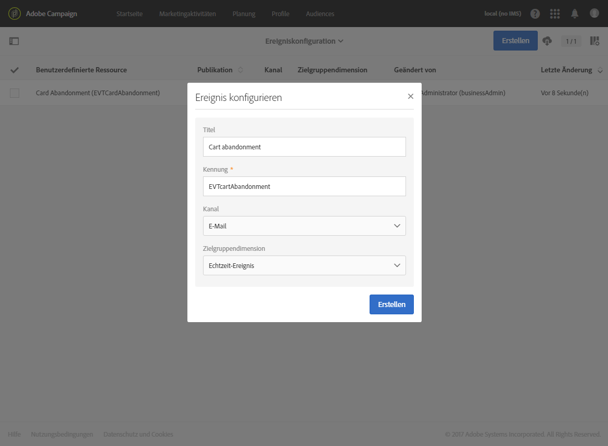

   >[!IMPORTANT]
   >
   >Die Kennung einschließlich des EVT-Präfixes darf maximal 64 Zeichen lang sein.

1. Wählen Sie den für den Versand Ihrer Transaktionsnachrichten verwendeten Kanal aus: **[!UICONTROL E-Mail]**, **[!UICONTROL Mobiltelefon (SMS)]** oder **[!UICONTROL App]** (Push-Benachrichtigung).

   >[!NOTE]
   >
   >Für jede Ereigniskonfiguration kann jeweils nur ein Kanal verwendet werden. Nach der Erstellung des Ereignisses lässt sich der Kanal nicht mehr ändern.

1. Wählen Sie die passende Zielgruppendimension zur gewünschten Ereigniskonfiguration aus und danach **[!UICONTROL Erstellen]**.

   Bei ereignisbasierten Transaktionsnachrichten werden die im Ereignis selbst vorhandenen Daten verwendet, während bei profilbasierten Transaktionsnachrichten die in der Adobe-Campaign-Datenbank verfügbaren Daten verwendet werden. Lesen Sie diesbezüglich auch den Abschnitt [Konfigurationen für Transaktionsereignisse](#transactional-event-specific-configurations).

>[!NOTE]
>
>Die Anzahl der erstellten Echtzeit-Ereignisse kann sich auf Ihre Plattform auswirken. Für optimale Leistung müssen Sie Echtzeit-Ereignisse, die Sie nicht mehr benötigen, löschen. Siehe [Ereignis löschen](#deleting-an-event).

## Ereignisattribute definieren    {#defining-the-event-attributes}

Definieren Sie im Bereich **[!UICONTROL Felder]** die Attribute, die in den Ereignisinhalt integriert werden und im Anschluss zur Personalisierung der Transaktionsnachricht verwendet werden können.

Alle das Hinzufügen oder Ändern von Feldern betreffenden Schritte folgen dem gleichen Prinzip wie für [benutzerdefinierte Ressourcen](../../developing/using/configuring-the-resource-s-data-structure.md#adding-fields-to-a-resource).

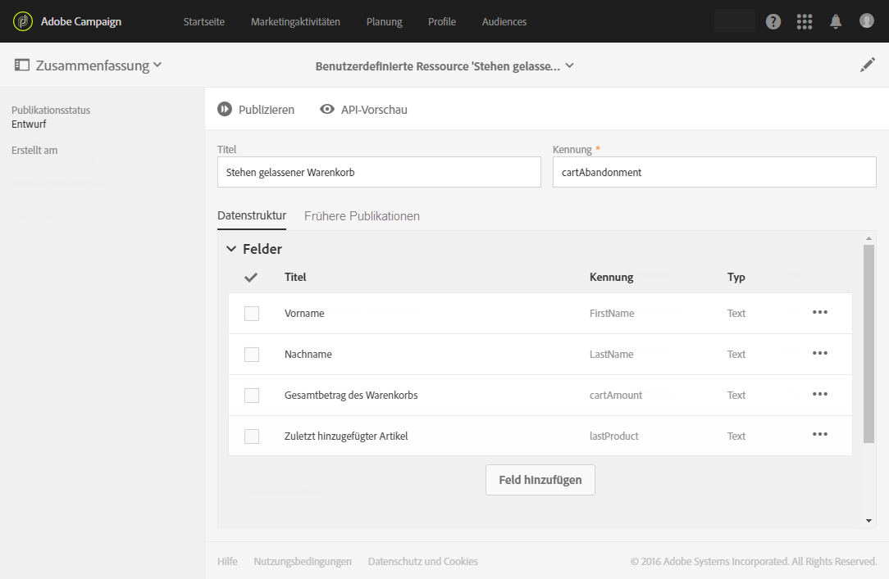

>[!NOTE]
>
>Wenn Sie eine mehrsprachige Transaktionsnachricht erstellen möchten, definieren Sie ein zusätzliches Ereignisattribut mit der ID **[!UICONTROL AC_language]**. Dies gilt nur für Transaktionsnachrichten. Nach der Publikation des Ereignisses sind die Schritte zur Bearbeitung des Inhalts einer mehrsprachigen Transaktionsnachricht dieselben wie für eine mehrsprachige Standard-E-Mail. Siehe [Mehrsprachige E-Mail erstellen](../../channels/using/creating-a-multilingual-email.md).

## Datenkollektionen definieren    {#defining-data-collections}

Sie können zum Ereignisinhalt eine Kollektion von Elementen hinzufügen, wobei jedes Element mehrere Attribute enthält.

Diese Kollektion kann in Transaktions-E-Mails verwendet werden, um [Produktlisten](../../channels/using/event-transactional-messages.md#using-product-listings-in-a-transactional-message) zum Nachrichteninhalt hinzuzufügen, wie z. B. eine Liste mit Produkten einschließlich Preis, Referenznummer, Menge usw. für jedes Produkt auf der Liste.

1. Wählen Sie im Bereich **[!UICONTROL Kollektionen]** die Schaltfläche **[!UICONTROL Element erstellen]** aus.

   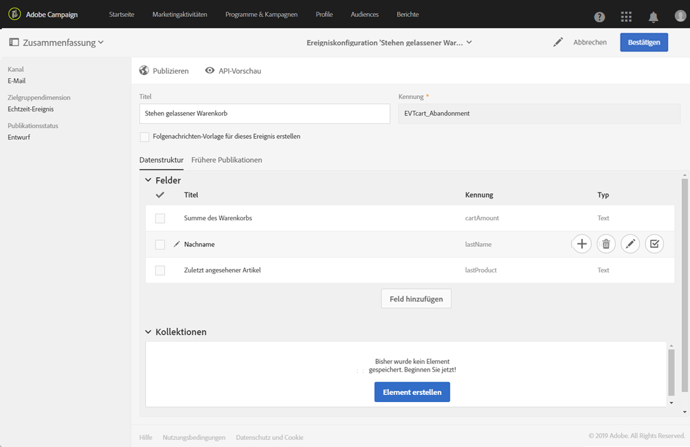

1. Fügen Sie Ihrer Kollektion einen Titel und eine Kennung hinzu.
1. Fügen Sie alle Felder hinzu, die Sie für jedes Produkt der Liste in der Transaktionsnachricht anzeigen möchten.

   Für dieses Beispiel haben wir folgende Felder hinzugefügt:

   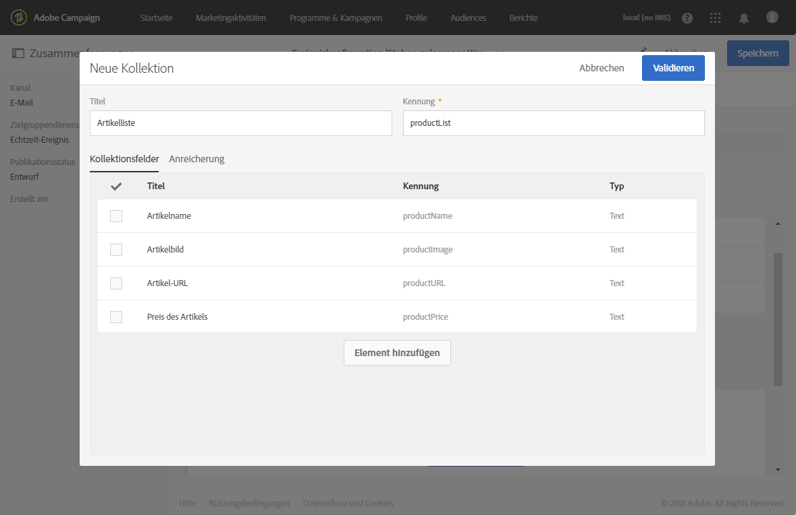

1. Auf dem Tab **[!UICONTROL Anreicherung]** können Sie die einzelnen Elemente der Kollektion anreichern. Auf diese Weise können Sie die Elemente der entsprechenden Produktliste mit Informationen aus der Adobe Campaign-Datenbank oder aus anderen von Ihnen erstellten Ressourcen personalisieren.

>[!NOTE]
>
>Die Anreicherungsschritte für die Elemente einer Kollektion entsprechen den Anweisungen im Abschnitt [Ereignis anreichern](#enriching-the-transactional-message-content). Beachten Sie, dass Sie beim Anreichern des Ereignisses keine Kollektion anreichern können: Dafür müssen Sie im Abschnitt **[!UICONTROL Kollektionen]** der Kollektion selbst eine Anreicherung hinzufügen.

Nach der Publikation des Ereignisses sowie der Nachricht lässt sich diese Kollektion in den Transaktionsnachrichten verwenden.

Dies ist die API-Vorschau für dieses Beispiel:

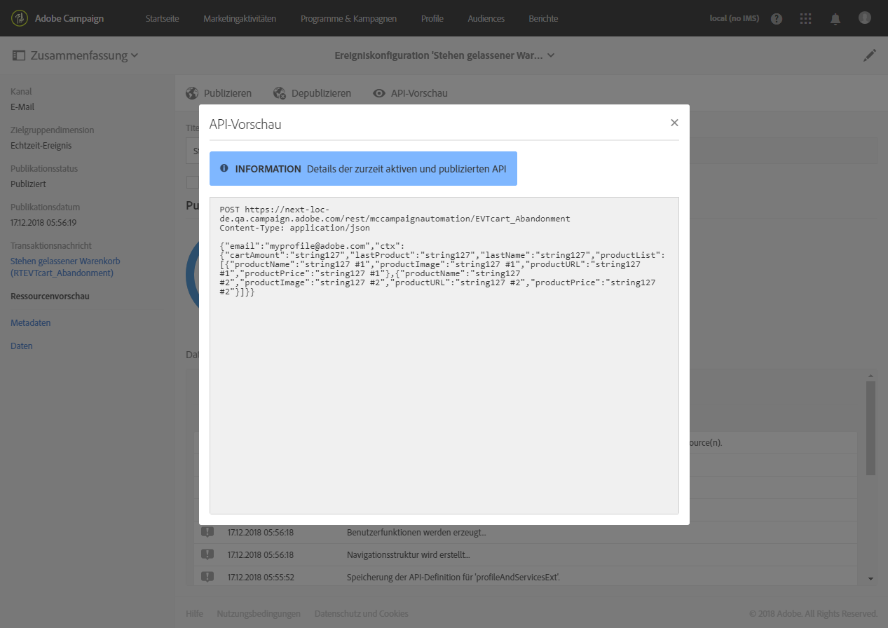

**Verwandte Themen:**

* [Vorschau erstellen und Ereignis publizieren](#previewing-and-publishing-the-event)
* [Produktlisten in Transaktionsnachrichten verwenden](../../channels/using/event-transactional-messages.md#using-product-listings-in-a-transactional-message)

## Ereignis anreichern {#enriching-the-transactional-message-content}

Sie können Transaktionsnachrichten mit Informationen aus der Adobe Campaign-Datenbank anreichern, um Ihre Nachrichten zu personalisieren. Ausgehend vom Nachnamen oder der CRM-ID eines jeden Empfängers können Sie beispielsweise Daten wie die jeweilige Adresse oder das Geburtsdatum oder jedes beliebige in der Profiltabelle hinzugefügte benutzerdefinierte Feld abrufen, um dem den Empfänger gesendeten Informationen zu personalisieren.

Sie können Transaktionsnachrichten mit Daten aus der erweiterten **[!UICONTROL externen API &quot;Profile und Dienste&quot;]** anreichern. Weiterführende Informationen finden Sie unter [API erweitern: Erweiterung publizieren](../../developing/using/step-2--publish-the-extension.md).

Diese Informationen können auch in neuen Ressourcen gespeichert werden. In diesem Fall muss die Ressource mit den Ressourcen **[!UICONTROL Profil]** oder **[!UICONTROL Dienst]** entweder direkt oder über eine andere Tabelle verknüpft werden. Beispielweise können Sie in der folgenden Konfiguration die Transaktionsnachricht mit Informationen aus der Ressource **[!UICONTROL Produkt]** wie etwa einer Produktkategorie oder einer Kennung anreichern, wenn die Ressource **[!UICONTROL Produkt]** mit der Ressource **[!UICONTROL Profil]** verknüpft ist.

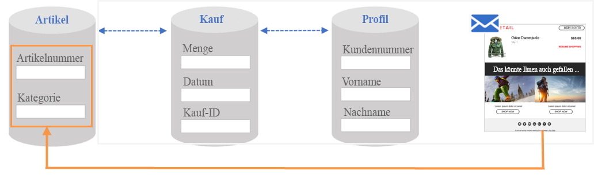

Weiterführende Informationen zur Erstellung und Publikation von Ressourcen finden Sie auf [dieser Seite](../../developing/using/key-steps-to-add-a-resource.md).

1. Wählen Sie im Bereich **[!UICONTROL Anreicherung]** die Schaltfläche **[!UICONTROL Element erstellen]** aus.

   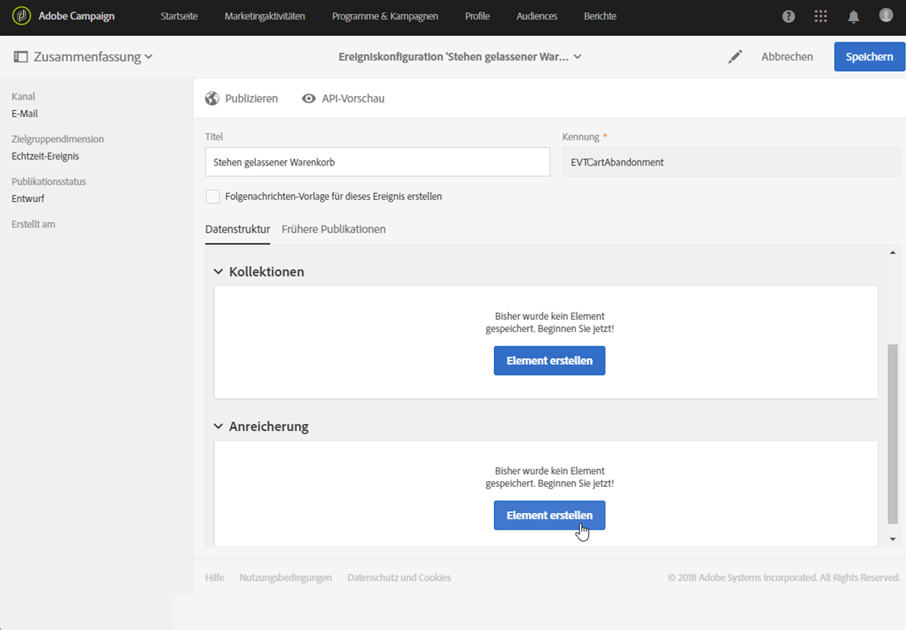

1. Wählen Sie die Ressource aus, mit der Sie Ihre Nachricht verknüpfen möchten. In unserem Fall ist das die Ressource **[!UICONTROL Profil]**.

   

1. Verwenden Sie die Schaltfläche **[!UICONTROL Element erstellen]**, um ein Feld in der ausgewählten Ressource mit einem zuvor von Ihnen zum Ereignis hinzugefügten Feld zu verknüpfen (siehe [Ereignisattribute definieren](#defining-the-event-attributes)).

   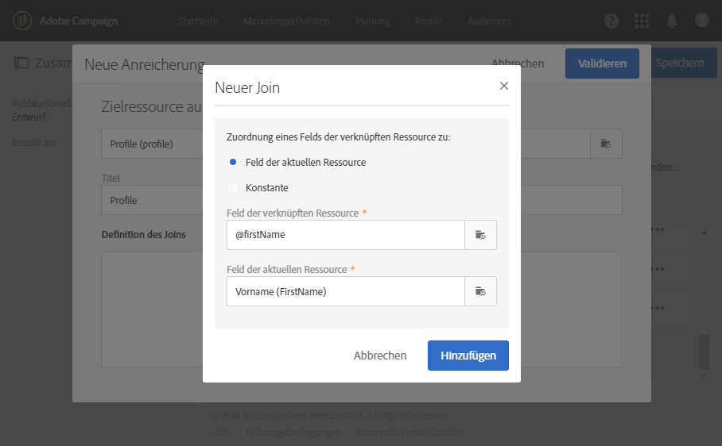

1. In unserem Beispiel stimmen wir die Felder **[!UICONTROL Nachname]** und **[!UICONTROL Vorname]** mit den entsprechenden Feldern der Ressource **[!UICONTROL Profil]** ab.

   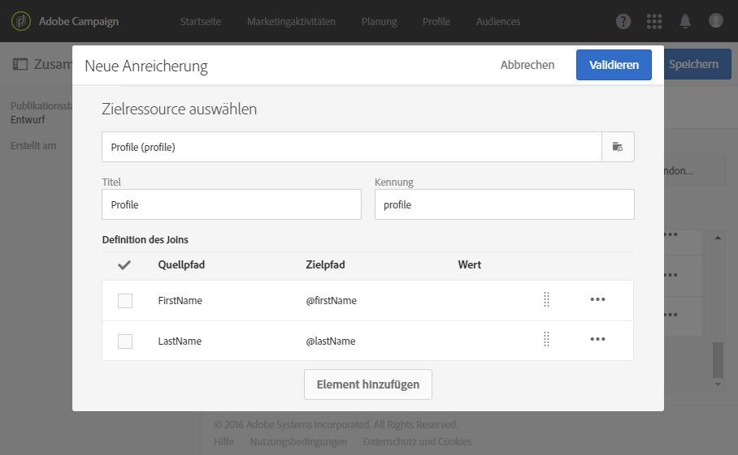

   Sie können den Inhalt der Transaktionsnachricht auch über die Ressource **[!UICONTROL Dienst]** anreichern. Weiterführende Informationen zu Diensten finden Sie in [diesem Abschnitt](../../audiences/using/creating-a-service.md).

1. Wenn Sie ein profilbasiertes Ereignis erstellen oder bearbeiten, wählen Sie im Abschnitt **[!UICONTROL Zielgruppen-Anreicherung]** die Anreicherung aus, die beim Versand als Nachrichtenziel verwendet werden soll.

   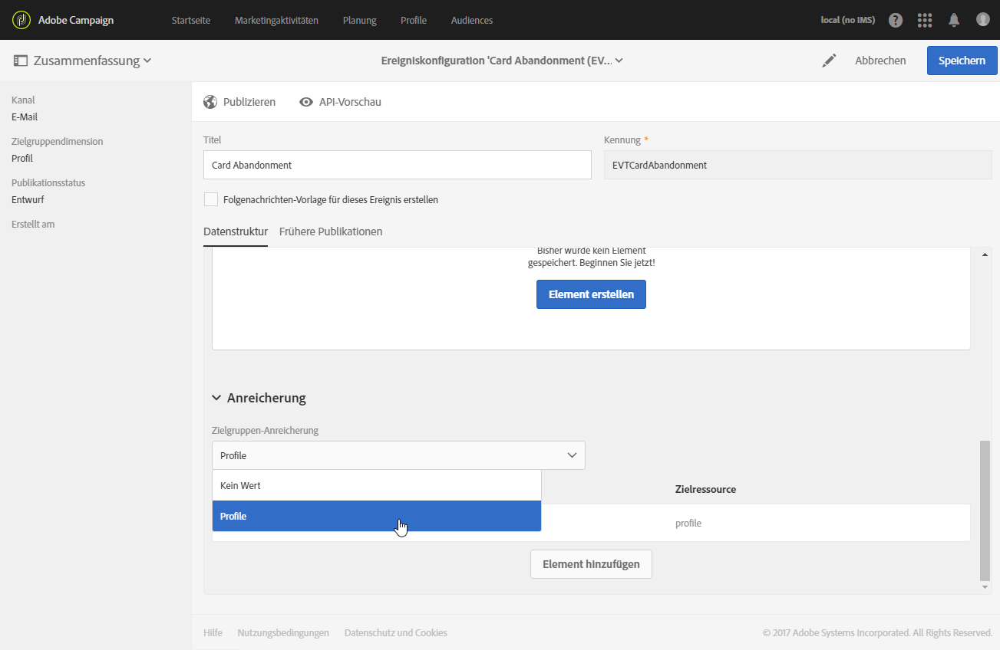

   >[!NOTE]
   >
   >Die Auswahl einer Zielgruppen-Anreicherung anhand der Ressource **[!UICONTROL Profil]** ist bei profilbasierten Ereignissen obligatorisch.

Nach der Publikation des Ereignisses sowie der Nachricht lässt sich der Inhalt der Transaktionsnachricht über den Link anreichern.

**Verwandte Themen:**

* [Vorschau erstellen und Ereignis publizieren](#previewing-and-publishing-the-event).
* [Transaktionsnachricht personalisieren](../../channels/using/event-transactional-messages.md#personalizing-a-transactional-message).

## Vorschau erstellen und Ereignis publizieren {#previewing-and-publishing-the-event}

Bevor Sie das Ereignis verwenden können, müssen Sie eine Vorschau erstellen und es publizieren.

1. Verwenden Sie die Schaltfläche **[!UICONTROL API-Vorschau]**, um eine Simulation der von Ihrem Web-Entwickler verwendeten REST-API anzuzeigen, bevor sie publiziert wird. Nach der Publikation des Ereignisses dient diese Schaltfläche des Weiteren dazu, eine Vorschau der in Produktion befindlichen API anzuzeigen. Siehe [Aktivierung des Ereignisses in eine Website integrieren](#integrating-the-triggering-of-the-event-in-a-website).

   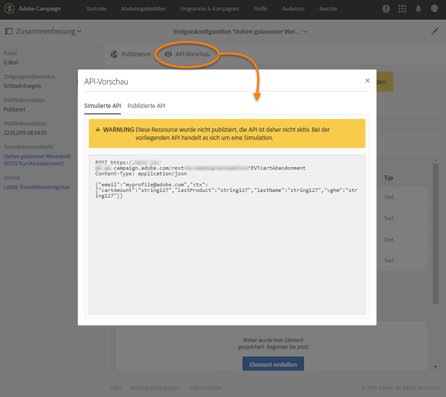

   >[!NOTE]
   >
   >Die REST-API variiert je nach ausgewähltem Kanal und nach ausgewählter Zielgruppendimension. Weiterführende Informationen zu den unterschiedlichen Konfigurationen finden Sie unter [Konfigurationen für Transaktionsereignisse](#transactional-event-specific-configurations).

1. Starten Sie mit der Schaltfläche **[!UICONTROL Publizieren]** die Publikation.

   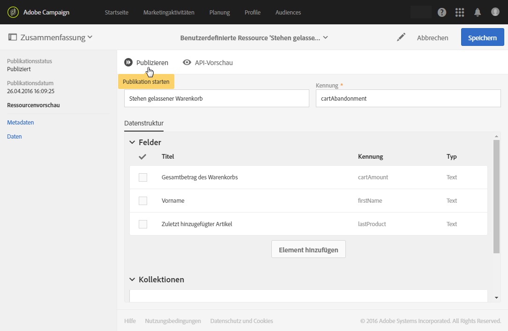

   Die von Ihrem Website-Entwickler verwendete API wird bereitgestellt und die Transaktionsereignisse können jetzt gesendet werden.

1. Die Publikationslogs lassen sich mithilfe des gleichnamigen Tabs einsehen.

   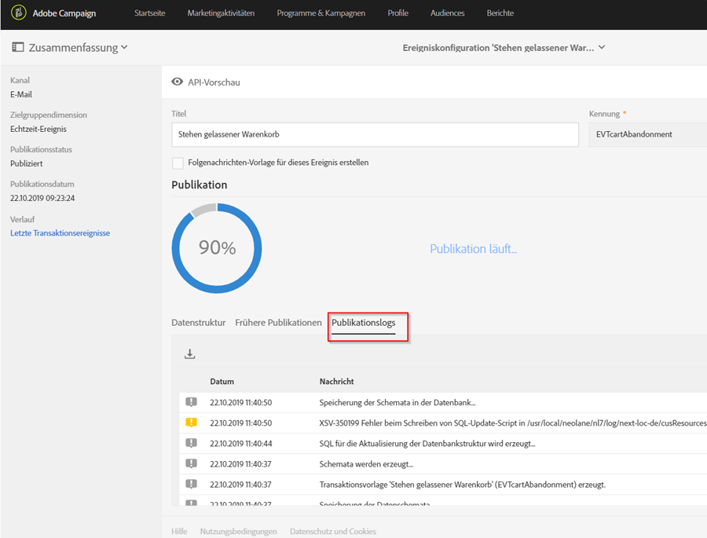

   >[!IMPORTANT]
   >
   >Jedes Mal, wenn Sie ein Ereignis ändern, müssen Sie anschließend die Schaltfläche **[!UICONTROL Publizieren]** verwenden, um die von Ihrem Web-Entwickler verwendete REST-API zu aktualisieren.

   Mit Ausführung der Publikation wird automatisch eine dem neuen Ereignis entsprechende Transaktionsnachricht erzeugt.

1. Sie können direkt über den Link auf der linken Seite auf diese Transaktionsnachricht zugreifen.

   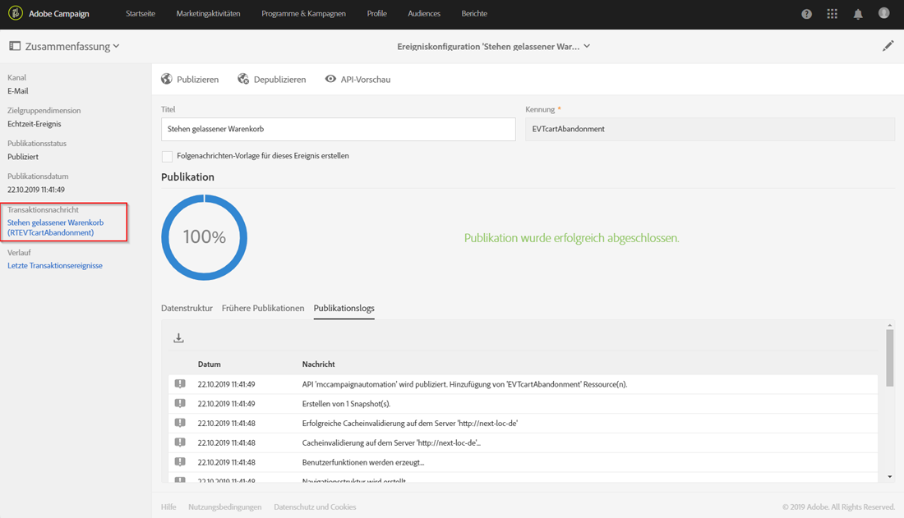

Damit das entsprechende Ereignis den Versand der Transaktionsnachricht auslösen kann, muss die Transaktionsnachricht angepasst und publiziert werden; siehe [Ereignis-Transaktionsnachrichten](../../channels/using/event-transactional-messages.md).

Außerdem muss die Auslösung dieses Ereignisses in Ihre Webseite integriert werden. Siehe [Aktivierung des Ereignisses in eine Website integrieren](#integrating-the-triggering-of-the-event-in-a-website).

Sobald Adobe Campaign erste Ereignisse im Zusammenhang mit dieser Ereigniskonfiguration erhält, können Sie über den Link **[!UICONTROL Letzte Transaktionsereignisse]** im Abschnitt **[!UICONTROL Verlauf]** auf die neuesten Ereignisse zugreifen, die von Ihrem Drittanbieterdienst gesendet und von Adobe Campaign verarbeitet wurden.

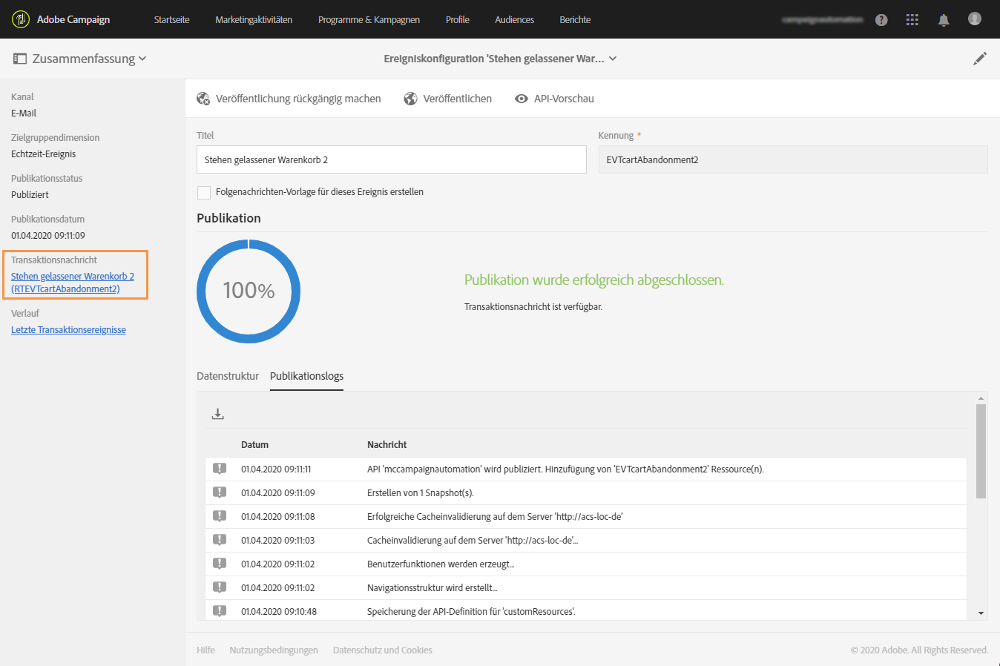

Die Ereignisse (im JSON-Format) werden von den jüngsten hin zu den ältesten aufgelistet. Mit dieser Liste können Sie Daten wie den Inhalt oder Status eines Ereignisses zu Kontroll- und Debugging-Zwecken überprüfen.

### Ereignis depublizieren   {#unpublishing-an-event}

Mithilfe der **[!UICONTROL Depublizieren]**-Schaltfläche lässt sich die Publikation des Ereignisses abbrechen, wodurch auch die Ressource aus der REST-API gelöscht wird, die dem zuvor von Ihnen erstellten Ereignis entspricht. Selbst wenn das Ereignis auf Ihrer Webseite ausgelöst wird, werden die entsprechenden Nachrichten nun nicht mehr gesendet und auch nicht in der Datenbank gespeichert.

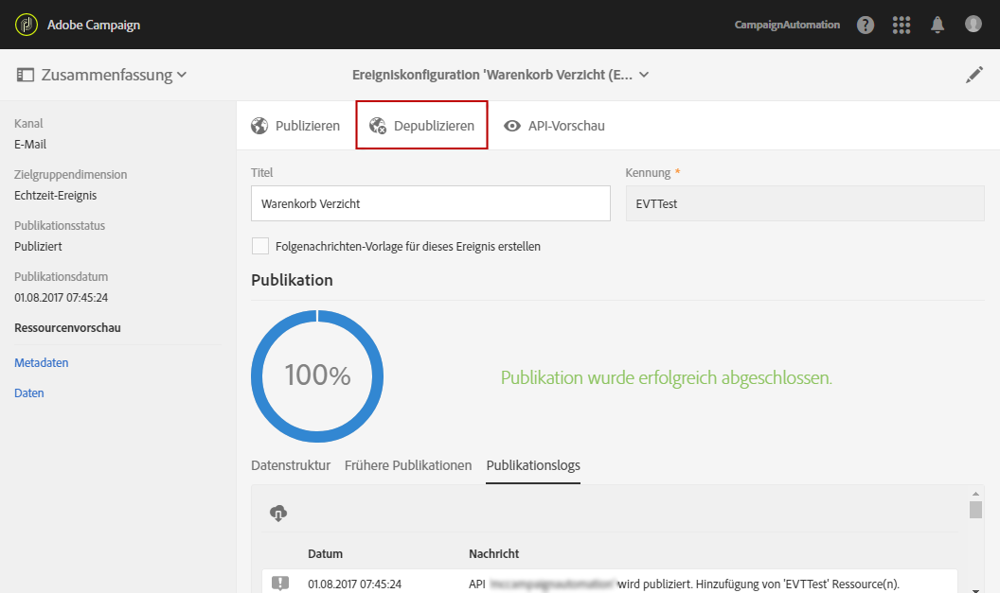

>[!NOTE]
>
>Sollten Sie die entsprechende Transaktionsnachricht bereits publiziert haben, wird die Transaktionsnachrichtenpublikation ebenfalls abgebrochen. Siehe [Transaktionsnachricht depublizieren](../../channels/using/event-transactional-messages.md#unpublishing-a-transactional-message).

Verwenden Sie die Schaltfläche **[!UICONTROL Publizieren]**, um die neue REST-API zu erzeugen.

### Publikationsprozess bei Transaktionsnachrichten {#transactional-messaging-pub-process}

Die nachstehende Tabelle zeigt den Publikationsprozess bei Transaktionsnachrichten.

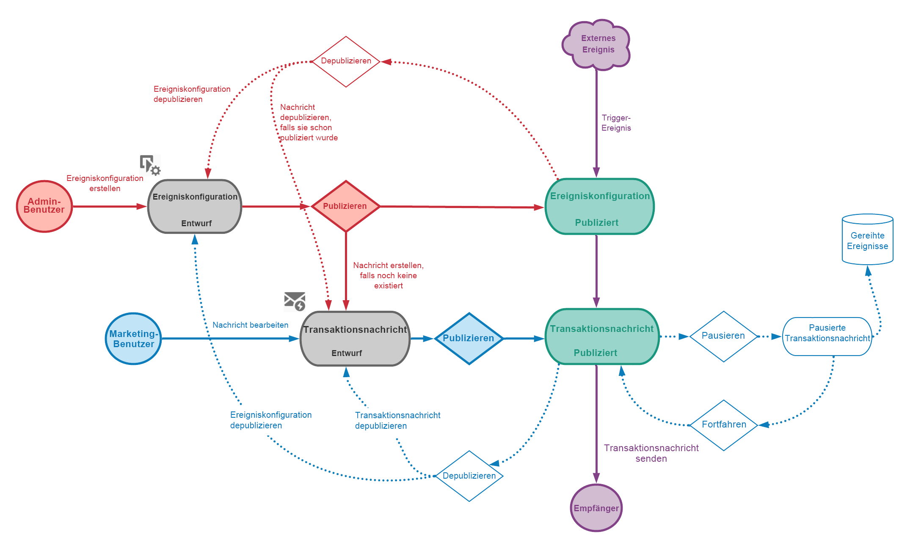

Weitere Informationen zum Veröffentlichen, Anhalten und Rückgängigmachen der Veröffentlichung einer Transaktionsnachricht finden Sie in [diesem Abschnitt](../../channels/using/event-transactional-messages.md#publishing-a-transactional-message).

### Löschen eines Ereignisses {#deleting-an-event}

Wenn Ereignis depubliziert oder noch nicht publiziert wurde, können Sie es aus der Ereigniskonfigurationsliste löschen. Gehen Sie dazu wie folgt vor:

1. Verwenden Sie das **[!UICONTROL Adobe Campaign]**-Logo oben links im Bildschirm und anschließend die Schaltflächen **[!UICONTROL Marketingpläne]** > **[!UICONTROL Transaktionsnachrichten]** > **[!UICONTROL Ereigniskonfiguration]**.
1. Bewegen Sie den Mauszeiger über die gewünschte Ereigniskonfiguration und wählen Sie die Schaltfläche **[!UICONTROL Element löschen]**.

   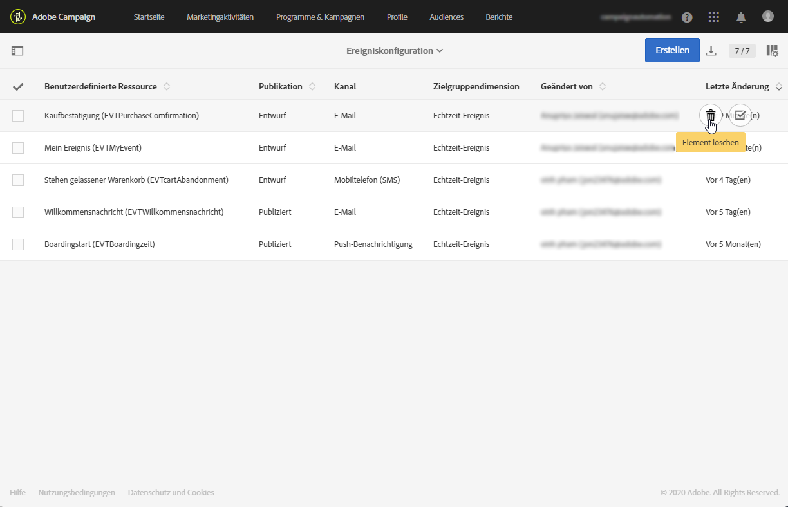

   >[!NOTE]
   >
   >Vergewissern Sie sich, dass die Ereigniskonfiguration den Status **[!UICONTROL Entwurf]** aufweist; andernfalls können Sie sie nicht löschen. Der Status **[!UICONTROL Entwurf]** gilt für ein Ereignis, das noch nicht publiziert bzw. das [depubliziert](#unpublishing-an-event) wurde.

1. Wählen Sie die Schaltfläche **[!UICONTROL Bestätigen]**.

   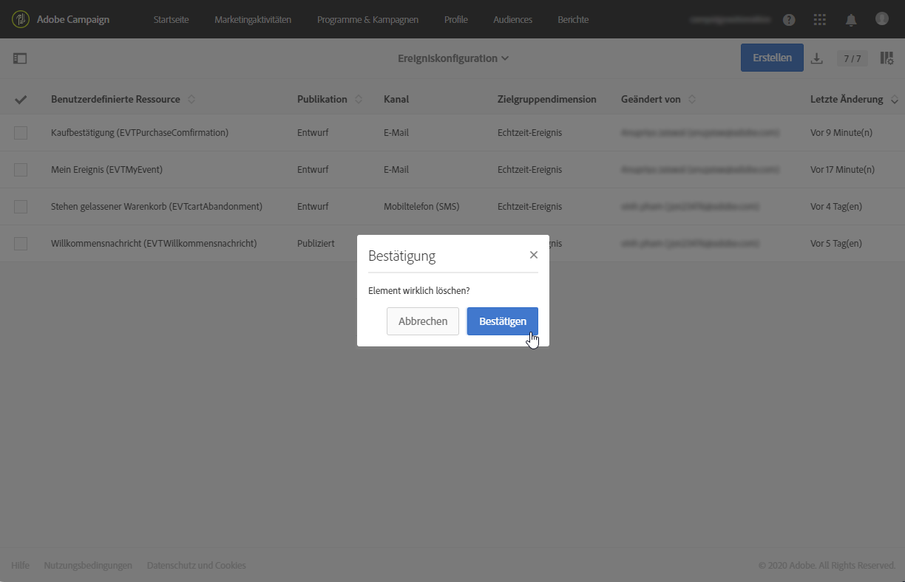

>[!IMPORTANT]
>
>Wenn Sie eine bereits publizierte und in Verwendung befindliche Ereigniskonfiguration löschen, werden auch die entsprechenden Transaktionsnachrichten sowie deren Versand- und Trackinglogs gelöscht.

## Durchsuchen von transaktionalen Ereignissen {#searching-transactional-events}

Gehen Sie wie unten beschrieben vor, um auf die bereits erstellten transaktionalen Ereignis zuzugreifen und sie zu durchsuchen.

1. Verwenden Sie das **[!UICONTROL Adobe Campaign]**-Logo oben links im Bildschirm und anschließend die Schaltflächen **[!UICONTROL Marketingpläne]** > **[!UICONTROL Transaktionsnachrichten]** > **[!UICONTROL Ereigniskonfiguration]**.
1. Klicken Sie auf die Schaltfläche **[!UICONTROL Suche]** anzeigen.

   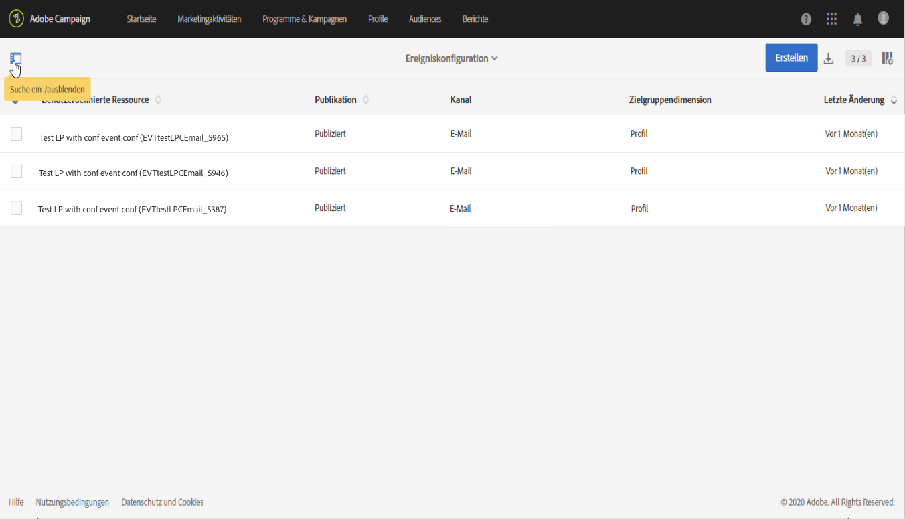

1. Sie können nach **[!UICONTROL Veröffentlichungsstatus]** filtern. Auf diese Weise können Sie beispielsweise nur die veröffentlichten Ereignisse anzeigen.
1. Sie können die Ereignis auch mit dem erhaltenen **[!UICONTROL letzten Ereignis filtern]**. Wenn Sie beispielsweise 10 eingeben, werden nur die Ereignis-Konfigurationen mit dem letzten Ereignis angezeigt, das vor 10 Tagen oder länger empfangen wurde. Auf diese Weise können Sie anzeigen, welche Ereignis während eines bestimmten Zeitraums inaktiv waren.

   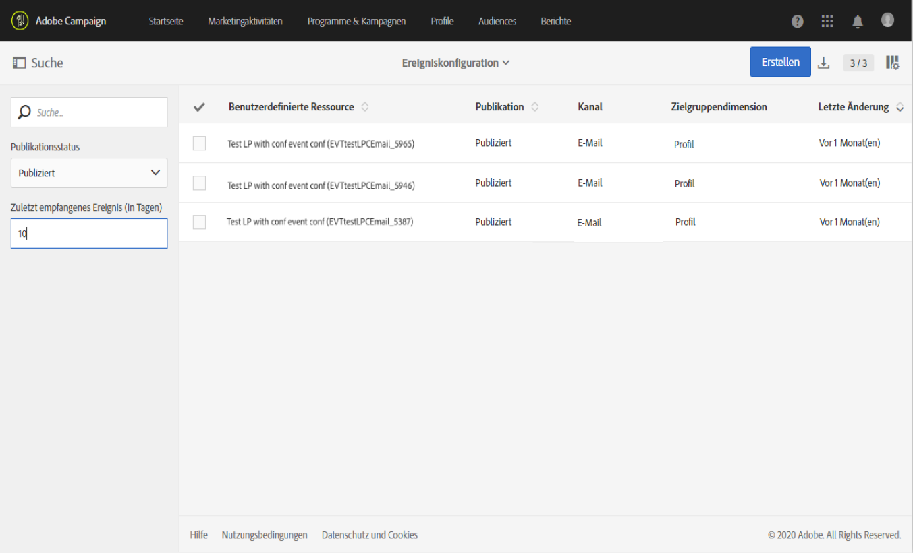

   >[!NOTE]
   >
   >Der Standardwert ist 0. Alle Ereignis werden dann angezeigt.

## Aktivierung des Ereignisses in eine Website integrieren {#integrating-the-triggering-of-the-event-in-a-website}

Nach der Erstellung des gewünschten Ereignisses muss die Auslösung dieses Ereignisses in Ihre Webseite integriert werden.

In dem in Abschnitt [Funktionsweise von Transaktionsnachrichten](../../channels/using/getting-started-with-transactional-msg.md#transactional-messaging-operating-principle) beschriebenen Beispiel wird ein Ereignis vom Typ &quot;Stehen gelassener Warenkorb&quot; ausgelöst, wenn ein Besucher Ihre Webseite verlassen hat, ohne den Kauf der Artikel in seinem Warenkorb abzuschließen. Zu diesem Zweck muss der Web-Entwickler Ihrer Seite die Adobe Campaign Standard REST-API verwenden.

Weiterführende Informationen dazu finden Sie im Abschnitt [REST-API-Dokumentation](../../api/using/managing-transactional-messages.md).

## Konfigurationen für Transaktionsereignisse {#transactional-event-specific-configurations}

Die Konfiguration von Transaktionsereignissen variiert je nach dem Typ der zu sendenden Transaktionsnachricht (Ereignis oder Profil) und dem verwendeten Kanal.

In den folgenden Abschnitten wird beschrieben, welche Konfiguration für die jeweilige Transaktionsnachricht festgelegt werden sollte. Weiterführende Informationen zu den allgemeinen Schritten bei der Konfiguration eines Ereignisses finden Sie im Abschnitt      [Ereignis erstellen](#creating-an-event).

### Ereignisbasierte Transaktionsnachrichten {#event-based-transactional-messages}

Um eine ereignisbasierte Transaktionsnachricht zu senden, erstellen und konfigurieren Sie zunächst ein Ereignis, bei dem die im Ereignis selbst enthaltenen Daten zur Zielgruppenbestimmung verwendet werden.
Weiterführende Informationen finden Sie unter [Interaktionen fördern mit Transaktionsnachrichten](https://helpx.adobe.com/de/campaign/kb/simplify-campaign-management.html#Managedatatofuelengagingexperiences).

1. Wählen Sie bei der Erstellung der Ereigniskonfiguration die Zielgruppendimension **[!UICONTROL Echtzeit-Ereignis]** (siehe [Ereignis erstellen](#creating-an-event)).
1. Fügen Sie zum Ereignis Felder hinzu, damit Sie die Transaktionsnachricht personalisieren können (siehe [Ereignisattribute definieren](#defining-the-event-attributes)).
1. Reichern Sie den Inhalt der Transaktionsnachricht an, wenn Sie Zusatzinformationen aus der Adobe-Campaign-Datenbank verwenden möchten (siehe [Inhalt der Transaktionsnachricht anreichern](#enriching-the-transactional-message-content)).

   >[!NOTE]
   >
   >Beim ereignisbasierten Transaktionsnachrichtenversand sollen ausschließlich die Daten verwendet werden, die im gesendeten Ereignis der Personalisierung von Empfängern und Nachrichteninhalten dienen. Der Inhalt Ihrer Transaktionsnachricht lässt sich jedoch durch die Verwendung von in der Adobe-Campaign-Datenbank enthaltenen Informationen anreichern.

1. Erstellen Sie eine Vorschau und publizieren Sie das Ereignis (siehe [Vorschau erstellen und Ereignis publizieren](#previewing-and-publishing-the-event)).

   Bei der Vorschau des Ereignisses enthält die REST-API ein Attribut, mit dem entsprechend dem ausgewählten Kanal die E-Mail-Adresse oder das Mobiltelefon spezifiziert wird.

   Mit Ausführung der Publikation wird automatisch eine dem neuen Ereignis entsprechende Transaktionsnachricht erzeugt. Damit das entsprechende Ereignis den Versand der Transaktionsnachricht auslösen kann, muss die Transaktionsnachricht angepasst und publiziert werden; siehe [Ereignis-Transaktionsnachrichten](../../channels/using/event-transactional-messages.md).

1. Integrieren Sie das Ereignis in Ihre Website (siehe [Aktivierung des Ereignisses in eine Website integrieren](#integrating-the-triggering-of-the-event-in-a-website)).

### Profilbasierte Transaktionsnachrichten    {#profile-based-transactional-messages}

Um eine profilbasierte Transaktionsnachricht zu senden, erstellen und konfigurieren Sie zunächst ein Ereignis, bei dem die in der Adobe-Campaign-Datenbank enthaltenen Daten zur Zielgruppenbestimmung verwendet werden.

1. Wählen Sie bei der Erstellung der Ereigniskonfiguration die Zielgruppendimension **[!UICONTROL Profil-Ereignis]** (siehe [Ereignis erstellen](#creating-an-event)).
1. Fügen Sie zum Ereignis Felder hinzu, damit Sie die Transaktionsnachricht personalisieren können (siehe [Ereignisattribute definieren](#defining-the-event-attributes)). Für eine Anreicherung müssen Sie mindestens ein Feld hinzufügen. Sie müssen keine anderen Felder wie **Vorname** und **Nachname** erstellen, da Sie Personalisierungsfelder aus der Adobe-Campaign-Datenbank verwenden können.
1. Erstellen Sie eine Anreicherung, um das Ereignis mit der Ressource **[!UICONTROL Profil]** zu verknüpfen (siehe [Inhalt der Transaktionsnachricht anreichern](#enriching-the-transactional-message-content)). Wenn die Zielgruppendimension **[!UICONTROL Profil]** verwendet wird, ist die Erstellung einer Anreicherung zwingend erforderlich.
1. Erstellen Sie eine Vorschau und publizieren Sie das Ereignis (siehe [Vorschau erstellen und Ereignis publizieren](#previewing-and-publishing-the-event)).

   Bei der Vorschau des Ereignisses enthält die REST-API kein Attribut, mit dem die E-Mail-Adresse oder das Mobiltelefon spezifiziert wird, da diese Daten von der Ressource **[!UICONTROL Profil]** abgerufen werden.

   Mit Ausführung der Publikation wird automatisch eine dem neuen Ereignis entsprechende Transaktionsnachricht erzeugt. Damit das entsprechende Ereignis den Versand der Transaktionsnachricht auslösen kann, muss die soeben erstellte Nachricht angepasst und publiziert werden; siehe [Profil-Transaktionsnachricht senden](../../channels/using/profile-transactional-messages.md#sending-a-profile-transactional-message).

1. Integrieren Sie das Ereignis in Ihre Website (siehe [Aktivierung des Ereignisses in eine Website integrieren](#integrating-the-triggering-of-the-event-in-a-website)).

### Ereignisbasierte Transaktions-Push-Benachrichtigungen    {#event-based-transactional-push-notifications}

Für den Versand von Transaktions-Push-Benachrichtigungen müssen Sie Adobe Campaign entsprechend konfigurieren. Siehe [Konfiguration von Push-Benachrichtigungen](https://helpx.adobe.com/de/campaign/kb/configuring-app-sdkv4.html).

Um eine anonyme Transaktions-Push-Benachrichtigung an alle Benutzer zu senden, die sich für den Empfang von Benachrichtigungen von Ihrer Mobile App angemeldet haben, erstellen und konfigurieren Sie zunächst ein Ereignis, bei dem die im Ereignis selbst enthaltenen Daten zur Zielgruppenbestimmung verwendet werden. Die entsprechenden Schritte finden Sie unten.

Das Ereignis muss diese drei Elemente enthalten:

* Einen **Anmeldetoken** als Nutzerkennung für eine Mobile App und ein Gerät. Möglicherweise entspricht es keinem Profil in der Adobe-Campaign-Datenbank.
* Einen **Mobile-App-Namen** (einen für alle Geräte – Android und iOS). Dies ist die Kennung der in Adobe Campaign konfigurierten Mobile App, die für den Empfang von Push-Benachrichtigungen auf den Geräten des Benutzers verwendet wird. Weiterführende Informationen hierzu finden Sie auf dieser [Seite](https://helpx.adobe.com/de/campaign/kb/configuring-app-sdkv4.html)
* Eine **Push-Plattform** (&quot;gcm&quot; für Android oder &quot;apns&quot; für iOS).

1. Wählen Sie bei der Erstellung der Ereigniskonfiguration den Kanal **[!UICONTROL Mobile App]** und die Zielgruppendimension **[!UICONTROL Echtzeit-Ereignis]** (siehe [Ereignis erstellen](#creating-an-event)).
1. Fügen Sie zum Ereignis Felder hinzu, damit Sie die Transaktionsnachricht personalisieren können (siehe [Ereignisattribute definieren](#defining-the-event-attributes)).
1. Reichern Sie den Inhalt der Transaktionsnachricht an, wenn Sie Zusatzinformationen aus der Adobe-Campaign-Datenbank verwenden möchten (siehe [Inhalt der Transaktionsnachricht anreichern](#enriching-the-transactional-message-content)).

   >[!NOTE]
   >
   >Beim ereignisbasierten Transaktionsnachrichtenversand sollen ausschließlich die Daten verwendet werden, die im gesendeten Ereignis der Personalisierung von Empfängern und Nachrichteninhalten dienen. Der Inhalt Ihrer Transaktionsnachricht lässt sich jedoch durch die Verwendung von in der Adobe-Campaign-Datenbank enthaltenen Informationen anreichern.

1. Erstellen Sie eine Vorschau und publizieren Sie das Ereignis (siehe [Vorschau erstellen und Ereignis publizieren](#previewing-and-publishing-the-event)).

   Bei der Vorschau des Ereignisses enthält die REST-API die Attribute &quot;registrationToken&quot;, &quot;application&quot; und &quot;pushPlatform&quot;, die für die Zielgruppenbestimmung des Versands verwendet werden.

   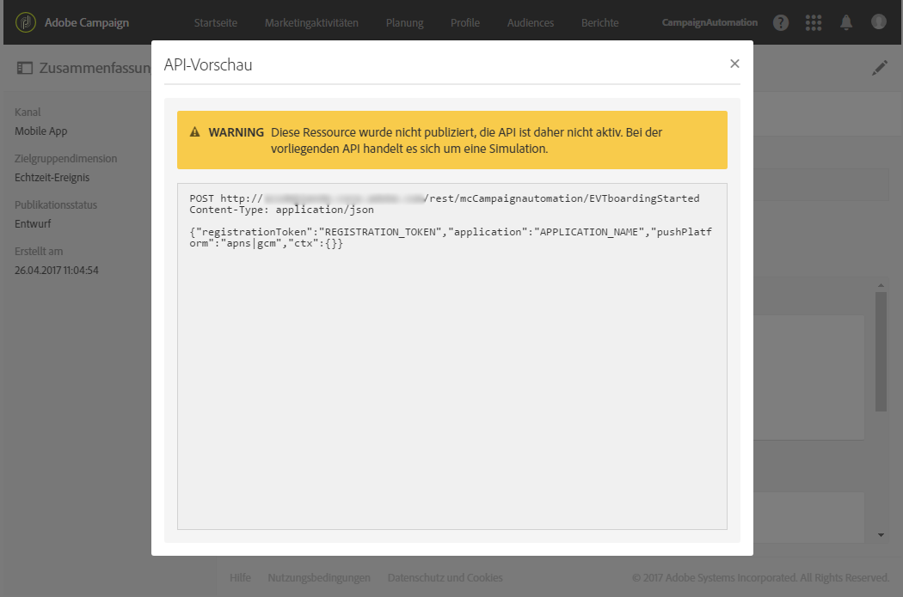

   Mit Ausführung der Publikation wird automatisch eine dem neuen Ereignis entsprechende Transaktions-Push-Benachrichtigung erzeugt. Um die soeben erstellte Nachricht anzupassen und zu publizieren, siehe [Transaktions-Push-Benachrichtigungen senden, bei denen die Zielgruppenbestimmung durch ein Ereignis erfolgt](../../channels/using/transactional-push-notifications.md#transactional-push-notifications-targeting-an-event).

1. Integrieren Sie das Ereignis in Ihre Website (siehe [Aktivierung des Ereignisses in eine Website integrieren](#integrating-the-triggering-of-the-event-in-a-website)).

### Profilbasierte Transaktions-Push-Benachrichtigungen    {#profile-based-transactional-push-notifications}

Um eine Transaktions-Push-Benachrichtigung an die Adobe-Campaign-Profile zu senden, die sich für Ihre Mobile App angemeldet haben, müssen Sie zunächst ein Ereignis erstellen und konfigurieren, bei dem die in der Adobe-Campaign-Datenbank enthaltenen Daten zur Zielgruppenbestimmung verwendet werden.

1. Wählen Sie bei der Erstellung der Ereigniskonfiguration den Kanal **[!UICONTROL Mobile App]** und die Zielgruppendimension **[!UICONTROL Profil]** (siehe [Ereignis erstellen](#creating-an-event)).

   Standardmäßig wird die Transaktions-Push-Benachrichtigung an alle Mobile Apps gesendet, für die sich der Empfänger angemeldet hat. Um die Push-Benachrichtigung an eine bestimmte Mobile App zu senden, wählen Sie sie in der Liste aus. Die anderen Mobile Apps werden zwar bei der Zielgruppenbestimmung der Nachricht berücksichtigt, aber vom Versand ausgeschlossen.

   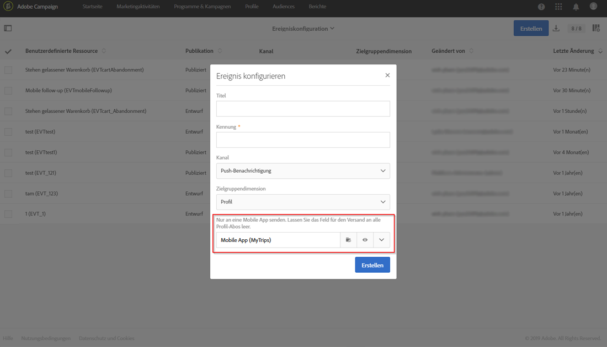

1. Fügen Sie zum Ereignis Felder hinzu, wenn Sie die Transaktionsnachricht personalisieren möchten (siehe [Ereignisattribute definieren](#defining-the-event-attributes)).

   >[!NOTE]
   >
   >Für eine Anreicherung müssen Sie mindestens ein Feld hinzufügen. Sie müssen keine anderen Felder wie **Vorname** und **Nachname** erstellen, da Sie Personalisierungsfelder aus der Adobe-Campaign-Datenbank verwenden können.

1. Erstellen Sie eine Anreicherung, um das Ereignis mit der Ressource **[!UICONTROL Profil]** zu verknüpfen (siehe [Inhalt der Transaktionsnachricht anreichern](#enriching-the-transactional-message-content)). Wenn die Zielgruppendimension **[!UICONTROL Profil]** verwendet wird, ist die Erstellung einer Anreicherung zwingend erforderlich.
1. Erstellen Sie eine Vorschau und publizieren Sie das Ereignis (siehe [Vorschau erstellen und Ereignis publizieren](#previewing-and-publishing-the-event)).

   Bei der Vorschau des Ereignisses enthält die REST-API kein Attribut, das das Anmeldetoken, den App-Namen und die Push-Plattform spezifiziert, da diese Informationen aus der Ressource **[!UICONTROL Profil]** entnommen werden.

   Mit Ausführung der Publikation wird automatisch eine dem neuen Ereignis entsprechende Transaktions-Push-Benachrichtigung erzeugt. Um die soeben erstellte Nachricht anzupassen und zu publizieren, siehe [Transaktions-Push-Benachrichtigungen senden, bei denen die Zielgruppenbestimmung durch ein Profil erfolgt](../../channels/using/transactional-push-notifications.md#transactional-push-notifications-targeting-a-profile).

1. Integrieren Sie das Ereignis in Ihre Website (siehe [Aktivierung des Ereignisses in eine Website integrieren](#integrating-the-triggering-of-the-event-in-a-website)).

### Ereignis konfigurieren, um eine Folgenachricht zu senden      {#configuring-an-event-to-send-a-follow-up-message}

Eine Folgenachricht ist eine vordefinierte Marketing-Versandvorlage, die in einem Workflow verwendet werden kann, um Nachrichten an die Empfänger einer bestimmten Transaktionsnachricht zu senden. Lesen Sie diesbezüglich auch den Abschnitt [Folgenachrichten](../../channels/using/follow-up-messages.md).

1. Verwenden Sie dieselbe Ereigniskonfiguration wie für den Versand einer Ereignis-Transaktionsnachricht. Siehe [Ereignisbasierte Transaktionsnachrichten](#event-based-transactional-messages).
1. Aktivieren Sie bei der Konfiguration Ihres Ereignisses und vor seiner Publikation die Option **[!UICONTROL Folgenachrichten-Vorlage für dieses Ereignis erstellen]**.

   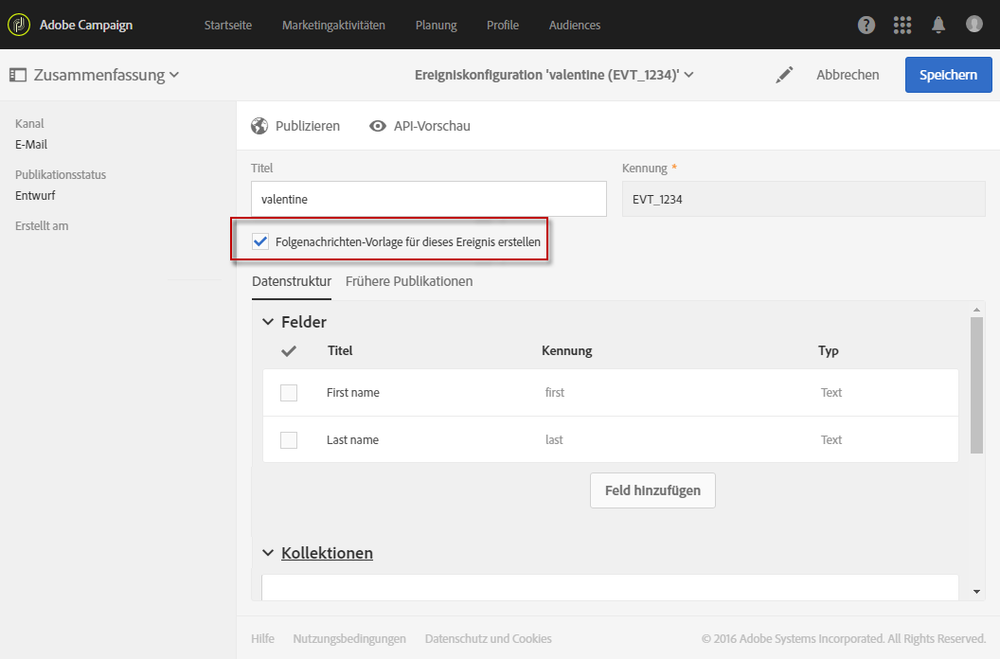

1. Erstellen Sie eine Vorschau und publizieren Sie das Ereignis (siehe [Vorschau erstellen und Ereignis publizieren](#previewing-and-publishing-the-event)).

   Mit Ausführung der Publikation werden automatisch eine dem neuen Ereignis entsprechende Transaktionsnachricht und eine Folgenachricht aus einer Versandvorlage erzeugt. Lesen Sie zur Verwendung von Folgenachrichten auch den Abschnitt [Folgenachrichten senden](../../channels/using/follow-up-messages.md#sending-a-follow-up-message).

## Anwendungsbeispiel: Konfiguration eines Ereignisses zum Senden einer Transaktionsnachricht    {#use-case--configuring-an-event-to-send-a-transactional-message}

In diesem Beispiel möchten wir ein Ereignis konfigurieren, um nach jedem Kauf auf unserer Website eine Bestätigungsnachricht mit folgenden Merkmalen zu senden:

Da wir unsere Kunden anhand ihrer CRM-ID identifizieren möchten, muss die Ressource **[!UICONTROL Profil]** zunächst um dieses neue Feld erweitert werden.

Ebenso muss eine benutzerdefinierte Ressource für Käufe erstellt und publiziert und mit der Ressource **[!UICONTROL Profil]** verknüpft werden. Auf diese Weise werden Sie in der Lage sein, Informationen aus dieser Ressource zur Anreicherung des Nachrichteninhalts abzurufen.

Weiterführende Informationen zur Erstellung und Publikation von Ressourcen finden Sie auf [dieser Seite](../../developing/using/key-steps-to-add-a-resource.md).

1. Erstellen Sie ein neues Ereignis unter Verwendung des Kanals **[!UICONTROL E-Mail]** und der Zielgruppendimension **[!UICONTROL Profil]** (siehe [Ereignis erstellen](#creating-an-event)).
1. Definieren Sie die Attribute, die zur Personalisierung der Transaktionsnachricht verfügbar sein sollen. Fügen Sie in unserem Fall die Felder &quot;CRM ID&quot; und &quot;Produktkennung&quot; hinzu (siehe [Ereignisattribute definieren](#defining-the-event-attributes)).

   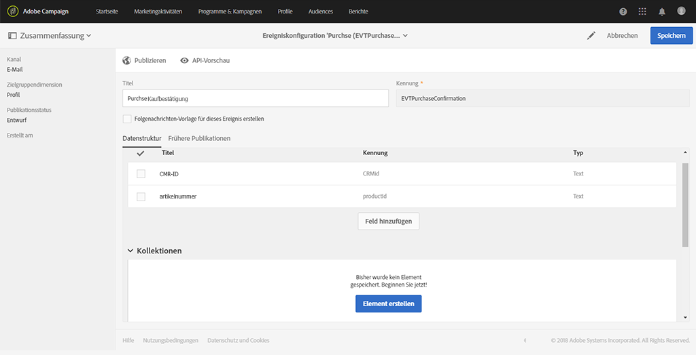

1. Um den Nachrichteninhalt mit Informationen zu früheren Käufen des Kunden anzureichern, erstellen Sie eine Anreicherung, die die Ressource **[!UICONTROL Kauf]** verwendet (siehe [Inhalt der Transaktionsnachricht anreichern](#enriching-the-transactional-message-content)).

   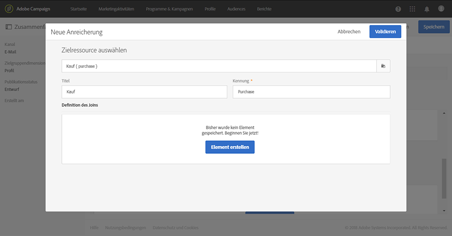

1. Erstellen Sie eine Join-Bedingung zwischen dem zuvor zur Nachricht hinzugefügten Feld &quot;Product identifier&quot; und dem entsprechenden Feld in der Ressource **[!UICONTROL Kauf]**..

   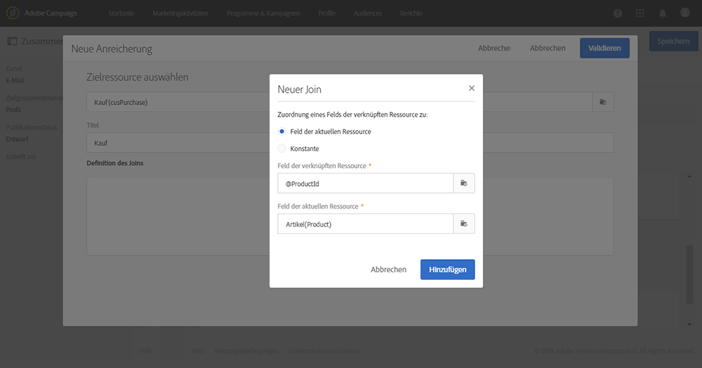

1. Erstellen Sie eine Vorschau und publizieren Sie das Ereignis (siehe [Vorschau erstellen und Ereignis publizieren](#previewing-and-publishing-the-event)).
1. Integrieren Sie das Ereignis in Ihre Website (siehe [Aktivierung des Ereignisses in eine Website integrieren](#integrating-the-triggering-of-the-event-in-a-website)).

