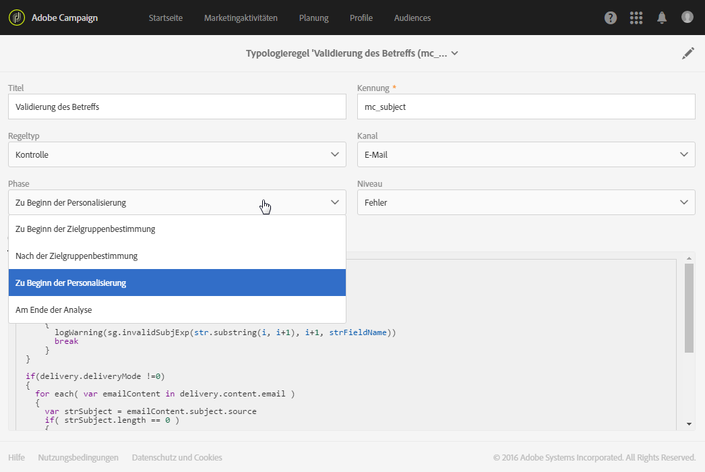

# Kontrollregeln{#control-rules}

Mit Kontrollregeln kann der Benutzer die Gültigkeit und Qualität der Nachrichten vor dem Versand überprüfen. Überprüft werden dabei zum Beispiel die Zeichenanzeige, die Größe von SMS-Nachrichten, das Adressformat usw.

In Adobe Campaign ist eine Reihe von nativen Regeln verfügbar, die folgende Standardkontrollen gewährleisten:

* **[!UICONTROL Prüfung des Betreffs]** (E-Mail): überprüft, ob der Betreff und die Absenderadresse keine Sonderzeichen enthalten, die bei bestimmten Mail Transfer Agents Probleme verursachen können, und ob der Nachrichtenbetreff ausgefüllt wurde.
* **[!UICONTROL Prüfung der URL-Titel]** (E-Mail): überprüft, ob jede Tracking-URL über einen Titel verfügt.
* **[!UICONTROL Prüfung der URLs]** (E-Mail): überprüft die Tracking-URLs (Prüfung auf Vorhandensein des Zeichens "&amp;").
* **[!UICONTROL Prüfung der Testversandgröße]** (alle Kanäle): erzeugt eine Fehlermeldung, wenn die Zielpopulation des Testversands mehr als 100 Empfänger umfasst.
* **Prüfung des Abmelde-Links** (E-Mail): überprüft, ob in jedem Inhalt (HTML und Text) mindestens eine Abmelde-URL (Opt-out) enthalten ist.
* **[!UICONTROL Prüfung der Sendungsgröße]** (alle Kanäle): überprüft die Größe der Nachricht.
* **[!UICONTROL Prüfung der Teilen-Links zu den sozialen Netzwerken]** (E-Mail): überprüft, wenn im Inhalt ein Link zum Teilen in sozialen Netzwerken (ViralLinks) enthalten ist, ob der dann nötige Mirrorseiten-Link ebenfalls enthalten ist.
* **[!UICONTROL A/B-Test]**: extrahiert die Test-Population für einen Versand mit A/B-Test.

Sie können die Phase im Lebenszyklus des Versands auswählen, in der die Regel angewendet werden soll. Wählen Sie den gewünschten Wert in der Typologieregel in der Dropdown-Liste des **[!UICONTROL Phase]**-Felds aus.

Mögliche Werte:

* **Zu Beginn der Zielgruppenbestimmung**

   Die Kontrollregel kann in dieser Phase angewendet werden, sodass der Personalisierungsschritt im Fall eines Fehlers nicht ausgeführt wird.

* **Nach der Zielgruppenbestimmung**

   Wenn Sie die Größe der Zielgruppe kennen müssen, um die Kontrollregel anzuwenden, wählen Sie diese Phase aus.

   So wird beispielsweise die Kontrollregel **Prüfung der Testversandgröße** nach der Zielgruppenbestimmung angewendet: Diese Regel verhindert die Vorbereitung der Nachrichtenpersonalisierung, wenn zu viele Testversand-Empfänger vorhanden sind.

* **Zu Beginn der Personalisierung**

   Diese Phase muss ausgewählt werden, wenn bei der Überprüfung die Nachrichtenpersonalisierung validiert werden soll. Die Nachrichtenpersonalisierung erfolgt während der Analysephase.

* **Am Ende der Analyse**

   Wenn für eine Überprüfung die Nachrichtenpersonalisierung abgeschlossen sein muss, wählen Sie diese Phase aus.

>[!NOTE]
>
>Aus Sicherheitsgründen kann der Inhalt der Kontrollregeln nicht geändert werden. Das **[!UICONTROL Code]**-Feld ist schreibgeschützt.
