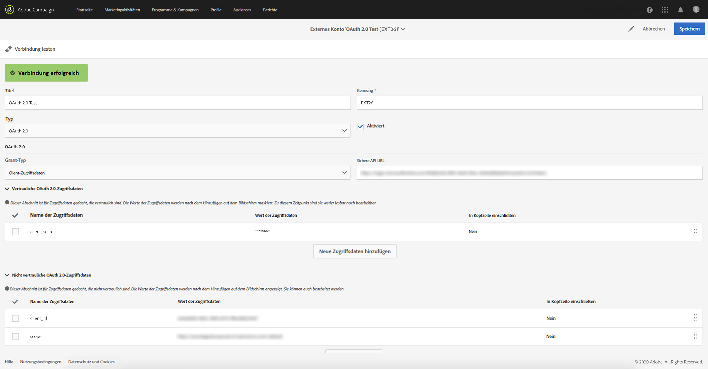

# Externe Konten{#external-accounts}

Externe Konten sind Konfigurationen, die den Zugriff auf Server außerhalb von Adobe Campaign erlauben.

Mit diesen externen Konten ist es möglich, in Campaign-Workflows auf Daten zuzugreifen und diese zu verwalten.

Die folgenden externen Konten können eingerichtet werden:

* SFTP. Weiterführende Informationen hierzu finden Sie in [diesem Abschnitt](#sftp-external-account).
* Amazon Storage Service (S3). Weiterführende Informationen hierzu finden Sie in [diesem Abschnitt](#amazon-s3-external-account).
* Adobe Experience Manager: Weiterführende Informationen hierzu finden Sie in [diesem Abschnitt](#adobe-experience-manager-external-account).
* Adobe Analytics. Weiterführende Informationen hierzu finden Sie in [diesem Abschnitt](../../integrating/using/configure-campaign-analytics-integration.md).
* Google reCAPTCHA. Weiterführende Informationen hierzu finden Sie in [diesem Abschnitt](#google-recaptcha-external-account).
* Microsoft Azure Blob Storage. Weiterführende Informationen hierzu finden Sie in [diesem Abschnitt](#microsoft-azure-external-account).
* OAuth 2.0. Weiterführende Informationen hierzu finden Sie in [diesem Abschnitt](#oauth-account).

>[!NOTE]
>
>Adobe verwendet auch andere Typen von externen Konten während des Produktbereitstellungsprozesses. Ab Campaign Standard 17.9 können externe FTP-Konten zwar definiert, aber nicht mehr in neuen Workflow-Aktivitäten verwendet werden. Wenn Sie bereits eine Verbindung eingerichtet hatten, ist sie nach wie vor aktiviert.

Externe Konten können von Administratoren im Menü **[!UICONTROL Administration > Anwendungskonfiguration > Externe Konten]** konfiguriert werden.

## Externes Konto erstellen {#creating-an-external-account}

Adobe Campaign enthält eine Reihe vordefinierter externer Konten. Sie können aber auch Ihre eigenen externen Konten erstellen, um eine Verbindung mit externen Systemen wie FTP-Servern zum Zweck des Dateitransfers herzustellen.

Externe Konten werden von technischen Prozessen, wie technischen Workflows oder Kampagnen-Workflows, verwendet. Bei der Einrichtung eines Dateitransfers in einem Workflow oder bei einem Datenaustausch mit einer anderen Anwendung (Adobe Target, Experience Manager etc.) müssen Sie ein externes Konto auswählen.

1. Wählen Sie die **[!UICONTROL Erstellen]**-Schaltfläche aus.
1. Geben Sie einen Titel ein. Der Titel und die Kennung werden verwendet, wenn Sie in Workflows externe Konten auswählen möchten.
1. Wählen Sie den Kontotyp aus, den Sie erstellen möchten.
1. Konfigurieren Sie den Zugriff auf das Konto, indem Sie die Anmeldedaten, die Server-Adresse, die Port-Nummer und/oder gegebenenfalls die Schlüssel spezifizieren.

   Die nötigen Informationen werden normalerweise vom Anbieter des Servers bereitgestellt, mit dem Sie eine Verbindung herstellen möchten.

1. Speichern Sie das Konto.

Das externe Konto wurde erstellt und ist nun in der Liste der Konten sichtbar. Es steht jetzt für Ihre Daten-/Dateitransfers oder Routing-Konfigurationen in Workflow-Aktivitäten und Versandeigenschaften bereit.

## Externes SFTP-Konto {#sftp-external-account}

Unterschiedliche Typen externer Konten erfordern die Angabe unterschiedlicher Informationen.

Geben Sie für ein externes SFTP-Konto die folgenden Details an:

* Serveradresse, z. B. **ftp.domain.com**
* Port-Nummer, z. B. **22**
* SFTP-Server-Anmeldedaten: Kontoname und Passwort, die zur Verbindung mit dem Server verwendet werden

### Empfehlungen für von Adobe gehostete SFTP-Server {#adobe-hosted-sftp-server-recommendations}

Wenn Dateien und Daten für ETL-Zwecke verwaltet werden, werden diese Dateien auf einem von Adobe bereitgestellten gehosteten SFTP-Server gespeichert. Dieser SFTP-Server ist ein vorübergehender Speicherplatz, auf dem Sie die Aufbewahrung und Löschung von Dateien selbst kontrollieren können.

Wenn der Speicherplatz nicht korrekt verwendet oder gewartet wird, kann der verfügbare physische Platz schnell aufgebraucht sein und ernsthafte Probleme bereiten. Als Folge kann Datenverlust oder die Beschädigung Ihrer Plattform auftreten.

Um solche Probleme zu vermeiden, empfiehlt Adobe, die unten stehenden Best Practice zu befolgen:

* Bewahren Sie nur die Mindestmenge an Daten auf.
* Verwenden Sie eine schlüsselbasierte Authentifizierung, um das Ablaufen von Kennwörtern zu vermeiden. Unterstützt werden nur die Formate **OpenSSH** und **SSH2**. Stellen Sie dem Adobe-Supportteam den öffentlichen Schlüssel bereit, damit er zum Campaign-Server hochgeladen werden kann.
* Bewahren Sie Daten nur so lange wie unbedingt nötig auf. 15 Tage sind das Limit.
* Verwenden Sie Workflows, um Daten ordnungsgemäß zu löschen (verwalten Sie die Beibehaltung von Daten innerhalb der Workflows, die die Daten nutzen).
* Verwenden Sie Batch-Prozesse bei SFTP-Uploads und in Workflows.
* Beseitigen Sie Fehler/Ausnahmen.
* Melden Sie sich gelegentlich beim SFTP-Server direkt an, um dessen Inhalt zu prüfen.
* Beachten Sie bitte, dass die Verwaltung des SFTP-Speichers hauptsächlich Ihre Verantwortung ist.

Beachten Sie außerdem, dass die öffentlichen IPs, mit denen Sie die SFTP-Verbindung aufbauen, in der Campaign-Instanz auf der Zulassungsliste stehen müssen. Wenn Sie IP-Adressen auf eine Zulassungsliste setzen lassen möchten, senden Sie ein [Support-Ticket](https://helpx.adobe.com/de/enterprise/using/support-for-experience-cloud.html) und stellen Sie den öffentlichen Schlüssel zur Authentifizierung bereit.

SFTP-Server können über das Control Panel verwaltet werden. Weitere Informationen finden Sie in der [Control Panel-Dokumentation](https://experienceleague.adobe.com/docs/control-panel/using/sftp-management/about-sftp-management.html?lang=de).

>[!NOTE]
>
>Das Control Panel steht allen Administratoren zur Verfügung. Die Schritte, um einem Benutzer Administratorzugriff zu gewähren, finden Sie auf [dieser Seite](https://experienceleague.adobe.com/docs/control-panel/using/discover-control-panel/managing-permissions.html?lang=de#discover-control-panel).

## OAuth 2.0-Konto {#oauth-account}

Geben Sie für ein externes OAuth 2.0-Konto die folgenden Details an:

* Ein **Grant-Typ**: Es werden nur **Client-Anmeldedaten** unterstützt.
* Eine **sichere API-URL**: Geben Sie den Autorisierungsendpunkt ein.
* **Vertrauliche OAuth 2.0-Anmeldedaten**: Dieser Abschnitt ist für vertrauliche Anmeldedaten gedacht. Die Anmeldedaten werden nach dem Hinzufügen auf dem Bildschirm maskiert. Zu diesem Zeitpunkt sind sie weder lesbar noch bearbeitbar. Wenn für den Autorisierungsendpunkt bestimmte Zugangsdaten anstelle des POST-Hauptteilparameters in die HTTP-Autorisierungskopfzeile eingefügt werden müssen, können Sie für diese Zugangsdaten die Option &quot;In Kopfzeile einschließen&quot; auswählen.
* **Nicht vertrauliche OAuth 2.0-Anmeldedaten**: Dieser Abschnitt ist für nicht vertrauliche Anmeldedaten gedacht. Die Anmeldedaten werden nach dem Hinzufügen auf dem Bildschirm angezeigt. Sie können auch bearbeitet werden.  Wenn für den Autorisierungsendpunkt bestimmte Zugangsdaten anstelle des POST-Hauptteilparameters in die HTTP-Autorisierungskopfzeile eingefügt werden müssen, können Sie für diese Zugangsdaten die Option &quot;In Kopfzeile einschließen&quot; auswählen.

Klicken Sie nach Eingabe der Kontoinformationen auf **Verbindung testen**, um zu überprüfen, ob das externe Konto korrekt konfiguriert wurde.



>[!NOTE]
>
>Die Anmeldedaten &quot;Content-Type: application/x-www-form-urlencoded&quot; und &quot;grant_type=client_credentials&quot; werden dem API-Aufruf automatisch hinzugefügt. Sie müssen sie daher nicht im Abschnitt für Anmeldedaten hinzufügen.

## Externes Amazon-S3-Konto {#amazon-s3-external-account}

Das Amazon-S3-Server-Feld sollte folgendermaßen ausgefüllt werden:

```
<S3 bucket name>.s3.amazonaws.com/<s3 object path>
```

Um Ihre Datei in S3 im verschlüsselten Modus zu speichern, aktivieren Sie die Option **[!UICONTROL Dateien in S3 verschlüsselt lassen]**.


Die nötigen Informationen werden normalerweise vom Anbieter des Servers bereitgestellt, mit dem Sie eine Verbindung herstellen möchten.

Spezifizieren Sie die mit Ihrem Endpunkt verknüpfte **[!UICONTROL AWS-Region]**. Die unterstützten Regionen und Signaturversionen finden Sie in der offiziellen [Amazon-Dokumentation zu S3](https://docs.aws.amazon.com/general/latest/gr/rande.html#s3_region).

>[!NOTE]
>
>Geben Sie Ihren **[!UICONTROL Receiver-Server]** ohne die AWS-Region ein; diese wird später automatisch Ihrer URL hinzugefügt.

### Empfehlungen für das Amazon-S3-Konto {#amazon-s3-account-recommendations}

Wir empfehlen zum Einrichten des Amazon-S3-Kontos folgende Vorgehensweise:

* Erstellen Sie eine restriktive Bucket-Richtlinie, um den Zugriff auf S3-Buckets zu beschränken. Die Bucket-Richtlinie kann während der Erstellung eines Buckets konfiguriert werden. Weiterführende Informationen finden Sie in der [Amazon-Dokumentation zu S3](https://docs.aws.amazon.com/AmazonS3/latest/dev//example-bucket-policies.html).
* Aktivieren Sie beim Erstellen eines externen Kontos die Verschlüsselung bei der Speicherung sensibler Daten im S3-Bucket, indem Sie die Option **[!UICONTROL Dateien in S3 verschlüsselt lassen]** aktivieren.
* Vergeben Sie Bucket-Berechtigungen, um festzulegen, wer auf das Objekt in einem Bucket zugreifen kann. Weiterführende Informationen zu Bucket-Berechtigungen finden Sie in der [Amazon-Dokumentation zu S3](https://docs.aws.amazon.com/AmazonS3/latest/dev//access-control-overview.html).

## Externes Adobe Experience Manager-Konto {#adobe-experience-manager-external-account}

Externe Konten vom Typ Adobe Experience Manager werden bei der Integration von Campaign mit Experience Manager verwendet.

Der Vorgang und die Anforderungen für diese Integration sind in [diesem Dokument](../../integrating/using/get-started-campaign-integrations.md) beschrieben.

Beim Einrichten dieses neuen externen Kontos müssen Sie die folgenden Informationen angeben:

* Server: Geben Sie die URL des Adobe Experience Manager-Servers an. Beispiel:

  ```
  http://aem.domain.com:4502
  ```

* Anmeldedaten zum AEM-Konto: Verwenden Sie das Konto, über das auf die Adobe-Experience-Manager-Instanz zugegriffen wird. Es sollte ein Konto sein, das Teil der campaign-remote-Gruppe in Adobe Experience Manager ist.

## Externes Google-reCAPTCHA-Konto {#google-recaptcha-external-account}

>[!NOTE]
>
>Für die Konfiguration von Google reCAPTCHA ist ein Google-Konto erforderlich.

Mithilfe von Google reCAPTCHA können Sie Ihre Landingpage vor Spam und Missbrauch durch Bots schützen. Dies erfordert nur wenig Einsatz aufseiten Ihrer Kunden, da nur eine Interaktion mit Ihrer Website erforderlich ist. Auf dieser [Seite](https://www.google.com/recaptcha/admin/create) können Sie Ihre Website registrieren. Wählen Sie den Typ &quot;V3 reCAPTCHA&quot;.

Damit Sie Google reCAPTCHA V3 zu Ihrer Landingpage hinzufügen können, müssen Sie dies zunächst in Ihrem externen Konto konfigurieren. Weiterführende Information zum Hinzufügen zu Ihrer Landingpage finden Sie in diesem [Abschnitt](../../channels/using/configuring-landing-page.md#setting-google-recaptcha).

Geben Sie für ein externes Google-reCAPTCHA-V3-Konto die folgenden Details an:

* Einen **[!UICONTROL Titel]** und eine **[!UICONTROL ID]** für Ihr externes Konto
* **[!UICONTROL Typ]**: Google reCAPTCHA
* Ihren **[!UICONTROL Site-Schlüssel]** und Ihr **[!UICONTROL Site-Geheimnis]**
* Einen **[!UICONTROL Schwellenwert]** zwischen 0 und 1

  Der **[!UICONTROL Schwellenwert]** 0,0 bedeutet, dass es sich wahrscheinlich um einen Bot handelt, 1,0 dagegen weist auf eine menschliche Interaktion hin. Verwenden Sie den Standard-Schwellenwert von 0,5.


## Externes Microsoft Azure Blob Storage-Konto {#microsoft-azure-external-account}

>[!NOTE]
>
>Informationen, die Sie zum Konfigurieren Ihres externen Kontos in Adobe Campaign Standard benötigen, finden Sie im Azure Portal. Wählen Sie dazu **[!UICONTROL Settings]** > **[!UICONTROL Access keys]** aus.

Der Azure Blob Storage-Connector kann mithilfe einer Workflow-Aktivität vom Typ **[!UICONTROL Dateiübertragung]** zum Importieren oder Exportieren von Daten in Adobe Campaign verwendet werden. Weiterführende Informationen hierzu finden Sie in diesem [Abschnitt](../../automating/using/transfer-file.md#azure-blob-configuration-wf).

Geben Sie für ein externes Microsoft Azure Blob Storage-Konto die folgenden Informationen ein:

* Einen **[!UICONTROL Titel]** und eine **[!UICONTROL ID]** für Ihr externes Konto
* **[!UICONTROL Typ]**: Microsoft Azure Blob Storage
* Ihren **[!UICONTROL Kontonamen]** und Ihren **[!UICONTROL Kontoschlüssel]**. Auf dieser [Seite](https://docs.microsoft.com/de-DE/azure/storage/common/storage-account-keys-manage) erfahren Sie, wo Sie Ihren Kontonamen und Kontoschlüssel finden können.
* Ihr **[!UICONTROL Endpunktsuffix]**. Es befindet sich im Azure Portal unter **[!UICONTROL Connection string]** im Menü **[!UICONTROL Access keys]**. Weiterführende Informationen hierzu finden Sie auf dieser [Seite](https://docs.microsoft.com/de-DE/azure/storage/common/storage-account-keys-manage).
* Den Namen Ihres **[!UICONTROL Containers]**. Wenn Sie mehr als einen Container verwenden möchten, müssen Sie so viele externe Konten wie Container erstellen.
* Mit der Option **[!UICONTROL Parallelität]** können Sie die Geschwindigkeit von Dateiübertragungen präzisieren.


Klicken Sie nach der Konfiguration auf **[!UICONTROL Verbindung testen]**, um Adobe Campaign mit Microsoft Azure Blob Storage zu verknüpfen.

### Microsoft Azure Blob Storage – Empfehlungen {#azure-blob-recommendations}

**Verschlüsselung**

Adobe Campaign nutzt eine gesicherte Verbindung (HTTPS), um auf Ihr Microsoft Azure Blob Storage-Konto zuzugreifen.

**Kontoschlüssel**

Beim Konfigurieren Ihres externen Kontos müssen Sie einen der **[!UICONTROL Kontoschlüssel]** angeben, die im Azure Portal verfügbar sind. Weitere Informationen zum Auffinden Ihrer Kontoschlüssel erhalten Sie auf dieser [Seite](https://docs.microsoft.com/de-DE/azure/storage/common/storage-account-keys-manage#view-access-keys-and-connection-string).

**Optimieren der Geschwindigkeit bei der Dateiübertragung**

Mit der Option **[!UICONTROL Parallelität]** können Sie die Geschwindigkeit von Dateiübertragungen genau einstellen.
Die Option stellt die Anzahl der Threads dar, die bei der Durchführung der Dateiübertragung verwendet werden. Jeder dieser Threads lädt einen Teil von ca. 1 MB aus dem Blob-Speicher herunter. Diese werden dann in die Warteschlange gestellt, um auf die Festplatte geschrieben zu werden. Beachten Sie, dass bei Erhöhung der Thread-Zahl auch die Auslastung der Ressourcen steigt, die von der Anwendung zur Dateiübertragung genutzt werden.

Nach Abschluss der Dateiübertragung finden Sie Performance-Metriken in den Workflow-Logs.

**Weitere Zustellversuche**

Standardmäßig werden bei der Dateiübertragung für Azure Blob bis zu vier weitere Zustellversuche durchgeführt.  Wenn der Azure Storage-Dienst einen Fehler-Code wie 503 (Server ist ausgelastet) oder 500 (Zeitüberschreitung bei Vorgang) zurückgibt, kann dies darauf hindeuten, dass Sie die Skalierbarkeit Ihres Speicherkontos bald erreichen oder überschreiten werden. Das kann passieren, wenn ein neues Konto verwendet wird bzw. Tests durchgeführt werden.

Wenn der Fehler weiterhin auftritt, können Sie die Anzahl der weiteren Zustellversuche erhöhen, indem Sie im erweiterten Menü **[!UICONTROL Administration]** > **[!UICONTROL Anwendungskonfiguration]** > **[!UICONTROL Optionen]** eine entsprechende Option erstellen.

Im Falle einer Implementierung muss die Option wie folgt eingerichtet werden:

```
ID:        AzureBlob_Max_Retries
Date type: Integer
Default:   <the number of retries needed>
```
