# Ermüdungsregeln{#fatigue-rules}

## Über Ermüdungsregeln {#about-fatigue-rules}

Mit Ermüdungsregeln können Marketer globale, kanalübergreifende Geschäftsregeln festlegen, mit denen Profile, die bereits zu oft angesprochen wurden, automatisch von Kampagnen ausgeschlossen werden.

Um Ermüdungsregeln zu implementieren, müssen Sie eine Höchstzahl von Nachrichten pro Profil definieren und einen Zeitraum auswählen, in dem die Regel angewendet werden soll. Bei der Versandvorbereitung werden Profile vom Versand ausgeschlossen, wenn sie bereits eine bestimmte Anzahl an Nachrichten erhalten haben.

>[!NOTE]
>
>Damit Ermüdungsregeln angewendet werden können, müssen Sie ein Kontaktdatum für den Versand festlegen. Wenn Sie Nachrichten sofort senden möchten, wird die Ermüdungsregel nicht angewendet.

Verwandte Themen:

* [Vorbereitung](../../administration/using/configuring-email-channel.md#preparation)
* [Typologien verwalten](../../administration/using/about-typology-rules.md#managing-typologies)
* [Typologieregeln](../../administration/using/about-typology-rules.md#typology-rules)
* [Kommunikationsfrequenz zur Vermeidung von Kontaktmüdigkeit optimieren](https://helpx.adobe.com/campaign/kb/simplify-campaign-management.html#Engageyourcustomersateverystep)

## Ermüdungsregel erstellen {#creating-a-fatigue-rule}

To create and configure a **[!UICONTROL Fatigue]** typology rule, apply the following steps:

1. Click the Adobe Campaign logo, in the top left corner of the interface, then select **[!UICONTROL Administration]** > **[!UICONTROL Channels]** > **[!UICONTROL Typologies]** > **[!UICONTROL Typology rules]**.

   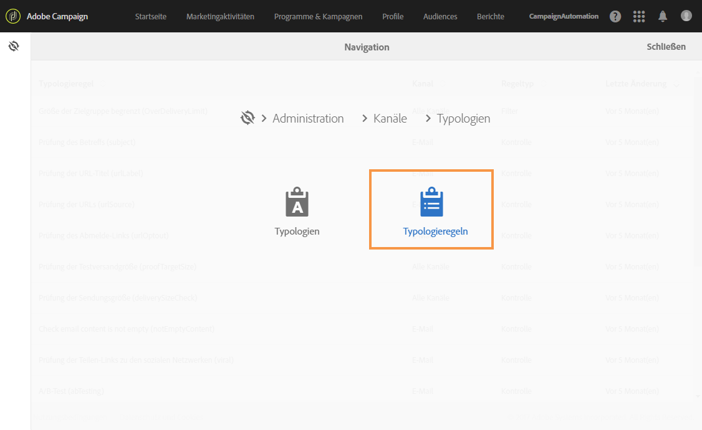

1. From the list of typology rules, click **[!UICONTROL Create]**.

   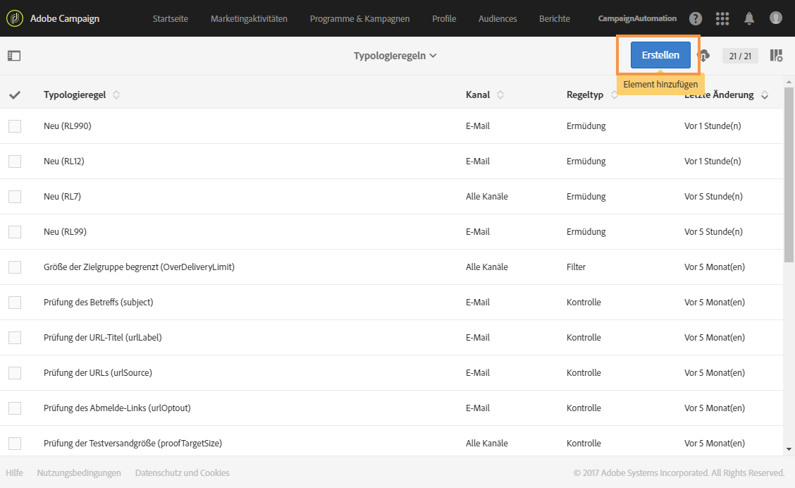

1. Wählen Sie im **[!UICONTROL Rule type]** Feld **[!UICONTROL Fatigue]**.

   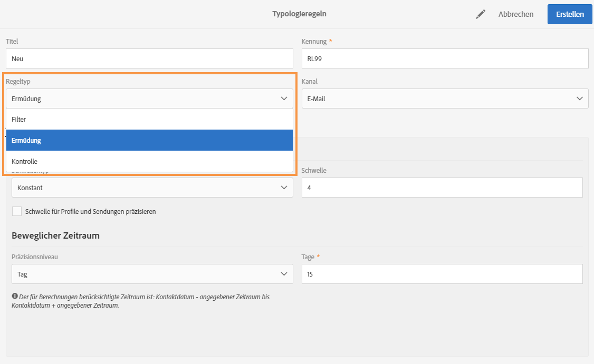

1. In the **[!UICONTROL Channel]** field, select which channel your rule will apply to. You can either select a single channel (email, SMS, direct mail, mobile application) or select **[!UICONTROL All channels]**. Siehe [Kanal auswählen](#choosing-the-channel).

   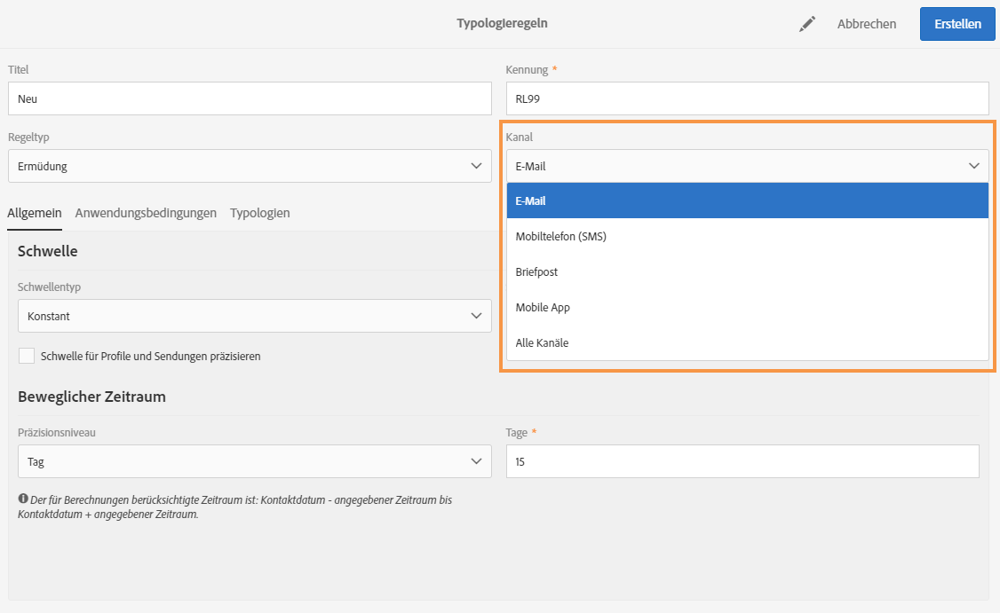

1. In the **[!UICONTROL General]** tab, define the method for calculating the maximum number of messages per profile. Sie können entweder eine konstante oder variable Schwelle auswählen. Sie können auch die Schwelle für Profile und Sendungen präzisieren. Lesen Sie diesbezüglich auch den Abschnitt [Schwelle definieren](#defining-the-threshold).

   

1. Choose a **[!UICONTROL Sliding period]** on which the typology rule will apply. Lesen Sie diesbezüglich auch den Abschnitt [Beweglichen Zeitraum festlegen](#setting-the-sliding-period).

   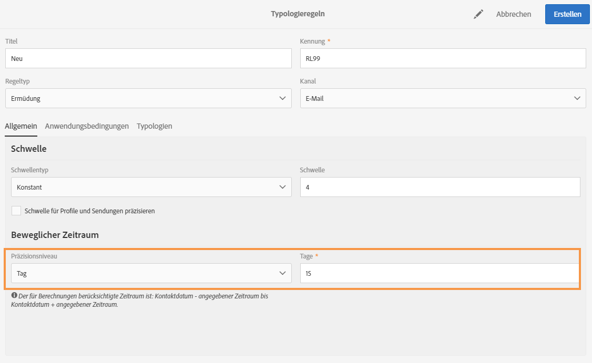

   In diesem Beispiel (siehe vorherige Screenshots) möchten wir eine Höchstzahl von vier Nachrichten in einem beweglichen Zeitraum von 15 Tagen versenden.

1. In the **[!UICONTROL Application criteria]** tab, you can choose to apply this rule to all deliveries or restrict the applicability of the rule according to the message to send. Die Regel wird nur ausgeführt, wenn die Anwendungsbedingung erfüllt ist. Sie können die Regel beispielsweise nur auf Nachrichten anwenden, deren Titel mit einem bestimmten Wort oder einer Kennung beginnt, die bestimmte Buchstaben enthalten. Siehe [Anwendbarkeit einer Filterregel einschränken](../../administration/using/filtering-rules.md#restricting-the-applicability-of-a-filtering-rule).

   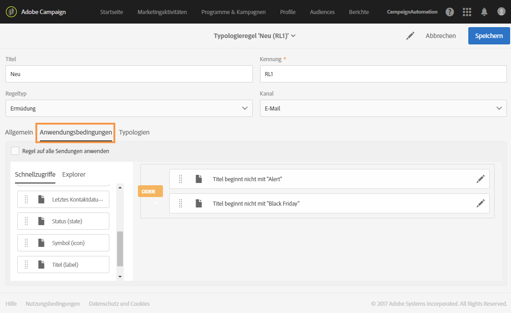

1. Select the **[!UICONTROL Typologies]** tab and link your typology rule to the typology used for your deliveries. Siehe [Typologien verwalten](../../administration/using/about-typology-rules.md#managing-typologies) und [Typologieregeln](../../administration/using/about-typology-rules.md#typology-rules).

   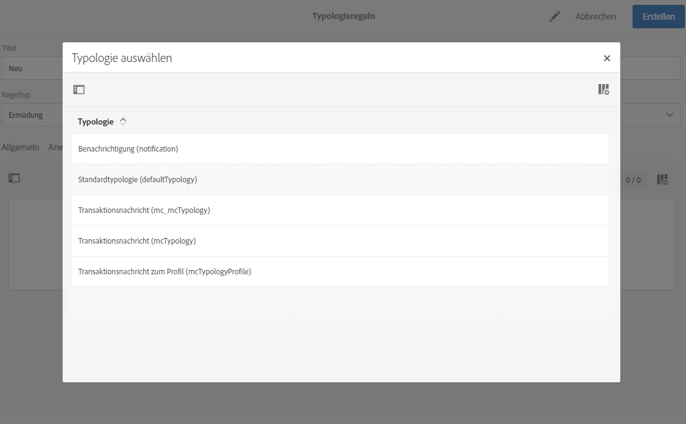

   >[!NOTE]
   >
   >Die Typologie kann auf Ebene der Versandvorlage festgelegt werden, um sie automatisch auf alle mit der jeweiligen Vorlage erstellten Sendungen anzuwenden.

Bei der Versandvorbereitung werden Profile vom Versand ausgeschlossen, wenn sie bereits eine bestimmte Anzahl an Sendungen erhalten haben. Die Ausführungsergebnisse der Ermüdungsregel finden Sie in den Versandlogs. Siehe [Ermüdungsergebnisse ansehen](#viewing-the-fatigue-results).

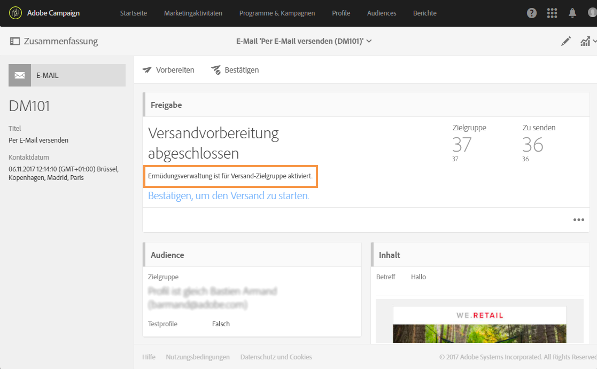

>[!IMPORTANT]
>
>Damit Ermüdungsregeln funktionieren, müssen Sie ein Kontaktdatum für den Versand festlegen. Wenn Sie Nachrichten sofort senden möchten, wird die Ermüdungsregel nicht angewendet.

## Kanal auswählen {#choosing-the-channel}

Ermüdungsregeln sind für mehrere Kanäle verfügbar. The channel is defined in the **[!UICONTROL Channel]** field of the typology rule settings. You can either select a single channel or select **[!UICONTROL All channels]**.

**Verfügbare Kanäle**

Folgende Kanäle stehen zur Verfügung:

* E-Mail
* Mobiltelefon (SMS)
* Briefpost
* Mobile App: Mit diesem Kanal können Sie Push-Benachrichtigungen an Profile oder an App-Abonnenten senden. Wenn Sie Benachrichtigungen an Profile senden, können die Ermüdungsregeln für alle Kanäle verwendet werden.

   >[!IMPORTANT]
   >
   >Ermüdungsregeln sind jedoch nicht kompatibel mit an App-Abonnenten gesendete Push-Benachrichtigungen. Wenn Sie Nachrichten an App-Abonnenten senden, werden die Ermüdungsregeln nicht angewendet.

* Alle Kanäle: Mit dieser Option können Sie die Regel auf alle Kanäle anwenden. Beispielsweise können Sie festlegen, monatlich kanalübergreifend maximal drei Nachrichten zu versenden. Wenn Sie in der Vorwoche zwei E-Mails an ein Profil gesendet haben und diesem Profil heute eine Push-Benachrichtigung senden möchten, wird dieses Profil ausgeschlossen.

**Versandtypen**

Ermüdungsregeln sind mit allen Versandtypen kompatibel: einmalige Sendungen, wiederkehrende Sendungen, Workflow-Sendungen und Transaktionsnachrichten.

**Transaktionsnachrichten** kommen zum Versand von Dienstnachrichten zur Anwendung. In diesem Fall wird die Zielgruppe über Ereignisse (rtEvent) bestimmt. Aber auch der Versand von Marketing-Nachrichten ist möglich, bei denen die Zielgruppe Profile enthält. Dies ist beispielsweise bei Remarketing-Nachrichten der Fall. Ermüdungsregeln sind nur mit Marketing-Nachrichten kompatibel (Zielgruppenbestimmung durch Profile). Ereignis-Transaktionsnachrichten enthalten keine Profilinformationen, weshalb sie nicht mit Ermüdungsregeln kompatibel sind (auch nicht, wenn sie mit Profilen angereichert werden). Durch die Unterstützung von Marketing-Nachrichten durch Transaktionsnachrichten können Sie **auf alle Kanäle eine Ermüdungsregel anwenden, auch auf Marketing-Transaktionsnachrichten**.

## Schwelle definieren {#defining-the-threshold}

In jeder Ermüdungsregel wird eine Schwelle definiert, also eine maximale Nachrichtenanzahl, die in einem gewissen Zeitraum an ein Profil gesendet werden kann. Sobald diese Schwelle erreicht ist, können keine Sendungen mehr durchgeführt werden, bis der Zeitraum abgelaufen ist. Durch dieses Verfahren kann ein Profil aus einem Versand automatisch ausgeschlossen werden, wenn eine Nachricht die festgelegte Schwelle übersteigt. Dadurch wird verhindert, dass ein Profil zu oft angesprochen wird.

Schwellenwerte können konstant oder variabel sein. Das bedeutet, dass unterschiedliche Profile in einem bestimmten Zeitraum unterschiedliche Schwellen aufweisen können oder Schwellen sogar innerhalb desselben Profils variieren können.

**Fixe Schwelle verwenden**

Die Schwelle stellt die maximale Anzahl der Nachrichten dar, die an ein Profil im betreffenden Zeitraum geschickt werden kann.

Die Schwelle ist standardmäßig konstant. Die von der Regel erlaubte maximale Nachrichtenanzahl muss festgelegt werden.

**Variable Schwelle verwenden**

Um einen Variablenschwellenwert zu definieren, wählen Sie den **[!UICONTROL Depends on the recipient]** Wert im **[!UICONTROL Threshold type]** Feld aus.

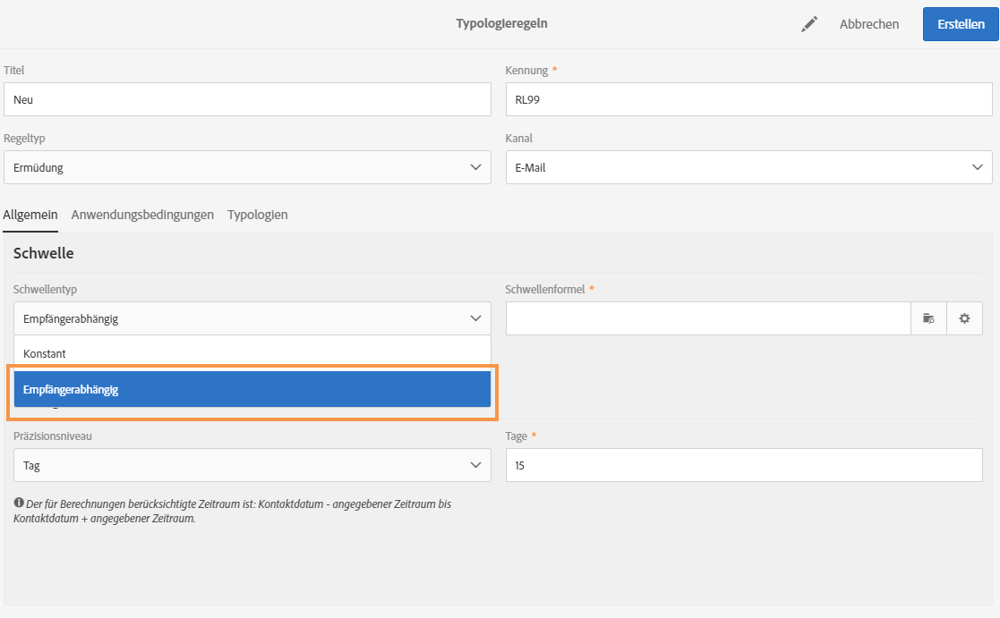

Dann haben Sie zwei Möglichkeiten:

* Wählen Sie ein Profilfeld aus: Die Schwelle ändert sich für jedes Profil entsprechend dem ausgewählten Feld. For example, if you have extended the profiles resource with a &#39;Communication frequency&#39; field, click the button on the right of the **[!UICONTROL Threshold computation formula]** field and select your field. Für jedes Profil übernimmt die Schwelle den im Feld &#39;Kommunikationshäufigkeit‘ angegebenen Wert.

   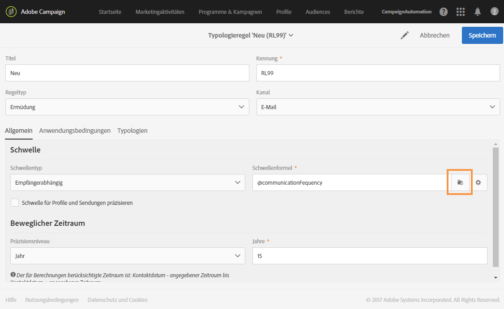

* define a formula: click the second button on the right of the **[!UICONTROL Threshold computation formula]** field to define an advanced threshold calculation formula. Sie können beispielsweise die Anzahl der genehmigten Nachrichten entsprechend dem Segment indexieren, zu dem das Profil gehört. Dies bedeutet, dass ein Profil, das zum Segment &#39;Web&#39; gehört, mehr Nachrichten erhalten kann als andere Profile. An **[!UICONTROL Iif (@origin='Web', 5, 3)]** type formula authorizes the delivery of 5 messages to profiles of the Web segment and 3 for other segments.

   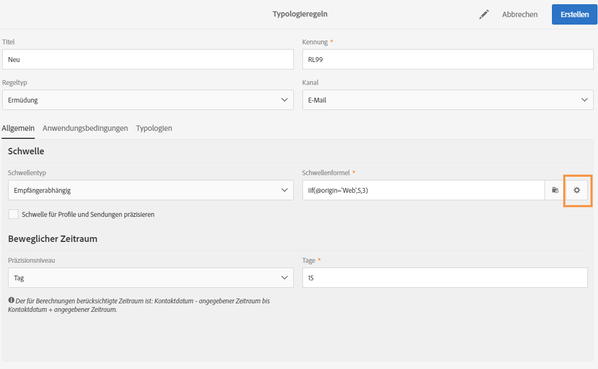

**Schwelle für Profile und Sendungen präzisieren**

Standardmäßig werden bei der Schwellenberechnung alle Nachrichten berücksichtigt. Markieren Sie das **[!UICONTROL Refine Threshold on profiles and deliveries]** Kästchen, um die Profile und Auslieferungen zu filtern, die bei der Vorbereitung der Auslieferung gezählt werden sollen.

Im folgenden Beispiel werden nur männliche Profile und nur Sendungen mit einem Titel gezählt, der mit **Newsletter** beginnt.

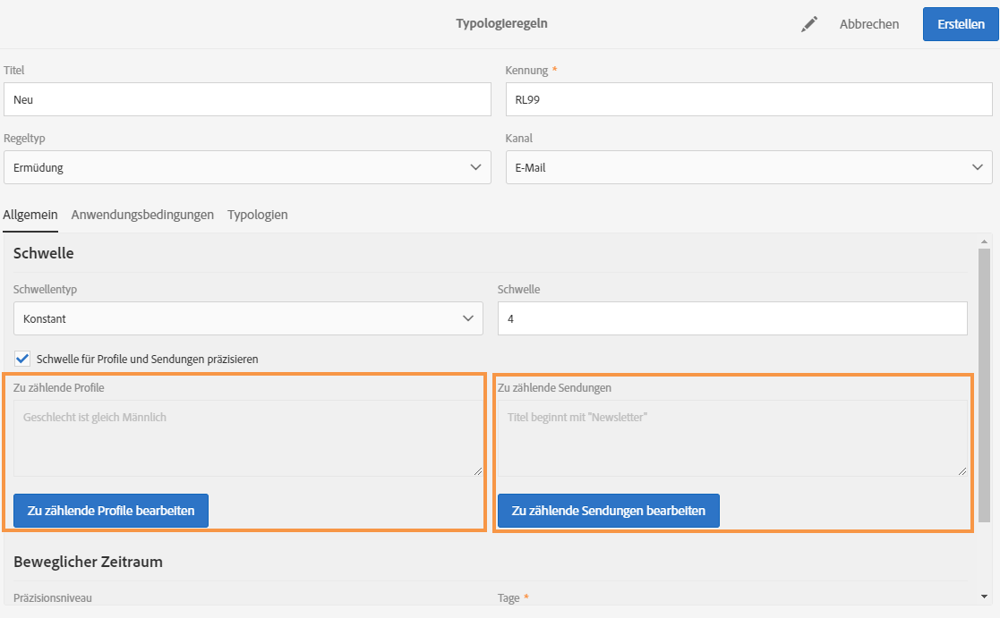

Refining the threshold on deliveries is different than restricting the applicability of the entire rule ( **[!UICONTROL Application criteria]** tab):

* **[!UICONTROL Application criteria]**: Sie wählen die Ausführung der Regel oder nicht nach bestimmten Kriterien. Wenn beispielsweise Ihre Anwendungsbedingung &#39;Titel beginnt mit Newsletter&#39; lautet, wird die Regel nur auf Sendungen angewendet, auf die diese Bedingung zutrifft. Wenn der Titel des Versands mit &#39;Promotion&#39; beginnt, wird die Regel gar nicht ausgeführt.
* **[!UICONTROL Refine threshold on profiles and deliveries > Deliveries to count]**: alle Auslieferungen, die diese Typologieregel verwenden, führen die Regel aus, aber Sie entscheiden unter den früheren und geplanten Auslieferungen, welche Sie zählen möchten. Wenn beispielsweise Ihre Beschränkung ‚Titel beginnt mit Newsletter‘ lautet, wird die Regel ausgeführt, selbst wenn der Versandtitel mit &#39;Promo‘ beginnt. Gezählt wird die Anzahl der Sendungen im ausgewählten beweglichen Zeitraum, deren Titel mit &#39;Newsletter‘ beginnt.

## Beweglichen Zeitraum festlegen {#setting-the-sliding-period}

Die Ermüdungsregeln werden für bewegliche Zeiträume von n Tagen bestimmt. The period is configured in the **[!UICONTROL Sliding period]** section, for example 2 weeks, 7 days or 5 hours.

Bei der Ausführung der Regel werden sowohl vergangene als auch geplante Sendungen berücksichtigt. Damit wird sichergestellt, dass in einem bestimmten beweglichen Zeitraum die Schwelle nie überschritten wird.

Wenn Sie beispielsweise einen Zeitraum von 48 Stunden definieren, werden vom System 48 Stunden **vor dem Kontaktdatum** und 48 Stunden **nach dem Kontaktdatum** berücksichtigt. Der ausgewählte Zeitraum wird demnach verdoppelt, damit sowohl künftige als auch vorhergegangene Sendungen einbezogen werden können.

Um die berücksichtigten Sendungen auf einen Zeitraum von zwei Wochen zu beschränken, geben Sie im Bereich **Beweglicher Zeitraum** die Option **Tag** und **7** oder 1 Woche ein. In dieser Berechnung werden Sendungen berücksichtigt, die bis zu sieben Tage vor dem Verfügbarkeitsdatum und bis zu sieben Tage nach dem in der Regel festgelegten Verfügbarkeitsdatum durchgeführt werden.

## Ermüdungsergebnisse ansehen {#viewing-the-fatigue-results}

Bei der Versandvorbereitung werden Profile vom Versand ausgeschlossen, wenn sie bereits eine bestimmte Anzahl an Sendungen erhalten haben. To view fatigue rule execution results, click the button in the bottom right corner of the **[!UICONTROL Deployment]** block.

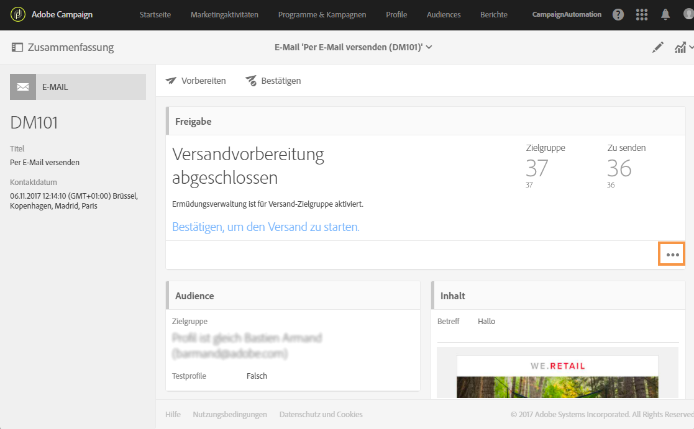

In drei Tabs werden die Durchführungsergebnisse der Ermüdungsregel, einschließlich des Namens der Regel, angezeigt:

* Versandlogs:

   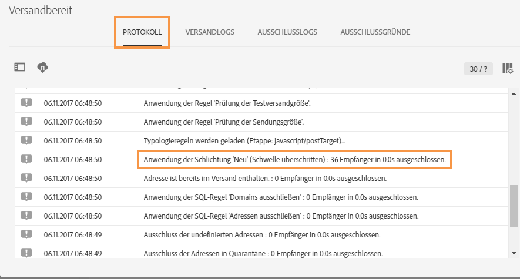

* Ausschlusslogs:

   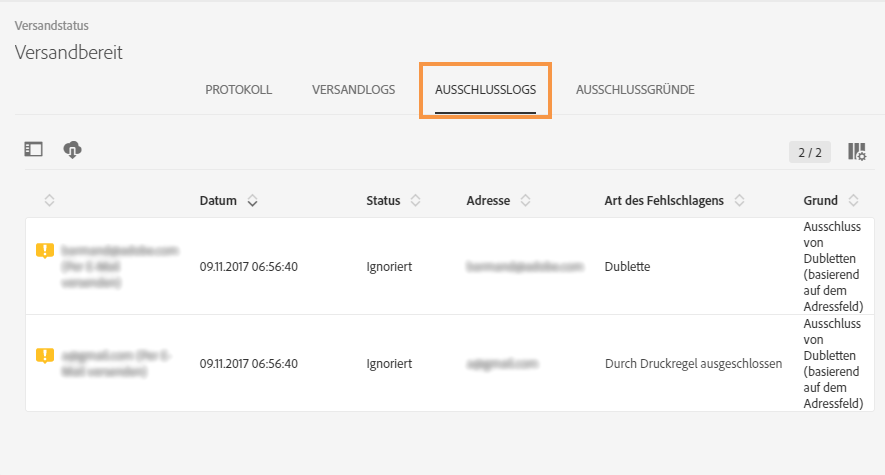

* Ausschlussgründe:

   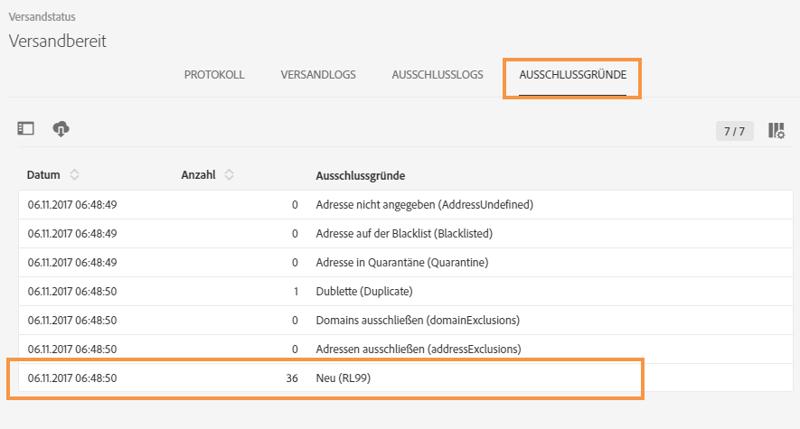

## Bericht mit der Zusammenfassung zu Ermüdungsregeln ansehen {#viewing-the-fatigue-rule-summary-report}

In Adobe Campaign ist ein Bericht zu Ermüdungsregeln verfügbar, dem Sie entnehmen können, wie die Regeln auf Ihre Kampagnen angewendet werden. Dadurch erfahren Sie, wie Ihre Kampagnen einander beeinflussen und welche Anpassungen Sie vornehmen können.

The **[!UICONTROL Fatigue rules summary]** report can be accessed from the **[!UICONTROL Reports]** button, in the top right corner of each program, campaign, and message.

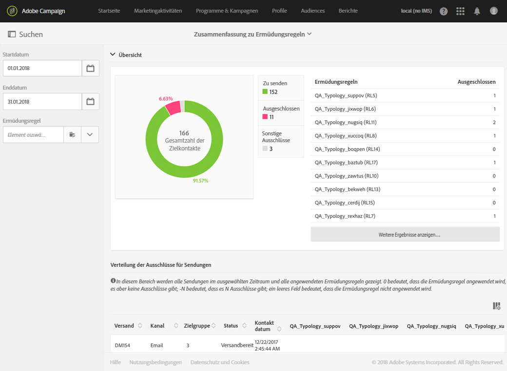

Auf der linken Seite des Bildschirms können Sie die Daten des Berichts nach Kontaktdatum der Sendungen filtern. Standardmäßig beginnt der ausgewählte Zeitraum 15 Tage vor dem aktuellen Datum und endet 15 Tage danach. Sie können auch nach einer bestimmten Ermüdungsregel filtern.

Das Kreisdiagramm bietet für den ausgewählten Zeitraum die folgenden Informationen:

* **[!UICONTROL Total targeted]**: Gesamtziel vor der Nachrichtenvorbereitung
* **[!UICONTROL Excluded]**: die Gesamtzahl der Ausschlüsse aufgrund der Anwendung der Ermüdungsregel
* **[!UICONTROL Other exclusions]**: die Gesamtzahl der Ausnahmen aufgrund anderer Typologieregeln
* **[!UICONTROL To deliver]**: die Gesamtzahl der Meldungen, die nach der Nachrichtenvorbereitung zu übermitteln sind ( **[!UICONTROL To deliver]** = **[!UICONTROL Total targeted]** - **[!UICONTROL Excluded]** - **[!UICONTROL Other exclusions]** )

Rechts neben dem Diagramm finden Sie die Anzahl der Ausschlüsse aufgeschlüsselt nach Ermüdungsregeln.

In der Tabelle am unteren Seitenrand werden alle im ausgewählten Zeitraum durchgeführten Sendungen angezeigt. Für jeden Versand werden die angewendeten Ermüdungsregeln und die entsprechenden Ausschlüsse aufgeführt. Auch Sendungen ohne Kontaktdatum sind in der Tabelle enthalten.

* **[!UICONTROL 0]** bedeutet, dass die Ermüdungsregel angewendet wurde, aber kein Ausschluss erfolgte.
* **[!UICONTROL -N]** bedeutet, dass N Ausschlüsse durchgeführt wurden.
* Ein leeres Feld bedeutet, dass die Ermüdungsregel nicht angewendet wurde.

>[!NOTE]
>
>Die angezeigten Daten beziehen sich kontextuell nicht auf das Programm, die Nachricht oder die Kampagne, von denen auf den Bericht zugegriffen wird. In diesem Bericht werden alle Ermüdungsregeln und Sendungen für alle Organisationseinheiten angezeigt. Dadurch erhalten Sie einen umfassenden Überblick über alle Sendungen und können analysieren, wie Ihre Kampagnen durch andere beeinflusst werden.

## Beispiele {#examples}

Es gibt viele Möglichkeiten zur Verwendung der Ermüdungsfunktion. Hier sind einige Beispiele:

* Erstellen Sie eine Ermüdungsregel mit einer **konstanten Schwelle**, die für **alle Kanäle** gilt:

   Angenommen, Sie erstellen eine Regel für mehrere Kanäle mit einer konstanten Schwelle von 3 über einen beweglichen Zeitraum von 7 Tagen.

   In der vorangegangenen Woche haben Ihre Premium-Profile eine Promotion-E-Mail und eine Transaktions-Remarketing-E-Mail erhalten. Außerdem haben Sie eine SMS geplant, die nächste Woche gesendet wird. Heute möchten Sie eine Push-Benachrichtigung an alle Ihre Profile senden. Die Premium-Profile werden aus der heutigen Push-Benachrichtigung ausgeschlossen, da ihre maximale Nachrichtenanzahl über einen Zeitraum von zwei Wochen bereits erreicht wurde.

   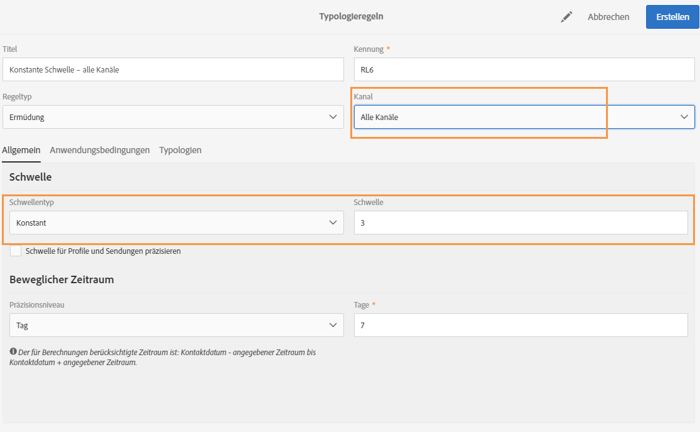

* Erstellen Sie eine Ermüdungsregel mit einer **variablen Schwelle** auf der Basis eines **Profilfelds**:

   Sie haben die Profil-Ressource mit dem Feld &#39;Kommunikationsbeschränkung&#39; erweitert, um für jedes Profil eine andere Schwelle festzulegen. Definieren Sie in Ihrer Ermüdungsregel eine variable Schwelle auf der Basis dieses Feldes und wählen Sie einen beweglichen Zeitraum von zwei Tagen aus. Sehen wir uns als Beispiel zwei Profile an: John hat eine Kommunikationsbeschränkung von 1 und David hat eine Schwelle von 2. Beide haben bereits gestern eine E-Mail mit einem Newsletter erhalten. Sie möchten ihnen heute noch eine E-Mail schicken. Nur David wird eine erhalten, da John von der Zielgruppe ausgeschlossen wurde.

   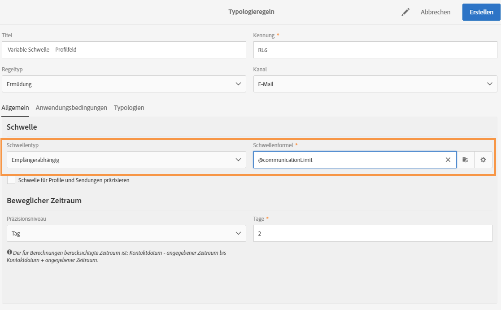

* Erstellen Sie eine Ermüdungsregel mit einer **Schwellenformel**:

   Sie möchten die Schwelle dem Alter Ihrer Profile anpassen. Für Profile unter 40 möchten Sie ein Limit von 4 und für ältere Profile ein Limit von 2 festlegen. Anstatt diese Schwelle für jedes Profil über ein erweitertes Feld festzulegen, können Sie direkt in Ihrer Ermüdungsregel eine Formel erstellen, mit der die Schwelle entsprechend dem Alter Ihrer Profile berechnet wird. In our example, the formula would be **[!UICONTROL Iif (@age<40, 4, 2)]**.

   

   >[!NOTE]
   >
   >Dieser Abschnitt enthält auch ein Beispiel mit einer schrittweisen Anleitung zu einer Ermüdungsregel, in der eine Schwellenformel verwendet wird.

* Erstellen Sie eine Ermüdungsregel zur **Präzisierung der Schwelle** für Profile und Sendungen:

   Sie haben die Profil-Ressource mit dem Feld &#39;Punktzahl&#39; und die Sendungen-Ressource mit dem Feld &#39;Typ&#39; erweitert. Sie möchten eine konstante Schwelle von 3 definieren, doch von der Zählung sollen alle Sendungen des Typs &#39;Warnung&#39; oder &#39;Schwarzer Freitag&#39; sowie alle Profile mit einer Punktzahl größer als 10 ausgeschlossen werden. Wenn die Regel ausgeführt wird, werden innerhalb der vorangegangenen und geplanten Sendungen alle Sendungen gezählt, die nicht vom Typ &#39;Warnung&#39; oder &#39;Schwarzer Freitag&#39; sind und an Profile gesendet werden, deren Punktzahl unter 10 liegt.

   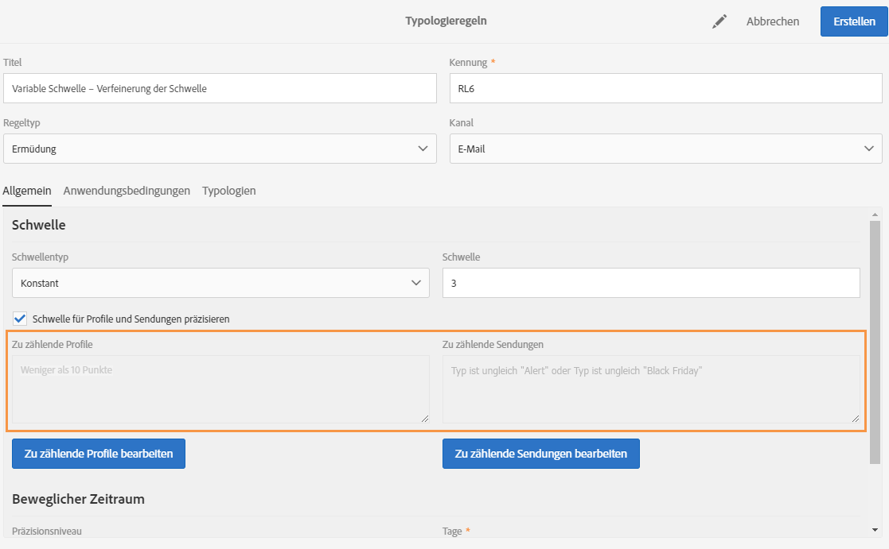

Im Folgenden finden Sie ein Beispiel mit einer schrittweisen Anleitung zur Erstellung einer Ermüdungsregel, in der eine Schwellenformel verwendet wird.

In diesem Anwendungsbeispiel möchten wir eine Typologieregel erstellen, die die Anzahl der wöchentlich gesendeten Nachrichten an Premium-Profile auf 2 und an Standard-Profile ebenfalls auf 2 begrenzt.

Um Kunden und Interessenten zu identifizieren, haben wir die Profil-Ressource mit dem Feld **[!UICONTROL Status]** erweitert, das 0 für Premium-Profile und 1 für Standard-Profile enthält.

Befolgen Sie die nachstehenden Schritte, um die Regel zu konfigurieren:

1. Erstellen Sie eine neue Typologieregel vom Typ **Ermüdung**.
1. In the **[!UICONTROL Threshold]** section, we want to create a formula to calculate the threshold depending on each profile. Wählen Sie den **[!UICONTROL Depends on the recipient]** Wert im **[!UICONTROL Threshold type]** Feld aus und klicken Sie dann auf das Symbol und die zweite Schaltfläche rechts neben dem **[!UICONTROL Threshold computation formula]** Feld.

   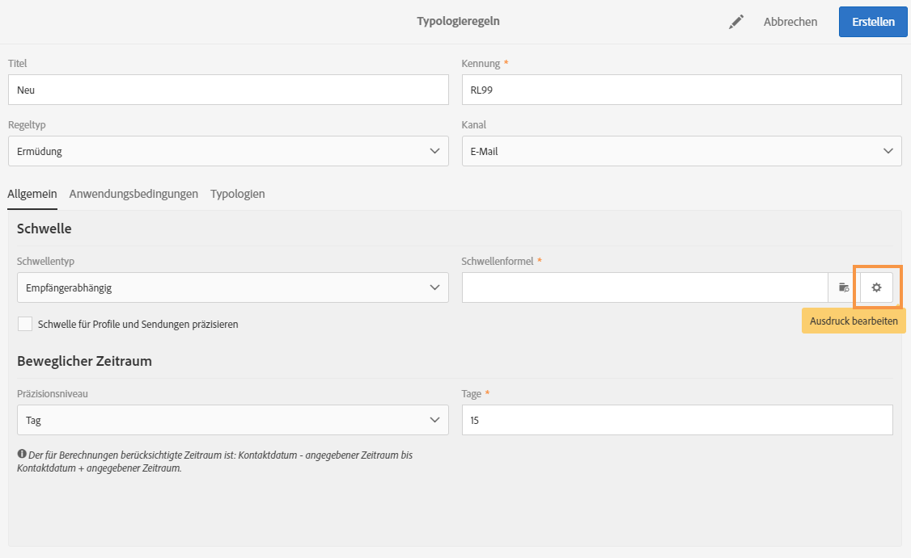

1. Doppelklicken Sie im **[!UICONTROL List of functions]** Abschnitt auf die Funktion **Iif** im **[!UICONTROL Others]** Knoten.

   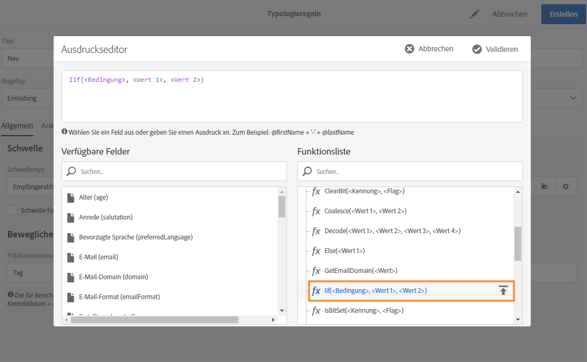

1. Then select the profile&#39;s **Status** in the **[!UICONTROL Available fields]** section.

   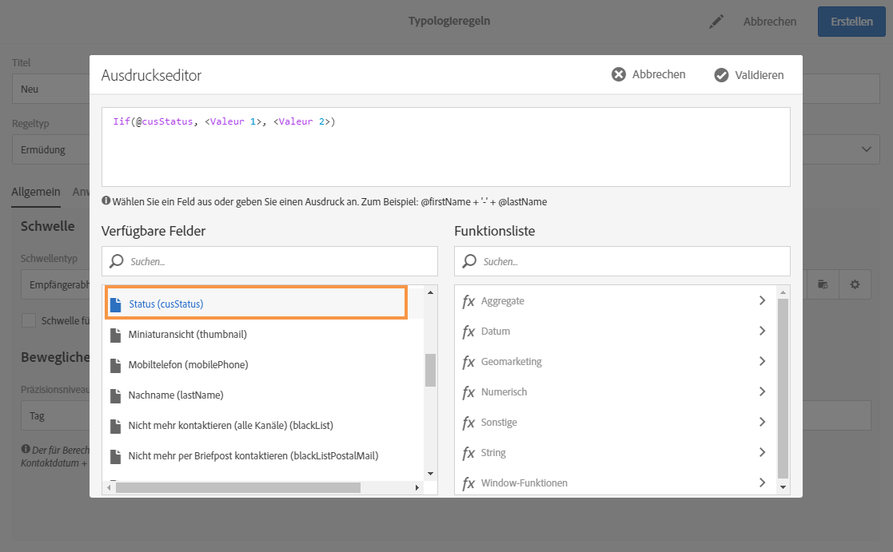

1. Geben Sie die gewünschten Werte für folgende Formel ein: **Iif(@status=0,2,4)**

   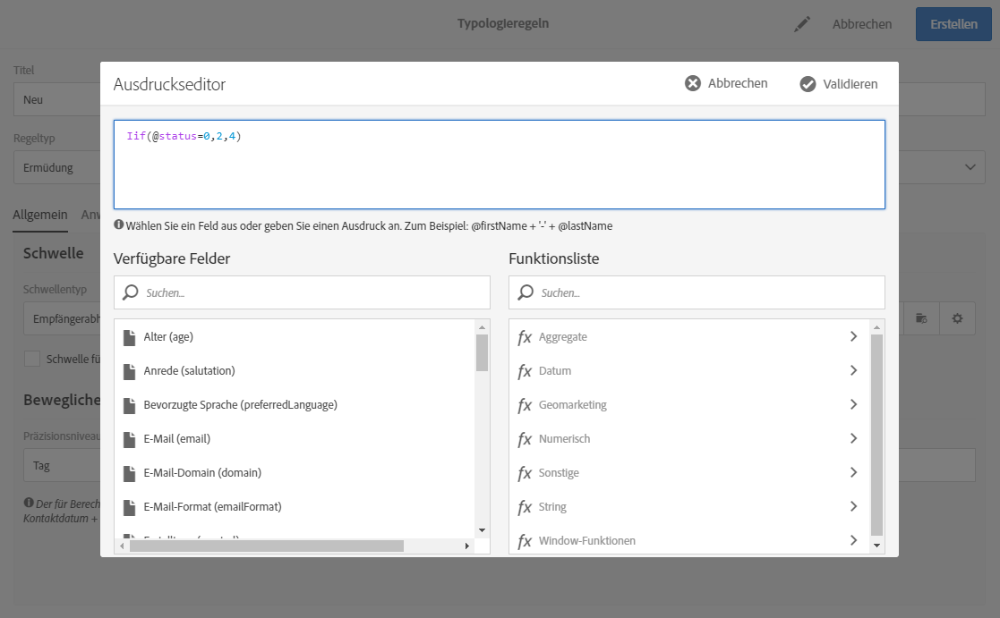

   Diese Formel ordnet einem Status gleich 0 den Wert 2 und jedem anderen Status den Wert 4 zu.

1. Click **[!UICONTROL Confirm]** to approve the formula.
1. Indicate the **[!UICONTROL Sliding period]** on which the rule will apply: 7 days in this case, to restrict the deliveries taken into account to a 2-week period.

   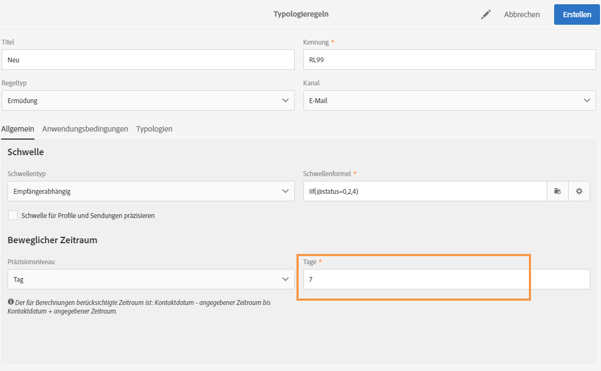

1. Fügen Sie die Regel einer Typologie hinzu, um sie bei Sendungen anwenden zu können. To do this, select the **[!UICONTROL Typologies]** tab, click **[!UICONTROL Create element]** and select the typology used for your deliveries.

   

1. Speichern Sie die Regel, um ihre Erstellung zu bestätigen.

Die Regel wird daraufhin für alle Sendungen auf der Basis der Typologie angewendet.
