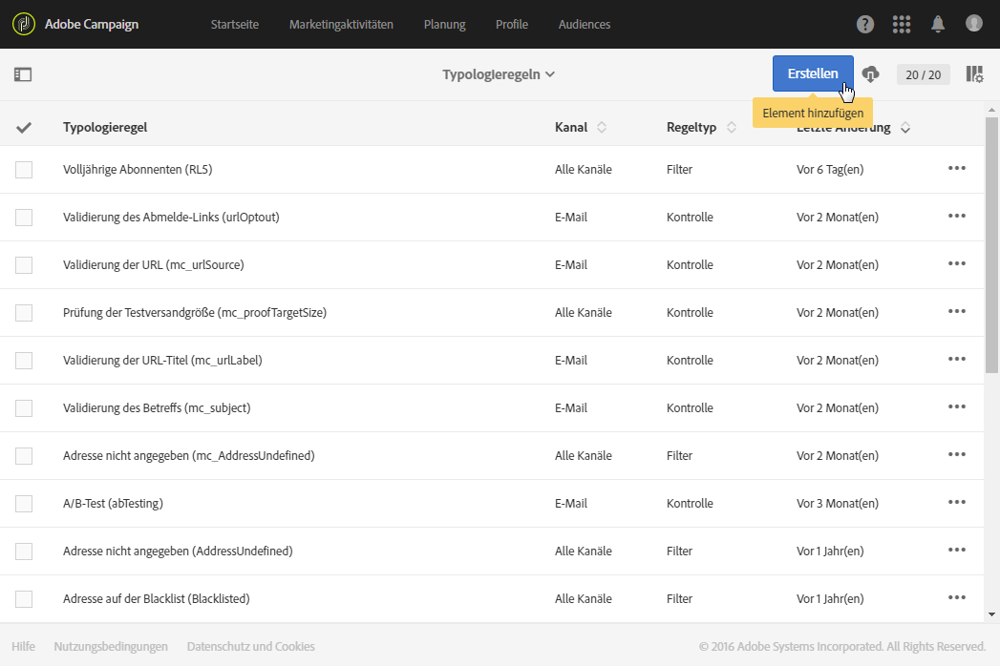
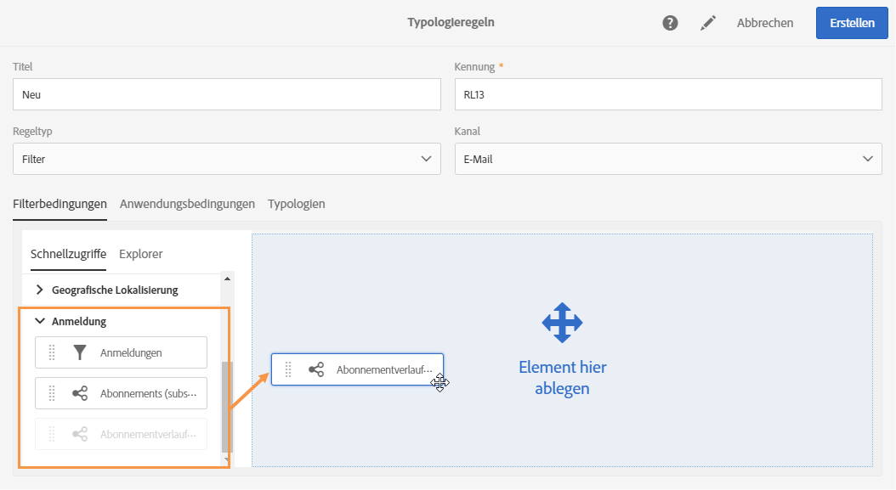
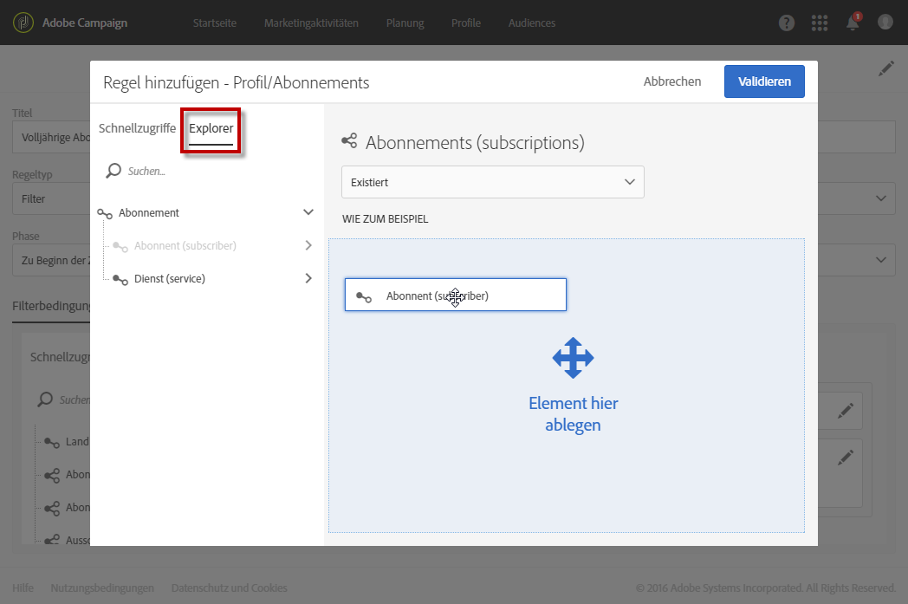
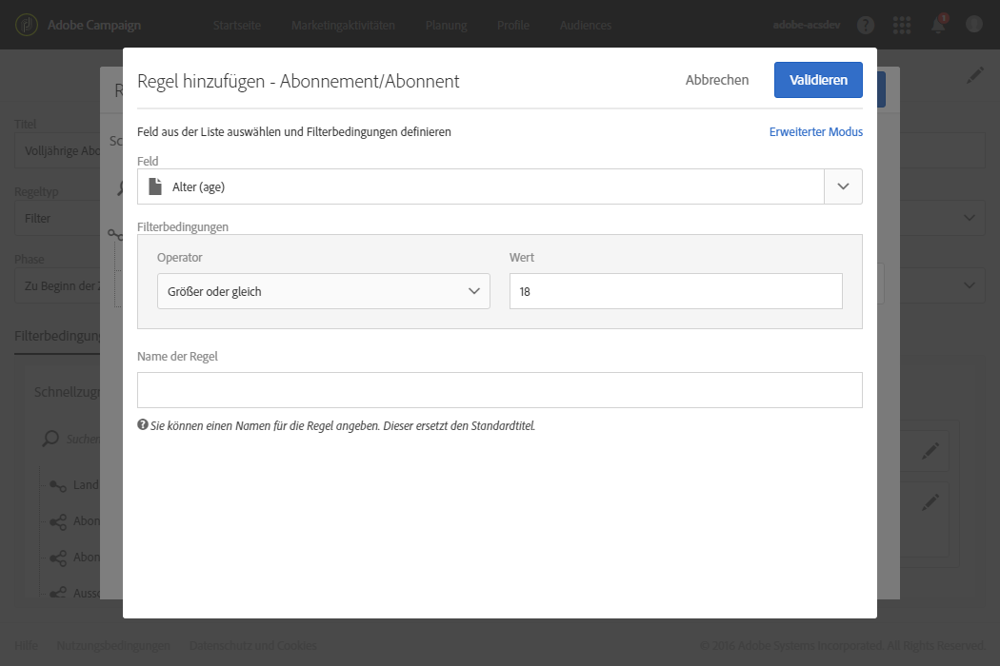
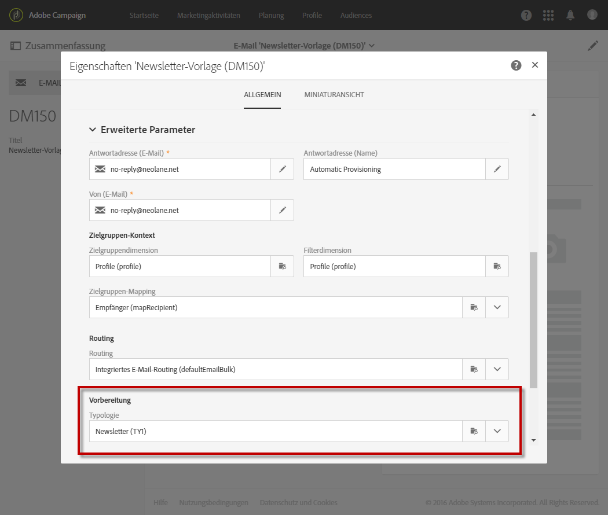
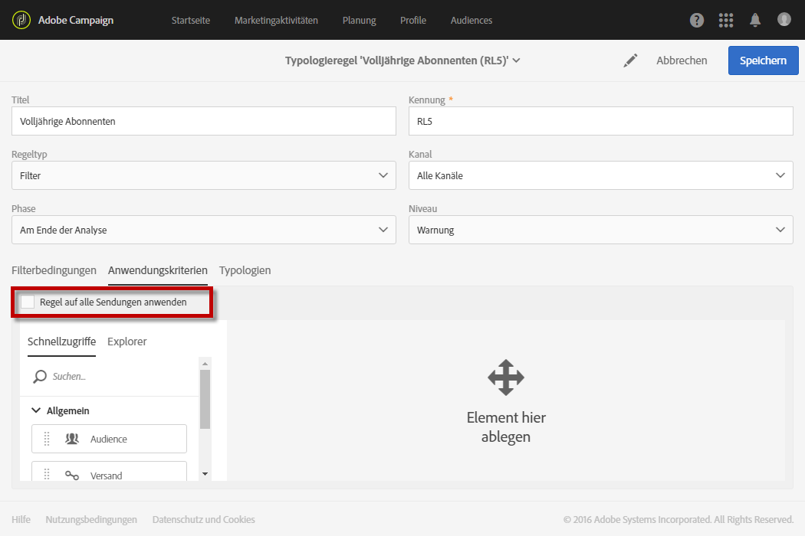

# Filterregeln{#filtering-rules}

Mit Filterregeln können Sie einen Teil der Nachrichten-Zielgruppe anhand von in einer Abfrage definierten Kriterien ausschließen. Mögliche Kriterien sind zum Beispiel Profile in Quarantäne oder Profile, die bereits eine bestimmte Anzahl an E-Mails erhalten haben.

Sie können beispielsweise Newsletter-Anmeldungen so filtern, dass Abonnenten unter 18 Jahren keine Nachricht erhalten.

## Filterregel erstellen  {#creating-a-filtering-rule}

1. Erstellen Sie eine **Filter**-Typologieregel, die auf alle Kommunikationskanäle angewendet werden kann.

   

1. Wählen Sie im Tab **[!UICONTROL Filterbedingungen]** in der Kategorie **[!UICONTROL Anmeldung]** die Abonnements aus.

   

1. Ziehen Sie im **[!UICONTROL Explorer]**-Tab des Abfrageeditors den **[!UICONTROL Abonnent]**-Knoten per Drag-and-Drop in den Arbeitsbereich des Bildschirms.

   

1. Wählen Sie das Feld **[!UICONTROL Alter]** und definieren Sie die Filterbedingungen so, dass das Mindestalter der Abonnenten 18 Jahre beträgt.

   

1. Verknüpfen Sie diese Regel im **[!UICONTROL Typologien]**-Tab mit einer Typologie.

   

1. Stellen Sie sicher, dass die betreffende Typologie in der Versandvorlage ausgewählt ist, die Sie verwenden möchten.

   

   >[!NOTE]
   >
   >Um auf die Versandvorlagen zuzugreifen, verwenden Sie das Adobe Campaign-Logo oben links im Bildschirm und anschließend die Schaltflächen **[!UICONTROL Ressourcen]** &gt; **[!UICONTROL Vorlagen]**.

Wenn diese Regel in einer Nachricht verwendet wird, werden minderjährige Abonnenten automatisch ausgeschlossen.

## Anwendbarkeit einer Filterregel einschränken  {#restricting-the-applicability-of-a-filtering-rule}

Sie können die Anwendbarkeit einer Filterregel je nach zu sendender Nachricht einschränken.

1. Deaktivieren Sie hierfür im Tab **[!UICONTROL Anwendungskriterien]** der Typologieregel die Option **[!UICONTROL Regel auf alle Sendungen anwenden]**, die standardmäßig aktiviert ist.

   

1. Verwenden Sie den Abfrageeditor, um einen Filter zu definieren. Sie können die Regel beispielsweise nur auf Nachrichten anwenden, deren Titel mit einem bestimmten Wort beginnt oder deren Kennung bestimmte Buchstaben enthält.

   

In diesem Fall wird die Regel nur auf die Nachrichten angewendet, die den definierten Kriterien entsprechen.

## Standardmäßige Ausschlussregeln für Zustellbarkeit  {#default-deliverability-exclusion-rules}

Standardmäßig sind zwei Filterregeln verfügbar: **[!UICONTROL Ausschluss der Adressen]** (**[!UICONTROL addressExclusions]**) und **[!UICONTROL Ausschluss der Domains]** (**[!UICONTROL domainExclusions]**). Während der E-Mail-Analyse vergleichen diese Regeln die E-Mail-Adressen der Empfänger mit den unzulässigen Adressen oder Domain-Namen aus einer verschlüsselten globalen Unterdrückungsliste, die in der Zustellbarkeitsinstanz verwaltet wird. Im Falle einer Übereinstimmung wird die Nachricht nicht an den jeweiligen Empfänger gesendet.

Auf diese Weise soll Blacklisting aufgrund von schädlichen Aktivitäten, insbesondere durch die Verwendung von Spamtraps, vermieden werden. Wenn beispielsweise für die Anmeldung über ein Webformular eine Spamtrap verwendet wird, wird automatisch eine Bestätigungs-E-Mail an diese Spamtrap gesendet. Als Folge davon wird Ihre Adresse automatisch auf die Blacklist gesetzt.

>[!NOTE]
>
>Die Adressen und Domain-Namen in der globalen Unterdrückungsliste sind verborgen. In den Versandanalyse-Logs wird nur die Anzahl der ausgeschlossen Empfänger angegeben.

