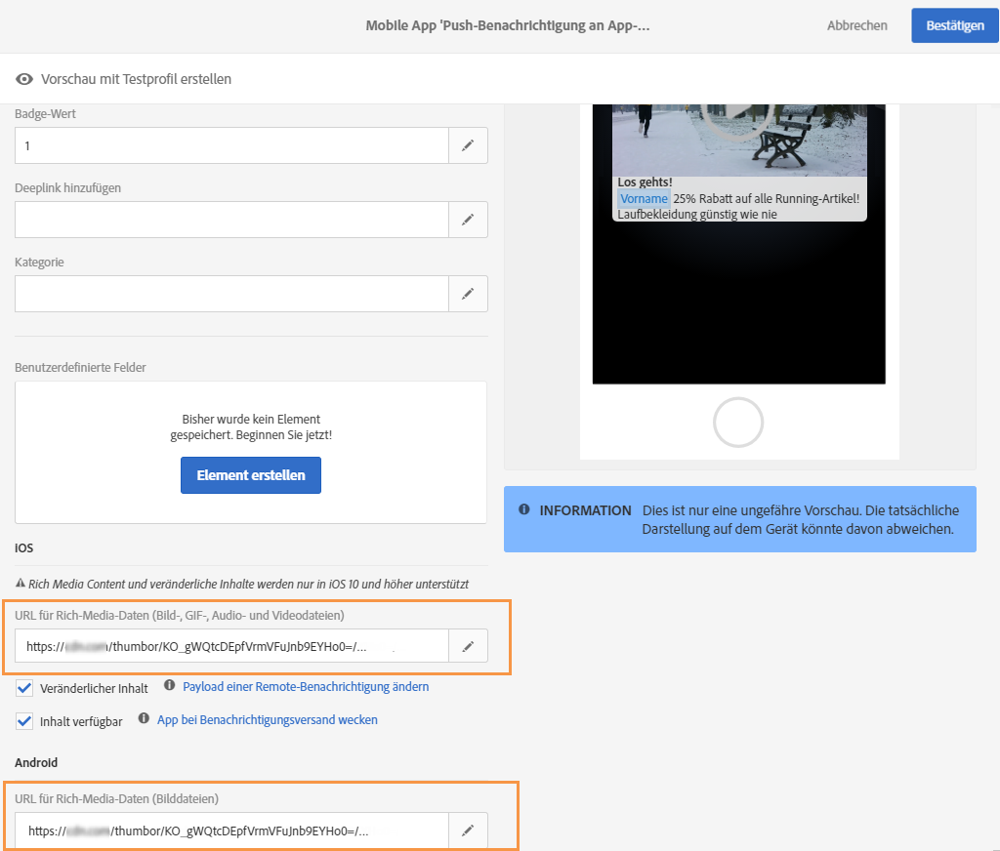

# Bilder und Videos unter iOS hinzufügen {#image-push}

>[!NOTE]
>
>Dieses Dokument gilt nur für iOS-Geräte.

In diesem Dokument erfahren Sie, wie Sie ein Bild aus einer iOS-Push-Benachrichtigung in Adobe Campaign Standard anzeigen.

## Schritt 1: Push-Benachrichtigung einrichten {#set-up-push}

Push-Benachrichtigungen werden von Experience Platform SDKs unterstützt.

Mobile Apps, über die Push-Benachrichtigungen empfangen werden, müssen von einem Administrator in der Adobe-Campaign-Benutzeroberfläche konfiguriert werden.

Durch die Konfiguration von sowohl Adobe Campaign als auch Adobe Mobile Services können Sie die Daten Ihrer Mobile Apps für Ihre Kampagnen verwenden. Weiterführende Informationen hierzu finden Sie auf [dieser Seite](../../administration/using/configuring-a-mobile-application.md).

Um Push-Benachrichtigungen mithilfe einer Experience Cloud SDK-Anwendung zu senden, muss in der Datenerfassungs-UI eine Mobile App eingerichtet und in Adobe Campaign konfiguriert werden. Weiterführende Informationen hierzu finden Sie auf [dieser Seite](../../administration/using/configuring-a-mobile-application.md#channel-specific-config).

## Schritt 2: Push-Benachrichtigung in Adobe Campaign anpassen {#customize-push}

In Adobe Campaign stehen Ihnen zur Anpassung von Push-Benachrichtigungen bei deren Erstellung eine Reihe erweiterter Optionen zur Verfügung.

1. Push-Benachrichtigung erstellen. Weiterführende Informationen hierzu finden Sie auf [dieser Seite](../../channels/using/preparing-and-sending-a-push-notification.md).

1. Rufen Sie auf Ihrer Seite mit den Inhalten für Push-Benachrichtigungen den Abschnitt **[!UICONTROL Erweiterte Optionen]** auf.

1. Geben Sie im Feld **[!UICONTROL URL für Rich-Media-Daten]** die URL Ihrer Datei ein.
Unter iOS 10 oder höher können Sie Bild-, GIF-, Audio- und Videodateien einfügen.

   

1. Erstellen Sie eine Vorschau Ihrer Push-Benachrichtigung und speichern Sie sie.

## Schritt 3: Mobile-App-Code anpassen {#mobile-app-code}

Nachdem Sie Ihre Push-Benachrichtigung in Adobe Campaign angepasst haben, müssen Sie Ihre Mobile App so konfigurieren, dass das Bild auf Geräten angezeigt wird.

>[!NOTE]
>
>Wenn Ihre App in Objective-C geschrieben ist, lesen Sie die folgende [Dokumentation](https://experienceleague.adobe.com/docs/mobile-services/ios/messaging-ios/push-messaging/c-set-up-rich-push-notif-ios.html?lang=de).

Wenn Ihre App in [!DNL Swift] geschrieben ist, führen Sie die folgenden Schritte aus:

1. Öffnen Sie Ihr [!DNL Xcode]-Projekt.

1. Wählen Sie in Ihrem [!DNL Xcode]-Projekt **[!UICONTROL Datei]** > **[!UICONTROL Neu]** > **[!UICONTROL Zielgruppe]** aus.

1. Wählen Sie **[!UICONTROL Erweiterung für Benachrichtigungsdienst]** aus.

   

1. Überprüfen Sie, ob die **NotificationService.swift**-Dateiklasse erstellt wurde.

1. Bearbeiten Sie diese Klasse und ersetzen Sie den Standardinhalt durch Folgendes.
Dadurch kann die App den eingehenden Parameter mit der Bild-URL verarbeiten, analysieren, lokal kopieren und dann über die Push-Benachrichtigung anzeigen.

   ```
   import UserNotifications
   
   class NotificationService: UNNotificationServiceExtension {
   
   var contentHandler: ((UNNotificationContent) -> Void)?
   var bestAttemptContent: UNMutableNotificationContent?
   
   override func didReceive(_ request: UNNotificationRequest, withContentHandler contentHandler: @escaping (UNNotificationContent) -> Void) {
       self.contentHandler = contentHandler
       bestAttemptContent = (request.content.mutableCopy() as? UNMutableNotificationContent)
   
       if let bestAttemptContent = bestAttemptContent {
           var urlString:String? = nil
           if let urlImageString = request.content.userInfo["media-attachment-url"] as? String {
               urlString = urlImageString
           }
   
           if urlString != nil, let fileUrl = URL(string: urlString!) {
               print("fileUrl: \(fileUrl)")
   
               // Download the attachment
               URLSession.shared.downloadTask(with: fileUrl) { (location, response, error) in
                   if let location = location {
                       // Move temporary file to remove .tmp extension
                       if (error == nil) {
                           let tmpDirectory = NSTemporaryDirectory()
                           let tmpFile = "file://".appending(tmpDirectory).appending(fileUrl.lastPathComponent)
                           let tmpUrl = URL(string: tmpFile)!
                           try! FileManager.default.moveItem(at: location, to: tmpUrl)
   
                           // Add the attachment to the notification content
                           if let attachment = try? UNNotificationAttachment(identifier: fileUrl.lastPathComponent, url: tmpUrl) {
                               bestAttemptContent.attachments = [attachment]
                               }
                       }
                       if(error != nil) {
                           print("Failed to download attachment: \(error.debugDescription)")
                       }
                   }
                   // Serve the notification content
                   contentHandler(bestAttemptContent)
               }.resume()
           }
       }
   }
   
   override func serviceExtensionTimeWillExpire() {
       // Called just before the extension will be terminated by the system.
       // Use this as an opportunity to deliver your "best attempt" at modified content, otherwise the original push payload will be used.
       if let contentHandler = contentHandler, let bestAttemptContent = bestAttemptContent {
           contentHandler(bestAttemptContent)
       }
   }
   
   }
   ```

Das Mobilgerät sollte die folgende Payload erhalten, während die Benachrichtigung gesendet wird.

Die Bild-URL ist dem Schlüssel &quot;media-attachment-url&quot; zugeordnet. Dies ist das Schlüssel/Wert-Paar, das Sie aus der Perspektive des Anwendungs-Codes handhaben müssen, um das Bild herunterzuladen und anzuzeigen.

```
userInfo: [AnyHashable("media-attachment-url"): https://pbs.twimg.com/profile_images/876737835314950144/zPTs9b7o.jpg, AnyHashable("_dId"): 1de3ef93, AnyHashable("_mId"): h280a5, AnyHashable("aps"): {
 
    alert =     {
 
        body = "Message Body here";
 
        title = "This a push from Campaign";
 
    };
 
    badge = 1;
 
    "mutable-content" = 1;
 
}]
```

## Schritt 4: Versand der Push-Benachrichtigung testen {#test-send-push}

Sie können jetzt testen, wie Ihre App und der in Schritt 2 erstellte Versand funktionieren. Weiterführende Informationen zum Vorbereiten und Senden Ihrer Push-Benachrichtigung finden Sie auf dieser [Seite](../../channels/using/preparing-and-sending-a-push-notification.md).


