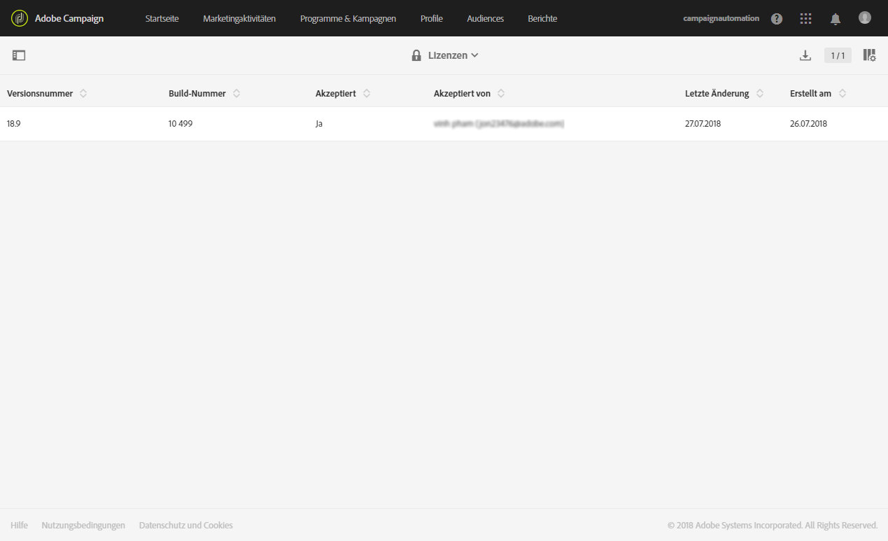
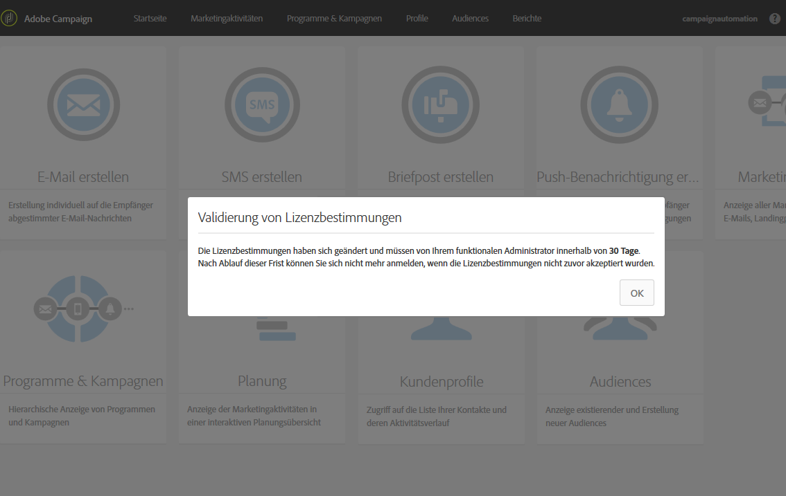
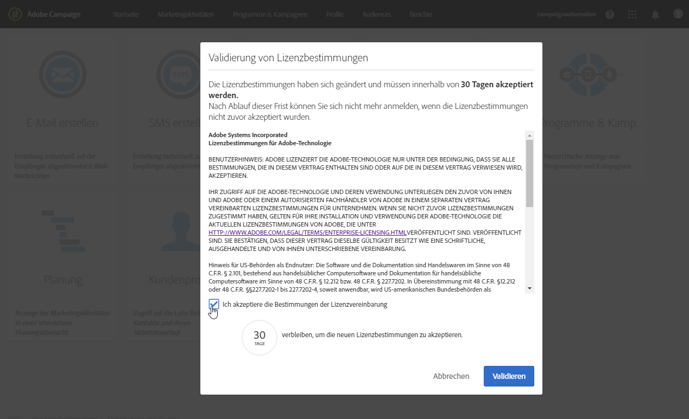
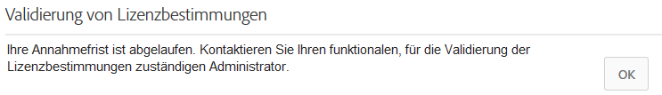

# Lizenzen{#licenses}

Im Fenster **[!UICONTROL Lizenzen]finden Sie die auf Ihrer Instanz installierten Lizenzen sowie entsprechende Details, wie z. B. die Build-Nummer und die Versionsnummer sowie Informationen darüber, ob die Vereinbarung akzeptiert wurde und durch wen.**

Mit der Veröffentlichung eines neuen Builds oder einer neuen Funktion kann sich die Lizenzvereinbarung ändern. Diese muss dann von einem funktionalen Administrator der Instanz akzeptiert werden.

Wenn sich ein Standardbenutzer einloggt, erscheint das folgende Fenster. Vonseiten des Standardbenutzers ist keine Aktion erforderlich. Standardbenutzer können Adobe Campaign weiterhin verwenden, indem sie die Schaltfläche **[!UICONTROL OK]auswählen.**

An administrator has to read and confirm the new terms of agreement in the following 30 days of the build installation by checking **[!UICONTROL I accept the terms from the license agreement]** and clicking **[!UICONTROL Confirm]**.

Wenn die Vereinbarung nicht innerhalb dieser 30 Tage akzeptiert wurde, kann diese Instanz nicht mehr verwendet werden. Die Standardbenutzer sind dann nicht mehr in der Lage, auf die Funktionen von Adobe Campaign zuzugreifen, und sehen nur die folgende Mitteilung, bis ein funktionaler Administrator die Vereinbarung akzeptiert.

