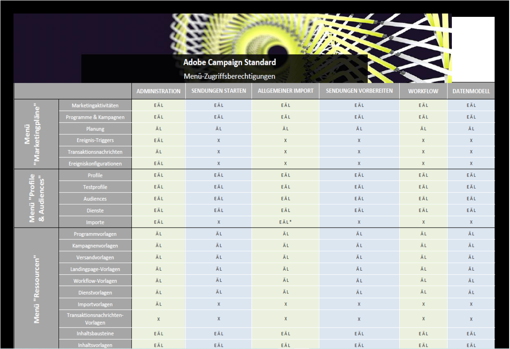

# Liste der Rollen{#list-of-roles}

Adobe Campaign bietet standardmäßig eine Auswahl an Benutzerrollen zur Definition von Einzelberechtigungen für Benutzer und Benutzergruppen.

Gemeinsam mit Organisationseinheiten bieten Rollen Benutzern eine gefilterte Ansicht der Benutzeroberfläche und definieren ihren Zugriff auf die unterschiedlichen Funktionen.

Rollen können über das Menü **[!UICONTROL Administration > Benutzer &amp; Sicherheit > Rollen]** verwaltet werden.

Standardberechtigungen sind:

* **[!UICONTROL Administration]**: Berechtigt zur allgemeinen Administration.

   >[!NOTE]
   >
   >Wenn Sie mit Experience Cloud-Triggern arbeiten müssen, benötigen Sie die **[!UICONTROL Administration]**-Berechtigung, um auf das Menü &quot;Experience Cloud-Trigger&quot;zugreifen zu können. Weitere Informationen zu Experience Cloud-Triggern finden Sie auf dieser [Seite](../../integrating/using/about-adobe-experience-cloud-triggers.md).

* **[!UICONTROL Datamodel]**: Berechtigt zur Durchführung von Veröffentlichungen und zur Erstellung von benutzerdefinierten Ressourcen.
* **[!UICONTROL Allgemeiner Import]**: Berechtigt zum allgemeinen Import von Daten. Dazu muss die Rolle **[!UICONTROL Allgemeiner Import]** mit der **[!UICONTROL Workflow]**-Rolle verknüpft werden.
* **[!UICONTROL Sendungen vorbereiten]**: Berechtigung zum Erstellen, Ändern, Vorbereiten und Löschen von Sendungen. Benutzer mit dieser Rolle können einen Versand vorbereiten, aber nicht durchführen.
* **[!UICONTROL Sendungen starten]**: Berechtigung zum Erstellen, Ändern, Vorbereiten, Senden und Löschen von Sendungen.
* **[!UICONTROL Workflow]**: Berechtigung zum Verwalten der Ausführung von Workflows (Start, Stopp, Pause usw.). Benutzer mit dieser Rolle können auch in einem Workflow keine Sendungen durchführen.

Weitere Informationen dazu finden Sie in der Tabelle [Rollen und Berechtigungen](/help/administration/using/assets/acs_rights.pdf), in der die Funktionen beschrieben werden, die je nach den ausgewählten Berechtigungen auf der Benutzeroberfläche verfügbar sind.

**Verwandte Themen:**

* [Über die Zugriffsverwaltung](../../administration/using/about-access-management.md)
* [Gruppen und Benutzer verwalten](../../administration/using/managing-groups-and-users.md)
