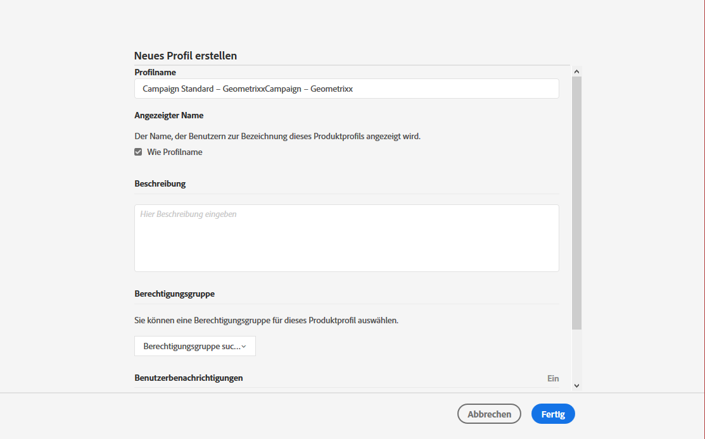

# Gruppen und Benutzer verwalten{#managing-groups-and-users}

## Über Sicherheitsgruppen {#about-security-groups}

Sicherheitsgruppen sind eine Gruppe von Benutzern, die innerhalb Ihres Unternehmens dieselben Rollen und Berechtigungen besitzen.

Benutzer müssen stets einer Sicherheitsgruppe angehören. Dadurch können Sie Benutzern spezifische Rollen und Unternehmenseinheiten zuweisen.

Die für die verschiedenen Benutzerrollen jeweils verfügbaren Aktionen sind in den Tabellen auf der folgenden Seite aufgeführt: [Berechtigungen in Adobe Campaign Standard](https://docs.campaign.adobe.com/doc/standard/en/Technotes/AdobeCampaign-ACSRights.pdf).

Standardmäßige Sicherheitsgruppen sind:

* **[!UICONTROL Administratoren]**
* **[!UICONTROL Versand-Supervisoren]**
* **[!UICONTROL Message Center Agents]**
* **[!UICONTROL Standardbenutzer]**
* **[!UICONTROL Workflow-Supervisoren]**

Ein Benutzer, der keiner Sicherheitsgruppe zugeordnet wurde, hat keinen Zugriff auf Adobe Campaign.

Wenn Sie den Zugriff eines Benutzers beschränken möchten, fügen Sie ihn nicht der Campaign Standard-Benutzergruppe hinzu, da diese der Organisationseinheit **[!UICONTROL Alle]** zugeordnet ist.

>[!NOTE]
>
>Standardmäßig wird die Organisationseinheit **[!UICONTROL Alle (all)]** der Sicherheitsgruppe **[!UICONTROL Administratoren]** zugewiesen. Sie ist schreibgeschützt und kann nicht geändert werden.

## Sicherheitsgruppe erstellen und Benutzer zuordnen {#creating-a-security-group-and-assigning-users}

>[!IMPORTANT]
>
>Bitte beachten Sie, dass in der Admin Console Sicherheitsgruppen Profile genannt werden.

Wenn die vorhandenen Gruppen für Ihre Anforderungen nicht ausreichend sind, können Sie auch eigene Sicherheitsgruppen erstellen. Sicherheitsgruppen können von Administratoren verwaltet werden, die sowohl auf das Menü &quot;Administration&quot; von Adobe Campaign als auch auf die Admin Console zugreifen können. Weitere Informationen zur Admin Console finden Sie in [dieser Dokumentation](https://helpx.adobe.com/de/enterprise/managing/user-guide.html).

Hier müssen wir zunächst die beiden vorhandenen Gruppen &quot;Standardbenutzer&quot; und &quot;Administrator&quot; unseren Benutzern zuweisen. Diese Sicherheitsgruppen schränken manche Funktionen von Adobe Campaign ein: Die Standardbenutzer haben elementaren Zugriff auf Adobe Campaign, während der Administrator beispielsweise auf die Administratormenüs zugreifen kann.

Beachten Sie bitte, dass alle Änderungen, die an Sicherheitsgruppen in der Admin Console vorgenommen werden, synchronisiert werden, sobald sich ein Benutzer in Adobe Campaign anmeldet.

Im Anschluss erstellen wir die Sicherheitsgruppen &quot;Geometrixx&quot; und &quot;Geometrixx Clothes&quot;. Abhängig von den jeweiligen Organisationseinheiten des Standardbenutzers und des Administrators lässt sich dadurch der Zugriff beschränken.

Weisen Sie zunächst eine der vorhandenen Sicherheitsgruppen Ihren Benutzern zu:

1. Wählen Sie in der Admin Console zuerst Ihre Instanz und dann den Tab **Benutzer** aus.

   

1. Wählen Sie die Schaltfläche **[!UICONTROL Benutzer hinzufügen]** aus und geben Sie die E-Mail-Adresse Ihres Benutzers ein.
1. Wählen Sie im Tab **[!UICONTROL Produkte zuweisen]** Ihre Instanz aus und dann in der Dropdown-Liste die vordefinierte Sicherheitsgruppe **[!UICONTROL Administrator]**. Dadurch erhält der Benutzer Zugriff auf die Administrationsmenüs und kann die nächsten Sicherheitsgruppen erstellen.

   

1. Wählen Sie **[!UICONTROL Speichern]** aus und gehen Sie analog vor, um Ihrem neuen Benutzer die vordefinierte Sicherheitsgruppe **[!UICONTROL Standardbenutzer]** zuzuweisen.

   

Sobald Ihre beiden Benutzer mit den vordefinierten **[!UICONTROL Administrator]**- und **[!UICONTROL Standardbenutzer]**-Sicherheitsgruppen verknüpft sind, die unseren Benutzern ihre Rollen zuweisen, kann der Administrator jetzt die beiden Sicherheitsgruppen **Geometrixx** und **Geometrixx Clothes** erstellen. Damit werden unseren Benutzern zusätzlich zu den vordefinierten Sicherheitsgruppen auch Organisationseinheiten zugewiesen.

1. Wählen Sie in der Admin Console zuerst Ihre Instanz und dann den Tab **Produkte** aus.
1. Verwenden Sie die Schaltfläche **Neues Profil**, um die Sicherheitsgruppe **Geometrixx** zu erstellen.

   

1. Geben Sie den **[!UICONTROL Profilnamen]** ein und halten Sie sich dabei genau an die folgende Syntax: **[!UICONTROL Campaign Standard - Name der Instanz - Kennung der Sicherheitsgruppe]**. Wählen Sie dann **[!UICONTROL Fertig]** aus.

   Die ausgewählte Kennung wird dann bei der Erstellung der Sicherheitsgruppe in Adobe Campaign verwendet.

   >[!NOTE]
   >
   >Wenn die oben beschriebene Syntax nicht mit einer älteren Instanz funktioniert, muss sie durch **[!UICONTROL Campaign - Name der Instanz - Kennung der Sicherheitsgruppe]** ersetzt werden.

   

1. Gehen Sie bei der Erstellung der **Geometrixx Clothes**-Sicherheitsgruppe analog vor.
1. Weisen Sie die Sicherheitsgruppe Ihrem Benutzer zu, indem Sie den Tab **[!UICONTROL Benutzer]** auswählen.

   

1. Wählen Sie den zuvor erstellen Benutzer und danach das Symbol  in der Kategorie **[!UICONTROL Produkte]** aus.

   Wählen Sie **[!UICONTROL Zugewiesene Produkte direkt bearbeiten]** aus, um Ihrem Benutzer eine neue Sicherheitsgruppe zuzuweisen.

   

1. Wählen Sie im Tab **[!UICONTROL Produkte zuweisen]** Ihre Instanz und dann in der Dropdown-Liste die zuvor erstellte Sicherheitsgruppe „Geometrixx“ aus, um sie dem Administrator-Benutzer zuzuweisen.

   Wählen Sie **[!UICONTROL Speichern]** aus.

   

   Wenn ein Benutzer mehreren Gruppen angehört,

   * werden die Rollen der unterschiedlichen Gruppen kumuliert. In unserem Beispiel befinden sich die Benutzer in zwei unterschiedlichen Gruppen: eine Gruppe hat Zugriff auf Rollen und die andere auf Einheiten.
   * Dann wird die in der Hierarchie am höchsten angesiedelte Einheit verwendet (siehe Beispiel im Abschnitt [Organisationseinheiten](../../administration/using/organizational-units.md)).
   * Der Benutzer kann sich nicht mehr einloggen, wenn Einheiten dasselbe Niveau aufweisen und sich in Parallelzweigen der Hierarchie befinden.

1. Gehen Sie analog vor, um die Geometrixx-Clothes-Sicherheitsgruppe Ihrem Standardbenutzer zuzuweisen.

   

Jetzt werden die neu erstellten Sicherheitsgruppen in der Admin Console erstellt. Damit diese vollständig synchronisiert werden, müssen sie auch in Adobe Campaign erstellt werden.

Der Administrator-Benutzer muss die Sicherheitsgruppen erstellen, die für die Zuweisung der Organisationseinheiten verwendet werden: Geometrixx und Geometrixx Clothes. Weiterführende Informationen zur Erstellung von Organisationseinheiten finden Sie in [Einheiten erstellen und verwalten](../../administration/using/organizational-units.md#creating-and-managing-units).

1. Der Zugriff auf die Sicherheitsgruppe erfolgt über das **[!UICONTROL Adobe Campaign]**-Logo oben links im Bildschirm. Verwenden Sie dann die Schaltflächen **[!UICONTROL Administration > Benutzer &amp; Sicherheit > Sicherheitsgruppen]**.
1. Erstellen Sie die neue Sicherheitsgruppe und definieren Sie **[!UICONTROL Titel]** und **[!UICONTROL Kennung]**.

   Die Kennung muss mit der in der Admin Console verwendeten identisch sein.

1. Weisen Sie im Feld **[!UICONTROL Benutzerzugriff]** eine Organisationseinheit zu. In unserem Beispiel wird der Geometrixx-Sicherheitsgruppe die Organisationseinheit **[!UICONTROL Alle]** zugewiesen.

   >[!NOTE]
   >
   >Wenn Sie Ihren Benutzern eine vordefinierte Sicherheitsgruppe zuweisen, müssen Sie die organisatorische Einheit zurücksetzen.

   

1. Sie können Ihrer Sicherheitsgruppe auch Rollen zuweisen. In unserem Beispiel ist dieser Schritt nicht nötig, da die vordefinierten Sicherheitsgruppen **[!UICONTROL Administrator]** und **[!UICONTROL Standardbenutzer]** verwendet werden, um Rollen zuzuweisen.
1. Gehen Sie bei der Erstellung der letzten Sicherheitsgruppe &quot;Geometrixx Clothes&quot; analog vor und weisen Sie die Organisationseinheit &quot;Geometrixx Clothes&quot; zu.

   

Ihre Benutzer sind jetzt einer Sicherheitsgruppe zugeordnet und können sich mit Adobe Campaign verbinden.

>[!IMPORTANT]
>
>Wenn Benutzer aus einer Sicherheitsgruppe in der Admin Console entfernt werden, sind sie weiterhin Mitglieder der Adobe Campaign-Sicherheitsgruppe, können sich aber nicht mehr in Adobe Campaign einloggen. Entfernen Sie in diesem Fall die E-Mail-Adressen der Benutzer aus der Admin Console, damit keine sensiblen Informationen an sie gesendet werden können.

