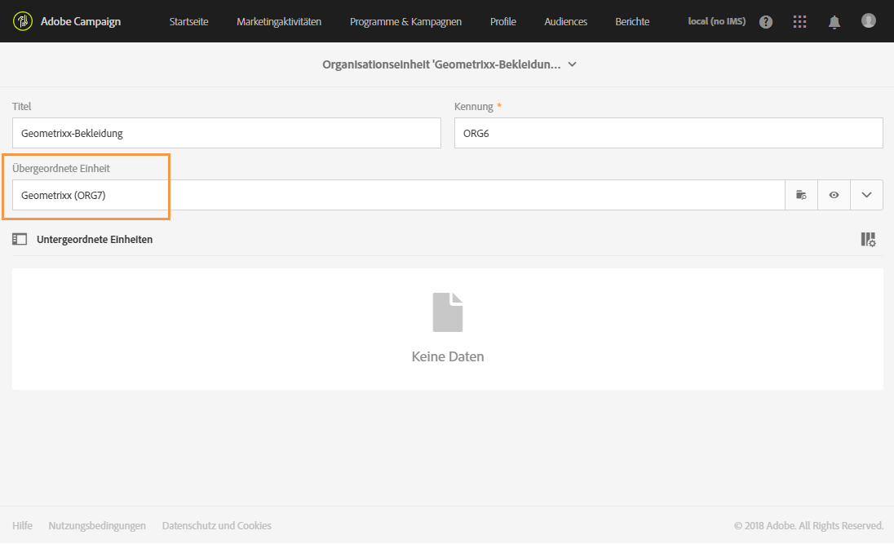

# Organisationseinheiten{#organizational-units}

## Über Einheiten {#about-units}

Alle Objekte und Benutzer der Plattform sind einer Organisationseinheit zugeordnet. Diese Einheit bestimmt auf hierarchische Weise die Ansicht von Benutzern. Die geografische Einheit und die Organisationseinheit, denen ein Benutzer zugeordnet wurde, bestimmen das Zugriffsniveau, über das er für die verschiedenen Plattformobjekte verfügt.

>[!IMPORTANT]
>
>Ein Benutzer, der keiner Einheit zugeordnet wurde, kann keine Verbindung zu Adobe Campaign herstellen. Wenn Sie den Zugriff von Benutzern oder Benutzergruppen einschränken möchten, dürfen sie nicht der Einheit **[!UICONTROL Alle]** zugeordnet werden. Es wird empfohlen, die Option **Zugriffsberechtigungs-Verwaltungsfelder** hinzuzufügen, bevor Sie Profile importieren. Weitere Informationen hierzu finden Sie in [diesem Abschnitt](../../administration/using/organizational-units.md#partitioning-profiles).
>
>Standardmäßig wird die Organisationseinheit **[!UICONTROL Alle (all)]** der Sicherheitsgruppe **[!UICONTROL Administratoren]** zugewiesen. Sie ist schreibgeschützt und kann nicht geändert werden.

Der Zugriff eines Benutzers auf Objekte übergeordneter Einheiten ist schreibgeschützt. Diese Benutzer verfügt über Lese- und Schreibzugriff auf alle Objekte seiner Einheit sowie untergeordneter Einheiten. Benutzer haben keinen Zugriff auf Objekte aus Parallelzweigen.

Standardmäßig sind nur die Einheiten **[!UICONTROL Alle]** verfügbar.

Wenn einem Benutzer eine Organisationseinheit zugewiesen wird, wird diese Einheit stets auf die vom Benutzer erstellten Objekte angewendet.

>[!NOTE]
>
>Wenn ein Benutzer mehreren Gruppen mit verschiedenen zugeordneten Einheiten angehört, gelten bestimmte Regeln. Weiterführende Informationen finden Sie im Abschnitt [Gruppen und Benutzer verwalten](../../administration/using/managing-groups-and-users.md).

## Einheiten erstellen und verwalten        {#creating-and-managing-units}

Mit Organisationseinheiten können Sie Ihre Instanz nach der Organisation filtern, mit der Ihre Benutzer verknüpft sind. Diese Einheit kann eine Region, ein Land oder sogar eine Marke in Ihrer Instanz sein.

Für unser Beispiel haben wir zuvor Sicherheitsgruppen erstellt und dabei zwei Benutzern unterschiedliche Benutzerrollen zugewiesen: Einem Benutzer wurden die Sicherheitsgruppen &quot;Administratoren&quot; und &quot;Geometrixx&quot; zugewiesen und dem anderen Benutzer die Sicherheitsgruppen &quot;Standardbenutzer&quot; und &quot;Geometrixx Clothes&quot;. Das vollständige Beispiel finden Sie unter [Sicherheitsgruppe erstellen und Benutzer zuordnen](../../administration/using/managing-groups-and-users.md#creating-a-security-group-and-assigning-users).

Jetzt müssen wir die Organisationseinheiten für die Sicherheitsgruppen &quot;Geometrixx Clothes&quot; und &quot;Geometrixx&quot; erstellen:

1. Wählen Sie im erweiterten Menü von Adobe Campaign **[!UICONTROL Administration]** > **[!UICONTROL Benutzer &amp; Sicherheit]** > **[!UICONTROL Organisationseinheiten]**.
1. Konfigurieren Sie unter Verwendung der Schaltfläche **[!UICONTROL Erstellen]** Ihre Organisationseinheit.

   

1. Ändern Sie den standardmäßigen **[!UICONTROL Titel]** und die **[!UICONTROL Kennung]** in &quot;Geometrixx&quot;.
1. Verknüpfen Sie dann diese Einheit mit einer übergeordneten Einheit. In unserem Beispiel wählen wir **[!UICONTROL Alle]**.

   

1. Wählen Sie abschließend **[!UICONTROL Erstellen]** aus, um Ihre neue Organisationseinheit einer Sicherheitsgruppe zuzuweisen.
1. Gehen Sie für die Geometrixx-Clothes-Einheit ebenso vor, beachten Sie jedoch, dass die übergeordnete Einheit die zuvor erstellte Geometrixx-Einheit sein muss.

   

Wie sich die Zuweisung unterschiedlicher Einheiten zu unterschiedlichen Sicherheitsgruppen auswirkt, wird ersichtlich, wenn der Benutzer, der der Administrator- und Geometrixx-Gruppe zugewiesen ist, zwei E-Mail-Vorlagen erstellt. Darin kann er feststellen, worauf der andere Benutzer, der den Standardbenutzern und Geometrixx Clothes zugewiesen ist, zugreifen kann und worauf nicht.

1. Wählen Sie im erweiterten Menü **[!UICONTROL Ressourcen]** > **[!UICONTROL Vorlagen]** > **[!UICONTROL Versandvorlagen]** aus.
1. Duplizieren Sie eine vorhandene Vorlage und personalisieren Sie sie nach Bedarf. Weiterführende Informationen finden Sie im Abschnitt [Über Vorlagen](../../start/using/marketing-activity-templates.md).
1. Wählen Sie bei der Erstellung der Vorlage das Symbol **[!UICONTROL Eigenschaften bearbeiten]** aus, um Ihrer Vorlage Einheiten zuzuweisen.

   

1. Wählen Sie im Dropdown-Menü **[!UICONTROL Zugriffsberechtigung]** die Organisationseinheit aus.

   Hier erstellen wir eine Vorlage mit der zuvor generierten Organisationseinheit &quot;Geometrixx&quot;.

   

1. Gehen Sie analog vor, um die zweite Vorlage zu erstellen, die der zuvor generierten Organisationseinheit &quot;Geometrixx Clothes&quot; zugeordnet wurde.

Benutzer, die den Gruppen **Standardbenutzer** und **Geometrixx Clothes** zugewiesen sind, können beide Vorlagen sehen. Wegen der hierarchischen Struktur der Organisationseinheiten besitzen diese Benutzer Lese- und Schreibrechte für die Vorlage, die mit der Einheit &quot;Geometrixx Clothes&quot; verknüpft ist, und nur Leserechte für die Vorlage, die mit der Einheit &quot;Geometrixx&quot; verknüpft ist.

Da die Einheit &quot;Geometrixx Clothes&quot; eine untergeordnete Einheit von &quot;Geometrixx&quot; ist, erscheint die folgende Nachricht, wenn der Benutzer versucht, die Vorlage &quot;Geometrixx&quot; zu ändern:

Mit Organisationseinheiten kann der Zugriff auf verschiedene Funktionen wie etwa Profile eingeschränkt werden. Unser Benutzer &quot;Geometrixx Clothes&quot; könnte beispielsweise auf der Registerkarte **[!UICONTROL Profile]** umfassend auf die Profile in der Organisationseinheit &quot;Geometrixx Clothes&quot; zugreifen und diese verändern.

Im Gegensatz dazu bestehen für die Organisationseinheit &quot;Geometrixx &quot; nur Leserechte und die folgende Fehlermeldung wird angezeigt, wenn unser Benutzer versucht, ein Profil zu ändern: **[!UICONTROL Sie verfügen nicht über die erforderlichen Rechte, um die Ressource &quot;Profil&quot; mit der ID]** zu ändern.

## Profile partitionieren {#partitioning-profiles}

>[!IMPORTANT]
>
>Es wird empfohlen, diese Option vor dem Import von Profilen hinzuzufügen, da Profile ohne Organisationseinheiten von Benutzern nicht aufgerufen werden können.
>
>Falls Sie Ihre Kundendatenbank bereits importiert haben, ist eine Aktualisierung erforderlich, um die Werte für Organisationseinheiten für bereits importierte Profile festzulegen.

Falls Ihre Organisation die Profile isolieren möchte, die von den einzelnen Marken kontaktiert werden, müssen Sie Ihre Profile nach Organisationseinheiten partitionieren.

Die Felder für die Organisationseinheiten sind in Ihren Profilen standardmäßig nicht verfügbar und müssen hinzugefügt werden.

1. Greifen Sie mithilfe des Adobe Campaign-Logos oben links im Bildschirm und der Schaltflächen **Administration > Entwicklung > Benutzerdefinierte Ressourcen** auf das entsprechende Menü zu.
1. Wählen Sie die **Profil**-Ressource aus oder erstellen Sie eine neue benutzerdefinierte Ressource, um die Profile zu erweitern. Weitere Informationen zum Erweitern von Profilen finden Sie auf dieser [Seite](../../developing/using/extending-the-profile-resource-with-a-new-field.md#step-1--extend-the-profile-resource).
1. Aktivieren Sie die Option **Felder für die Zugriffsberechtigungsverwaltung hinzufügen**, um die Organisationseinheiten in der Erweiterung der **Profil**-Ressource hinzuzufügen.

   

1. Wählen Sie **[!UICONTROL Speichern]** aus.
1. Aktualisieren Sie die Struktur durch eine erneute Veröffentlichung. Weitere Informationen zur Veröffentlichung finden Sie im Abschnitt [Datenstruktur aktualisieren](../../developing/using/updating-the-database-structure.md).

Das Feld für Organisationseinheiten wird Ihren Profilen im Bereich **[!UICONTROL Zugriffsberechtigung]** hinzugefügt.

**Verwandte Themen**:

* [Über Einheiten](../../administration/using/organizational-units.md#about-units)
* [Über die Zugriffsverwaltung](../../administration/using/about-access-management.md)
