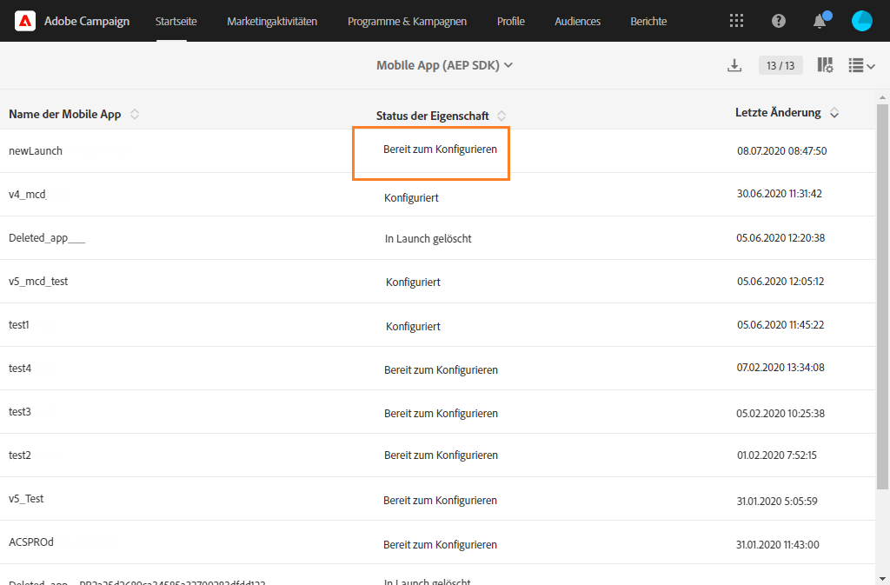
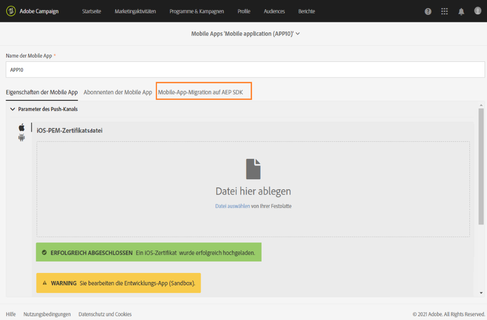
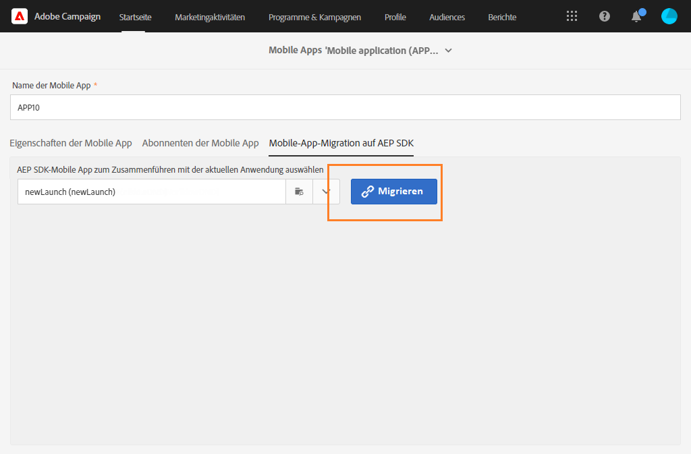
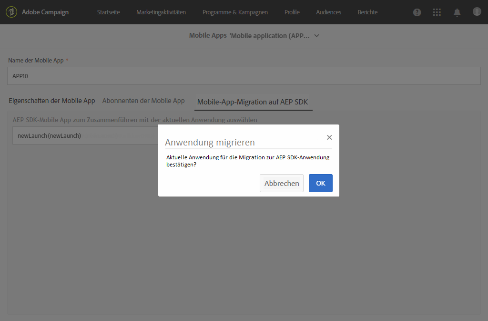
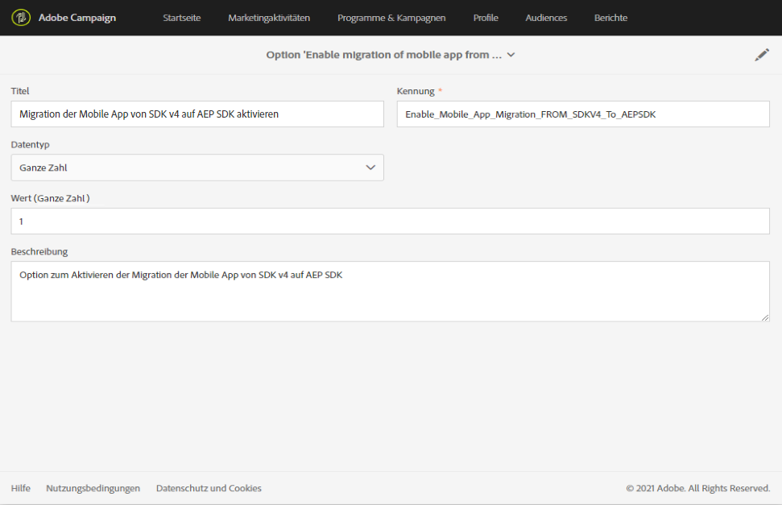
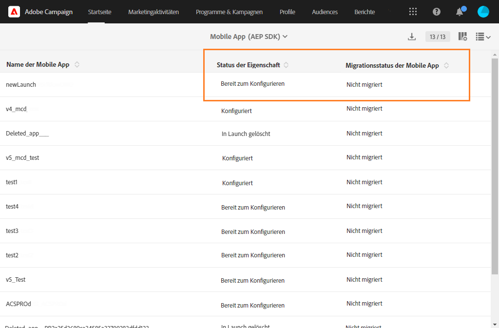

# Migrieren Ihrer Mobile App vom SDK v4 zum Adobe Experience Platform SDK {#sdkv4-migration}

>[!IMPORTANT]
>
> Der Migrationsprozess kann nicht rückgängig gemacht werden.
>
> Bitte lesen Sie sich das Dokument sorgfältig durch, bevor Sie die Migration Ihrer Mobile App vom SDK v4 zum Adobe Experience Platform SDK starten.

## Informationen zur SDK v4-Migration

Adobe Campaign Standard verarbeitet Mobile Apps, die das SDK v4 verwenden, separat von denen, die das Adobe Experience Platform SDK verwenden.
Nach dem Upgrade einer Mobile App von der Adobe SDK-Version v4 auf Adobe Experience Platform muss die Mobile App weiterhin in der Lage sein, die vorhandenen Abonnentendaten und Kampagnen der Anwendung zu nutzen. Daher ist eine Migration erforderlich.

>[!NOTE]
>
> Auf dieser Seite wird die Migration einer auf dem SDK v4 basierenden Mobile App auf eine neu erstellte Mobile App beschrieben, die das Adobe Experience Platform SDK verwendet. Ihre SDK v4-Mobile-Apps werden nicht mit einer Adobe Experience Platform SDK-Mobile-App zusammengeführt, die den **[!UICONTROL Eigenschaftenstatus]** **[!UICONTROL Konfiguriert]** aufweist.

| Was sich nach der Migration nicht ändert |
|:-:|
| Es gibt keine Auswirkungen auf bestehende Sendungen und Kampagnen, die die migrierte SDK V4-Mobile-App verwenden. |
| Der Name der Mobile App wird beibehalten. |
| Die Zugangsdaten für die iOS- und Android-Plattform werden beibehalten. |
| Alle Abonnenten der Mobile App und ihre Daten werden beibehalten. |
| Die bestehende SDK v4-Mobile-App sendet weiterhin Daten (PII-Daten, Abonnenten- und Token-Informationen) an Adobe Campaign Standard. |
| Die **[!UICONTROL Organisationseinheit]** der Mobile App wird beibehalten. |

| Was sich nach der Migration ändert |
|:-:|
| Die Mobile App wird unter **[!UICONTROL Administration]** > **[!UICONTROL Kanäle]** > **[!UICONTROL Mobile App (Adobe Experience Platform SDK)]** verfügbar sein. Vor der Migration war sie unter **[!UICONTROL Administration]** > **[!UICONTROL Kanäle]** > **[!UICONTROL Mobile App (SDK V4)]** verfügbar. |
| Der **[!UICONTROL PII-Abruf-Endpunkt]** der Mobile App ändert sich. Der ältere **[!UICONTROL PII-Abruf-Endpunkt]** funktioniert weiterhin und gesendete Daten gehen nicht verloren. |
| Die Mobile App wird mit einem Tag namens **[!UICONTROL Eigenschaft für Mobilgeräte]** verknüpft. Sie wird als neu erstellte Mobile App verarbeitet. |
| Die ursprüngliche Adobe Experience Platform SDK-Mobile-App, die bei der Migration verwendet wurde, wird nicht als separate Anwendung vorhanden sein. Nur die migrierte SDK v4-Mobile-App wird verfügbar sein. |

## Ihre Mobile App vom SDK v4 zum Adobe Experience Platform SDK migrieren {#how-to-migrate}

Vor der Migration sollten Sie die folgenden Empfehlungen berücksichtigen:

* Der Migrationsprozess kann nicht rückgängig gemacht werden.
* Sie sollten die Migration nicht für mehrere Mobile Apps gleichzeitig durchführen. Sie sollten auch sicherstellen, dass die Migration einer Mobile App nicht von mehreren Fenstern gleichzeitig ausgelöst wird.
* Stellen Sie vor der Migration sicher, dass Ihnen die **[!UICONTROL Organisationseinheit]** der Mobile App, die Sie migrieren möchten, und der Adobe Experience Platform-Mobile-App, die Sie für die Migration verwenden, zugewiesen ist.
* Nach der Migration wird die Mobile App zu einer Adobe Experience Platform SDK-Mobile-App. Die Änderungen werden mit dem entsprechenden Tag **[!UICONTROL Eigenschaft für Mobilgeräte]** verknüpft.

1. Erstellen Sie in der Datenerfassungs-UI eine neue **[!UICONTROL Eigenschaft für Mobilgeräte]**. Weiterführende Informationen dazu finden Sie in der [Dokumentation](https://aep-sdks.gitbook.io/docs/getting-started/create-a-mobile-property#create-a-mobile-property).

1. Wählen Sie in Adobe Campaign Standard im erweiterten Menü **[!UICONTROL Administration]** > **[!UICONTROL Anwendungskonfiguration]** > **[!UICONTROL Workflows]** aus und öffnen Sie den Workflow **[!UICONTROL syncWithLaunch]**. Überprüfen Sie, ob der Workflow ohne Fehler beendet wurde.

1. Überprüfen Sie nach Abschluss des Workflows im Menü **[!UICONTROL Administration]** > **[!UICONTROL Kanäle]** > **[!UICONTROL Mobile App (Adobe Experience Platform SDK)]**, ob die Mobile App in Adobe Campaign Standard verfügbar ist und sich im Status **[!UICONTROL Bereit zum Konfigurieren]** befindet.

   

1. Wählen Sie unter **[!UICONTROL Administration]** > **[!UICONTROL Kanäle]** > **[!UICONTROL Mobile App (SDK V4)]** die SDK v4-Anwendung aus, die Sie migrieren möchten.

1. Wählen Sie den Tab **[!UICONTROL Mobile App-Migration auf AEP SDK]** aus.

   

1. Wählen Sie in der Dropdown-Liste **[!UICONTROL AEP SDK-Mobile-App zum Zusammenführen mit der aktuellen Anwendung auswählen]** die zuvor erstellte Adobe Experience Platform SDK-Mobile-App aus.

1. Klicken Sie auf **[!UICONTROL Migrieren]**.

   

1. Klicken Sie im Fenster **[!UICONTROL Migrationsanwendung]** auf **[!UICONTROL OK]**.

   

1. Das Fenster für den erfolgreichen Abschluss wird angezeigt. Klicken Sie auf **[!UICONTROL Zur Adobe Experience Platform SDK-Kanalliste]**.

1. Vergewissern Sie sich auf der Seite &quot;Liste der Adobe Experience Platform SDK-Kanäle&quot;, dass der Status der vorherigen v4-Mobile-App **[!UICONTROL Bereit zum Konfigurieren]** ist.

1. Wählen Sie Ihre Mobile App aus und klicken Sie auf **[!UICONTROL Speichern]**, um die Migration abzuschließen.

Nach dieser Migration werden in der migrierten Mobile App Abonnenten, die mit der v4-Version der Mobile App erfasst wurden, und neue Abonnenten, die mit der AEP-Version der Mobile App erfasst wurden, verfügbar sein.

Um die beiden verschiedenen Abonnententypen zu unterscheiden, können Sie ein neues benutzerdefiniertes Feld vom Typ **[!UICONTROL Text]** hinzufügen. Erweitern Sie dazu die benutzerdefinierte Ressource **[!UICONTROL App-Abonnements (appSubscriptionRcp)]** beispielsweise als `sdkversion` oder `appVersion`. Weitere Informationen zum Erweitern einer benutzerdefinierten Ressource finden Sie auf dieser [Seite](../../developing/using/creating-or-extending-the-resource.md).
Anschließend müssen Sie das zugehörige Tag **[!UICONTROL Eigenschaft für Mobilgeräte]** so konfigurieren, dass dieser benutzerdefinierte Feldwert im Aufruf &quot;PII-Abruf&quot; gesendet wird, und die Konfiguration Ihrer Mobile App entsprechend ändern.

## Häufig gestellte Fragen {#faq}

### F: In der SDK v4-Mobile-App ist der Tab &quot;SDK v4-App-Migration auf Adobe Experience Platform SDK&quot; nicht sichtbar. {#tab-not-visible}

A: Überprüfen Sie im erweiterten Menü **[!UICONTROL Administration]** > **[!UICONTROL Anwendungskonfiguration]** > **[!UICONTROL Optionen]** den Wert der Option **[!UICONTROL App-Migration von SDK v4 auf Adobe Experience Platform SDK aktivieren]**. Er sollte auf 1 gesetzt und standardmäßig aktiviert sein. Möglicherweise hat der Administrator diese Option manuell deaktiviert.

### F: Im Tab &quot;App-Migration auf Adobe Experience Platform SDK&quot; wird die Meldung &quot;Keine Daten&quot; angezeigt. {#no-data}

A: In der Liste werden nur geeignete Anwendungen Ihrer **[!UICONTROL Organisationseinheit]** angezeigt. Bitte stellen Sie sicher, dass Sie die richtige Adobe Experience Platform-Anwendung für die Migration haben. Der **[!UICONTROL Status der Eigenschaften]** Ihrer Adobe Experience Platform-Anwendung sollte auf **[!UICONTROL Bereit zum Konfigurieren]** und der **[!UICONTROL Migrationsstatus der Mobile App]** auf **[!UICONTROL Nicht migriert]** eingestellt sein.

### F: Warum kann die Adobe Experience Platform SDK-Mobile-App mit dem Eigenschaftenstatus &quot;Konfiguriert&quot; nicht für die Migration verwendet werden? {#property-status}

A: Beim Migrationsprozess werden die SDK v4-Abonnenten und -Attribute beibehalten. Von der Adobe Experience Platform SDK-Mobile-App werden nur die Tag-bezogenen Informationen gespeichert. Abonnenten und andere Daten der Adobe Experience Platform SDK-Mobile-App gehen verloren. Um Datenverluste zu vermeiden, können nur Adobe Experience Platform SDK-Mobile-Apps mit dem **[!UICONTROL Eigenschaftenstatus]** **[!UICONTROL Bereit zum Konfigurieren]** migriert werden.

### F: Wo finde ich nach der Migration meine vorherige SDK v4-Mobile-App? {#v4-app-not-visible}

A: Die Mobile App wird nach der Migration im erweiterten Menü **[!UICONTROL Administration]** > **[!UICONTROL Kanäle]** > **[!UICONTROL Mobile App (Adobe Experience Platform SDK)]** angezeigt.

### F: Wo finde ich nach der Migration meine neu erstellte Adobe Experience Platform SDK-Mobile-App? {#aep-not-visible}

A: Die neu erstellte Adobe Experience Platform SDK-Mobile-App, die bei der Migration verwendet wurde, wird nicht als separate Anwendung existieren. Nur die migrierte SDK v4-Mobile-App wird verfügbar sein.

### F: Angenommen, die Organisationseinheit der SDK v4-Mobile-App ist auf &quot;A&quot; (ein untergeordnetes Element der Organisationseinheit &quot;ALL&quot;) und das Adobe Experience Platform SDK ist auf &quot;ALL&quot; eingestellt. Wie kann ich meine Mobile App migrieren? {#v4-org-unit}

A: Administratoren der **[!UICONTROL Organisationseinheit]** &quot;ALL&quot; sind berechtigt, beide Mobile Apps zu verwalten, und sind für die Migration zuständig.

### F: Angenommen, die Organisationseinheit der SDK v4-Mobile-App ist auf &quot;A&quot; und die Adobe Experience Platform SDK-Mobile-App ist auf &quot;B&quot; (eine mit Organisationseinheit &quot;A&quot; verbundene Einheit) festgelegt. Wie kann ich meine Mobile App migrieren? {#aep-org-unit}

A: Die Adobe Experience Platform SDK-Mobile-App, die das Asset einer verbundenen **[!UICONTROL Organisationseinheit]** ist, ist für Benutzer der **[!UICONTROL Organisationseinheit]** &quot;A&quot; nicht sichtbar. Die Mobile App steht den Administratoren von **[!UICONTROL Organisationseinheit]** &quot;ALL&quot; zur Verfügung. Wir empfehlen diesen Administratoren jedoch nicht, die Mobile App zu migrieren.
In diesem Fall sollten Sie Ihre Mobile Apps in dieselbe **[!UICONTROL Organisationseinheit]** oder in eine **[!UICONTROL Organisationseinheit]** mit einer übergeordneten Verknüpfung verschieben.
Weitere Informationen zur **[!UICONTROL Organisationseinheit]** finden Sie in diesem [Abschnitt](../../administration/using/organizational-units.md).

### F: Auf der Seite der Adobe Experience Platform SDK-Mobile-App (migriert von der v4-Mobile-App) werden unter der Dropdown-Liste &quot;Parameter des Push-Kanals&quot; keine Informationen wie etwa das hochgeladene Datum oder der hochgeladene Name für den Android-Schlüssel oder das iOS-Zertifikat angezeigt {#no-information-v5}

A: Das System speichert diese Informationen nicht, wenn die SDK v4-Mobile-App erstellt wird. Wenn Sie Ihre SDK v4-Mobile-App zu einer Adobe Experience Platform SDK-Mobile-App migrieren, enthält Ihre migrierte Mobile App ebenfalls keine derartigen Informationen. Sobald ein Benutzer ein neues iOS-Zertifikat oder einen Android-Schlüssel hochlädt, werden die Details des Schlüssels oder Zertifikats in der Dropdown-Liste **[!UICONTROL Parameter des Push-Kanals]** korrekt gespeichert und angezeigt.
