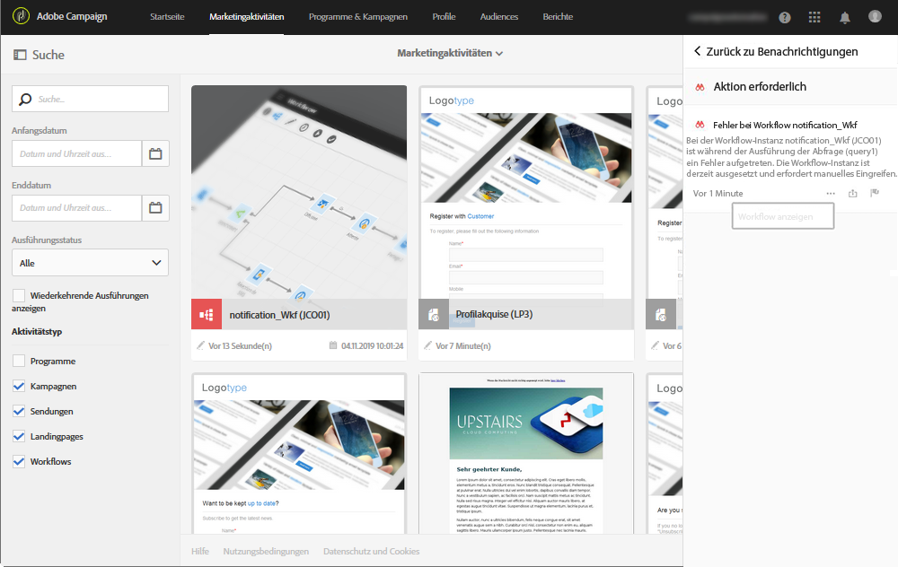
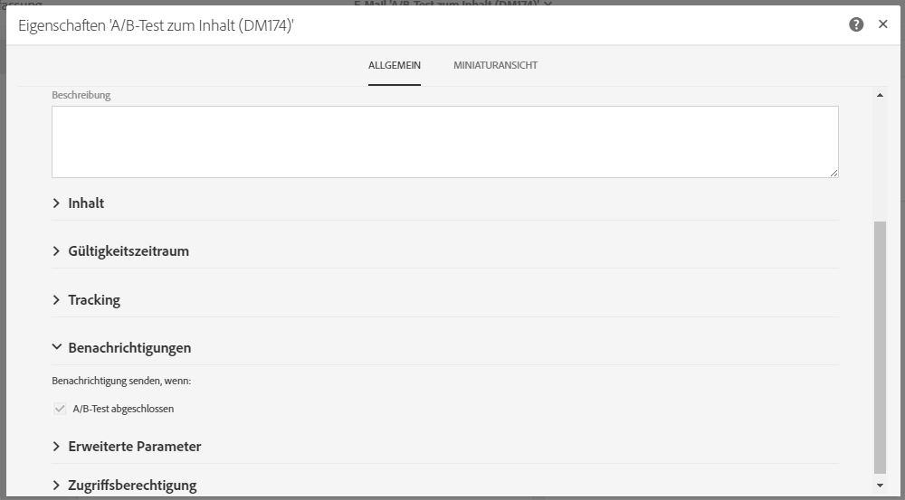
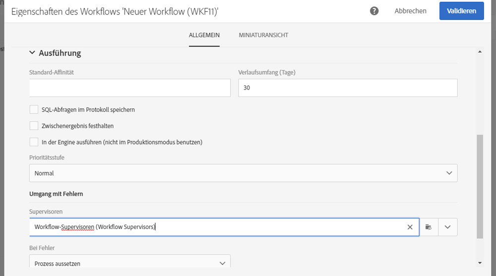

# Interne Benachrichtigungen senden{#sending-internal-notifications}

Adobe Campaign ermöglicht es Ihnen, Benachrichtigungen zu wichtigen Systemaktivitäten direkt in der Anwendung zu empfangen. Echtzeit-Benachrichtigungen informieren die jeweiligen Interessengruppen und ermöglichen es Benutzern, unverzüglich und direkt auf Aktivitätsbenachrichtigungen innerhalb der Anwendung zu reagieren. Teams profitieren dadurch von verbesserter Agilität und Effizienz sowie von einer reibungslosen Ausführung der Kampagnen.

Für die folgenden Objekte können Benachrichtigungen konfiguriert werden:

* **[!UICONTROL A/B-Test-E-Mails]**: Verfasser und Bearbeiter einer E-Mail werden benachrichtigt, dass eine Variante ausgewählt wurde (automatischer Modus) oder dass eine Variante ausgewählt werden muss (manueller Modus). Durch Anklicken der Benachrichtigung wird die entsprechende E-Mail angezeigt. Die Benachrichtigungsfunktion ist in der vordefinierten A/B-Test-Vorlage standardmäßig aktiviert. Um sie zu deaktivieren, bearbeiten Sie die Eigenschaften der E-Mail oder der E-Mail-Vorlage und deaktivieren Sie die Option unter **Allgemein > Benachrichtigungen**. Weiterführende Informationen zu A/B-Test-E-Mails finden Sie in Abschnitt [A/B-Tests erstellen](../../channels/using/designing-an-a-b-test-email.md). Lesen Sie zu E-Mail-Eigenschaften auch den Abschnitt [Liste der E-Mail-Eigenschaften](../../administration/using/configuring-email-channel.md#list-of-email-properties).

   

* **[!UICONTROL Workflows]**: Jedes Mitglied der ausgewählten Sicherheitsgruppe wird benachrichtigt (E-Mail- und In-App-Benachrichtigung), wenn ein Workflow fehlerhaft ist. Durch Anklicken der Benachrichtigung oder des E-Mail-Links wird der entsprechende Workflow angezeigt. Die Benachrichtigungsfunktion ist standardmäßig in der vordefinierten Workflow-Vorlage deaktiviert. Um sie zu aktivieren, bearbeiten Sie die Eigenschaften des Workflows oder der Workflow-Vorlage und fügen Sie eine Sicherheitsgruppe über **Allgemein > Ausführung > Umgang mit Fehlern > Supervisoren** hinzu. Weiterführende Informationen zu Sicherheitsgruppen finden Sie unter [Gruppen und Benutzer verwalten](../../administration/using/managing-groups-and-users.md). Weiterführende Informationen zu Workflow-Eigenschaften finden Sie auch in Abschnitt [Eigenschaften des Workflows](../../automating/using/managing-execution-options.md).

   
