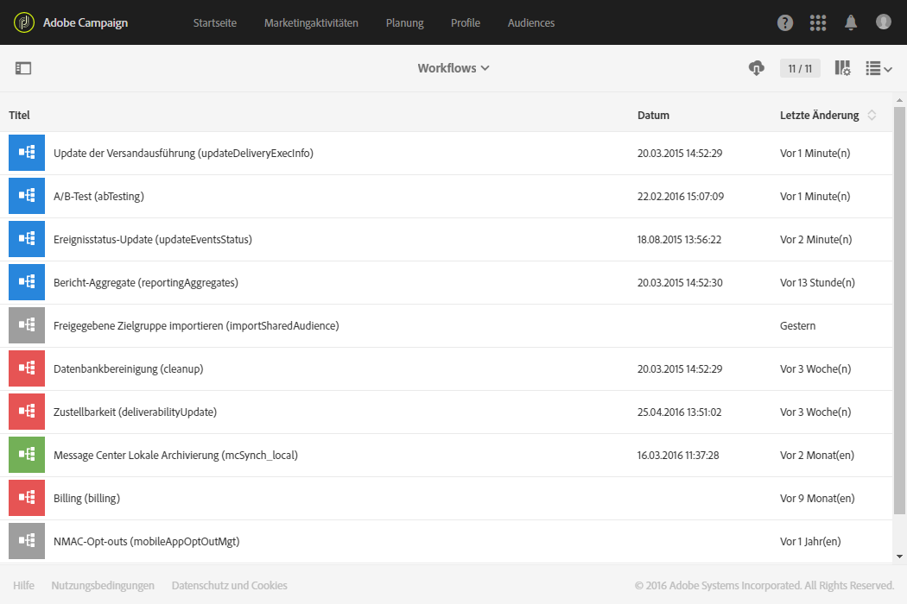

# Technische Workflows{#technical-workflows}

Die technischen Workflows sind standardmäßig in Adobe Campaign enthalten. Technische Workflows dienen der programmierten periodischen Ausführung von Server-Vorgängen.

Hierbei kann es sich beispielsweise um die Wartung der Datenbank, den Abruf von Trackinginformationen oder die Einrichtung von geplanten Versandvorgängen handeln. Der Zugriff auf technische Workflows erfolgt über das Adobe-Campaign-Logo oben links im Bildschirm.

Funktionale Administratoren können auf technische Workflows über das Menü **[!UICONTROL Administration > Anwendungskonfiguration > Workflows]** zugreifen.

>[!NOTE]
>
>Als funktionaler Administrator können Sie technische Workflows aussetzen oder neu starten und ihre Eigenschaften und Struktur ändern.

## Liste der technischen Workflows {#list-of-technical-workflows}

Technische Workflows dienen der Verwaltung automatischer Hintergrundprozesse und technischer Verfahren in Adobe Campaign.

<table> 
 <tbody> 
  <tr> 
   <td> <strong>Titel</strong>  </td> 
   <td> <strong>Kennung</strong>  </td> 
   <td> <strong>Beschreibung</strong>  </td> 
  </tr> 
  <tr> 
   <td> A/B-Test   </td> 
   <td> abTesting   </td> 
   <td> Dieser Workflow analysiert die Tracking-Protokolle der einzelnen Varianten. Am Ende der Testphase des A/B-Tests berechnet er automatisch die Gewinnervariante. Er wird standardmäßig täglich gestartet.  </td> 
  </tr> 
  <tr> 
   <td> Fakturierung   </td> 
   <td> billing   </td> 
   <td> Dieser Workflow übermittelt per E-Mail den Aktivitätsbericht des Systems an den fakturierungsverantwortlichen Benutzer ('billing'). Er wird standardmäßig automatisch täglich um 1 Uhr gestartet.  </td> 
  </tr> 
  <tr> 
   <td> Header aus Versandvorlagen kopieren   </td> 
   <td> smtpHeaderupdate   </td> 
   <td> Dieser Workflow kopiert die für E-Mail-Versandvorlagen festgelegten SMTP-Header in die entsprechenden untergeordneten Sendungen ohne Vorlagen. Von diesem Workflow werden nur E-Mail-Marketing-Sendungen erfasst. SMTP-Header werden nicht in Transaktionssendungen und Testsendungen kopiert.   Dieser Workflow wird nicht regelmäßig ausgeführt. Er muss von den Benutzenden für jede Verwendung gestartet werden. <!--So it'not really a technical workflow like all workflows on this page, because it's not run automatically - TBC-->   Wenn Ihre Instanz ein großes Volumen von Sendungen enthält, können Sie die Option NmsCleanup_DeliveryPurgeDelay in den <strong>Anwendungseinstellungen</strong> aktualisieren. Wenn Sie die SMTP-Header einer Vorlage ändern, müssen Sie den Workflow nach der Änderung erneut ausführen, damit die korrigierten Header in Sendungen ohne Vorlagen kopiert werden.<a href="data-retention.md#deliveries">Weitere Informationen</a>
     </td> 
  </tr> 
  <tr> 
   <td> Datenbankbereinigung   </td> 
   <td> cleanup   </td> 
   <td> Dieser Workflow dient der Datenbankwartung. Er berechnet diverse Statistiken und Vorgänge und bereinigt obsolete Daten gemäß den definierten Parametern. Er wird standardmäßig täglich um 4 Uhr gestartet.  </td> 
  </tr>
  <tr> 
   <td> Freigegebene Zielgruppe importieren   </td> 
   <td> importSharedAudience   </td> 
   <td> Dieser Workflow synchronisiert die Daten von aus Adobe Experience Cloud in Adobe Campaign importierten Zielgruppen. Er wird standardmäßig stündlich gestartet.  </td> 
  </tr> 
  <tr> 
   <td> Sofortige Berichtfreigabe   </td> 
   <td> reportSendingNow   </td> 
   <td> Dieser Workflow startet, unmittelbar nachdem der Versandzeitpunkt eines Bericht definiert wurde. Ihr Bericht wird dann in eine PDF-Datei umgewandelt, die per E-Mail an die Empfänger gesendet wird.  </td> 
  </tr> 
  <tr> 
   <td> KPI-Abstimmung mit Adobe Analytics   </td> 
   <td> kpiReconciliation   </td> 
   <td> Dieser Workflow ruft die KPI-Daten einmal täglich vom Reporting-Dienst ab und stimmt sie mit den Daten in Adobe Analytics ab. Danach wird die Differenz bei Bedarf übertragen. Er wird standardmäßig täglich um 4.20 Uhr gestartet.  </td> 
  </tr> 
  <tr> 
   <td> Message Center Lokale Archivierung   </td> 
   <td> mcSynch_local   </td> 
   <td> Dieser Workflow archiviert die Echtzeit-Ereignisse in einer Verlaufstabelle. Er wird standardmäßig stündlich gestartet.  </td> 
  </tr> 
  <tr> 
   <td> Bericht-Aggregate   </td> 
   <td> reportingAggregates   </td> 
   <td> Dieser Workflow aktualisiert die in Berichten verwendeten Aggregate. Er wird standardmäßig täglich um 2 Uhr gestartet.  </td> 
  </tr> 
  <tr> 
   <td> KPIs mit Adobe Analytics teilen   </td> 
   <td> kpiSharing   </td> 
   <td> Dieser Workflow überträgt alle 15 Minuten KPI-Daten von Adobe Campaign Standard zu Adobe Analytics.  </td> 
  </tr> 
    </tr> 
   <tr> 
   <td> Mit Launch synchronisieren    </td> 
   <td> SyncWithLaunch   </td> 
   <td> Dieser Workflow synchronisiert die Tag-Eigenschaften für Mobilgeräte, die in Adobe Campaign Standard importiert wurden. Er wird alle 15 Minuten gestartet.  </td> 
  </tr>
  <tr> 
   <td> Trackinglog-Wiederherstellung   </td> 
   <td> SyncWithLaunch   </td> 
   <td> Dieser Workflow synchronisiert die Tag-Eigenschaften für Mobilgeräte, die in Adobe Campaign Standard importiert wurden. Er wird alle 15 Minuten gestartet.  </td> 
  </tr>
  <tr> 
   <td> Trackinglogs wiederherstellen   </td> 
   <td> trackingLogRecovery   </td> 
   <td> Dieser Workflow stellt verlorene Trackinglogs wieder her. Beachten Sie, dass dieser technische Workflow nur in bestimmten Kontexten verwendet wird und auf die interne Verwendung durch Adobe beschränkt ist.   Er wird standardmäßig alle zehn Minuten gestartet.  </td> 
  </tr>
  <tr> 
   <td> Update der Versandausführung   </td> 
   <td> updateDeliveryExecInfo   </td> 
   <td> Dieser Workflow kopiert die Broadlogs und Trackinglogs in die lokale Datenbank. Er wird standardmäßig alle zehn Minuten gestartet.  </td> 
  </tr>
  <tr> 
   <td> Aktualisierung der Versandindikatoren   </td> 
   <td> updateDeliveryIndicators   </td> 
   <td> Dieser Workflow aktualisiert die Versand-KPIs (Key Performance Indicators). Er wird standardmäßig stündlich gestartet.  </td> 
  </tr> 
  <tr> 
   <td> Update des Ereignisstatus   </td> 
   <td> updateEventsStatus   </td> 
   <td> Dieser Workflow ordnet Ereignissen einen Status zu. Folgende Status sind möglich:  <strong>Ausstehend</strong>: Das Ereignis befindet sich in der Warteschlange. Es wurde noch keine Nachrichtenvorlage zugeordnet.  Versand ausstehend: Das Ereignis befindet sich in der Warteschlange, eine Nachrichtenvorlage wurde zugeordnet und die Verarbeitung durch den Versand hat begonnen.  <strong>Gesendet</strong>: Dieser Status wird aus den Versandlogs übernommen. Er bedeutet, dass die Nachrichten versendet wurden.  <strong>Vom Versand ignoriert</strong>: Dieser Status wird aus den Versandlogs übernommen. Er bedeutet, dass kein Versand vorgenommen bzw. die Sendung ignoriert/nicht berücksichtigt wurde.  <strong>Versandfehler</strong>: Dieser Status wird aus den Versandlogs übernommen. Er bedeutet, dass der Versand fehlgeschlagen ist.  Ereignis wurde nicht übernommen: Dem Ereignis konnte keine Nachrichtenvorlage zugeordnet werden. Es erfolgt kein weiterer Versuch der Ereignisverarbeitung.  </td> 
  </tr> 
  <tr> 
   <td> Zustellbarkeit   </td> 
   <td> deliverabilityUpdate   </td> 
   <td> Dieser Workflow erstellt die Liste der Qualifizierungsregeln für Bounce Messages sowie die Domain- und MX-Liste der Plattform. Der Workflow wird nur bei geöffnetem HTTPS-Port ausgeführt. Er wird standardmäßig täglich um 2 Uhr gestartet.  </td> 
  </tr> 
 </tbody> 
</table>
