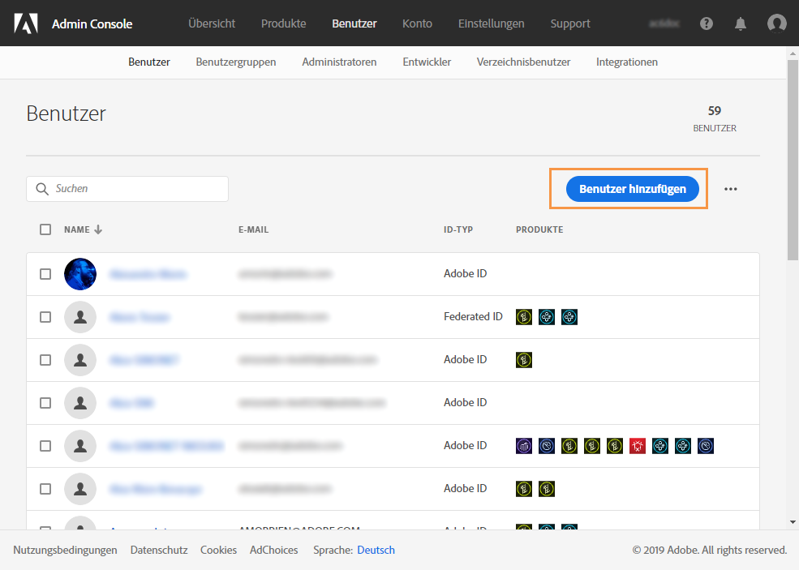
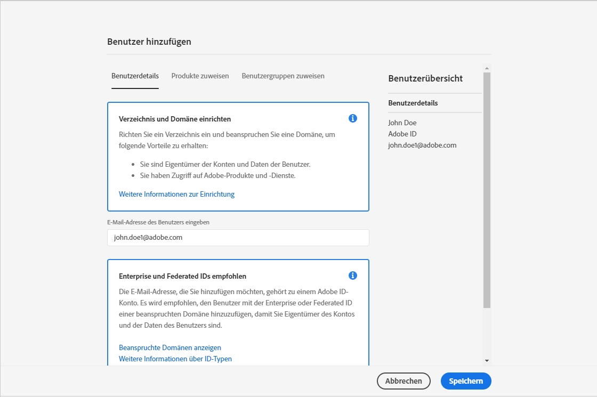
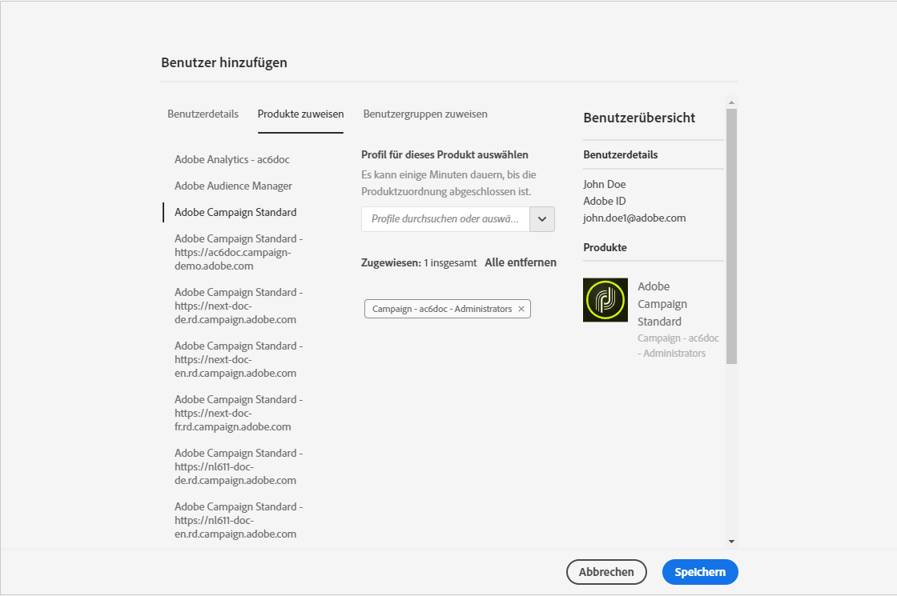
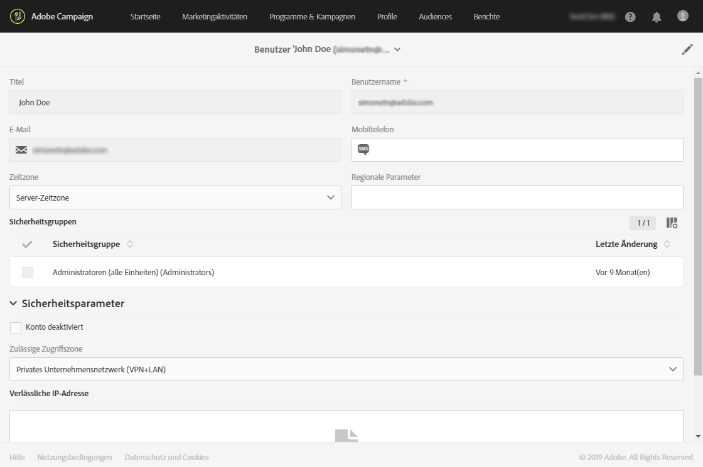

# Benutzerverwaltung{#users-management}

## Über Benutzer {#about-users}

In Adobe Campaign können Sie Ihren Benutzern verschiedene Rollen zuweisen und dadurch festlegen, welchen Teil der Benutzeroberfläche sie verwenden können.

In den folgenden Abschnitten werden die einzelnen Benutzerrollen und die jeweiligen Berechtigungen genauer beschrieben: [Benutzerrollen](../../administration/using/list-of-roles.md) und [Berechtigungen](https://experienceleague.adobe.com/docs/campaign-standard/assets/acs_rights.pdf?lang=de).

Administratoren können Benutzer über die Admin Console verwalten. Benutzer werden dadurch automatisch mit Adobe Campaign synchronisiert. Weiterführende Informationen dazu finden Sie in der Dokumentation zur ](https://helpx.adobe.com/de/enterprise/using/users.html)Admin Console[.

 [Entdecken Sie diese Funktion im Video](#video).

Die Anzeige der Adobe Campaign-Benutzer erfolgt über das **Adobe**-Logo oben links im Bildschirm. Klicken Sie dann auf **[!UICONTROL Administration > Benutzer &amp; Sicherheit > Benutzer]**.

Mithilfe der Schaltfläche **[!UICONTROL Benutzeradministration]** können Sie von Adobe Campaign aus auf die Benutzeroberfläche zur Benutzerverwaltung zugreifen.

**Verwandte Themen:**

* Video zur [Verwaltung von Benutzerberechtigungen](https://experienceleague.adobe.com/docs/campaign-standard-learn/tutorials/administrating/managing-user-access-rights.html?lang=de)
* [Liste der Rollen](../../administration/using/list-of-roles.md)
* [Liste der Berechtigungen](https://experienceleague.adobe.com/docs/campaign-standard/assets/acs_rights.pdf?lang=de)

## Typen von Benutzern {#type-of-users}

Diese Unterteilung der Benutzer ist nicht zwingend vorgeschrieben, sondern dient nur der Darstellung der häufigsten Anwendungsfälle von Adobe Campaign.

In diesem Abschnitt werden die wichtigsten Typen von Adobe Campaign-Benutzern erläutert. Weiterführende Informationen zu bestimmten Rollen, die ein Benutzer besitzen kann (Sendungen starten, exportieren, Sendungen vorbereiten usw.), finden Sie auf den Seiten [Liste der Rollen](../../administration/using/list-of-roles.md) und [Gruppen und Benutzer verwalten](../../administration/using/managing-groups-and-users.md) .

Vielmehr beschäftigen wir uns mit den drei wichtigsten Benutzertypen entsprechend ihrem Aufgabenbereich in Adobe Campaign:

* [Funktionale Administratoren](#functional-administrators): Dies sind die technisch ausgerichteten Benutzer in Ihrem Unternehmen.
* [Benutzer mit fortgeschrittenen Kenntnissen](#advanced-users): Sie richten alle Elemente ein, die Marketer für den Versand und die Überwachung von Nachrichten benötigen.
* [Benutzer mit Grundkenntnissen](#basic-users): Dies sind die Marketer, die Kampagnen personalisieren, versenden und überwachen.

>[!NOTE]
>
>Funktionale Administratoren unterscheiden sich von technischen Adobe-Administratoren. Technische Adobe-Administratoren verfügen über eine Adobe-interne Rolle, die Kunden nicht verwenden können. Sie verwalten die Bereitstellung von Instanzen, das Hosting, die Überwachung und Kontrolle der Infrastruktur sowie die technische Fehlerbehebung.

### Funktionale Administratoren {#functional-administrators}

Funktionale Administratoren sind Benutzer, die Zugriff auf die meisten technischen Elemente der Benutzeroberfläche haben. Sie sind verantwortlich für die **[!UICONTROL Administration]** und richten die Plattform ein, damit sich Marketer voll und ganz auf den Versand ihrer Kampagnen konzentrieren können.

>[!IMPORTANT]
>
>Nur funktionale Administratoren mit **[!UICONTROL Administratorrolle]** und Zugriff auf **alle** Einheiten können auf Versandlogs, Nachrichtenprotokolle, Trackinglogs, Ausschluss-Logs, Vorschlagsprotokolle und Abonnenten-Logs zugreifen. Ein Benutzer ohne Administratorrechte kann diese Protokolle ansprechen, muss aber mit einer verknüpften Tabelle (Profile, Versand) beginnen.

Funktionale Administratoren sind die einzigen Benutzer, die in der Adobe Campaign-Benutzeroberfläche Zugriff auf das Menü **[!UICONTROL Administration]** haben. Da diese Benutzer Zugriff auf technische Ressourcen benötigen, sollten ihnen erweiterte Benutzerrollen zugewiesen werden, wie etwa die vordefinierten Rollen **[!UICONTROL Administration]** und **[!UICONTROL Data Model]**. Diese Rollen sind in der vordefinierten Sicherheitsgruppe **[!UICONTROL Administrator]** zusammengefasst. Weiterführende Informationen hierzu finden Sie in diesem [Abschnitt](../../administration/using/list-of-roles.md).

Dies sind ihre Hauptaufgaben:

* [Benutzer und Berechtigungen verwalten](../../administration/using/about-access-management.md): Verwaltung der Zugriffsberechtigungen zur Plattform (Benutzer, Benutzerrollen, Sicherheitsgruppen, Einheiten)
* [Kanäle konfigurieren](../../administration/using/about-channel-configuration.md): Einrichten der unterschiedlichen Plattformkanäle sowie die Typologie- und Quarantäneverwaltung
* [Allgemeine Anwendungskonfiguration](../../administration/using/external-accounts.md): Konfiguration verschiedener Elemente der Anwendung (externe Konten, Optionen, technische Workflows)
* [Neue Funktionen zur Verbesserung von Standardfunktionen entwickeln](../../developing/using/data-model-concepts.md): Verwaltung benutzerdefinierter Ressourcen und Zugriff auf Diagnose-Tools
* [Instanzparameter einrichten](../../administration/using/branding.md): Definition verschiedener Marken und ihrer Parameter (Logo, Tracking-Verwaltung, Domain der Landingpage-URLs usw.)
* [Daten-Packages exportieren und importieren](../../automating/using/managing-packages.md): Austausch von Ressourcen zwischen unterschiedlichen Adobe-Campaign-Instanzen mithilfe strukturierter XML-Dateien
* [Logs exportieren](../../automating/using/exporting-logs.md) und [Importvorlagen definieren](../../automating/using/importing-data-with-import-templates.md#setting-up-import-templates)

### Benutzer mit fortgeschrittenen Kenntnissen {#advanced-users}

Diese Benutzer sind Marketing-Experten, die Adobe Campaign auf eine vorwiegend technische Art verwenden. Sie konfigurieren alle Elemente, die Marketer für den Versand und die Überwachung von Nachrichten verwenden.

Dieser Benutzertyp benötigt allgemeinere Rollen als ein funktionaler Administrator, sollte aber noch in der Lage sein, einige technische Vorgänge durchzuführen. Solchen Benutzern sollten beispielsweise die vordefinierten Rollen **[!UICONTROL Export]**, **[!UICONTROL Allgemeiner Import]** oder **[!UICONTROL Workflow]** zugewiesen werden. Weiterführende Informationen hierzu finden Sie in diesem [Abschnitt](../../administration/using/list-of-roles.md).

Dies sind ihre Hauptaufgaben:

* [Komplexe Datenverwaltungs-Workflows erstellen und ausführen](../../automating/using/about-data-management-activities.md): Import, Anreicherung und Transformation von Daten für die Datenbank oder Export von Daten in externe Dateien, um sie mit eigenen Tools zu verarbeiten
* [Vorlagen verwalten](../../start/using/marketing-activity-templates.md): Verwaltung von Vorlagen, um gewisse Parameter Ihrer Marketing-Aktivitäten entsprechend Ihren Anforderungen zu konfigurieren
* [Abfragen erstellen](../../automating/using/editing-queries.md#about-query-editor) und [Audiences verwalten](../../audiences/using/about-audiences.md): Manuelles Erstellen von Audiences mittels Abfragen oder automatisches Erstellen mittels dedizierter Workflows
* [Fortgeschrittene Bearbeitung von Ausdrücken](../../automating/using/editing-queries.md#about-query-editor): Einsatz fortgeschrittener Funktionen zur Bearbeitung für Abfragen verwendeter Werte (Datumsangaben, Strings, numerische Felder, Sortierung usw.)
* [Listen exportieren](../../automating/using/exporting-lists.md) und [Daten mithilfe von Importvorlagen importieren](../../automating/using/importing-data-with-import-templates.md)

### Benutzer mit Grundkenntnissen {#basic-users}

Dank der funktionalen Administratoren und Benutzer mit fortgeschrittenen Kenntnissen können Marketer Kampagnen personalisieren, versenden und überwachen, ohne sich über die technischen Feinheiten den Kopf zerbrechen zu müssen. Solchen Benutzern sollten beispielsweise die vordefinierten Rollen **[!UICONTROL Sendungen vorbereiten]**, **[!UICONTROL Workflow]** und **[!UICONTROL Sendungen starten]** zugewiesen werden. Diese Rollen sind in der vordefinierten Sicherheitsgruppe **[!UICONTROL Standardbenutzer]** zusammengefasst. Weiterführende Informationen hierzu finden Sie in diesem [Abschnitt](../../administration/using/list-of-roles.md).

Dies sind ihre Hauptaufgaben:

* [Programme und Kampagnen verwalten](../../start/using/programs-and-campaigns.md): Erstellen von Marketing-Kampagnen einschließlich unterschiedlicher Arten von Aktivitäten (E-Mails, SMS, Push-Benachrichtigungen, Workflows, Landingpages)
* [Profile verwalten](../../audiences/using/about-profiles.md) und [testen](../../audiences/using/managing-test-profiles.md): Verwalten und Testen von Versandempfängern; fügen Sie Informationen wie den Vornamen, Nachnamen, Kontaktinformationen, Abonnements, E-Mails usw. hinzu.
* [Nachrichten erstellen und senden](../../sending/using/confirming-the-send.md): Erstellen der Nachricht, Auswahl der Audience, Definition des Nachrichteninhalts und der Personalisierungsobjekte, Durchführen von Testsendungen und Senden der endgültigen Nachricht an die Audience
* [Landingpages erstellen und veröffentlichen](../../channels/using/getting-started-with-landing-pages.md): Erstellen und Verwalten von diversen Diensten, die Sie Ihren Kunden anbieten möchten, z. B. Formulare zur An- oder Abmeldung für ein Abonnement
* [Kampagnen-Workflows erstellen und ausführen](../../automating/using/building-a-workflow.md): Automatisierung der Kampagnen-Prozesse mithilfe von Workflows
* Marketing-Aktivitäten mithilfe von [Berichten](../../reporting/using/defining-the-report-period.md) überwachen

## Benutzer erstellen {#creating-a-user}

Um einen Benutzer zu Ihrer Instanz hinzuzufügen, müssen Sie ihn zuerst in der Admin Console erstellen und danach in Adobe Campaign Standard verwalten.

1. Wählen Sie dazu im erweiterten Menü **[!UICONTROL Administration > Benutzer &amp; Sicherheit > Benutzer]** und danach **[!UICONTROL Benutzeradministration]** aus, um die Admin Console aufzurufen.

   

1. Wählen Sie in der **[!UICONTROL Admin Console]** den Tab **[!UICONTROL Benutzer]** aus.

1. Wählen Sie **[!UICONTROL Benutzer hinzufügen]** aus.

   

1. Geben Sie im Tab **[!UICONTROL Detail eines Benutzers]** die Details des Benutzers wie die E-Mail-Adresse, den Vornamen und den Nachnamen ein.

   

1. Weisen Sie dem Benutzer auf der Registerkarte **[!UICONTROL Produkte zuweisen]** eine oder mehrere Sicherheitsgruppen zu. Weiterführende Informationen zu Sicherheitsgruppen finden Sie auf dieser [Seite](../../administration/using/managing-groups-and-users.md).

   Klicken Sie abschließend auf **[!UICONTROL Speichern]**.

   

Der Benutzer wird jetzt erstellt. Er erhält eine E-Mail, in der er an folgendes Fenster weitergeleitet wird. Dort wird er aufgefordert, ein Passwort festzulegen und die Nutzungsbedingungen zu akzeptieren. Danach kann dieser Benutzer eine Verbindung mit Ihrer Adobe Campaign Standard-Instanz herstellen.

Beim Anmelden bei Ihrer Instanz wird dieser Benutzer mit Adobe Campaign Standard synchronisiert.

Anschließend können Sie überprüfen, ob der Benutzer richtig mit Adobe Campaign synchronisiert wurde:

1. Wählen Sie dazu im erweiterten Menü **[!UICONTROL Administration > Benutzer &amp; Sicherheit > Benutzer]** den zuvor von Ihnen erstellten Benutzer aus.

1. Aktualisieren Sie bei Bedarf die Felder **[!UICONTROL Mobil]**, **[!UICONTROL Zeitzone]** oder **[!UICONTROL Regionale Parameter]**.

1. Überprüfen Sie die Sicherheitsgruppe des Benutzers. Hier können Sie sehen, dass dem Benutzer die Sicherheitsgruppe **[!UICONTROL Administrator]** zugewiesen wurde.

   >[!NOTE]
   >
   >Das Hinzufügen oder Entfernen von Sicherheitsgruppen von einem Benutzer ist nur in der Admin Console möglich.

   

1. Wenn Sie diesen Benutzer deaktivieren möchten, aktivieren Sie die Option **[!UICONTROL Konto deaktiviert]**.

1. Wählen Sie im Feld **[!UICONTROL Zulässige Zugriffszone]** die Option, über die Ihr Benutzer eine Verbindung zu dieser Instanz herstellen kann, z. B. internes Netzwerk oder VPN.

1. Wählen Sie **[!UICONTROL Speichern]** aus.

Ihr Benutzer kann jetzt Adobe Campaign Standard verwenden.

## Tutorial {#video}

In diesem Video wird gezeigt, wie Benutzerzugriffsrechte verwaltet werden.

>[!VIDEO](https://video.tv.adobe.com/v/24671?quality=12)

Weitere Anleitungsvideos zu Campaign Standard finden Sie [hier](https://experienceleague.adobe.com/docs/campaign-standard-learn/tutorials/overview.html?lang=de).
