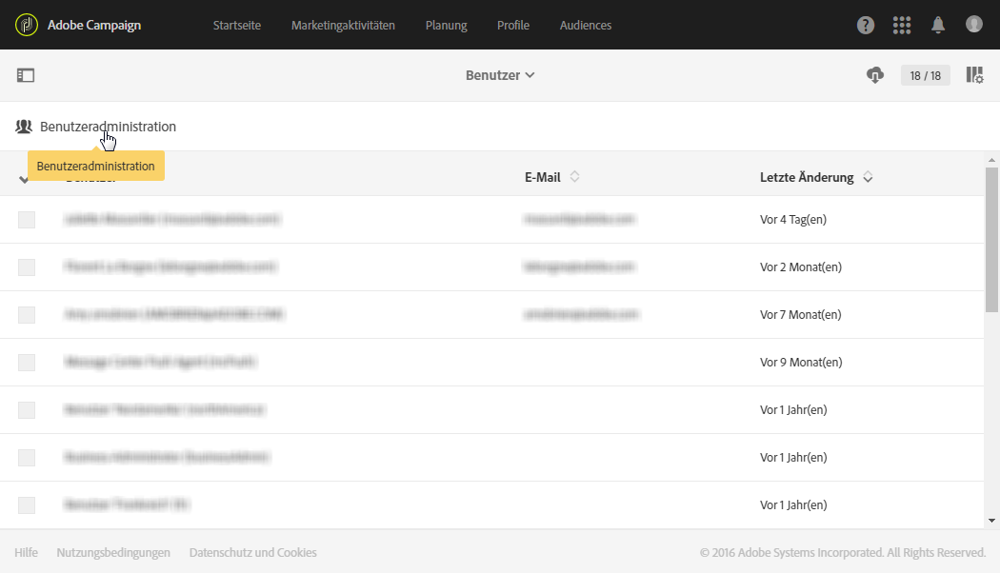
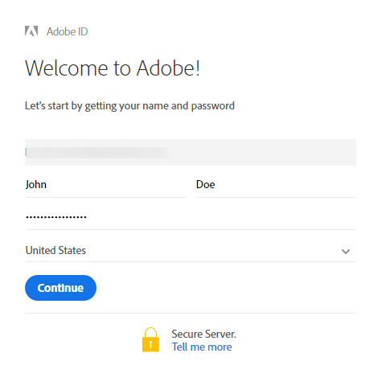

# Users management{#users-management}

## About users {#about-users}

In Adobe Campaign können Sie Ihren Benutzern verschiedene Rollen zuweisen und dadurch festlegen, welchen Teil der Benutzeroberfläche sie verwenden können.

In den folgenden Abschnitten werden die einzelnen Benutzerrollen und die jeweiligen Berechtigungen genauer beschrieben: [Benutzerrollen](../../administration/using/list-of-roles.md) und [Berechtigungen](https://docs.campaign.adobe.com/doc/standard/en/Technotes/AdobeCampaign-ACSRights.pdf).

Administratoren können Benutzer über die Admin Console verwalten. Benutzer werden dadurch automatisch mit Adobe Campaign synchronisiert. Weiterführende Informationen dazu finden Sie im [Handbuch zur Admin Console](https://helpx.adobe.com/enterprise/using/users.html).

Der Zugriff auf die Adobe-Campaign-Benutzer erfolgt über das **[!UICONTROL Adobe-Campaign]**-Logo oben links im Bildschirm. Verwenden Sie dann die Schaltflächen **[!UICONTROL Administration &gt; Benutzer &amp; Sicherheit &gt; Benutzer]**.

Mithilfe der Schaltfläche **[!UICONTROL Benutzeradministration können Sie von Adobe Campaign aus auf die Benutzeroberfläche zur Benutzerverwaltung zugreifen]**.

**Verwandte Themen:**

* Video [Managing user permissions](https://helpx.adobe.com/campaign/kt/acs/using/acs-user-access-rights-feature-video-use.html)
* [Liste der Rollen](../../administration/using/list-of-roles.md)
* [Liste der Berechtigungen](https://docs.campaign.adobe.com/doc/standard/en/Technotes/AdobeCampaign-ACSRights.pdf)

## Type of users {#type-of-users}

Diese Unterteilung der Benutzer ist nicht zwingend vorgeschrieben, sondern dient nur der Darstellung der häufigsten Verwendungsfälle von Adobe Campaign.

In diesem Abschnitt werden die wichtigsten Typen von Adobe-Campaign-Benutzern erläutert. Hier werden nicht die einzelnen Benutzerrollen beschrieben, die ein Benutzer haben kann (Versandstart, Export, Versandvorbereitung usw.). Weiterführende Informationen zu Benutzerrollen finden Sie auf den Seiten [Liste der Rollen](../../administration/using/list-of-roles.md) und [Gruppen und Benutzer verwalten](../../administration/using/managing-groups-and-users.md).

Vielmehr beschäftigen wir uns mit den drei wichtigsten Benutzertypen entsprechend ihrem Aufgabenbereich in Adobe Campaign:

* [Funktionale Administratoren](../../administration/using/users-management.md#functional-administrators): Dies sind die technisch ausgerichteten Benutzer in Ihrem Unternehmen.
* [Benutzer mit fortgeschrittenen Kenntnissen](../../administration/using/users-management.md#advanced-users): Sie richten alle Elemente ein, die Marketer für den Versand und die Überwachung von Nachrichten benötigen.
* [Benutzer mit Grundkenntnissen](../../administration/using/users-management.md#basic-users): Dies sind die Marketer, die Kampagnen personalisieren, versenden und überwachen.

>[!NOTE]
>
>Funktionale Administratoren unterscheiden sich von technischen Adobe-Administratoren. Technische Adobe-Administratoren verfügen über eine Adobe-interne Rolle, die Kunden nicht verwenden können. Sie verwalten die Bereitstellung von Instanzen, das Hosting, die Überwachung und Kontrolle der Infrastruktur sowie die technische Fehlerbehebung.

### Funktionale Administratoren {#functional-administrators}

Funktionale Administratoren sind Benutzer, die Zugriff auf die meisten technischen Elemente der Benutzeroberfläche haben. Sie sind verantwortlich für die **[!UICONTROL Administration]und richten die Plattform ein, damit sich Marketer voll und ganz auf den Versand ihrer Kampagnen konzentrieren können.**

Funktionale Administratoren sind die einzigen Benutzer, die Zugriff auf das Menü **[!UICONTROL Administration]in der Adobe-Campaign-Benutzeroberfläche haben.** Da diese Benutzer Zugriff auf technische Ressourcen benötigen, sollten ihnen erweiterte Benutzerrollen zugewiesen werden, wie etwa die vordefinierten Rollen **[!UICONTROL Administration]** und **Data Model[!UICONTROL .]** Diese Rollen sind in der vordefinierten Sicherheitsgruppe **[!UICONTROL Administrator]zusammengefasst.** Weiterführende Informationen hierzu finden Sie in diesem [Abschnitt](../../administration/using/list-of-roles.md).

Dies sind ihre Hauptaufgaben:

* [Benutzer und Berechtigungen verwalten](../../administration/using/about-access-management.md): Verwaltung der Zugriffsberechtigungen zur Plattform (Benutzer, Benutzerrollen, Sicherheitsgruppen, Einheiten)
* [Kanäle konfigurieren](../../administration/using/about-channel-configuration.md): Einrichten der unterschiedlichen Plattformkanäle sowie die Typologie- und Quarantäneverwaltung
* [Allgemeine Anwendungskonfiguration](../../administration/using/external-accounts.md): Konfiguration verschiedener Elemente der Anwendung (externe Konten, Optionen, technische Workflows)
* [Neue Funktionen zur Verbesserung von Standardfunktionen entwickeln](../../developing/using/data-model-concepts.md): Verwaltung benutzerdefinierter Ressourcen und Zugriff auf Diagnose-Tools
* [Instanzparameter einrichten](../../administration/using/branding.md): Definition verschiedener Marken und ihrer Parameter (Logo, Tracking-Verwaltung, Domain der Landingpage-URLs usw.)
* [Daten-Packages exportieren und importieren](../../automating/using/managing-packages.md): Austausch von Ressourcen zwischen unterschiedlichen Adobe-Campaign-Instanzen mithilfe strukturierter XML-Dateien
* [Logs exportieren](../../automating/using/exporting-logs.md) und [Importvorlagen definieren](../../automating/using/defining-import-templates.md)

### Benutzer mit fortgeschrittenen Kenntnissen {#advanced-users}

Diese Benutzer sind Marketing-Experten, die Adobe Campaign auf eine vorwiegend technische Art verwenden. Sie konfigurieren alle Elemente, die Marketer für den Versand und die Überwachung von Nachrichten verwenden.

Dieser Benutzertyp benötigt allgemeinere Rollen als ein funktionaler Administrator, sollte aber noch in der Lage sein, einige technische Vorgänge durchzuführen. To do so, they should be assigned, for example, the **[!UICONTROL Export]**, **[!UICONTROL Generic import]** or **[!UICONTROL Workflow]** out-of-the-box roles. Weiterführende Informationen hierzu finden Sie in diesem [Abschnitt](../../administration/using/list-of-roles.md).

Dies sind ihre Hauptaufgaben:

* [Komplexe Datenverwaltungs-Workflows erstellen und ausführen](../../automating/using/about-data-management-activities.md): Import, Anreicherung und Transformation von Daten für die Datenbank oder Export von Daten in externe Dateien, um sie mit eigenen Tools zu verarbeiten
* [Vorlagen verwalten](../../start/using/about-templates.md): Verwaltung von Vorlagen, um gewisse Parameter Ihrer Marketing-Aktivitäten entsprechend Ihren Anforderungen zu konfigurieren
* [Abfragen erstellen](../../automating/using/editing-queries.md#about-query-editor) und [Audiences verwalten](../../audiences/using/about-audiences.md): Manuelles Erstellen von Audiences mittels Abfragen oder automatisches Erstellen mittels dedizierter Workflows
* [Fortgeschrittene Bearbeitung von Ausdrücken](../../automating/using/editing-queries.md#about-query-editor): Einsatz fortgeschrittener Funktionen zur Bearbeitung für Abfragen verwendeter Werte (Datumsangaben, Strings, numerische Felder, Sortierung usw.)
* [Listen exportieren](../../automating/using/exporting-lists.md) und [Daten mithilfe von Importvorlagen importieren](../../automating/using/importing-data-with-import-templates.md)

### Benutzer mit Grundkenntnissen {#basic-users}

Dank der funktionalen Administratoren und Benutzer mit fortgeschrittenen Kenntnissen können Marketer Kampagnen personalisieren, versenden und überwachen, ohne sich über die technischen Feinheiten den Kopf zerbrechen zu müssen. To do so, they should be assigned, for example, the **[!UICONTROL Prepare deliveries]**, **[!UICONTROL Workflow]** and **[!UICONTROL Start deliveries]** out-of-the-box roles. Diese Rollen sind in der vordefinierten Sicherheitsgruppe **[!UICONTROL Standardbenutzer]zusammengefasst.** Weiterführende Informationen hierzu finden Sie in diesem [Abschnitt](../../administration/using/list-of-roles.md).

Dies sind ihre Hauptaufgaben:

* [Programme und Kampagnen verwalten](../../start/using/programs-and-campaigns.md): Erstellen von Marketingkampagnen einschließlich unterschiedlicher Arten von Aktivitäten (E-Mails, SMS, Push-Benachrichtigungen, Workflows, Landingpages)
* [Profile verwalten](../../audiences/using/about-profiles.md) und [testen](../../sending/using/managing-test-profiles-and-sending-proofs.md): Verwalten und Testen von Versandempfängern Fügen Sie Informationen wie den Vornamen, Nachnamen, Kontaktinformationen, Abonnements, E-Mails usw. hinzu.
* [Nachrichten erstellen und senden](../../sending/using/confirming-the-send.md): Erstellen der Nachricht, Auswahl der Audience, Definition des Nachrichteninhalts und der Personalisierungsobjekte, Durchführen von Testsendungen und Senden der endgültigen Nachricht an die Audience
* [Landingpages erstellen und publizieren](../../channels/using/about-landing-pages.md): Erstellen und Verwalten von diversen Diensten, die Sie Ihren Kunden anbieten möchten, z. B. Formulare zur An- oder Abmeldung für ein Abonnement
* [Kampagnen-Workflows erstellen und ausführen](../../automating/using/building-a-workflow.md): Automatisierung der Kampagnen-Prozesse mithilfe von Workflows
* Marketing-Aktivitäten mithilfe von [Berichten](../../reporting/using/defining-the-report-period.md) überwachen

## Creating a user {#creating-a-user}

Um einen Benutzer zu Ihrer Instanz hinzuzufügen, müssen Sie ihn zuerst in der Admin-Konsole erstellen, bevor Sie ihn in Adobe Campaign Standard verwalten.

1. From the advanced menu, select **[!UICONTROL Administration &gt; Users &amp; Security &gt; Users]** and click **[!UICONTROL User administration]** to access the admin console.

   

1. In the **[!UICONTROL Admin Console]**, click on the **[!UICONTROL Users]** tab.

1. Click **[!UICONTROL Add User]**.

   

1. From the **[!UICONTROL User details]** tab, fill in the user's details such as email address, name and surname.

   

1. From the **[!UICONTROL Assign products]** tab, assign one or multiple security group to your user. For more information on security groups, refer to this [page](../../administration/using/managing-groups-and-users.md).

   Click **[!UICONTROL Save]** when done configuring.

   

Ihr Benutzer wird jetzt erstellt und sollte eine E-Mail an das folgende Fenster weiterleiten, in der der Benutzer ein Kennwort eingeben muss, um die Nutzungsdauer zu bestätigen. Dieser Benutzer kann dann eine Verbindung zu Ihrer Adobe Campaign Standard-Instanz herstellen.

Ihr Benutzer wird mit Adobe Campaign Standard synchronisiert, sobald er sich bei Ihrer Instanz anmeldet.

Anschließend können Sie überprüfen, ob Ihr Benutzer richtig mit Adobe Campaign synchronisiert wurde:

1. From the advanced menu **[!UICONTROL Administration &gt; Users &amp; Security &gt; Users]** select your previously created user.

1. Update the **[!UICONTROL Mobile]**, **[!UICONTROL Time zone]** or **[!UICONTROL Regional settings]** if needed.

1. Überprüfen Sie die Sicherheitsgruppe Ihres Benutzers. Here, you can see that the user has been assigned the **[!UICONTROL Administrators]** security group.

   >[!Note]
   >
   >Sicherheitsgruppen können nur in der Admin-Konsole entfernt oder einem Benutzer hinzugefügt werden.

   

1. Check **[!UICONTROL Account disabled]** if you want to deactivate this user.

1. In the **[!UICONTROL Authorized connection zone]** field, select through which way your user will connect to this instance, e.g. internal network or VPN.

1. Wählen Sie **[!UICONTROL Speichern aus]**.
