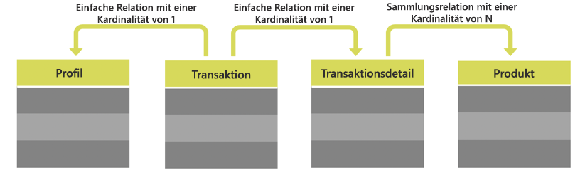

# Benutzerdefinierte Ressourcen {#custom-resources}

Adobe Campaign verfügt über ein vordefiniertes Datenmodell, bei dem Daten über verschiedene Ressourcen definiert werden. Sie können das bereitgestellte Datenmodell anreichern, indem Sie die Ressourcen erweitern, um eigene benutzerdefinierte Felder oder benutzerdefinierte Tabellen hinzuzufügen (z. B. Einkaufs- oder Produkttabellen).

Benutzerdefinierte Ressourcen können über APIs mit dem Endpunkt **/profileAndServicesExt** und dem Namen der benutzerdefinierten Ressource aufgerufen werden.

`https://mc.adobe.io/<ORGANIZATION>/campaign/profileAndServicesExt/<resourceName>/`

>[!NOTE]
>
>Verwenden Sie bei Ressourcen, die nicht vordefiniert sind, immer das Präfix <b>&quot;cus&quot;</b> vor dem Namen der Ressource.

Sie können beliebige Aktionen mit benutzerdefinierten Ressourcen ausführen, solange diese mit der Profiltabelle verknüpft sind. Betrachten wir zum Beispiel die folgende Tabellenstruktur:



In diesem Fall sind alle Ressourcen aus den Tabellen **Transaktion**, **Transaktionsdetails** und **Produkt** verfügbar, solange sie mit der Tabelle **Profil** verknüpft sind.

<br/>

***Beispielanfrage***

Beispielhafte GET-Anfrage zum Aufrufen der erweiterten Ressource profileAndServicesExt.

```
-X GET https://mc.adobe.io/<ORGANIZATION>/campaign/profileAndServicesExt/\
-H 'Content-Type: application/json' \
-H 'Authorization: Bearer <ACCESS_TOKEN>' \
-H 'Cache-Control: no-cache' \
-H 'X-Api-Key: <API_KEY>' \
```

Es wird eine Liste aller verknüpften benutzerdefinierten Ressourcen zurückgegeben. Anschließend können Sie die Ressourcen-URLs verwenden, um beliebige in dieser Dokumentation beschriebenen API-Aufgaben zu erledigen.

```
{
"apiName": "resourceType",
"cusProduct": {
        "content": ...,
        "data": "/profileAndServicesExt/cusProduct/",
        "help": "Product",
        "href": "https://mc.adobe.io/<ORGANIZATION>/campaign/profileAndServicesExt/cusProduct/metadata",
        "name": "cusProduct",
        "type": "collection"
    },
"cusTransaction": {
        "content": ...,
        "data": "/profileAndServicesExt/cusTransaction/",
        "help": "Product",
        "href": "https://mc.adobe.io/<ORGANIZATION>/campaign/profileAndServicesExt/cusTransaction/metadata",
        "name": "cusProduct",
        "type": "collection"
    },
    ...
}
```

Weiterführende Informationen zur Datenmodellerweiterung finden Sie in der Campaign-Dokumentation:

* [Konzepte von Datenmodellen](../../developing/using/data-model-concepts.md)
* [Die API erweitern](../../developing/using/about-extending-the-api.md)
* [Relationen mit anderen Ressourcen definieren](https://helpx.adobe.com/de/campaign/standard/developing/using/configuring-the-resource-s-data-structure.html#defining-links-with-other-resources)
