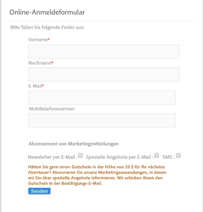
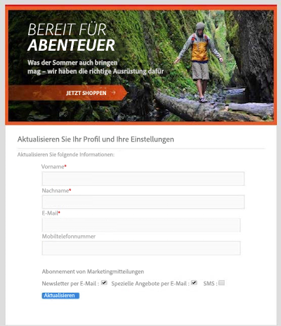
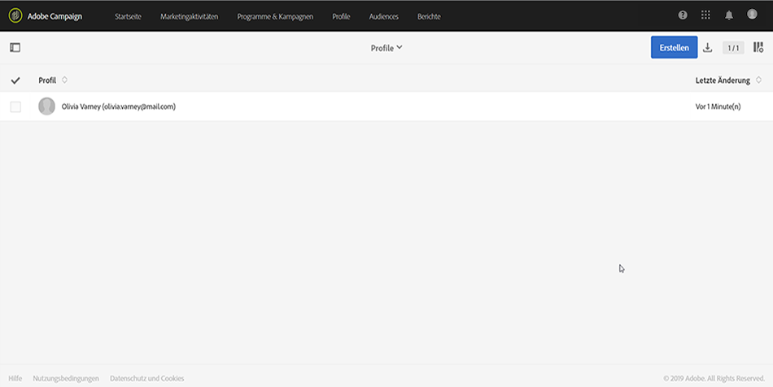

# Gründe für die Verwendung von Campaign Standard-APIs {#why-using-campaign-standard-apis}

Adobe Campaign Standard bietet APIs, mit denen vorhandene Systeme in die ACS-Plattform integriert werden können, um Probleme in Echtzeit zu lösen.

Öffentliche Websites wie die Anmelde- oder Abmeldeseite müssen eine Verbindung zu Backend-Systemen herstellen, um Profilinformationen zu speichern. Backend-Systeme wie Adobe Campaign verfügen über die Flexibilität und die Macht, Profildaten zu erfassen und benutzerdefinierte Vorgänge daran durchzuführen.

Hier einige Beispiele:

* Aussicht auf Online-Registrierung.
* Bestehendes Kundenprofil- und Marketingkommunikationsmanagement.
* Ereignisbasierte transaktionssichere Kommunikation - Bestellbestätigung, Buchungsschritt, Passwortzurücksetzung usw.
* Auch E-Mail-Kommunikation zum Warenkorbabbruch.

Die Anmelde-Einstiegsseiten bieten Kunden oder Interessenten die Möglichkeit, ihren Namen und ihre E-Mail-Adresse zu registrieren. Sobald Campaign Standard die Profilinformationen und Voreinstellungen erfasst hat, kann es personalisierte Nachrichten auf Basis der Interessen der Person senden.

Sie werden mit den folgenden Elementen erstellt:

1. Ein Registrierungsformular mit Kampagnen-API-Listenern.

   

1. Benutzerdefinierte Aktionen, die basierend auf Kontrollkästchen durchgeführt werden sollen. Ein Kunde, der "E-Mail-Sonderangebote" auswählt, erhält eine andere, benutzerspezifische E-Mail mit einem Gutschein als der normale Registrierungsprozess.

   

1. Ein Profil kann seine Details ändern, nachdem Sie in der E-Mail auf den Link "Details aktualisieren"geklickt haben. Dadurch wird das Profil auf die Seite "Profil- und Voreinstellungsdetails aktualisieren"geleitet. Zur Durchführung des Vorgangs werden die Profildetails (Pkey) an den Kampagnenserver weitergeleitet und das Profil abgerufen und dargestellt. Sobald das Profil auf die Schaltfläche "Aktualisieren" klickt, werden die Informationen im System aktualisiert (über einen PATCH-Befehl).

   

Es steht eine Reihe von Anforderungen zur Verfügung, die Ihnen dabei helfen, sich mit den Anforderungen der Campaign Standard-APIs vertraut zu machen. Diese Sammlung im JSON-Format bietet vordefinierte API-Anforderungen, die gängige Anwendungsfälle darstellen.

Die folgenden Schritte beschreiben einen schrittweisen Verwendungsfall zum Importieren und Verwenden der Sammlung zum Erstellen eines Profils in der Campaign Standard-Datenbank.

>[!NOTE]
>
>Unser Beispiel verwendet Postman. Sie können jedoch Ihren bevorzugten REST-Client nutzen.

1. Laden Sie die JSON-Sammlung herunter, indem Sie [hier](https://helpx.adobe.com/content/dam/help/en/campaign/kb/working-with-acs-api/_jcr_content/main-pars/download_section/download-1/KB_postman_collection.json.zip)klicken.

1. Öffnen Sie Postman und wählen Sie dann das Menü **Datei** / **Import** .

1. Ziehen Sie die heruntergeladene Datei in das Fenster. Vordefinierte API-Anforderungen werden angezeigt und können verwendet werden.

   

1. Wählen Sie **Erstellen einer Profilanforderung** und aktualisieren Sie dann die POST-Anforderung und die Registerkarte **Kopfzeilen** mit Ihren eigenen Informationen (&lt;ORGANISATION&gt;, &lt;API_KEY&gt;, &lt;ACCESS_TOKEN&gt;). Weiterführende Informationen hierzu finden Sie in [diesem Abschnitt](../../api/using/setting-up-api-access.md).

   

1. Füllen Sie die Registerkarte **Haupttext** mit den Informationen aus, die Sie dem neuen Profil hinzufügen möchten, und klicken Sie dann auf die Schaltfläche **Senden** , um die Anforderung auszuführen.

   

1. Nachdem ein Objekt erstellt wurde, wird ihm ein Primärschlüssel (PKey) zugeordnet. Er ist in der Antwort auf Anforderung sowie in anderen Attributen sichtbar.

   

1. Öffnen Sie Ihre Campaign Standard-Instanz und überprüfen Sie dann, ob das Profil mit allen Informationen aus der Payload erstellt wurde.

   
