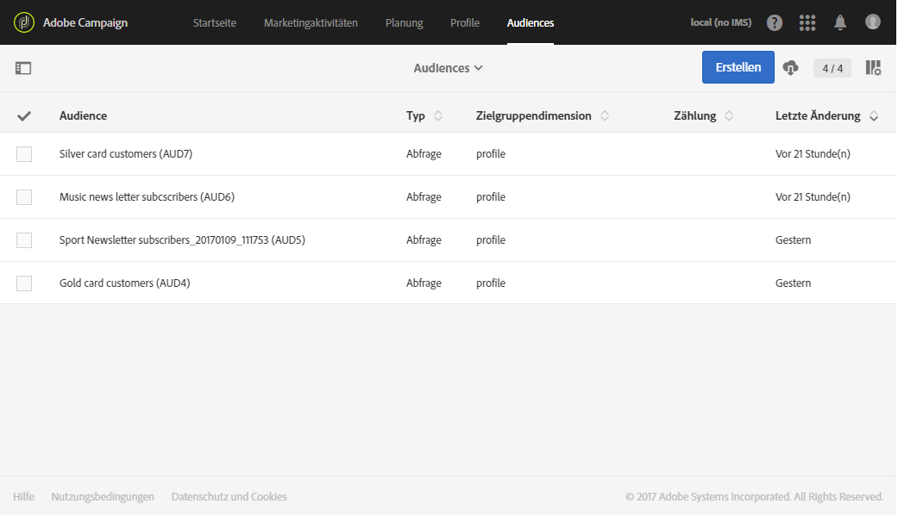

# Über Zielgruppen{#about-audiences}

Eine Audience ist eine Liste mit Profilen basierend auf Regeln und Attributen.

Audiences können in Adobe Campaign manuell mittels Abfragen oder automatisch mittels dedizierter Workflows erstellt werden. Außerdem besteht die Möglichkeit zur Verwendung von freigegebenen Zielgruppen aus Adobe Experience Cloud. Alle Audiences sind in einer Liste zusammengefasst, auf die entweder über die **[!UICONTROL Audiences]**-Karte der Adobe Campaign-Startseite oder über den **[!UICONTROL Audiences]**-Link zugegriffen werden kann.

Adobe Campaign bietet die Möglichkeit, mit verschiedenen Audience-Typen zu arbeiten. Der Typ einer Audience entspricht der Art ihrer Erstellung:

* **[!UICONTROL Abfrage]**: bedeutet, dass die Audience mithilfe einer [Abfrage](../../automating/using/editing-queries.md#about-query-editor) von in der Adobe Campaign-Datenbank enthaltenen Daten über die Liste der Audiences erstellt wurde. Über Abfragen definierte Audiences werden bei jeder Verwendung erneut berechnet.
* **[!UICONTROL Liste]** - bedeutet, dass es sich bei der Audience um eine feststehende Liste von Profilen handelt. Diese Listen werden in [Workflows](../../automating/using/get-started-workflows.md) erstellt, wenn bei Speicherung der Audience die Dimension der Daten bekannt ist. Dies kann beispielsweise nach Zielbestimmungsaktivitäten (insbesondere **[!UICONTROL Abfragen]**) oder nach der Abstimmung von aus einer Datei importierten Daten geschehen.
* **[!UICONTROL Datei]** – bedeutet, dass die Audience direkt durch [Importieren einer Datei](../../automating/using/load-file.md) in einen Workflow erstellt wurde und dass die Dimension der Daten bei Speicherung der Audience unbekannt war.
* **[!UICONTROL Experience Cloud]** – bedeutet, dass die Audience auf einer aus Adobe Experience Cloud importierten freigegebenen Zielgruppe beruht. Diese Option ist nur dann verfügbar, wenn die Funktion der Zielgruppenfreigabe konfiguriert wurde. Weitere Informationen finden Sie in [Importieren einer Zielgruppe aus Adobe Experience Cloud](../../integrating/using/sharing-audiences-with-audience-manager-or-people-core-service.md#importing-an-audience).

