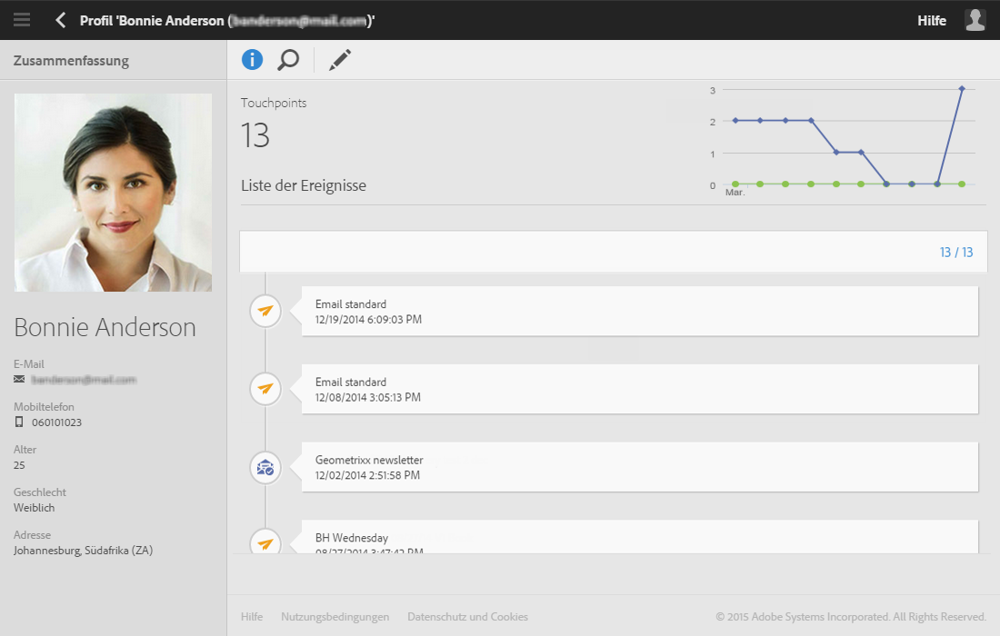

# Über Profile{#about-profiles}

Die Adobe-Campaign-Plattform ermöglicht die Verwaltung von Kontakten über den gesamten Zyklus hinweg, von der Erstellung bzw. dem Import über die Zielgruppenbestimmung und das Tracking bis hin zur Aktualisierung. Kontakte werden in der Datenbank in Form von Profilen mit den entsprechenden Informationen – Nachname, Vorname, Adressdaten, Abonnements, Sendungen etc. – gespeichert.

>[!NOTE]
>
>Profile sind auch über die Adobe Campaign Standard API verfügbar. Weiterführende Informationen finden Sie im [entsprechenden Handbuch](../../api/using/retrieving-profiles.md).

Bei der Erstellung von Kampagnen kann die Versandzielgruppe aus Profilen nach einfachen oder erweiterten Kriterien zusammengestellt werden. Technisch betrachtet ist ein Profil ein Eintrag in einer Datenbank, der alle zur Zielgruppenbestimmung, zur Qualifizierung und zum Tracking von Verhalten erforderlichen Informationen enthält.

Bei einem Profil kann es sich – je nach den in der Organisation verwendeten Bezeichnungen – um Kunden, Interessenten, Newsletter-Abonnenten, Empfänger, Benutzer etc. handeln. Unterschiedliche Typen von Profilen werden mit [Zielgruppendimensionen](../../automating/using/query.md#targeting-dimensions-and-resources) definiert.
