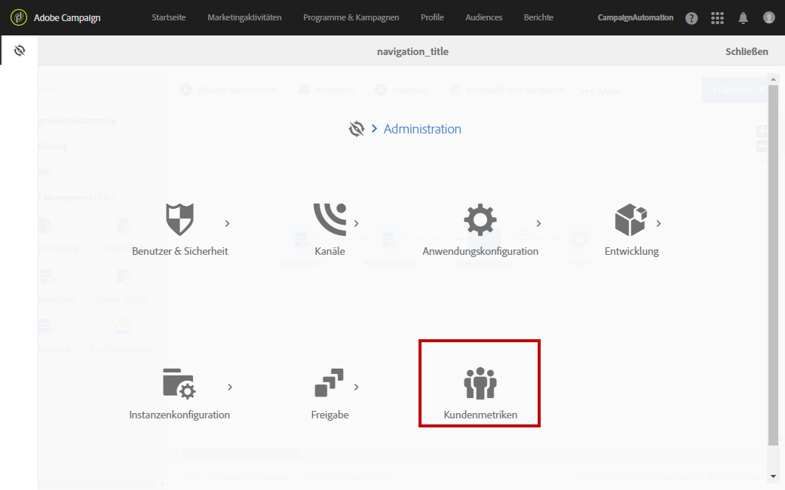
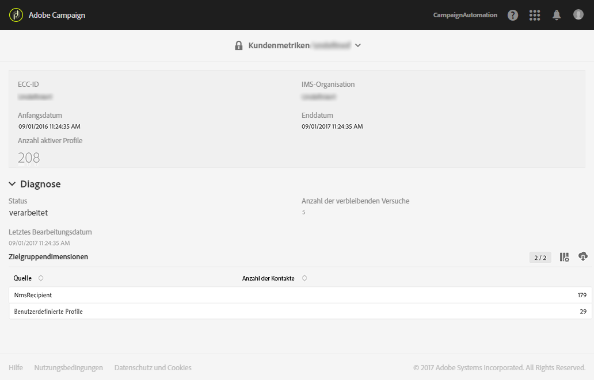

# Aktive Profile{#active-profiles}

Adobe Campaign erstellt einen Bericht, in dem die Anzahl der aktiven Profile dargestellt wird. Dieser Bericht hat nur informativen Charakter und keine direkte Auswirkung auf die Rechnungsstellung. Nur Administratoren haben Zugriff auf diesen Bericht. Er kann unter **[!UICONTROL Administration > Kundenmetriken abgerufen werden]**.

Mit dem technischen Workflow **[!UICONTROL Rechnungsstellung]** wird jeden Monat ein Bericht erzeugt, in dem die Anzahl der aktiven Profile aufgeführt wird, die in den letzten zwölf Monaten angesprochen wurden.

Die Profile, die während der Versandvorbereitung ausgeschlossen wurden (Typologieregeln, Quarantänen), werden nicht berücksichtigt. Ein Profil, das mehrere Sendungen erhalten hat, wird nur einmal gezählt. Am Ende des Berichts finden Sie die Liste der aktiven Profile für jede Zielgruppendimension.

Wenn Sie auf AWS gehostet werden und Campaign Standard aus Build 10368 verwenden, können Sie die Anzahl der in Ihren Instanzen verwendeten aktiven Profile auch direkt im Control Panel überwachen. Weitere Informationen hierzu finden Sie in der [Control Panel-Dokumentation](https://docs.adobe.com/content/help/de-DE/control-panel/using/performance-monitoring/active-profiles-monitoring.html).
