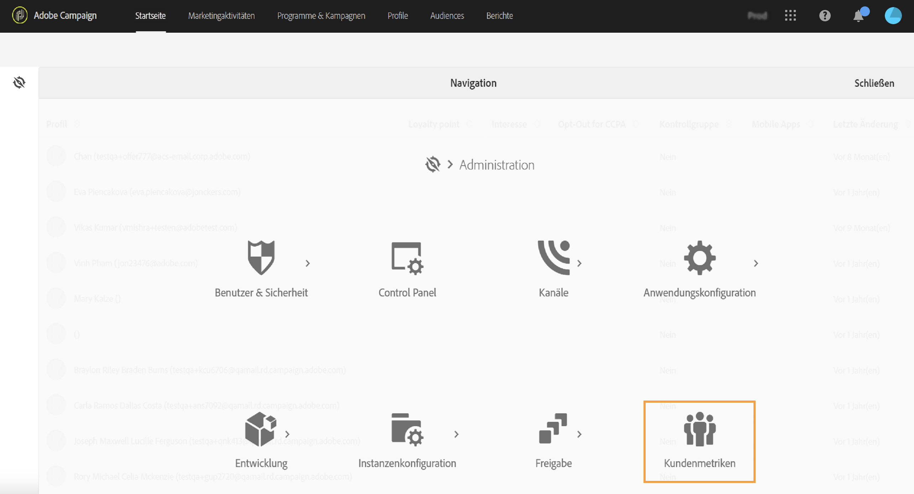
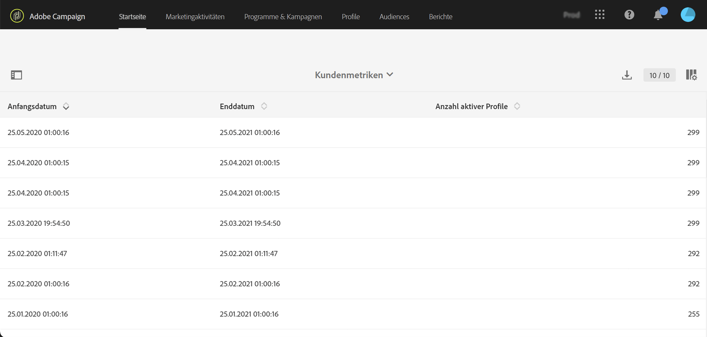

# Aktive Profile{#active-profiles}

Sie können auf die Details der aktiven Profile über den Bericht **[!UICONTROL Kundenmetriken]** zugreifen. Dieser Bericht ist nur für funktionale Administratoren und Administratorinnen in Campaign verfügbar. Um auf diesen Bericht zuzugreifen, klicken Sie auf das Adobe Campaign-Symbol oben links in der [Benutzeroberfläche](../../start/using/interface-description.md#advanced-menu) und gehen Sie zu **[!UICONTROL Administration > Kundenmetriken]**.

Dieser Bericht wird monatlich durch den technischen Workflow **[!UICONTROL Abrechnung]** generiert und zeigt die Anzahl der **aktiven Profile** an. Weitere Informationen zu technischen Workflows finden Sie auf [dieser Seite](../../administration/using/technical-workflows.md).

Ein &quot;Profil&quot; ist ein Datensatz mit Informationen, die einen Endkunden, Interessenten oder Lead repräsentieren. Profile werden als **aktiv** angesehen, wenn sie innerhalb der letzten 12 Monate über einen beliebigen Kanal durch einen Campaign-Versand angesprochen wurden.

Gemäß Ihrem Vertrag erhalten alle Ihre Campaign-Instanzen eine bestimmte Anzahl aktiver Profile. Informationen zur Anzahl der gekauften aktiven Profile finden Sie in Ihrem Lizenzvertrag.

* Die Profile, die bei der Vorbereitung des Versands (z. B. durch Typologieregeln oder den Quarantänemechanismus) ausgeschlossen wurden, werden nicht berücksichtigt.

* Empfänger von Transaktionsnachrichten werden als aktive Profile gezählt.

* Ein Profil, das mehrere Sendungen erhalten hat, wird nur einmal gezählt.

* Dieser Bericht hat nur informativen Charakter und keine direkte Auswirkung auf die Rechnungsstellung.

Unten auf der Seite werden die Zielgruppendimensionen mit der jeweiligen Anzahl der Profile aufgelistet. Empfänger von Transaktionsnachrichten sind mit der Dimension **Anonym** verknüpft.

>[!NOTE]
>
>Als Administrator können Sie die Anzahl der in Ihren Instanzen verwendeten aktiven Profile auch direkt über das Control Panel überwachen. Weitere Informationen hierzu finden Sie in der [Control Panel-Dokumentation](https://experienceleague.adobe.com/docs/control-panel/using/performance-monitoring/active-profiles-monitoring.html?lang=de).
>
