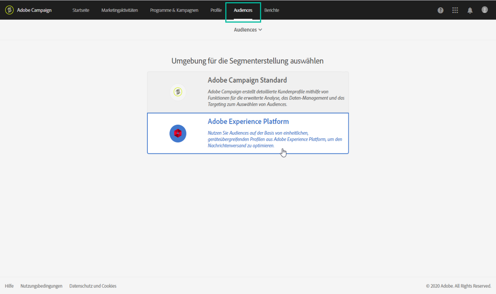
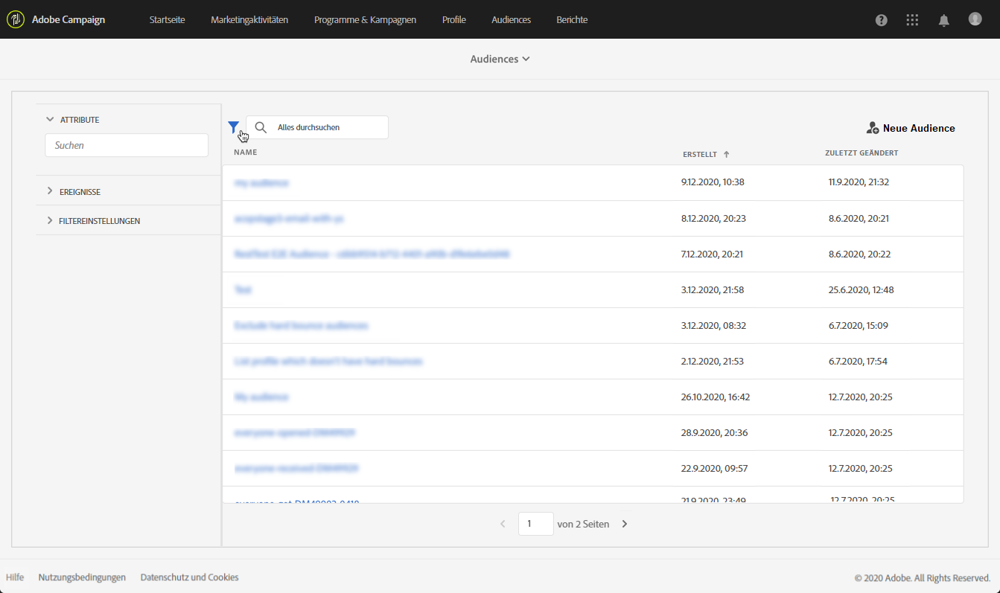
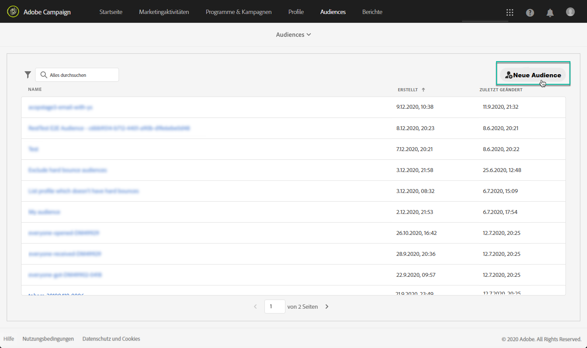
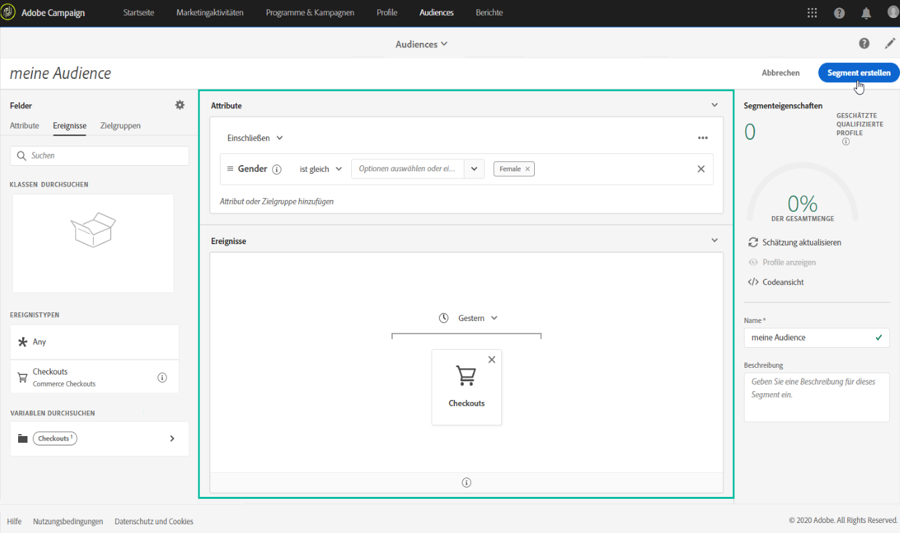
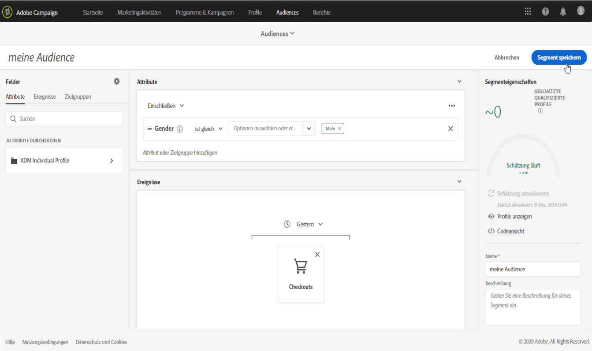

# Adobe Experience Platform-Audiences verwalten {#about-audiences}

>[!IMPORTANT]
>
>Der Audience Destinations-Dienst befindet sich derzeit in der Betaphase, die häufig ohne Vorankündigung aktualisiert werden kann. Kunden müssen auf Azure gehostet werden (derzeit nur für Nordamerika in der Betaphase), um auf diese Funktionen zugreifen zu können. Wenden Sie sich an die Adobe-Kundenunterstützung, wenn Sie Zugriff haben möchten.

## Adobe Experience Platform-Audiences aufrufen

Um Segment Builder von Adobe Experience Platform aufzurufen, navigieren Sie zur Karte **[!UICONTROL Audiences]** auf der Startseite von Campaign Standard (oder zum Link **[!UICONTROL Audiences]** in der Kopfzeile) und wählen Sie dann die Umgebung **[!UICONTROL Adobe Experience Platform]**.

Sie werden zunächst zur Segmentlistenseite von Adobe Experience Platform weitergeleitet, auf der bereits vorhandene Adobe Experience Platform-Segmente zur weiteren Bearbeitung aufgerufen werden können.

Es stehen eine Suchleiste und ein Filter zur Verfügung, die Ihnen bei der Suche nach dem gewünschten Adobe Experience Platform-Segment helfen.

## Adobe Experience Platform-Audiences erstellen

Gehen Sie wie folgt vor, um direkt in Campaign Standard eine Adobe Experience Platform-Audience zu erstellen:

1. Wählen Sie auf der Segmentlistenseite von Adobe Experience Platform rechts die Schaltfläche **[!UICONTROL Neue Audience]** aus.

   

1. Unified Segment Builder sollte jetzt in Ihrem Arbeitsbereich angezeigt werden. Damit können Sie ein Segment mithilfe von Daten aus Adobe Experience Platform erstellen, das letztendlich zur Erstellung Ihrer Audience verwendet wird.

1. Benennen Sie das Segment im rechten Bereich und geben Sie eine Beschreibung ein (optional).

   

1. Zur erfolgreichen Erstellung eines Segments müssen Sie eine **Zusammenführungsrichtlinie** auswählen, die dem Marketing-Zweck dieses Segments entspricht.

   Im Einstellungsbereich ist eine standardmäßige Platform-Zusammenführungsrichtlinie ausgewählt. Weiterführende Informationen zu Zusammenführungsrichtlinien finden Sie im entsprechenden Abschnitt im [Segment Builder-Benutzerhandbuch](https://docs.adobe.com/content/help/de-DE/experience-platform/segmentation/ui/overview.html).

   

1. Definieren Sie die Regeln, um Profile zu identifizieren, die in Ihrer Audience abgerufen werden sollen.

   Ziehen Sie dazu die gewünschten Attribute und/oder Ereignisse aus dem linken Bereich in den Arbeitsbereich, definieren Sie die entsprechenden Regeln und wählen Sie dann die Schaltfläche **[!UICONTROL Segment erstellen]** aus, um das Segment zu speichern (siehe [Verwenden von Unified Segment Builder](../../audiences/using/aep-using-segment-builder.md)).

   

Die Audience kann jetzt aktiviert werden. Sie können sie als Zielgruppe für Ihre Kampagnen nutzen (siehe [Zielgruppenbestimmung für Adobe Experience Platform-Audiences](../../automating/using/aep-targeting-audiences.md)).

## Audiences ändern

Um eine Audience zu bearbeiten, öffnen Sie sie und ändern Sie die Regeln nach Bedarf in der Unified Segment Builder-Benutzeroberfläche (siehe [Verwenden von Unified Segment Builder](../../audiences/using/aep-using-segment-builder.md)).

Wählen Sie nach Abschluss der Änderungen die Schaltfläche **[!UICONTROL Segment speichern]** aus, um Ihre Audience zu aktualisieren.

