# Unified Segment Builder verwenden {#using-the-unified-segment-builder}

>[!IMPORTANT]
>
>Der Audience Destinations-Dienst befindet sich derzeit in der Betaphase, die häufig ohne Vorankündigung aktualisiert werden kann. Kunden müssen auf Azure gehostet werden (derzeit nur für Nordamerika in der Betaphase), um auf diese Funktionen zugreifen zu können. Wenden Sie sich an die Adobe-Kundenunterstützung, wenn Sie Zugriff haben möchten.

Mit dem einheitlichen Segmentaufbau können Sie Audiencen erstellen, indem Sie Regeln definieren, die auf Daten aus dem [Unified Profil Service](https://docs.adobe.com/content/help/en/experience-platform/profile/home.html)basieren.

In diesem Abschnitt werden globale Konzepte beim Erstellen eines Segments vorgestellt. Detaillierte Informationen zum Einheitlichen Segmentaufbau selbst finden Sie im [Segment Builder-Benutzerhandbuch](https://docs.adobe.com/content/help/en/experience-platform/segmentation/ui/overview.html).

Die Benutzeroberfläche des einheitlichen Segmentaufbaus besteht wie folgt:

* Im linken Bereich finden Sie alle verfügbaren Attribute, Ereignis und Audiencen zum Erstellen des Segments durch Ziehen und Ablegen der gewünschten Felder in den Segment Builder-Arbeitsbereich.
* Der mittlere Bereich bietet einen Arbeitsbereich zum Erstellen des Segments, indem Regeln aus den verfügbaren Feldern definiert und kombiniert werden.
* Der Kopf- und der rechte Bereich zeigen die Segmenteigenschaften (d. h. Name, Beschreibung und geschätzte qualifizierte Profil für das Segment) an.

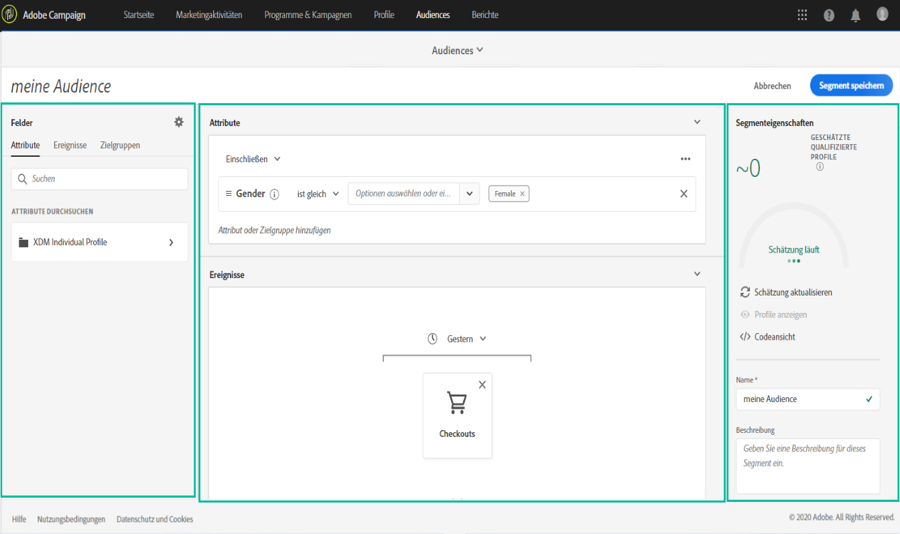

## Erstellen eines Segments

Gehen Sie wie folgt vor, um ein Segment zu erstellen:

Der einheitliche Segmentaufbau sollte jetzt in Ihrer Arbeitsfläche angezeigt werden. Damit können Sie ein Segment mithilfe von Daten aus Adobe Experience Platform erstellen, die letztendlich zur Erstellung Ihrer Audience verwendet werden.

1. Benennen Sie das Segment und geben Sie dann eine Beschreibung ein (optional).

   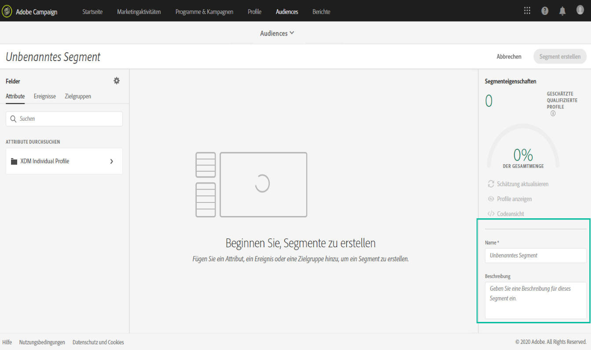

1. Vergewissern Sie sich, dass die gewünschte Richtlinie für die Zusammenführung im Einstellungsbereich ausgewählt ist.

   Weitere Informationen zu Zusammenführungsrichtlinien finden Sie im entsprechenden Abschnitt im [Segment Builder-Benutzerhandbuch](https://docs.adobe.com/content/help/en/experience-platform/segmentation/ui/overview.html).

   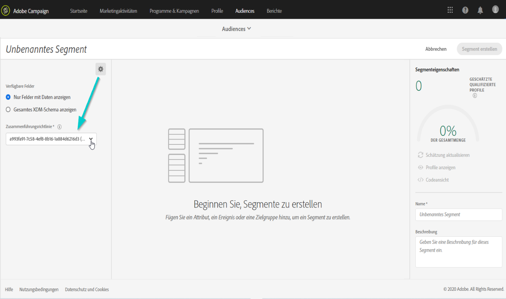

1. Suchen Sie die gewünschten Felder im linken Bereich und ziehen Sie sie in den mittleren Arbeitsbereich.

   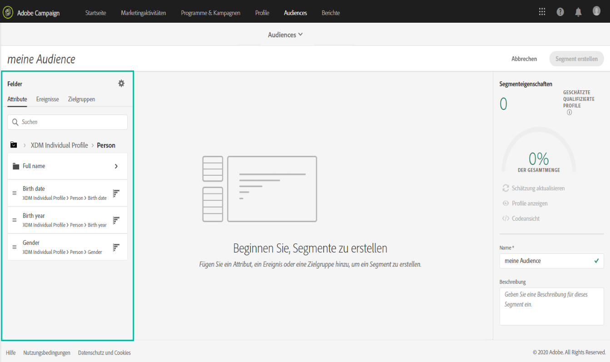

1. Konfigurieren Sie die Regeln für die gezogenen Felder.

   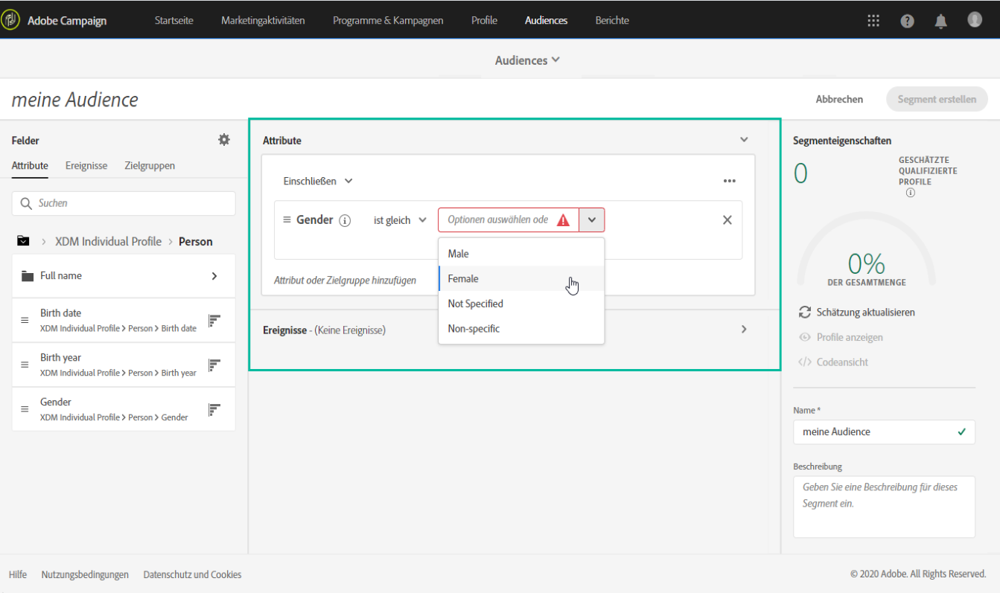

1. Click the **[!UICONTROL Create segment]** button.

## Die richtigen Felder für ein Segment suchen

Im linken Bereich werden alle Attribute, Ereignis und Audiencen Liste, die zum Erstellen von Regeln zur Verfügung stehen.

Die aufgeführten Felder sind Attribute, die von Ihrer Firma erfasst werden und über das [Erlebnisdatenmodell (XDM) zur Verfügung gestellt wurden](https://docs.adobe.com/content/help/en/experience-platform/xdm/home.html).

Die Felder sind in Registerkarten unterteilt:

* **[!UICONTROL Attributes]**: Vorhandene Attribute von Profilen, die aus Ihrer Adobe Campaign-Datenbank und/oder Adobe Experience Platform stammen können Sie beziehen sich auf statische Informationen, die an ein Profil angehängt werden (z. B. E-Mail-Adresse, Wohnsitzland, Treuestatus usw.).

   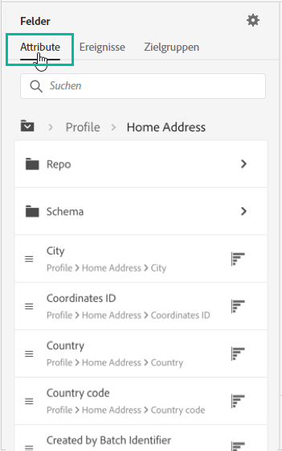

* **[!UICONTROL Events]**: Aktivitäten, die Verbraucher identifizieren, die mit den Touchpoints Ihrer Firma interagiert haben, z. B. &quot;Personen, die zweimal in zwei Wochen bestellt haben&quot;. Dies kann aus Adobe Analytics gestreamt oder mithilfe von ETL-Werkzeugen von Drittanbietern direkt in die Adobe Experience Platform integriert werden.

   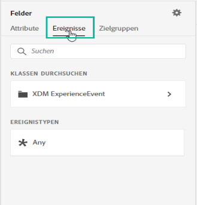

>[!NOTE]
>
>**Mit der Segmentierung** mehrerer Entitäten können Sie Profil-Daten um zusätzliche Daten erweitern, die auf Produktklassen, Stores oder anderen Nicht-Profil-Klassen basieren. Sobald eine Verbindung besteht, stehen Daten aus zusätzlichen Klassen zur Verfügung, als wären sie nativ für das Profil-Schema.
>
>Weiterführende Informationen finden Sie im [entsprechenden Handbuch](https://docs.adobe.com/content/help/en/experience-platform/segmentation/multi-entity-segmentation.html).

Standardmäßig zeigt der Unified Segment Builder Felder an, in denen bereits Daten vorhanden sind. Um das vollständige Schema einschließlich der Felder anzuzeigen, für die keine Daten vorhanden sind, aktivieren Sie die **[!UICONTROL Show full XDM schema]** Option in den Einstellungen.

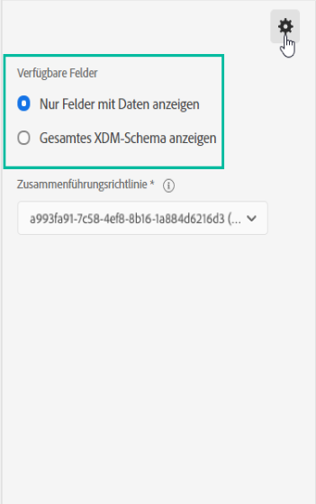

Das Symbol am Ende jedes Felds enthält weitere Informationen zum Attribut und dessen Verwendung.

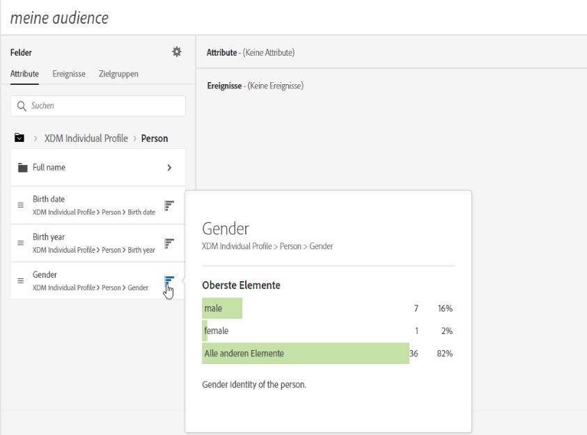

## Definieren von Regeln für ein Segment

>[!NOTE]
>
>Im folgenden Abschnitt finden Sie globale Informationen zur Regeldefinition. Weitere Informationen finden Sie im [Segment Builder-Benutzerhandbuch](https://docs.adobe.com/content/help/en/experience-platform/segmentation/ui/overview.html).

Gehen Sie wie folgt vor, um eine Regel zu erstellen:

1. Suchen Sie im linken Bereich nach dem Feld, das die Attribute oder Ereignis widerspiegelt, auf denen die Regel basiert.

1. Ziehen Sie das Feld in den mittleren Arbeitsbereich und konfigurieren Sie es dann entsprechend der gewünschten Segmentdefinition. Dazu stehen mehrere Funktionen für Zeichenfolge und Datum/Uhrzeit zur Verfügung.

   Im folgenden Beispiel werden alle Profil mit einem Geschlecht, das &quot;Männlich&quot;entspricht, mit der Regel Zielgruppe.

   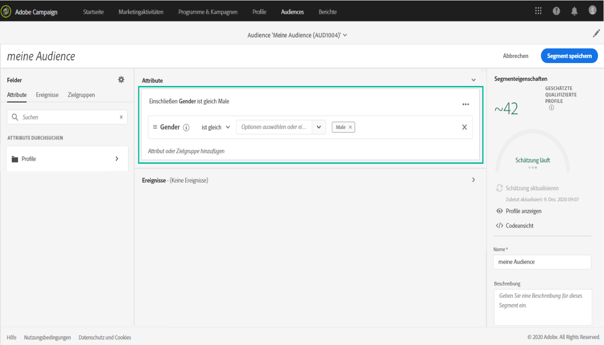

   Die geschätzte Population, die dem Segment entspricht, wird im **[!UICONTROL Segment Properties]** Abschnitt automatisch neu berechnet.

1. Über die **[!UICONTROL View Profiles]** Schaltfläche erhalten Sie eine Vorschau der ersten 20 Datensätze, die der Regel entsprechen, sodass Sie das Segment schnell validieren können.

   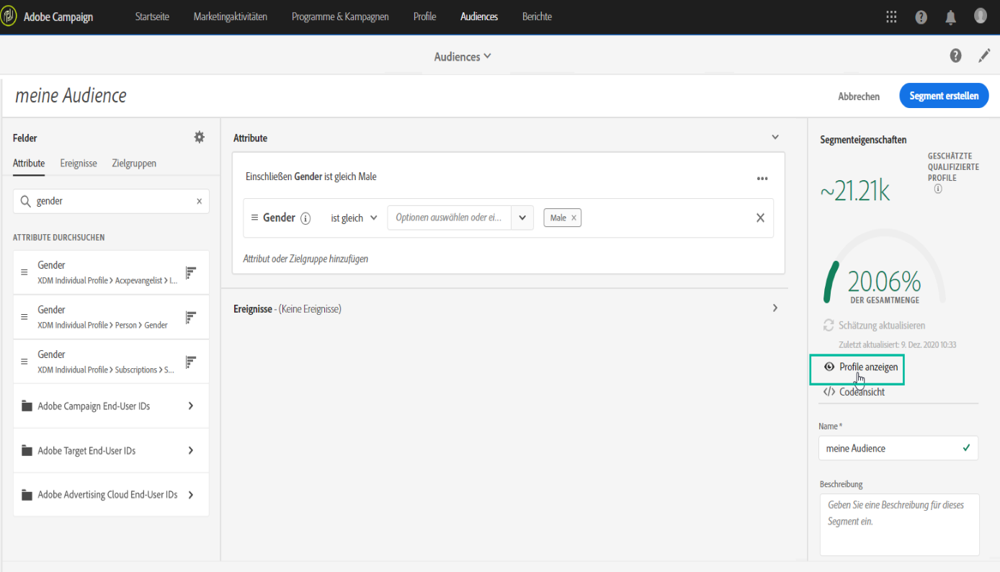

   Sie können beliebig viele zusätzliche Regeln hinzufügen, um die richtigen Profil Zielgruppe.

   Wenn Sie einem Container eine Regel hinzufügen, wird sie mit dem logischen UND-Operator an alle vorhandenen Regeln angehängt. Klicken Sie bei Bedarf auf den logischen Operator, um ihn zu ändern.

   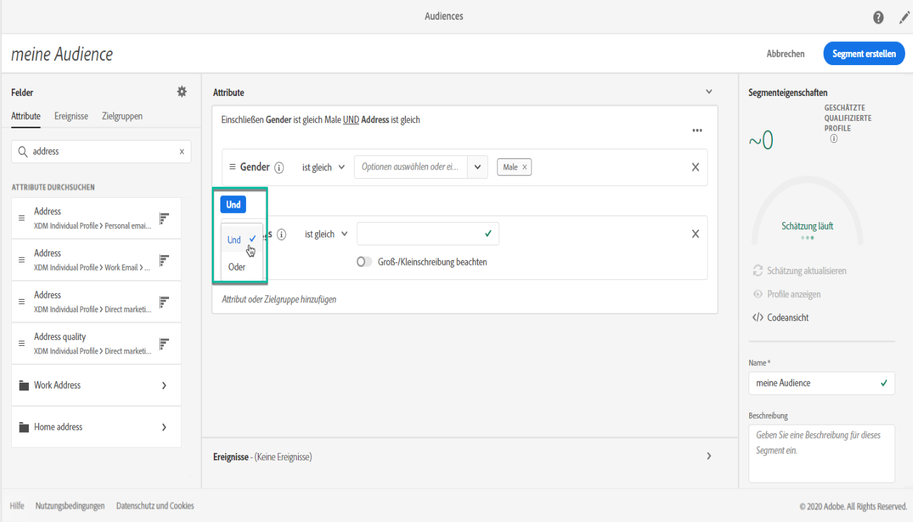

Sobald beide Regeln miteinander verknüpft sind, bilden sie einen Container.

## Felder vergleichen

Mit dem einheitlichen Segmentaufbau können Sie zwei Felder vergleichen, um eine Regel zu definieren. Weibchen, deren Hausadresse sich beispielsweise in einer anderen Postleitzahl als ihre Arbeitsadresse befindet.

Gehen Sie dazu wie folgt vor:

1. Ziehen Sie das erste Feld, das Sie vergleichen möchten (z. B. die Postleitzahl der Hausadresse), in den Arbeitsbereich der Mitte.

   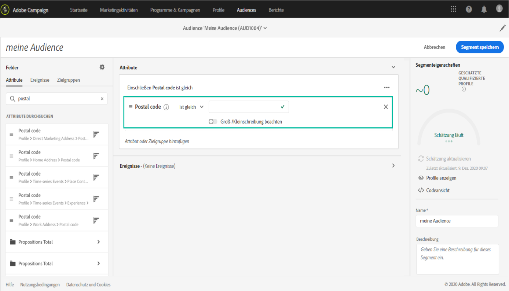

1. Wählen Sie das zweite Feld (z. B. die Arbeitsadresse Postleitzahl) aus, das mit dem ersten Feld verglichen wird.

   Ziehen Sie es in den mittleren Arbeitsbereich im gleichen Container wie das erste Feld im **[!UICONTROL Drop here to compare operands]** Feld.

   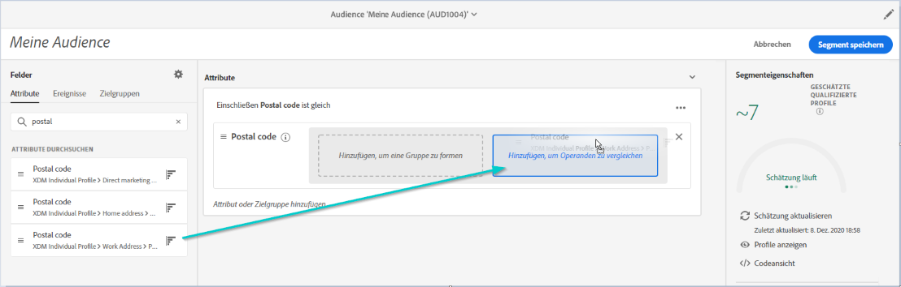

1. Konfigurieren Sie den Operator zwischen den beiden Feldern nach Bedarf. In diesem Beispiel möchten wir, dass unser Segment Profil mit einer anderen Hausadresse als der Arbeitsadresse Zielgruppe.

   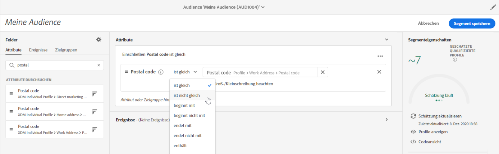

Die Regel ist jetzt konfiguriert und kann als Audience aktiviert werden.
