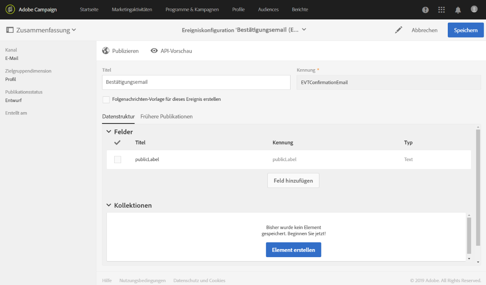
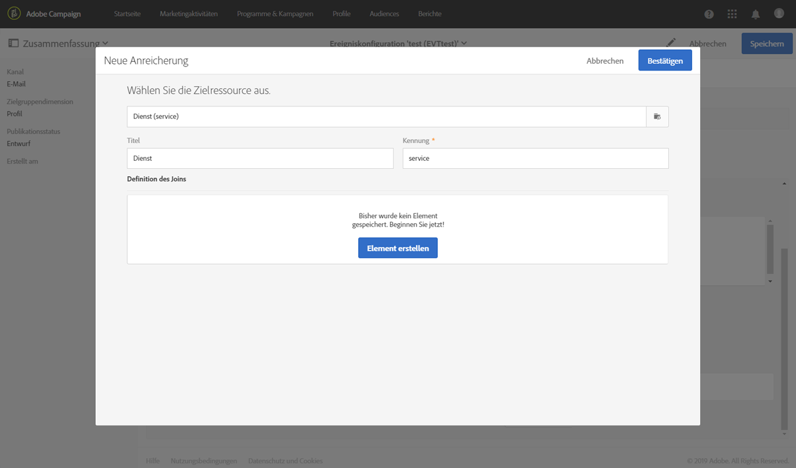
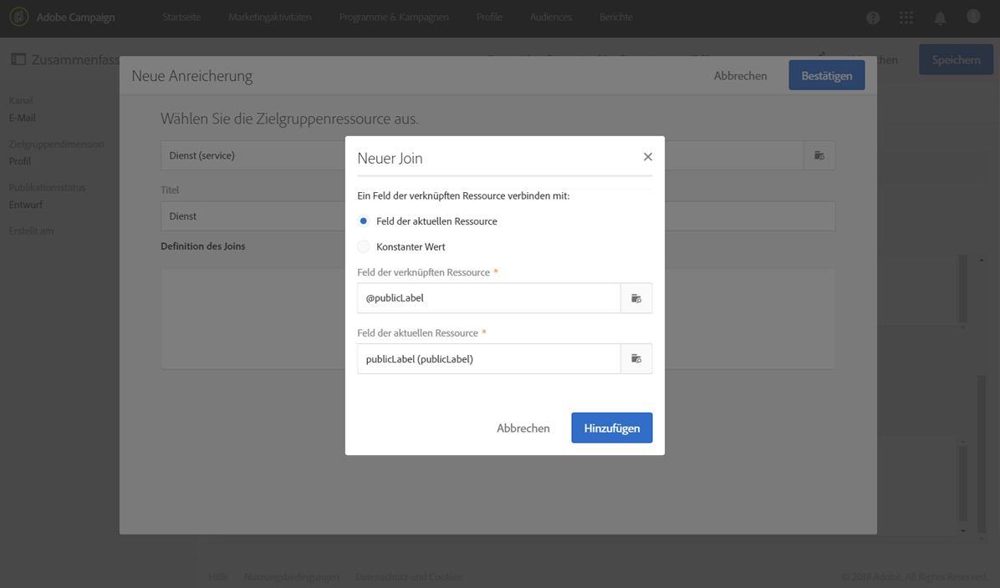
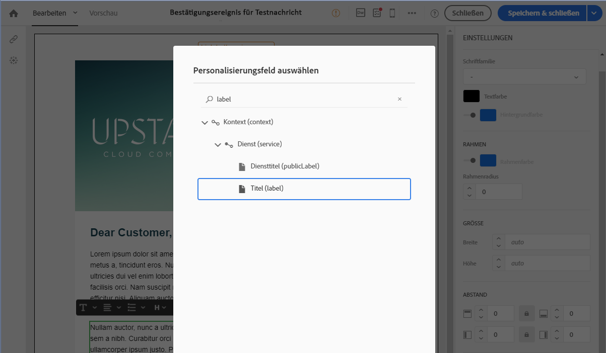
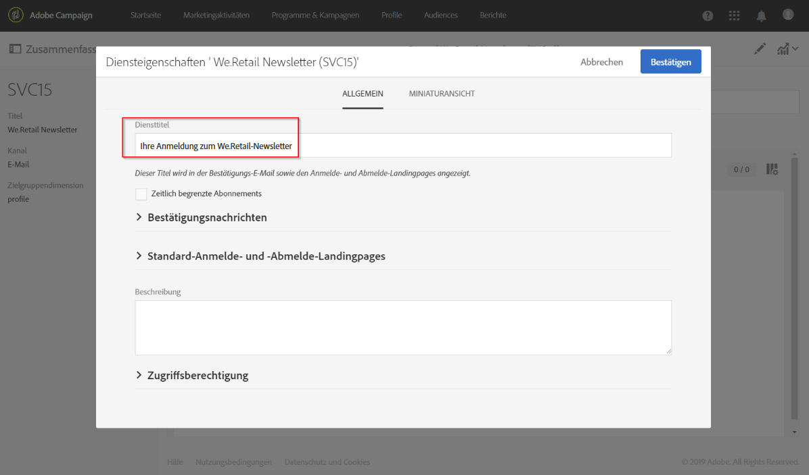
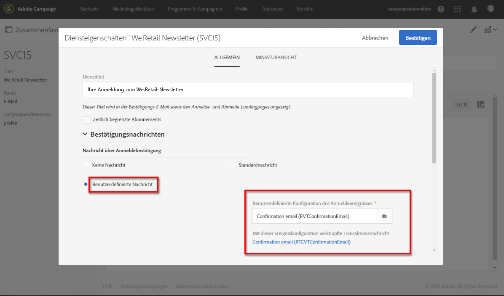
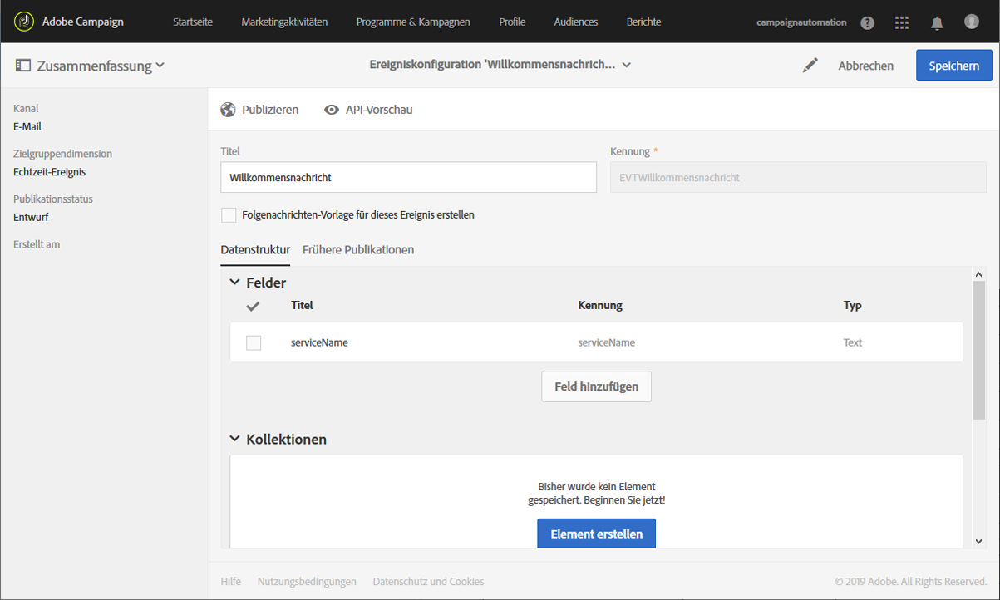
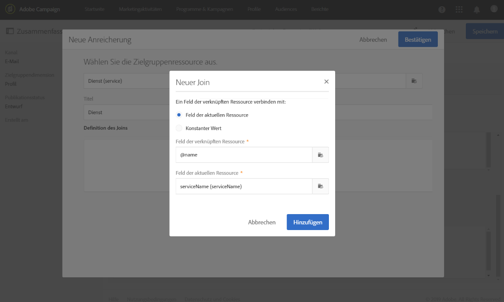
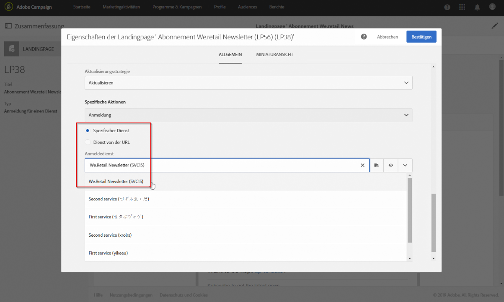
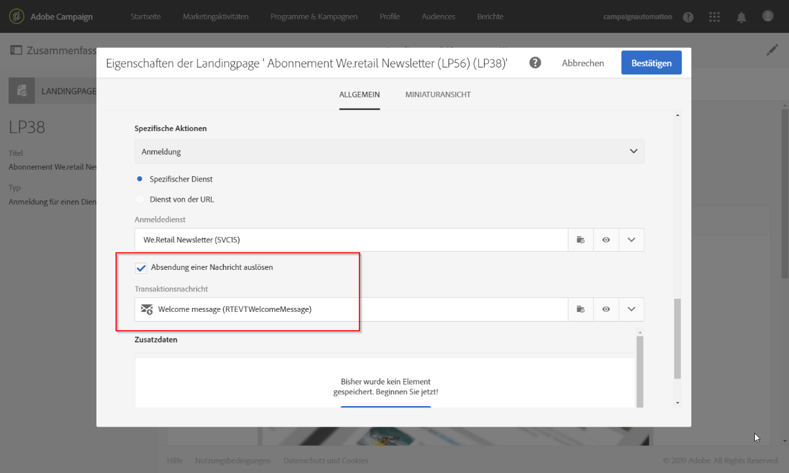

# Abonnement eines Dienstes bestätigen{#confirming-subscription-to-a-service}

## Senden einer Anmeldebestätigung {#sending-subscription-confirmation}

In diesem Abschnitt wird beschrieben, wie Sie eine automatische benutzerdefinierte Bestätigungs-E-Mail an Profile senden, die einen Dienst abonnieren.

Sie können zur Bestätigung einer Anmeldung (oder der Abmeldung) für ein Abonnement entweder die Standardnachricht oder eine benutzerdefinierte Nachricht verwenden. Die Schritte zur Auswahl einer Bestätigungsnachricht finden Sie im Abschnitt [Dienst erstellen](../../audiences/using/creating-a-service.md).

Wenn Sie die Standardnachricht verwenden, können Sie den Inhalt mit folgenden Einschränkungen bearbeiten:
* Sie können zur Personalisierung des Nachrichteninhalts nur eine begrenzte Anzahl von Feldern aus dem Ereigniskontext verwenden.
* Die Nachricht ist für alle Dienste, die den Standardmodus verwenden, identisch.

Um eine speziell auf einen Dienst abgestimmte Bestätigungs-E-Mail zu senden, können Sie eine benutzerdefinierte Nachricht erstellen, in der Sie auch Personalisierungsfelder von anderen Ressourcen nutzen können. Dazu müssen Sie eine Transaktionsnachricht erstellen und konfigurieren. Zu dieser Nachricht kann ein Verweis erstellt werden:
* Über den Dienst selbst. Weiterführende Informationen dazu finden Sie im Abschnitt [Bestätigungsnachricht über einen Dienst konfigurieren](#configuring-confirmation-message-from-service).
* Über eine Anmelde-Landingpage. Weiterführende Informationen dazu finden Sie im Abschnitt [Bestätigungsnachricht über eine Landingpage konfigurieren](#configuring-confirmation-message-from-landing-page).

## Bestätigungsnachricht über einen Dienst konfigurieren {#configuring-confirmation-message-from-service}

Nehmen wir an, Sie möchten Besuchern Ihrer Website, die Ihren Unternehmens-Newsletter abonnieren, automatisch eine Bestätigungsnachricht senden.

Dazu müssen Sie eine Transaktions-E-Mail konfigurieren und vom gewünschten Dienst auf diese Nachricht verweisen (in diesem Fall ist der Dienst das Abonnement Ihres Unternehmens-Newsletters). Um die Transaktionsnachricht mit Dienstinformationen anzureichern, können Sie beim Erstellen des Ereignisses eine Abstimmung definieren.

Wenn diese Nachricht über den Dienst konfiguriert wird, wird die Transaktionsnachricht zur Bestätigung nur gesendet, wenn ein Besucher diesen Dienst zum ersten Mal abonniert. Wenn ein Profil den Dienst bereits abonniert hat, wird keine weitere Bestätigungsnachricht an dieses Profil gesendet.

### Schritt 1: Bestätigungs-E-Mail erstellen {#step-1--create-the-confirmation-email-1}

Eine Bestätigungs-E-Mail wird automatisch an jedes Profil gesendet, das den Newsletter abonniert (über eine Landingpage oder andere Wege). Das Abonnement gilt als Ereignis und die E-Mail ist eine [Transaktionsnachricht](../../channels/using/getting-started-with-transactional-msg.md), die an jedes Profil gesendet wird, das den Dienst abonniert.

Die Schritte zum Erstellen der Bestätigungs-E-Mail werden unten beschrieben. Da im Dienst auf die Transaktionsnachricht verwiesen wird, müssen Sie diesen zuerst erstellen.

#### Ereignis erstellen    {#create-the-event-1}

Die Bestätigungs-E-Mail ist eine Transaktionsnachricht, da sie auf ein Ereignis reagiert, nämlich das Abonnement eines Dienstes. Diese Nachricht wird gesendet, um die Anmeldung zu einem Abonnement für Ihren Newsletter zu bestätigen.

1. Greifen Sie über das Adobe Campaign-Logo auf **[!UICONTROL Marketingpläne]** > **[!UICONTROL Transaktionsnachrichten]** > **[!UICONTROL Ereigniskonfiguration]** zu und erstellen Sie ein Ereignis.
1. Geben Sie einen Titel ein und wählen Sie eine Zielgruppendimension und danach **[!UICONTROL Erstellen]** aus.

   Die Konfigurationsschritte werden im Abschnitt [Konfigurieren eines transaktionalen Ereignisses](../../channels/using/configuring-transactional-event.md) beschrieben.

1. Wählen Sie im Bereich **[!UICONTROL Felder]** die Option **[!UICONTROL Element erstellen]** aus und fügen Sie **[!UICONTROL publicLabel]** in der Datenstruktur hinzu, um eine Abstimmung zu ermöglichen.

   

   >[!NOTE]
   >
   >Das Feld **[!UICONTROL publicLabel]** muss unbedingt ausgefüllt werden. Wenn Sie diese Feld nicht zur Ereignisdatenstruktur hinzufügen, kann Adobe Campaign keine Abstimmung mit dem Dienst durchführen. Beim Abonnieren eines Dienstes wird dieses Feld mit dem **[!UICONTROL Diensttitel]** des entsprechenden Dienstes ausgefüllt.

1. Wählen Sie im Bereich **[!UICONTROL Anreicherung]** die Option **[!UICONTROL Element erstellen]** und danach die Zielressource **[!UICONTROL Dienst]** aus.

   

1. Mappen Sie im Bereich **[!UICONTROL Definition des Joins]** das Feld **[!UICONTROL publicLabel]** der Ressource **[!UICONTROL Dienst]** mit dem Feld **[!UICONTROL publicLabel]** der Ereigniskonfiguration.

   

   >[!NOTE]
   >
   >Auf diese Weise können Sie Personalisierungsfelder aus der Ressource **[!UICONTROL Dienst]** in der Transaktionsnachricht verwenden.

1. Speichern Sie die Ereigniskonfiguration und wählen Sie **[!UICONTROL Publizieren]** aus, um das Ereignis zu publizieren.

Das Ereignis ist somit fertig eingerichtet. Jetzt können Sie die Transaktions-E-Mail erstellen.

#### Bestätigungsnachricht erstellen     {#design-the-confirmation-message-1}

Die Bestätigungs-E-Mail ist eine Transaktionsnachricht, die auf dem soeben publizierten Ereignis basiert.

1. Wählen Sie ausgehend vom Adobe Campaign-Logo die Option **[!UICONTROL Marketingpläne]** > **[!UICONTROL Transaktionsnachrichten]** und nochmals **[!UICONTROL Transaktionsnachrichten]**.
1. Wählen Sie die entsprechende Transaktions-E-Mail für das Ereignis aus, das Sie gerade veröffentlicht haben.

1. Wählen Sie im Bereich **[!UICONTROL Inhalt]** eine E-Mail-Vorlage aus. Weitere Informationen zum Bearbeiten von Transaktionsnachrichten finden Sie unter [Bearbeiten von Transaktionsnachrichten](../../channels/using/editing-transactional-message.md).
1. Da Sie von der Ressource **[!UICONTROL Dienst]** aus auf alle Felder direkt zugreifen können, können Sie ein beliebiges Feld aus dem Knoten **[!UICONTROL Kontext]** > **[!UICONTROL Echtzeit-Ereignis (rtEvent)]** > **[!UICONTROL Ereigniskontext (ctx)]** > **[!UICONTROL Dienst]** auswählen, um Ihren Inhalt zu personalisieren.

   

   Weitere Informationen zum Personalisieren einer Transaktionsnachricht finden Sie in [diesem Abschnitt](../../channels/using/editing-transactional-message.md#personalizing-a-transactional-message).

1. Sehen Sie sich Ihre Nachricht unter Verwendung eines Testprofils in der Vorschau an. Weitere Informationen hierzu finden Sie unter Definieren eines bestimmten Profils[.](../../channels/using/testing-transactional-message.md#defining-specific-test-profile)

1. Wählen Sie **[!UICONTROL Speichern &amp; schließen]** aus, um den Inhalt zu speichern.
1. Publizieren Sie die Transaktionsnachricht. Siehe [Transaktionsnachricht publizieren](../../channels/using/publishing-transactional-message.md#publishing-a-transactional-message).

### Schritt 2: Dienst erstellen und konfigurieren {#step-2--create-and-configure-the-service-1}

1. Erstellen Sie ausgehend vom Adobe Campaign-Logo im erweiterten Menü **Profile &amp; Audiences** > **Dienste** einen Dienst.
1. Gehen Sie zum Bereich **[!UICONTROL Diensteigenschaften]**, auf den Sie über die Schaltfläche  im Dienst-Dashboard zugreifen können.
1. Füllen Sie das Feld **[!UICONTROL Diensttitel]** aus.

   

   >[!NOTE]
   >
   >Sie müssen dieses Feld ausfüllen, um eine Abstimmung mit der Transaktionsnachricht zu ermöglichen.

1. Wählen Sie im Bereich **[!UICONTROL Bestätigungsnachrichten]** die Option **[!UICONTROL Benutzerdefinierte Nachricht]** aus: In diesem Modus können Sie für Profile, die Ihren Dienst abonnieren, einen Verweis auf eine spezifische Bestätigungsnachricht erstellen.
1. Wählen Sie die **[!UICONTROL Benutzerdefinierte Konfiguration des Anmeldeereignisses]** aus, die der von Ihnen erstellten Transaktionsnachricht zugeordnet ist.

   

1. Wählen Sie **[!UICONTROL Bestätigen]** aus und speichern Sie den Dienst.

Jetzt erhält jedes Profil, das diesen Dienst abonniert, die von Ihnen definierte Transaktionsnachricht, deren personalisierten Felder mit dem ausgewählten Dienst gemappt sind.

>[!NOTE]
>
>Die Nachricht wird gesendet, wenn sich ein Benutzer zum ersten Mal für das Abonnement anmeldet.

## Bestätigungsnachricht über eine Landingpage konfigurieren {#configuring-confirmation-message-from-landing-page}

Sie können auch auf einer Abonnement-Landingpage einen Verweis auf die Bestätigungsnachricht erstellen, indem Sie die Option **[!UICONTROL Absendung einer Nachricht auslösen]** im Bereich **[!UICONTROL Vorgang]** der Landingpage verwenden.

Beim Verweisen auf die Bestätigungsnachricht über die Landingpage wird jedes Mal eine Nachricht gesendet, wenn auf der Landingpage die Sendefunktion aktiviert wird (auch wenn das Profil bereits ein Abonnement hat).

### Schritt 1: Bestätigungs-E-Mail erstellen {#step-1--create-the-confirmation-email-2}

Über eine Landingpage wird automatisch eine Bestätigungs-E-Mail an jedes Profil gesendet, das den Newsletter abonniert. Das Abonnement gilt als Ereignis und die E-Mail ist eine [Transaktionsnachricht](../../channels/using/getting-started-with-transactional-msg.md), die an jedes Profil gesendet wird, das den Dienst abonniert.

Die Schritte zur Erstellung dieser Elemente werden unten beschrieben. Da der Verweis auf die Transaktionsnachricht über die Landingpage erfolgt, müssen Sie diese zuerst erstellen.

#### Ereignis erstellen     {#create-the-event-2}

Die Bestätigungs-E-Mail ist eine [Transaktionsnachricht](../../channels/using/getting-started-with-transactional-msg.md), da sie auf ein Ereignis reagiert, nämlich das Abonnement eines Dienstes. Diese Nachricht wird gesendet, um die Anmeldung zu einem Abonnement für Ihren Newsletter zu bestätigen.

1. Greifen Sie über das Adobe Campaign-Logo auf **[!UICONTROL Marketingpläne]** > **[!UICONTROL Transaktionsnachrichten]** > **[!UICONTROL Ereigniskonfiguration]** zu und erstellen Sie ein Ereignis.
1. Geben Sie einen Titel ein und wählen Sie eine Zielgruppendimension und danach **[!UICONTROL Erstellen]** aus.

   Die Konfigurationsschritte werden im Abschnitt [Konfigurieren eines transaktionalen Ereignisses](../../channels/using/configuring-transactional-event.md) beschrieben.

1. Wählen Sie im Bereich **[!UICONTROL Felder]** die Option **[!UICONTROL Element erstellen]** aus und fügen Sie **[!UICONTROL serviceName]** in der Datenstruktur hinzu, um eine Abstimmung zu ermöglichen.

   

   >[!NOTE]
   >
   >Das Feld **[!UICONTROL serviceName]** muss ausgefüllt werden. Wenn Sie dieses Feld nicht zur Ereignisdatenstruktur hinzufügen, kann Adobe Campaign keine Abstimmung mit dem abonnierten Dienst durchführen.

1. Wählen Sie im Bereich **[!UICONTROL Anreicherung]** die Option **[!UICONTROL Element erstellen]** und danach die Zielressource **[!UICONTROL Dienst]** aus.
1. Mappen Sie im Bereich **[!UICONTROL Definition des Joins]** das Feld **[!UICONTROL serviceName]** der Ressource **[!UICONTROL Dienst]** mit dem Feld **[!UICONTROL name]** der Ereigniskonfiguration.

   

   >[!NOTE]
   >
   >Auf diese Weise können Sie Personalisierungsfelder aus der Ressource [!UICONTROL Dienst] in der Transaktionsnachricht verwenden.

#### Bestätigungsnachricht erstellen     {#design-the-confirmation-message-2}

Die Schritte zum Erstellen der Transaktionsnachricht werden in diesem [Abschnitt](#design-the-confirmation-message-1) beschrieben.

### Schritt 2: Dienst erstellen und konfigurieren {#step-2--create-and-configure-the-service-2}

1. Erstellen Sie ausgehend vom Adobe Campaign-Logo im erweiterten Menü **[!UICONTROL Profile &amp; Audiences]** > **[!UICONTROL Dienste]** einen Dienst.
1. Gehen Sie zum Bereich **[!UICONTROL Diensteigenschaften]**, auf den Sie über die Schaltfläche  im Dienst-Dashboard zugreifen können.
1. Füllen Sie das Feld **[!UICONTROL Diensttitel]** aus. Dieser Titel wird in der Bestätigungsnachricht sowie in der Anmelde-Landingpage angezeigt.
1. Wählen Sie **[!UICONTROL Bestätigen]** aus und speichern Sie den Dienst.

### Schritt 3: Landingpage erstellen und konfigurieren {#step-3--create-and-configure-the-landing-page}

Erstellen Sie eine Abonnement-Landingpage, die schließlich auf Ihrer Website publiziert wird.

Gehen Sie wie folgt vor, um diese Landingpage zu erstellen und zu konfigurieren:

1. Erstellen Sie auf der Basis der Vorlage [Abonnement](../../channels/using/getting-started-with-landing-pages.md) eine **[!UICONTROL neue Landingpage]**.
1. Bearbeiten Sie die Eigenschaften der Landingpage. Wählen Sie im Bereich **[!UICONTROL Vorgang]** > **[!UICONTROL Spezifische Aktionen]** die Option **[!UICONTROL Spezifischer Dienst]** aus und wählen Sie dann den soeben erstellten Dienst aus der Dropdown-Liste aus.

   

1. Wählen Sie die Option **[!UICONTROL Absendung einer Nachricht auslösen]** und danach die soeben erstellte Transaktionsnachricht aus der Dropdown-Liste aus.

   

1. Passen Sie den Inhalt der Landingpage an.

1. [Testen und publizieren](../../channels/using/testing-publishing-landing-page.md) Sie die Landingpage.

Jedes Mal, wenn jetzt ein Profil Ihren Newsletter abonniert, indem es die Landingpage ausfüllt und auf die Senden-Schaltfläche klickt, erhält es die von Ihnen definierte Bestätigungsnachricht, wobei die personalisierten Felder mit dem Dienst gemappt werden.

>[!NOTE]
>
>Diese Nachricht wird jedes Mal gesendet, wenn auf der Landingpage auf die Senden-Schaltfläche geklickt wird, auch wenn das Profil bereits ein Abonnement hat.
