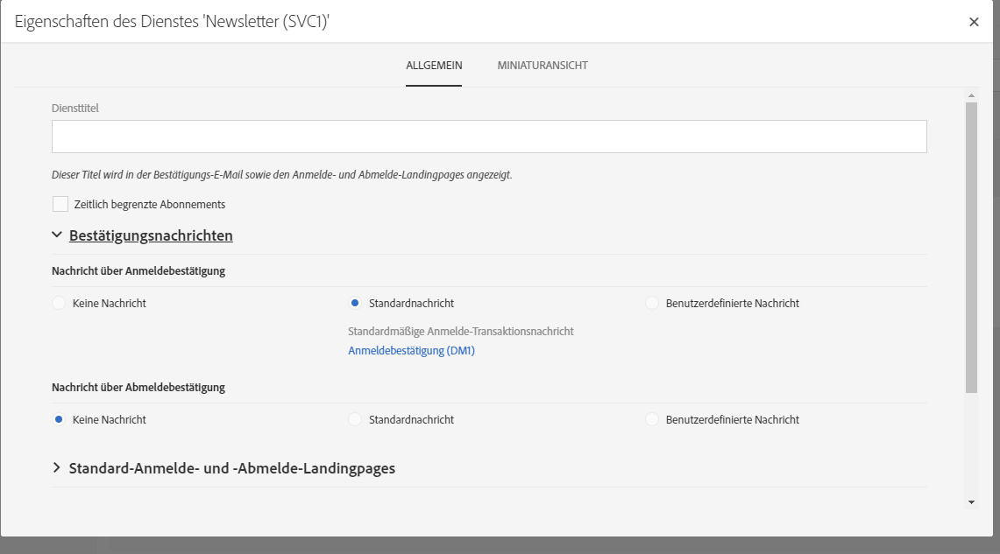
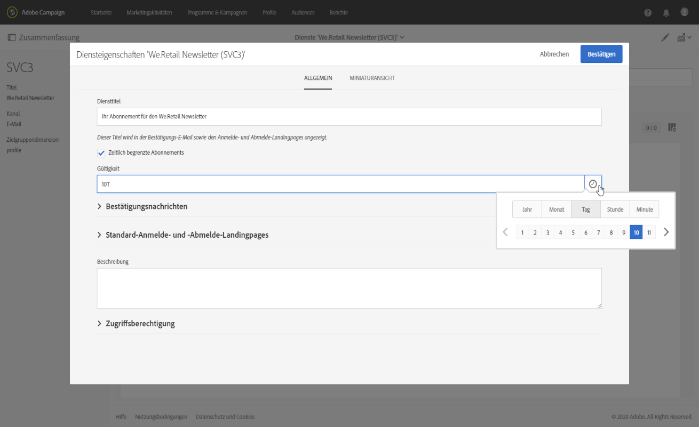

# Service erstellen{#creating-a-service}

Um Anmeldungen verwalten zu können, müssen Sie zunächst einen Dienst erstellen und konfigurieren. Durch die Konfiguration eines neuen Dienstes können Sie die Bestätigungs-E-Mails spezifizieren, welche die Nutzer erhalten, die sich vom Dienst an- oder abmelden. Außerdem definieren Sie dabei die Anmelde- und -Abmelde-Landingpages, die dem Dienst zugeordnet sind. Beispielsweise leitet ein in eine E-Mail eingefügter Anmelde-Link für einen Dienst den Nutzer zu der im Dienst angegebenen Anmelde-Landingpage weiter.

 [Funktion im Video kennenlernen](#video).

So konfigurieren Sie einen Dienst:

1. Greifen Sie mithilfe des Adobe Campaign-Logos oben links im Bildschirm auf das erweiterte Menü **[!UICONTROL Profile &amp; Audiences]** > **[!UICONTROL Dienste]** zu und fügen Sie einen neuen Dienst hinzu oder öffnen Sie einen bestehenden. Bei Erstellung eines neuen Dienstes führt der Assistent Sie Schritt für Schritt durch die Konfiguration.

   Eine Standard-Dienstvorlage steht zur Verfügung. Diese Vorlage ist so vorkonfiguriert, dass sie Standard-Landingpages und -Bestätigungs-E-Mails enthält. Sie haben jedoch die Möglichkeit der Erstellung anderer Vorlagen, wenn Sie spezielle Parameter angeben möchten. Weiterführende Informationen finden Sie im Abschnitt [Marketingaktivitäten-Vorlagen](../../start/using/marketing-activity-templates.md).

1. Gehen Sie mithilfe der Schaltfläche **[!UICONTROL in die]** Eigenschaften des Dienstes und konfigurieren Sie die Bestätigungsnachrichten, die bei Anmeldungen oder Abmeldungen versendet werden sollen.

   

1. Wählen Sie die Option **[!UICONTROL Zeitlich begrenzte Abonnements]** aus, um eine Gültigkeit für das Abonnement festzulegen.

   

   Sie können das Ablaufdatum in einer Segmentierungsaktivität verwenden, um Profile anzusprechen, die einen Dienst abonniert haben, der noch nicht abgelaufen ist.

1. Füllen Sie das Feld **[!UICONTROL Diensttitel]** aus. Der Diensttitel ist bei Verwendung einer benutzerdefinierten Bestätigungsnachricht obligatorisch.

1. Wählen Sie eine Bestätigungsnachrichtenvorlage für An- und Abmeldungen aus. Drei Modi sind verfügbar:

   * **[!UICONTROL Keine Nachricht]**: Mit diesem Modus können Sie einen Dienst ohne Bestätigungsnachricht erstellen.
   * **[!UICONTROL Standardnachricht]**: Bei diesem Modus wird die standardmäßige Bestätigungs-Transaktionsnachricht für An- oder Abmeldungen verwendet. Die Standard-Bestätigungsnachrichten sind allgemein gehalten und für alle Dienste identisch, die den Standardmodus verwenden.

     >[!NOTE]
     >
     >Sie können eine Standardnachricht ändern, indem Sie im Bereich **[!UICONTROL Diensteigenschaften]** auf deren Titel klicken oder indem Sie die Nachricht in der Liste der Transaktionsnachrichten von Adobe Campaign auswählen, nachdem Sie das Feld **[!UICONTROL Interne Transaktionsnachrichten zeigen]** aktiviert haben.

   * **[!UICONTROL Benutzerdefinierte Nachricht]**: In diesem Modus können Sie benutzerdefinierte Bestätigungsnachrichten verwenden, die für jeden Dienst anders sind. Wählen Sie hierfür die Option **[!UICONTROL Benutzerdefinierte Konfiguration des Anmeldeereignisses]** aus. Diese Konfiguration ist mit einer bestimmten [Transaktionsnachrichtenvorlage](../../channels/using/getting-started-with-transactional-msg.md) verknüpft. Weiterführende Informationen dazu finden Sie im Abschnitt zum [Bestätigen des Abonnements eines Dienstes](../../audiences/using/confirming-subscription-to-a-service.md).

1. Speichern Sie den Dienst. Dieser kann nun verwendet werden.

Nachdem ein Dienst erstellt wurde, können Sie damit beginnen, ihn zu bewerben.

**Verwandte Themen:**

* [Dienst bewerben](../../audiences/using/promoting-a-service.md)
* [Erstellen einer Audience aus Abonnenten](../../audiences/using/creating-audiences.md#creating-list-audiences)
* [Verknüpfen einer Landingpage mit einem Service](../../channels/using/configuring-landing-page.md#linking-a-landing-page-to-a-service)

## Anleitungsvideo {#video}

In diesem Video wird gezeigt, wie man einen Dienst erstellt und seine Abonnements verwaltet.

>[!VIDEO](https://video.tv.adobe.com/v/30225?quality=12&captions=ger)

Weitere Anleitungsvideos zu Campaign Standard finden Sie [hier](https://experienceleague.adobe.com/docs/campaign-standard-learn/tutorials/overview.html?lang=de).
