# Erstellen von Audiences{#creating-audiences}

## Audiences vom Typ Abfrage erstellen {#creating-query-audiences}

In diesem Abschnitt wird die Erstellung einer Audience vom Typ **Abfrage** beschrieben. Audiences lassen sich des Weiteren in einem [Workflow](../../automating/using/get-started-workflows.md) mithilfe eines Dateiimports oder einer Zielgruppenbestimmung erstellen.

Ausgehend von der Audience-Liste erfolgt die Erstellung von Audiences entweder mittels Abfrage von Adobe-Campaign-Profilen oder durch Importieren einer Zielgruppe aus Adobe Experience Cloud.

1. Der Zugriff auf die Audience-Liste erfolgt über den Tab bzw. die Karte **[!UICONTROL Audiences]**.

   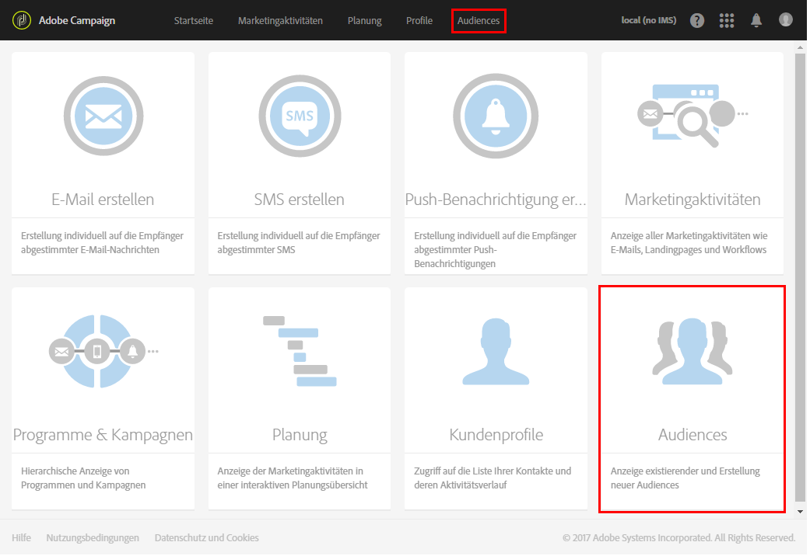

1. Verwenden Sie die Schaltfläche **[!UICONTROL Erstellen]**, um zum Bildschirm für die Audience-Erstellung zu gelangen.

   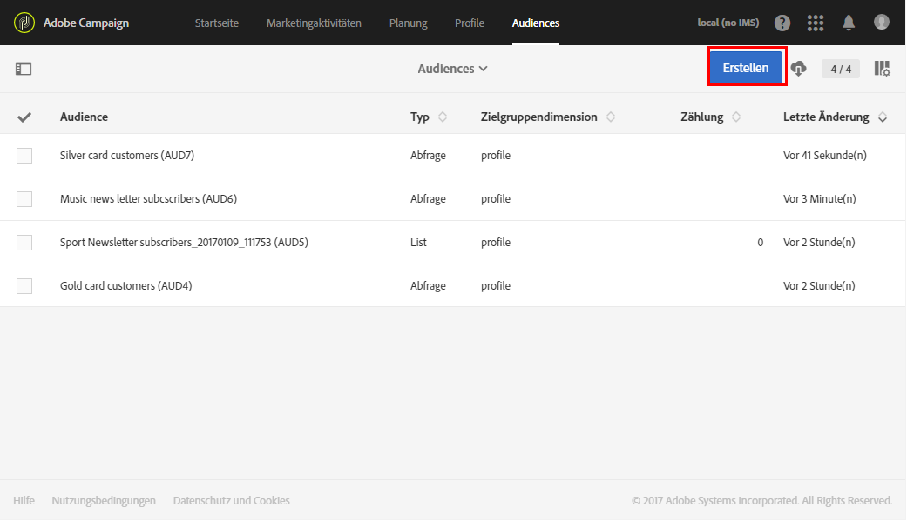

1. Vergeben Sie einen Titel für Ihre Audience. Der Titel wird in der Audience-Liste und in der Palette des Abfragetools verwendet.
1. Wählen Sie dann den Audience-Typ **[!UICONTROL Abfrage]** aus: Mithilfe von Abfragen bestimmte Audiences werden bei jeder nachfolgenden Verwendung neu berechnet.

   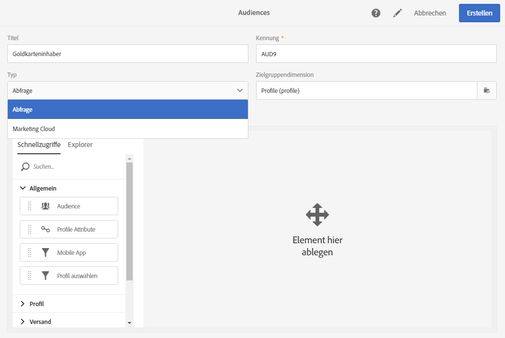

1. Wählen Sie die gewünschte **[!UICONTROL Zielgruppendimension]** zum Filtern Ihrer Kunden aus. Die Zielgruppendimension ist für jede Audience eindeutig. Sie können also keine Audience erstellen, die etwa aus Testprofilen und Abonnenten zugleich besteht. Weiterführende Informationen zum Thema Zielgruppendimension finden Sie auf [dieser Seite](../../automating/using/query.md#targeting-dimensions-and-resources).
1. Erstellen Sie die Abfrage zur Bestimmung der Audience-Population. Lesen Sie diesbezüglich auch den Abschnitt [Abfragen erstellen](../../automating/using/editing-queries.md).
1. Speichern Sie abschließend die Audience mithilfe der Schaltfläche **[!UICONTROL Erstellen]**.

>[!NOTE]
>
>Sie können eine Beschreibung für die Audience hinzufügen und mithilfe des Symbols **[!UICONTROL Eigenschaften bearbeiten]** die Zugriffsberechtigungen bestimmen.

## Audiences vom Typ Liste erstellen {#creating-list-audiences}

In diesem Abschnitt wird die Erstellung einer Audience vom Typ **Liste** beschrieben. Audiences dieser Art werden in Workflows unter Verwendung von Zielgruppenbestimmungsaktivitäten erstellt. Zusätzlich können Sie Audiences mithilfe eines Dateiimports in einem [Workflow](../../automating/using/get-started-workflows.md) oder im **[!UICONTROL Audiences]**-Menü mithilfe einer Abfrage erstellen.

Gehen Sie zur Erstellung einer Audience vom Typ **Liste** wie folgt vor:

1. Wählen Sie im Tab **Marketing-Aktivitäten** die Option **Erstellen** und dann **Workflow**.

   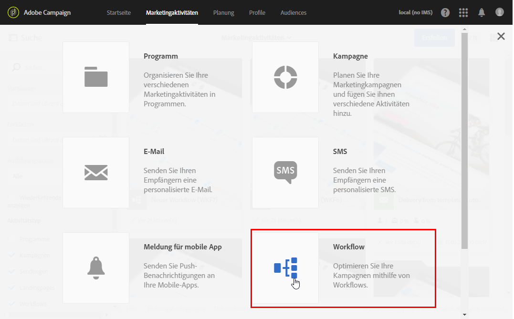

1. Platzieren und konfigurieren Sie Zielgruppenbestimmungsaktivitäten im Workflow-Arbeitsbereich, um eine Population auszuwählen, deren Dimension **bekannt** ist. Die Liste der verfügbaren Aktivitäten und die entsprechenden Konfigurationen werden im Abschnitt [Über Zielgruppenbestimmungsaktivitäten](../../automating/using/about-targeting-activities.md) erläutert.

   Sie können die Aktivität **[!UICONTROL Abfrage]** verwenden oder Daten mithilfe der Aktivität **[!UICONTROL Datei laden]** importieren und daraufhin die Aktivität **[!UICONTROL Abstimmung]** verwenden, um die Dimension der importierten Daten zu ermitteln. In diesem Beispiel sollen mithilfe einer **[!UICONTROL Abfrage]**-Aktivität die Zielgruppe der Empfänger angesprochen werden, die den Sport-Newsletter abonniert haben.

   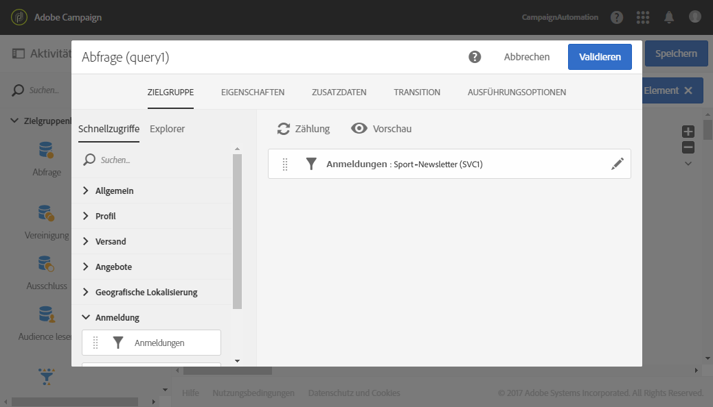

1. Platzieren Sie im Anschluss an die Zielgruppenbestimmung eine **[!UICONTROL Audience-Speicherung]** im Workflow-Diagramm. Beispielsweise können Sie die Option **[!UICONTROL Audience erstellen oder aktualisieren]** auswählen. Dadurch können Sie eine Audience erstellen und anschließend automatisch mit neuen Daten aktualisieren. Fügen Sie in diesem Fall die Aktivität **[!UICONTROL Planung]** am Anfang des Workflows hinzu.

   Weiterführende Informationen zur Konfiguration und Verwendung dieser Aktivität finden Sie im Abschnitt [Audience-Speicherung](../../automating/using/save-audience.md).

   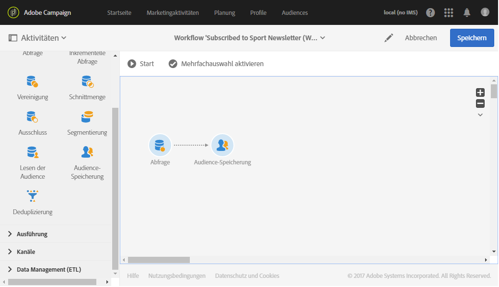

1. Speichern und starten Sie den Workflow.

   Da die **[!UICONTROL Audience-Speicherung]** auf eine Zielgruppenbestimmung mit bekannter Dimension folgt, sind die mithilfe dieser Aktivität erstellten Audiences vom Typ **Liste**.

   Der Inhalt der gespeicherten Audience kann anschließend in der Detailansicht der Audience eingesehen werden. Auf letztere können Sie in der Liste der Audiences zugreifen. Die in dieser Ansicht gezeigten Spalten entsprechen den Spalten der in die Speicherungsaktivität des Workflows eingehenden Transition. Dies sind beispielsweise die Spalten der importierten Datei, über eine Abfrage hinzugefügte Zusatzdaten etc.

   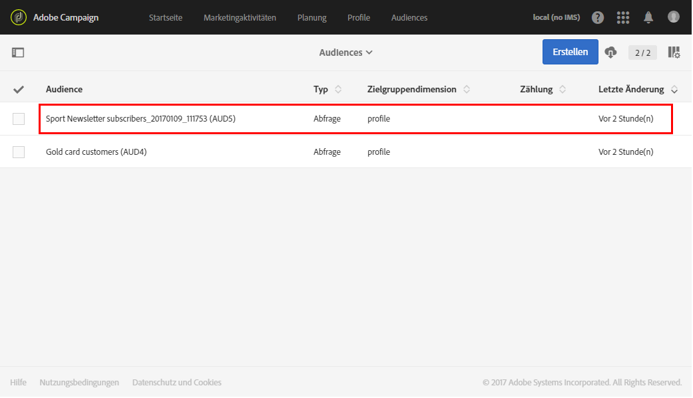

## Audiences vom Typ Datei erstellen      {#creating-file-audiences}

In diesem Abschnitt wird die Erstellung einer Audience vom Typ **Datei** mithilfe eines Dateiimports in einem Workflow beschrieben. Zusätzlich können Sie Audiences im Anschluss an eine Zielgruppenbestimmung in einem [Workflow](../../automating/using/get-started-workflows.md) oder im **[!UICONTROL Audiences]**-Menü mithilfe einer Abfrage erstellen.

Gehen Sie zur Erstellung einer Audience vom Typ **Datei** wie folgt vor:

1. Wählen Sie im Tab **Marketing-Aktivitäten** die Option **Erstellen** und dann **Workflow**.
1. Platzieren und konfigurieren Sie eine **[!UICONTROL Datei-laden]**-Aktivität im Workflow-Arbeitsbereich, um eine Population zu importieren, deren Dimension zum Zeitpunkt der Workflow-Ausführung **unbekannt** ist. Weiterführende Informationen zur Konfiguration und Verwendung dieser Aktivität finden Sie im Abschnitt [Datei laden](../../automating/using/load-file.md).

   

1. Schließen Sie eine **[!UICONTROL Audience-Speicherung]** an die **[!UICONTROL Datei-laden]**-Aktivität an. Weiterführende Informationen zur Konfiguration und Verwendung dieser Aktivität finden Sie im Abschnitt [Audience-Speicherung](../../automating/using/save-audience.md).
1. Speichern und starten Sie den Workflow.

   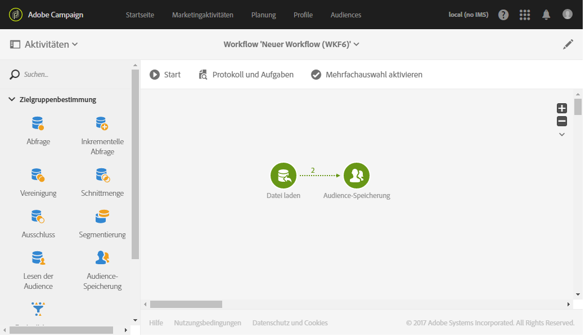

   Da die **[!UICONTROL Audience-Speicherung]** auf einen Import folgt, ist die Dimension der Daten unbekannt und die mithilfe dieser Aktivität erstellten Audiences sind vom Typ **Datei**.

   Der Inhalt der gespeicherten Audience kann anschließend in der Detailansicht der Audience eingesehen werden. Auf letztere können Sie in der Liste der Audiences zugreifen. Die in dieser Ansicht gezeigten Spalten entsprechen den Spalten der in die Speicherungsaktivität des Workflows eingehenden Transition. Dies sind beispielsweise die Spalten der importierten Datei, über eine Abfrage hinzugefügte Zusatzdaten etc.

   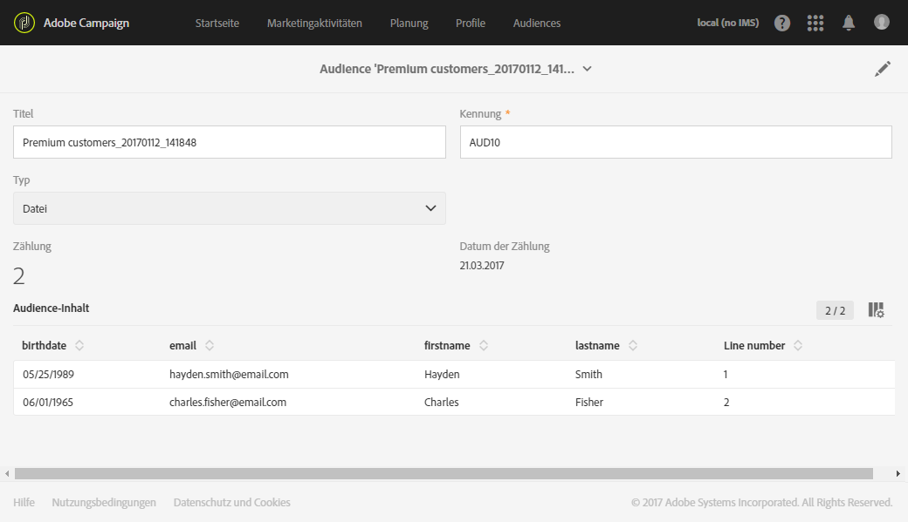

## Erstellen von Experience Cloud-Audiences      {#creating-experience-cloud-audiences}

Adobe Campaign ermöglicht die gemeinsame Nutzung von Audiences mit Adobe Experience Cloud. Eine Audience vom Typ **Experience Cloud** wird direkt von People Core Service in Adobe Campaign mit dem technischen Workflow **[!UICONTROL Freigegebene Zielgruppe importieren]** importiert.

Im Gegensatz zur Audience vom Typ **Abfrage**, mit der Profile in Adobe Campaign abgefragt werden, besteht die Audience vom Typ **Experience Cloud** aus einer Liste mit Besucherkennungen.

Damit diese Integration funktioniert, muss sie zuerst konfiguriert werden. Weiterführende Informationen zur Konfiguration und zum Import oder Export von Audiences mit People Core Service finden Sie im folgenden [Abschnitt](../../integrating/using/sharing-audiences-with-audience-manager-or-people-core-service.md).

## Audiences bearbeiten {#editing-audiences}

Die Vorgehensweise zur Bearbeitung von Audiences hängt vom jeweiligen Typ ab:

* Greifen Sie zur Änderung einer Audience vom Typ **Abfrage** über das **[!UICONTROL Audiences]**-Menü oder die **[!UICONTROL Audiences]**-Karte auf der Adobe-Campaign-Startseite auf die Liste der Audiences zu.

  Öffnen Sie die gewünschte Audience. Alle Elemente einer bereits konfigurierten Audience können geändert werden.

  >[!CAUTION]
  >
  >Wenn Sie die **[!UICONTROL Filterdimension]** einer Abfrage ändern, gehen bereits konfigurierte Regeln verloren.

* Um eine Audience vom Typ **Liste** oder vom Typ **Datei** zu ändern, öffnen Sie den Workflow, von dem aus sie erstellt wurde, und ändern Sie die Aktivität **[!UICONTROL Audience-Speicherung]** ab. Starten Sie den Workflow, damit die Änderungen für die Audience übernommen werden.
* Weiterführende Informationen dazu, wie Sie Audiences vom Typ **Experience Cloud** bearbeiten, finden Sie im Abschnitt [Importieren/Exportieren von Audiences mit People Core Service](../../integrating/using/sharing-audiences-with-audience-manager-or-people-core-service.md).

## Audiences löschen      {#deleting-audiences}

Es gibt zwei Möglichkeiten, um eine oder mehrere Audiences zu löschen. Die erste Möglichkeit besteht darin, zu Ihrer Audience ein Ablaufdatum hinzuzufügen.

Gehen Sie dabei folgendermaßen vor:

1. Öffnen Sie eine Audience.
1. Wählen Sie die Schaltfläche  aus, um auf die Konfiguration der Audience zuzugreifen.

   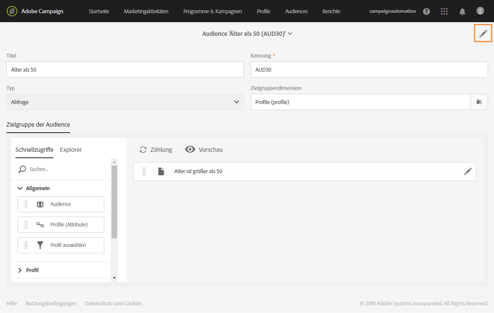

1. Fügen Sie im Feld **[!UICONTROL Läuft ab am]** ein Ablaufdatum für die Audience hinzu.

   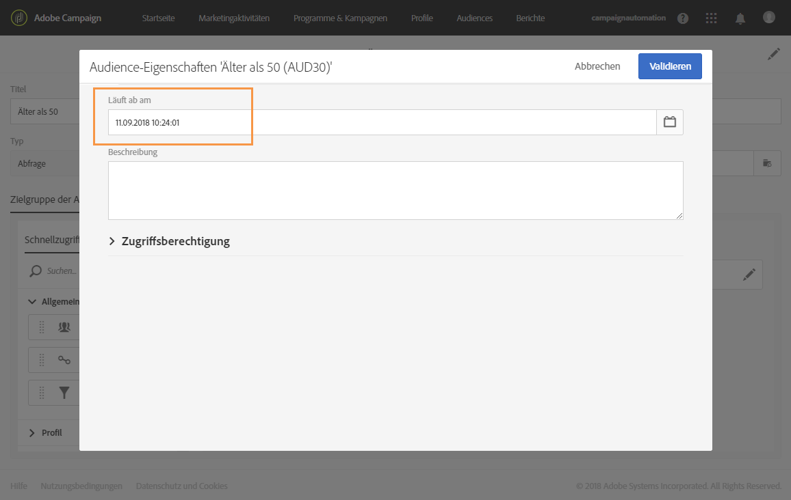

1. Wählen Sie **[!UICONTROL Bestätigen]** und danach **[!UICONTROL Speichern]**.

Ihr Ablaufdatum ist jetzt konfiguriert. Sobald dieses Datum erreicht ist, wird die Audience automatisch gelöscht.

Die zweite Möglichkeit zum Löschen einer Audience besteht darin, eine oder mehrere Audiences und danach die Schaltfläche **[!UICONTROL Element löschen]** auszuwählen.

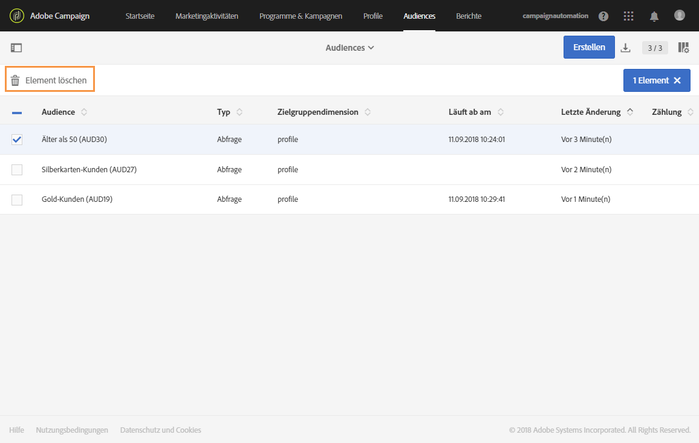
