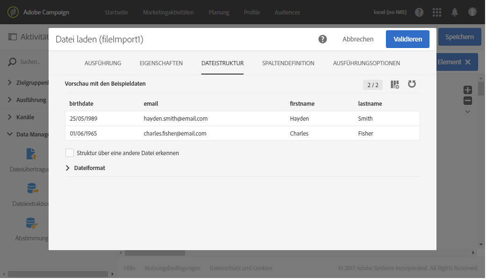

# Erstellen von Zielgruppen{#creating-audiences}

## Zielgruppen vom Typ Abfrage erstellen {#creating-query-audiences}

In diesem Abschnitt wird die Erstellung einer Zielgruppe vom Typ **Abfrage** beschrieben. Audiences lassen sich des Weiteren in einem [Workflow](../../automating/using/get-started-workflows.md) mithilfe eines Dateiimports oder einer Zielgruppenbestimmung erstellen.

Ausgehend von der Audience-Liste erfolgt die Erstellung von Audiences entweder mittels Abfrage von Adobe Campaign-Profilen oder durch Importieren einer Zielgruppe aus Adobe Experience Cloud.

1. Der Zugriff auf die Zielgruppe-Liste erfolgt über den Tab bzw. die Karte **[!UICONTROL Zielgruppen]**.

   

1. Verwenden Sie die Schaltfläche **[!UICONTROL Erstellen]**, um zum Bildschirm für die Zielgruppe-Erstellung zu gelangen.

   

1. Vergeben Sie einen Titel für Ihre Zielgruppe. Der Titel wird in der Zielgruppe-Liste und in der Palette des Abfragetools verwendet.
1. Wählen Sie dann den Zielgruppe-Typ **[!UICONTROL Abfrage]** aus: Mithilfe von Abfragen bestimmte Zielgruppen werden bei jeder nachfolgenden Verwendung neu berechnet.

   

1. Wählen Sie die gewünschte **[!UICONTROL Zielgruppendimension]** zum Filtern Ihrer Kunden aus. Die Zielgruppendimension ist für jede Audience eindeutig. Sie können also keine Zielgruppe erstellen, die etwa aus Testprofilen und Abonnenten zugleich besteht. Weiterführende Informationen zum Thema Zielgruppendimension finden Sie auf [dieser Seite](../../automating/using/query.md#targeting-dimensions-and-resources).
1. Erstellen Sie die Abfrage zur Bestimmung der Zielgruppe-Population. Lesen Sie diesbezüglich auch den Abschnitt [Abfragen erstellen](../../automating/using/editing-queries.md).
1. Speichern Sie abschließend die Zielgruppe mithilfe der Schaltfläche **[!UICONTROL Erstellen]**.

>[!NOTE]
>
>Sie können eine Beschreibung für die Zielgruppe hinzufügen und mithilfe des Symbols **[!UICONTROL Eigenschaften bearbeiten]** die Zugriffsberechtigungen bestimmen.

## Zielgruppen vom Typ Liste erstellen {#creating-list-audiences}

In diesem Abschnitt wird die Erstellung einer Audience vom Typ **Liste** beschrieben. Audiences dieser Art werden in Workflows unter Verwendung von Zielgruppenbestimmungsaktivitäten erstellt. Zusätzlich können Sie Zielgruppen mithilfe eines Dateiimports in einem [Workflow](../../automating/using/get-started-workflows.md) oder im **[!UICONTROL Zielgruppen]**-Menü mithilfe einer Abfrage erstellen.

Gehen Sie zur Erstellung einer Zielgruppe vom Typ **Liste** wie folgt vor:

1. Wählen Sie im Tab **Marketing-Aktivitäten** die Option **Erstellen** und dann **Workflow**.

   

1. Platzieren und konfigurieren Sie Zielgruppenbestimmungsaktivitäten im Workflow-Arbeitsbereich, um eine Population auszuwählen, deren Dimension **bekannt** ist. Die Liste der verfügbaren Aktivitäten und die entsprechenden Konfigurationen werden im Abschnitt [Über Zielgruppenbestimmungsaktivitäten](../../automating/using/about-targeting-activities.md) erläutert.

   Sie können die Aktivität **[!UICONTROL Abfrage]** verwenden oder Daten mithilfe der Aktivität **[!UICONTROL Datei laden]** importieren und daraufhin die Aktivität **[!UICONTROL Abstimmung]** verwenden, um die Dimension der importierten Daten zu ermitteln. In diesem Beispiel sollen mithilfe einer **[!UICONTROL Abfrage]**-Aktivität die Zielgruppe der Empfänger angesprochen werden, die den Sport-Newsletter abonniert haben.

   

1. Platzieren Sie im Anschluss an die Zielgruppenbestimmung eine **[!UICONTROL Audience-Speicherung]** im Workflow-Diagramm. Beispielsweise können Sie die Option **[!UICONTROL Zielgruppe erstellen oder aktualisieren]** auswählen. Dadurch können Sie eine Zielgruppe erstellen und anschließend automatisch mit neuen Daten aktualisieren. Fügen Sie in diesem Fall die Aktivität **[!UICONTROL Planung]** am Anfang des Workflows hinzu.

   Weiterführende Informationen zur Konfiguration und Verwendung dieser Aktivität finden Sie im Abschnitt [Zielgruppe speichern](../../automating/using/save-audience.md).

   

1. Speichern und starten Sie den Workflow.

   Da die **[!UICONTROL Audience-Speicherung]** auf eine Zielgruppenbestimmung mit bekannter Dimension folgt, sind die mithilfe dieser Aktivität erstellten Audiences vom Typ **Liste**.

   Der Inhalt der gespeicherten Zielgruppe kann anschließend in der Detailansicht der Zielgruppe eingesehen werden. Auf letztere können Sie in der Liste der Zielgruppen zugreifen. Die in dieser Ansicht gezeigten Spalten entsprechen den Spalten der in die Speicherungsaktivität des Workflows eingehenden Transition. Dies sind beispielsweise die Spalten der importierten Datei, über eine Abfrage hinzugefügte Zusatzdaten etc.

   

## Zielgruppen vom Typ Datei erstellen      {#creating-file-audiences}

In diesem Abschnitt wird die Erstellung einer Zielgruppe vom Typ **Datei** mithilfe eines Dateiimports in einem Workflow beschrieben. Zusätzlich können Sie Audiences im Anschluss an eine Zielgruppenbestimmung in einem [Workflow](../../automating/using/get-started-workflows.md) oder im **[!UICONTROL Audiences]**-Menü mithilfe einer Abfrage erstellen.

Gehen Sie zur Erstellung einer Zielgruppe vom Typ **Datei** wie folgt vor:

1. Wählen Sie auf der Registerkarte **Marketing-Aktivitäten** die Option **Erstellen** und dann **Workflow**.
1. Platzieren und konfigurieren Sie eine **[!UICONTROL Datei-laden]**-Aktivität im Workflow-Arbeitsbereich, um eine Population zu importieren, deren Dimension zum Zeitpunkt der Workflow-Ausführung **unbekannt** ist. Weiterführende Informationen zur Konfiguration und Verwendung dieser Aktivität finden Sie im Abschnitt [Datei laden](../../automating/using/load-file.md).

   

1. Schließen Sie eine **[!UICONTROL Zielgruppe-speichern]**-Aktivität an die **[!UICONTROL Datei-laden]**-Aktivität an. Weiterführende Informationen zur Konfiguration und Verwendung dieser Aktivität finden Sie im Abschnitt [Zielgruppe speichern](../../automating/using/save-audience.md).
1. Speichern und starten Sie den Workflow.

   

   Da die **[!UICONTROL Zielgruppe-speichern]**-Aktivität auf einen Import folgt, ist die Dimension der Daten unbekannt und die mithilfe dieser Aktivität erstellten Zielgruppen sind vom Typ **Datei**.

   Der Inhalt der gespeicherten Zielgruppe kann anschließend in der Detailansicht der Zielgruppe eingesehen werden. Auf letztere können Sie in der Liste der Zielgruppen zugreifen. Die in dieser Ansicht gezeigten Spalten entsprechen den Spalten der in die Speicherungsaktivität des Workflows eingehenden Transition. Dies sind beispielsweise die Spalten der importierten Datei, über eine Abfrage hinzugefügte Zusatzdaten etc.

   

## Erstellen von Experience Cloud-Audiences      {#creating-experience-cloud-audiences}

Adobe Campaign ermöglicht die gemeinsame Nutzung von Zielgruppen mit Adobe Experience Cloud. Eine Audience vom Typ **Experience Cloud** wird direkt von People Core Service in Adobe Campaign mit dem technischen Workflow **[!UICONTROL Freigegebene Zielgruppe importieren]** importiert.

Im Gegensatz zur Zielgruppe vom Typ **Abfrage**, mit der Profile in Adobe Campaign abgefragt werden, besteht die Zielgruppe vom Typ **Experience Cloud** aus einer Liste mit Besucherkennungen.

Damit diese Integration funktioniert, muss sie zuerst konfiguriert werden. Weiterführende Informationen zur Konfiguration und zum Import oder Export von Zielgruppen mit People Core Service finden Sie im folgenden [Abschnitt](../../integrating/using/sharing-audiences-with-audience-manager-or-people-core-service.md).

## Zielgruppen bearbeiten {#editing-audiences}

Die Vorgehensweise zur Bearbeitung von Zielgruppen hängt vom jeweiligen Typ ab:

* Greifen Sie zur Änderung einer Zielgruppe vom Typ **Abfrage** über das **[!UICONTROL Zielgruppen]**-Menü oder die **[!UICONTROL Zielgruppen]**-Karte auf der Adobe Campaign-Startseite auf die Liste der Zielgruppen zu.

  Öffnen Sie die gewünschte Zielgruppe. Alle Elemente einer bereits konfigurierten Zielgruppe können geändert werden.

  >[!CAUTION]
  >
  >Wenn Sie die **[!UICONTROL Filterdimension]** einer Abfrage ändern, gehen bereits konfigurierte Regeln verloren.

* Um eine Zielgruppe vom Typ **Liste** oder vom Typ **Datei** zu ändern, öffnen Sie den Workflow, von dem aus sie erstellt wurde, und ändern Sie die Aktivität **[!UICONTROL Zielgruppe speichern]** ab. Starten Sie den Workflow, damit die Änderungen für die Zielgruppe übernommen werden.
* Weiterführende Informationen dazu, wie Sie Zielgruppen vom Typ **Experience Cloud** bearbeiten, finden Sie im Abschnitt [Importieren/Exportieren von Zielgruppen mit People Core Service](../../integrating/using/sharing-audiences-with-audience-manager-or-people-core-service.md).

## Zielgruppen löschen      {#deleting-audiences}

Es gibt zwei Möglichkeiten, um eine oder mehrere Zielgruppen zu löschen. Die erste Möglichkeit besteht darin, zu Ihrer Zielgruppe ein Ablaufdatum hinzuzufügen.

Gehen Sie dabei folgendermaßen vor:

1. Öffnen Sie eine Zielgruppe.
1. Wählen Sie die Schaltfläche  aus, um auf die Konfiguration der Zielgruppe zuzugreifen.

   

1. Fügen Sie im Feld **[!UICONTROL Läuft ab am]** ein Ablaufdatum für die Zielgruppe hinzu.

   

1. Wählen Sie **[!UICONTROL Bestätigen]** und danach **[!UICONTROL Speichern]**.

Ihr Ablaufdatum ist jetzt konfiguriert. Sobald dieses Datum erreicht ist, wird die Zielgruppe automatisch gelöscht.

Die zweite Möglichkeit zum Löschen einer Zielgruppe besteht darin, eine oder mehrere Zielgruppen und danach die Schaltfläche **[!UICONTROL Element löschen]** auszuwählen.

