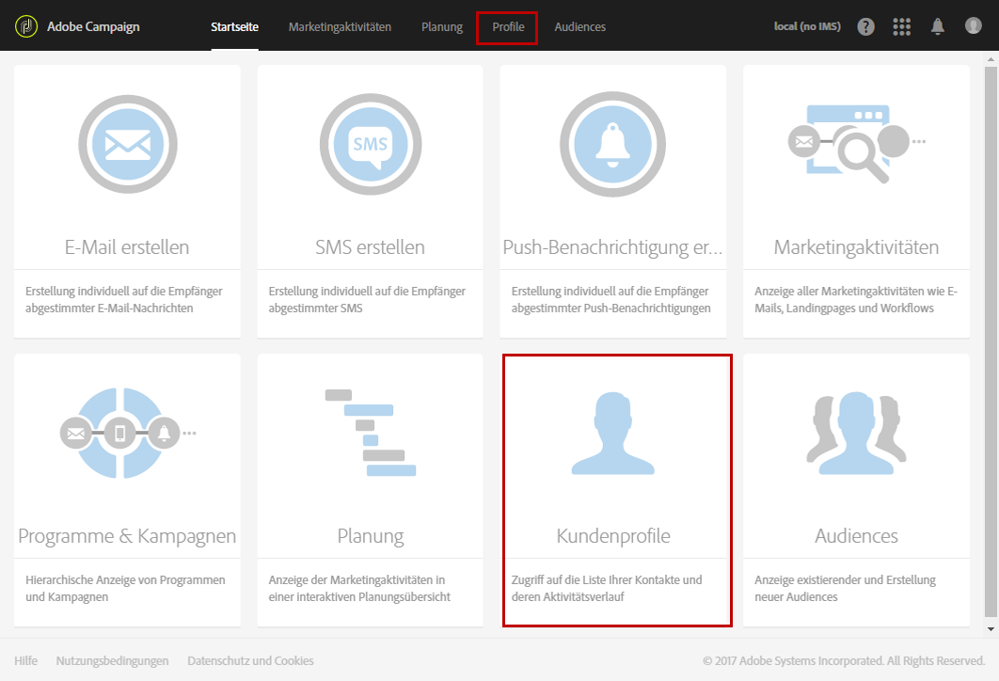
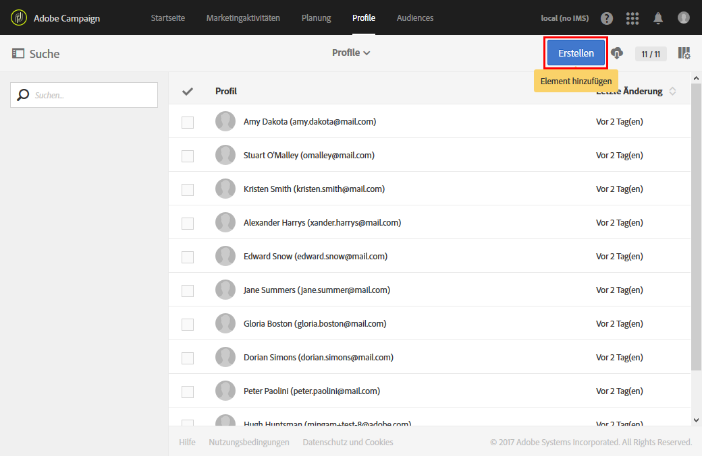
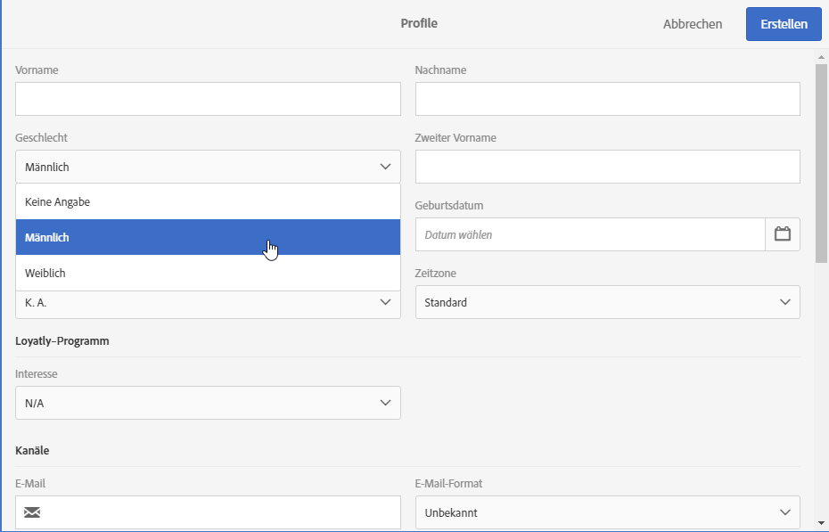

# Profile erstellen{#creating-profiles}

In Adobe Campaign dienen Profile standardmäßig der Bestimmung der Hauptzielgruppe einer Marketingkommunikation.

>[!NOTE]
>
>Die Erstellung von Profilen ist auch mithilfe der Adobe Campaign Standard API möglich. Weiterführende Informationen finden Sie im [entsprechenden Handbuch](../../api/using/creating-profiles-api.md).

 [Erfahren Sie im Video, wie man Profile mit einem Workflow importiert](#video)

Ein Profil kann in Campaign folgendermaßen erstellt oder aktualisiert werden:

* Import einer Profilliste von einer Datei über einen [Workflow](../../automating/using/creating-import-workflow-templates.md)
* Datenerhebung online über [Landingpages](../../channels/using/getting-started-with-landing-pages.md)
* Im Bulk-Modus über die [REST-API](../../api/using/get-started-apis.md)
* Synchronisieren von Profilen in [Microsoft Dynamics](../../integrating/using/d365-acs-get-started.md)
* Geben Sie Daten wie unten beschrieben über die Benutzeroberfläche ein

Hier ist ein Beispiel dafür, wie Sie ein neues Profil direkt in der Benutzeroberfläche erstellen können. Gehen Sie dazu folgendermaßen vor:

1. Öffnen Sie auf der Adobe Campaign-Startseite die Karte **Kundenprofile** oder den Tab **Profile**, um die Profilliste aufzurufen.

   

1. Wählen Sie **[!UICONTROL Erstellen]** aus.

   

1. Machen Sie die erforderlichen Angaben zum Profil.

   

   * Die Kontaktinformationen, darunter Vorname, Nachname, Geschlecht, Geburtsdatum, Foto oder bevorzugte Sprache (für [mehrsprachige E-Mails](../../channels/using/creating-a-multilingual-email.md)), ermöglichen eine stärkere Personalisierung von Nachrichten.
   * Die Angabe zur **[!UICONTROL Zeitzone]** wird verwendet, um den Versand auf die Zeitzone des Profils abzustimmen. Weiterführende Informationen hierzu finden Sie in diesem [Abschnitt](../../sending/using/sending-messages-at-the-recipient-s-time-zone.md).
   * In der Kategorie **[!UICONTROL Kanäle]** sind die E-Mail-Adresse, Mobiltelefonnummer und Opt-out-Informationen aufgeführt. Hier lässt sich ermitteln, über welche Kanäle Sie das Profil erreichen können.

     >[!NOTE]
     > Mobiltelefonnummern müssen in der Profiltabelle immer im internationalen Format (`+<country><number>`) angegeben werden.

   * Die Informationen in der Kategorie **[!UICONTROL Nicht mehr kontaktieren]** werden aktualisiert, sobald sich das Profil von einem Kanal abmeldet.
   * In der Kategorie **[!UICONTROL Adresse]** wird die Anschrift festgehalten. Diese muss ausgefüllt und die Option **[!UICONTROL Anschrift angegeben]** aktiviert sein, wenn [Briefpost](../../channels/using/about-direct-mail.md) an dieses Profil versendet werden soll. Ist die Option **[!UICONTROL Anschrift angegeben]** nicht aktiviert, wird dieses Profil vom Briefpostversand ausgeschlossen.
   * In der Kategorie **[!UICONTROL Zugriffsberechtigung]** sind die Organisationseinheiten des Profils festgehalten, um die [Berechtigungen zu verwalten](../../administration/using/about-access-management.md). Informationen zum Hinzufügen der Organisationsfelder zu Profilen finden Sie im Abschnitt [Profile partitionieren](../../administration/using/organizational-units.md#partitioning-profiles).
   * In der Kategorie **[!UICONTROL Rückverfolgung]** werden automatisch Informationen zu dem Benutzer aktualisiert, der das Profil erstellt oder geändert hat.

1. Speichern Sie das Profil mithilfe der Schaltfläche **[!UICONTROL Erstellen]**.

Das Profil wurde der Liste hinzugefügt.

>[!NOTE]
>Das Feld &quot;Bevorzugte Sprache&quot; wird verwendet, um beim Versand mehrsprachiger Nachrichten die Sprache auszuwählen. Weiterführende Informationen zu mehrsprachigen Nachrichten [finden Sie auf dieser Seite](../../channels/using/creating-a-multilingual-email.md).

## Anleitungsvideo {#video}

In diesem Video wird gezeigt, wie man Profile mit einem Workflow importiert.

>[!VIDEO](https://video.tv.adobe.com/v/24993?quality=12)

Weitere Anleitungsvideos zu Campaign Standard finden Sie [hier](https://experienceleague.adobe.com/docs/campaign-standard-learn/tutorials/overview.html?lang=de).
