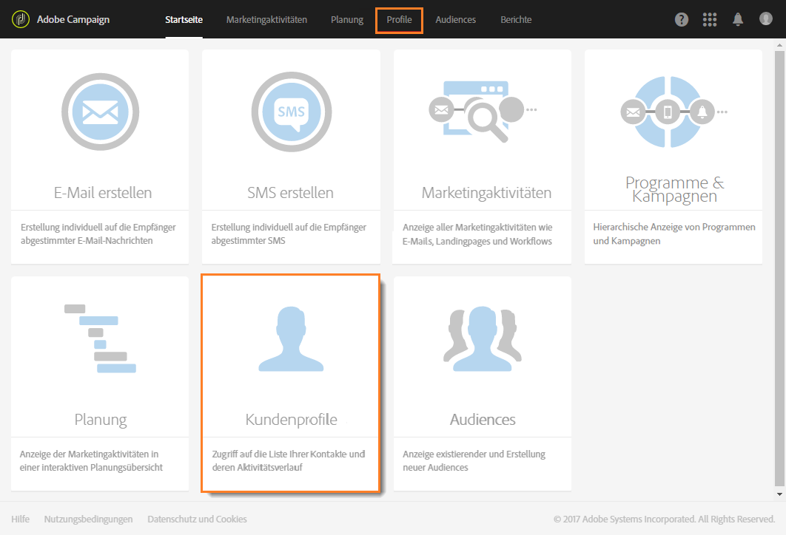

# Profile erstellen{#creating-profiles}

In Adobe Campaign dienen Profile standardmäßig der Bestimmung der Hauptzielgruppe einer Marketingkommunikation.

Ein Profil kann in Campaign folgendermaßen erstellt oder aktualisiert werden:

* Import einer Profilliste von einer Datei über einen [Workflow](https://helpx.adobe.com/campaign/kt/acs/using/acs-importing-profiles-feature-video-using.html)
* Datenerhebung online über [Landingpages](../../channels/using/about-landing-pages.md)
* Im Bulk-Modus über die [REST-API](http://docs.campaign.adobe.com/doc/standard/en/api/ACS_API.html)
* Profile von [Microsoft Dynamics synchronisieren](https://helpx.adobe.com/campaign/kb/acs-ms-dynamics.html)
* Direkte Dateneingabe über die Benutzeroberfläche, wie unten beschrieben

Hier ist ein Beispiel dafür, wie Sie ein neues Profil direkt in der Benutzeroberfläche erstellen können. Gehen Sie dazu folgendermaßen vor:

1. Öffnen Sie auf der Adobe-Campaign-Startseite die Karte **Kundenprofile** oder den Tab **Profile**, um die Profilliste aufzurufen.

   

1. Wählen Sie dann **[!UICONTROL Erstellen aus]**.

   

1. Machen Sie die erforderlichen Angaben zum Profil.

   

   * Die Kontaktinformationen, darunter Vorname, Nachname, Geschlecht, Geburtsdatum, Foto oder bevorzugte Sprache (für [mehrsprachige E-Mails](../../channels/using/creating-a-multilingual-email.md)), ermöglichen eine stärkere Personalisierung von Nachrichten.
   * Die Angabe zur **[!UICONTROL Zeitzone]** wird verwendet, um den Versand auf die Zeitzone des Profils abzustimmen. Weiterführende Informationen hierzu finden Sie in diesem [Abschnitt](../../sending/using/sending-messages-at-the-recipient-s-time-zone.md).
   * In der Kategorie **[!UICONTROL Kanäle]** sind die E-Mail-Adresse, Mobiltelefonnummer und Opt-out-Informationen aufgeführt. Hierüber können Sie feststellen, über welche Kanäle Sie das Profil ansprechen können.
   * Die Informationen in der Kategorie **[!UICONTROL Nicht mehr kontaktieren]** werden aktualisiert, sobald sich das Profil von einem Kanal abmeldet.
   * In der Kategorie **[!UICONTROL Adresse]** wird die Anschrift festgehalten. Diese muss ausgefüllt und die Option **[!UICONTROL Anschrift angegeben]** aktiviert sein, wenn [Briefpost](../../channels/using/about-direct-mail.md) an dieses Profil versendet werden soll. Ist die Option **[!UICONTROL Anschrift angegeben]** nicht aktiviert, wird dieses Profil vom Briefpostversand ausgeschlossen.
   * In der Kategorie **[!UICONTROL Zugriffsberechtigung]** sind die Organisationseinheiten des Profils festgehalten (zur [Verwaltung von Berechtigungen](../../administration/using/about-access-management.md)). Siehe auch [Profile partitionieren](../../administration/using/organizational-units.md#partitioning-profiles).
   * In der Kategorie **[!UICONTROL Rückverfolgung]** werden automatisch Informationen zu dem Benutzer aktualisiert, der das Profil erstellt oder geändert hat.

1. Speichern Sie das Profil mithilfe der Schaltfläche **[!UICONTROL Erstellen]**.

Das Profil wurde der Liste hinzugefügt.

>[!NOTE]
>
>Die Erstellung von Profilen ist auch mithilfe der Adobe Campaign Standard API möglich. Weiterführende Informationen finden Sie im [entsprechenden Handbuch](https://final-docs.campaign.adobe.com/doc/standard/en/api/ACS_API.html#creating-profiles).

Profile können nach Organisationseinheiten partitioniert werden. Informationen zum Hinzufügen der Organisationsfelder zu Profilen finden Sie im Abschnitt [Profile partitionieren](../../administration/using/organizational-units.md#partitioning-profiles).

>[!NOTE]
>
>Das Feld "Bevorzugte Sprache" wird verwendet, um beim Versand mehrsprachiger Nachrichten die Sprache auszuwählen. Weiterführende Informationen zu mehrsprachigen Nachrichten [finden Sie auf dieser Seite](../../channels/using/creating-a-multilingual-email.md).

**Verwandte Themen:**

* [Anleitung zu Einstiegsseiten](../../channels/using/about-landing-pages.md)
* [Profilimport](https://helpx.adobe.com/campaign/kt/acs/using/acs-importing-profiles-feature-video-using.html)

