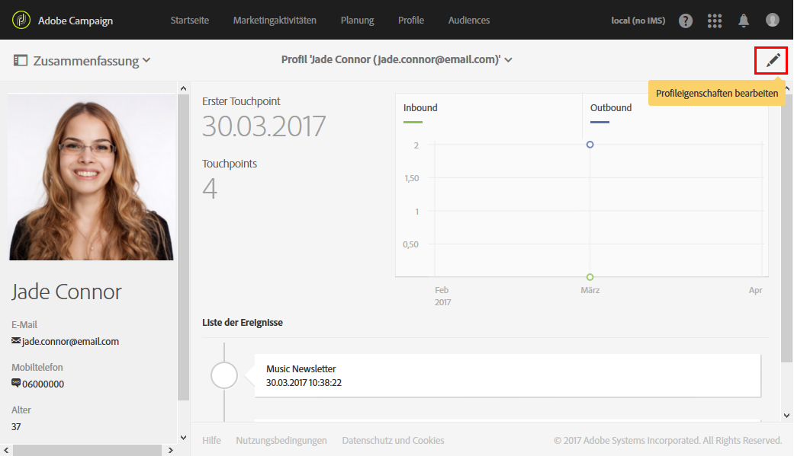
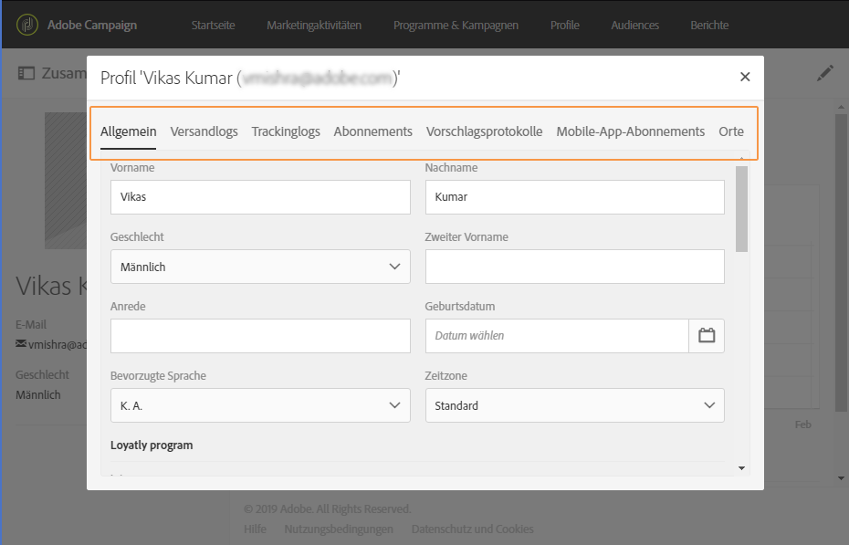

# Profile bearbeiten{#editing-profiles}

## Auf Profileigenschaften zugreifen {#accessing-profile-properties}

Gehen Sie wie folgt vor, um ein bereits existierendes Profil zu bearbeiten bzw. seine Daten einzusehen, oder es zu ändern:

1. Öffnen Sie auf der Adobe Campaign-Startseite die Karte **[!UICONTROL Kundenprofile]** oder den Tab **[!UICONTROL Profile]**.
1. Wählen Sie einen Kontakt aus.
1. Greifen Sie über das Symbol **[!UICONTROL Profileigenschaften bearbeiten]** auf die Profilinformationen zu.

   

   Das Fenster der Profileigenschaften enthält mehrere Tabs, mit denen auf alle Profilinformationen zugegriffen werden kann:

   Je nach benutzerdefinierten Ressourcen, die in Adobe Campaign erstellt oder erweitert wurden, stehen mitunter weitere Tabs zur Verfügung. Weiterführende Informationen zu benutzerdefinierten Ressourcen finden Sie in [Über benutzerdefinierte Ressourcen](../../developing/using/data-model-concepts.md).

   >[!NOTE]
   >
   >Mit Ausnahme des Bereichs **[!UICONTROL Rückverfolgung]** können Sie nur die Informationen im Tab **[!UICONTROL Allgemein]** ändern.

Die Bearbeitung von Profilen ist auch mit der Adobe Campaign Standard API möglich. Weiterführende Informationen finden Sie in der [entsprechenden Dokumentation](../../api/using/updating-profiles.md).

Verwandtes Thema:

* [Integriertes Kundenprofil](../../audiences/using/integrated-customer-profile.md)
* [In der Zeitzone des Empfängers senden](../../sending/using/sending-messages-at-the-recipient-s-time-zone.md)

## Allgemeine Profildaten {#general-profile-data}

Der Tab **[!UICONTROL Allgemein]** enthält die folgenden Informationen zum Profil:

* Kontaktinformationen wie Vorname, Nachname, Geburtsdatum, Foto, bevorzugte Sprache (für [mehrsprachige E-Mails](../../channels/using/creating-a-multilingual-email.md)) usw. des Empfängers.
* Kanäle, über die das Profil kontaktiert werden kann, d. h. E-Mail-Adresse, Mobiltelefonnummer und zugehörige Opt-out-Informationen.
* Anschrift (für [Briefpost](../../channels/using/about-direct-mail.md)) und die Zeitzone des Kontakts (um [Nachrichten in seiner Zeitzone zu terminieren](../../sending/using/sending-messages-at-the-recipient-s-time-zone.md)).
* Zugriffsberechtigung, in der die Organisationseinheit des Empfängers festgehalten ist (zur [Verwaltung von Berechtigungen](../../administration/using/about-access-management.md)). Siehe auch [Profile partitionieren](../../administration/using/organizational-units.md#partitioning-profiles).

## Versand- und Trackinglogs      {#sending-and-tracking-logs}

In den Tabs **[!UICONTROL Versandlogs]** und **[!UICONTROL Trackinglogs]** sind alle Sendungen an das Profil sowie alle zugehörigen Trackingdaten enthalten.

Weiterführende Informationen zu Versand- und Trackinglogs finden Sie in den Abschnitten [Versandlogs](../../sending/using/monitoring-a-delivery.md#delivery-logs) und [Nachrichten tracken](../../sending/using/tracking-messages.md).

## Abonnements      {#subscriptions}

Die Abonnements des Kontakts werden im entsprechenden Tab aufgeführt. Weiterführende Informationen zum Abonnement eines Dienstes finden Sie in [diesem Abschnitt](../../audiences/using/about-subscriptions.md).

Der Tab **[!UICONTROL Mobile-App-Abonnements]** bezieht sich auf Push-Benachrichtigungen. Weiterführende Informationen hierzu finden Sie im Kanal [Push-Benachrichtigung](../../channels/using/about-push-notifications.md).
