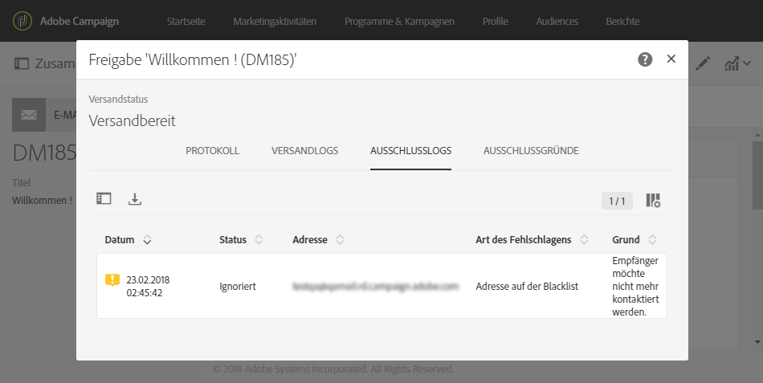

# Identifizieren von Opt-out-Profilen bei einem Versand{#identifying-opt-out-profiles-for-a-delivery}

Profile, die über die Opt-out-Funktion von einem bestimmten Versand ausgeschlossen sind, werden nach der Vorbereitungsphase im Versand-Dashboard im Tab **[!UICONTROL Ausschlusslogs]aufgeführt.**

**Verwandte Themen:**

* [Sendungen beobachten](../../sending/using/monitoring-a-delivery.md#exclusion-logs).
* [Versandvorbereitung](../../sending/using/preparing-the-send.md).

