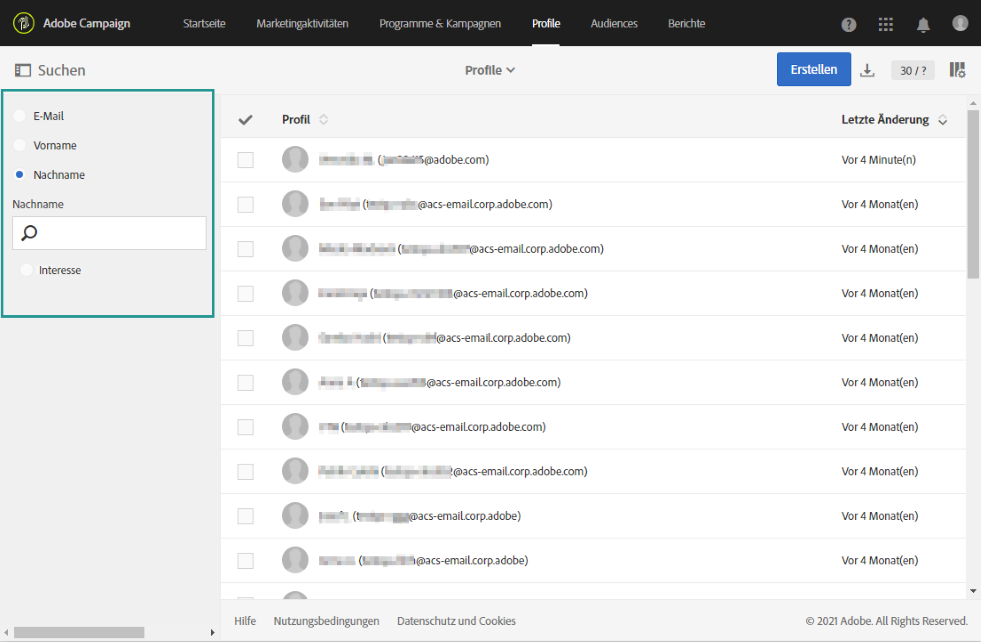
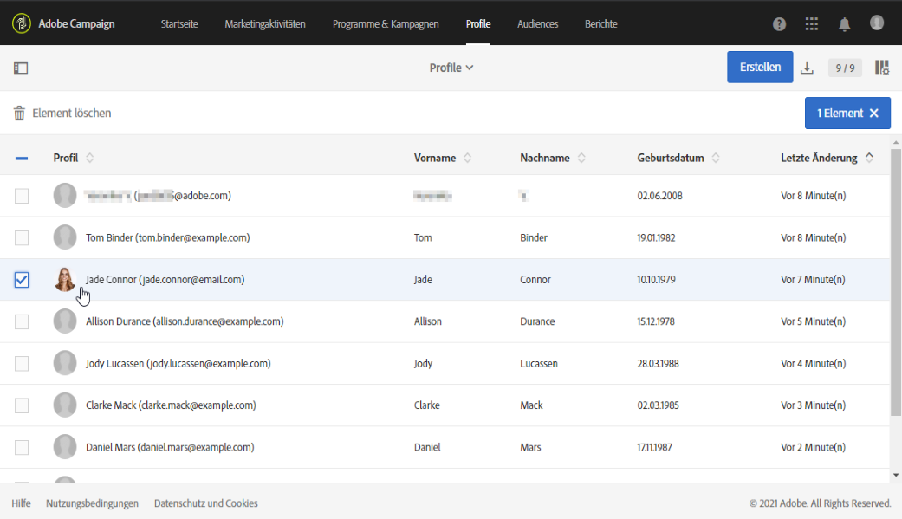
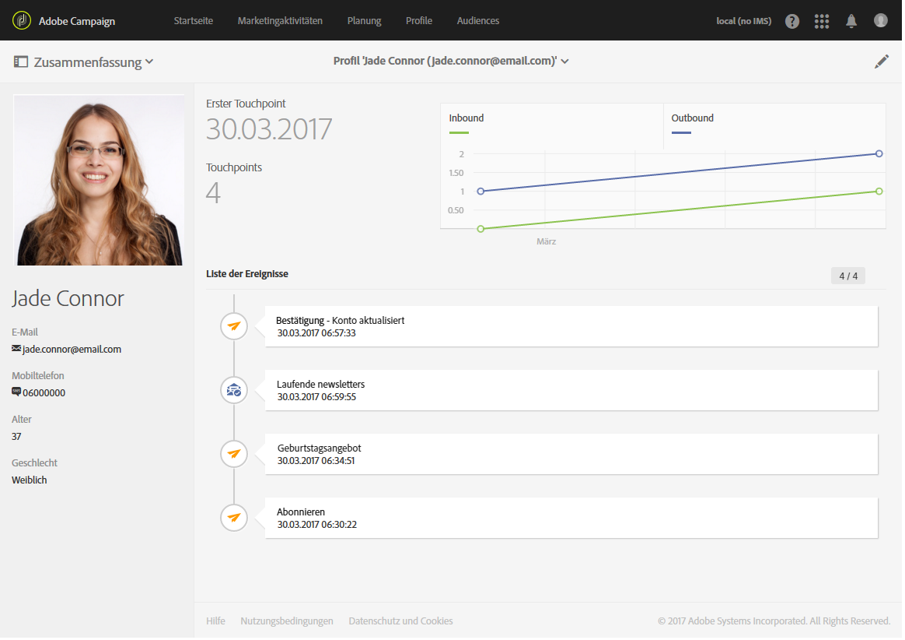

# Integriertes Kundenprofil{#integrated-customer-profile}

Für jeden Kontakt in Ihrer Datenbank ist ein integriertes Kundenprofil verfügbar. In diesem Marketing-Verlauf finden Sie die wichtigsten Marketing-Informationen zu einem Kundenkontakt in einer einzigen Ansicht zusammengefasst. Somit haben Sie von einer zentralen Stelle aus Zugriff auf alle Online-Verhaltensdaten: Kontaktinformationen, erhaltene E-Mails, Trackinglogs, An- und Abmeldungen etc.

Um auf das integrierte Kundenprofil zuzugreifen, gehen Sie folgendermaßen vor:

1. Öffnen Sie auf der Adobe Campaign-Startseite die Karte **[!UICONTROL Kundenprofile]** oder den Tab **Profile**, um die Profilliste anzuzeigen.

1. Um ein Profil anhand eines bestimmten Felds zu suchen, öffnen Sie den Suchbereich und wählen Sie das Feld aus, in dem Sie die Suche durchführen möchten.

   

1. Geben Sie den zu suchenden Wert an und drücken Sie dann die Eingabetaste.

   >[!NOTE]
   >
   >Beachten Sie, dass Suchvorgänge basierend auf den Feldern &quot;E-Mail&quot;, &quot;Vorname&quot; und &quot;Nachname&quot; sowie auf benutzerdefinierten Feldern durchgeführt werden können, die beim Erweitern der Ressource hinzugefügt wurden.
   >
   >Bei der Suche wird zwischen Groß- und Kleinschreibung unterschieden, und es wird nur nach Präfixen gesucht. Sie können beispielsweise nicht anhand der letzten Buchstaben des Nachnamens nach einem Profil suchen.

1. Wählen Sie einen Kontakt aus, um sein Profil zu öffnen.

   

Sie werden zum **Marketing-Verlauf** des Profils weitergeleitet.

Auf dieser Seite werden Schlüsselinformationen zum Profil sowie die Liste der Ereignisse erfasst.

Klicken Sie auf ein Ereignis in der Liste, um es zu öffnen. Dort können Sie auf die gesendeten Nachrichten oder die vom Profil abonnierten Dienste zugreifen.

>[!NOTE]
>
>Der Marketing-Verlauf kann auch über die Adobe Campaign Standard API aufgerufen werden. Weiterführende Informationen finden Sie in der [entsprechenden Dokumentation](../../api/using/interacting-with-marketing-history.md).
