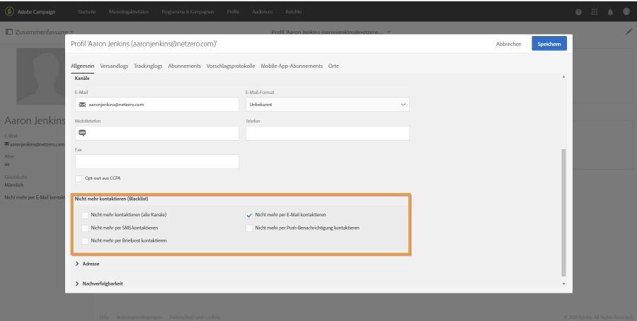
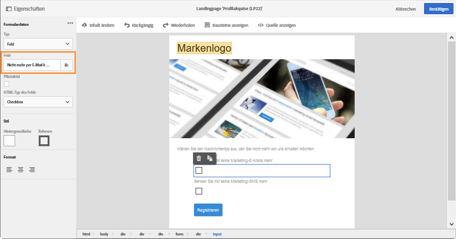
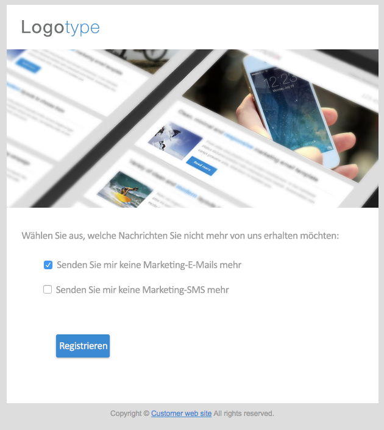
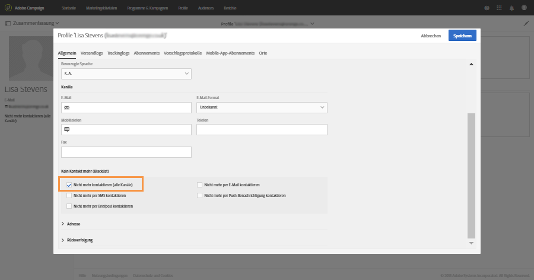

# Opt-in- und Opt-out-Verfahren in Campaign verwalten{#managing-opt-in-and-opt-out-in-campaign}

## Opt-in- und Opt-out-Verfahren in einem Profil verwalten {#managing-opt-in-and-opt-out-from-a-profile}

Ein Empfänger kann von einem Benutzer direkt im Profil-Tab **[!UICONTROL Allgemein]** an- oder abgemeldet werden.

Die aktivierten Optionen im Bereich **[!UICONTROL Nicht mehr kontaktieren (auf Blockierungsliste)]** entsprechen den Kanälen, von denen sich der Empfänger abgemeldet hat. Wählen Sie die Kanäle entsprechend den Anforderungen des Empfängers aus.

## Opt-in- und Opt-out-Landingpages einrichten        {#setting-up-opt-in-and-opt-out-landing-pages}

Um Empfängern die Möglichkeit zu geben, sich an- oder abzumelden, müssen Sie eine **[!UICONTROL Profilakquise]**-Landingpage erstellen und veröffentlichen. Empfänger können dann entsprechend ihren Anforderungen die gewünschten Kanäle auswählen. Gehen Sie dazu wie folgt vor:

Sie können auch eine Landingpage vom Typ **[!UICONTROL Blockierungsliste]** einrichten, über die sich Empfänger von allen Sendungen abmelden können. Weiterführende Informationen dazu finden Sie im Abschnitt [Landingpage zur Abmeldung von allen Sendungen einrichten](#setting-up-a-landing-page-to-opt-out-from-all-deliveries).

>[!NOTE]
>
>Landingpages können auch verwendet werden, um die Anmeldung zu Diensten zu ermöglichen. Weiterführende Informationen hierzu finden Sie auf dieser [Seite](../../channels/using/configuring-landing-page.md#linking-a-landing-page-to-a-service).

1. Erstellen Sie eine **[!UICONTROL Profilakquise]**-Landingpage (siehe [diesen Abschnitt](../../channels/using/getting-started-with-landing-pages.md)).
1. Fügen Sie zum Inhalt der Landingpage für jeden gewünschten Kanal ein Kontrollkästchen hinzu und verknüpfen Sie es dann mit dem entsprechenden Feld in der Campaign-Datenbank.

   

1. Speichern Sie die Landingpage und veröffentlichen Sie sie.
1. Die Kontrollkästchen in der Landingpage sind bereits entsprechend dem Profil-Tab **[!UICONTROL Allgemein]** markiert. Der Benutzer kann die Kanäle entsprechend seinen Anforderungen beliebig auswählen oder löschen und das Formular absenden.

   

1. Nachdem das Formular gesendet wurde, wird die Registerkarte **[!UICONTROL Allgemein]** des Profils gemäß der Auswahl des Empfängers aktualisiert.

   

### Landingpage zum Opt-out von allen Sendungen einrichten {#setting-up-a-landing-page-to-opt-out-from-all-deliveries}

Um Empfängern die Möglichkeit zu geben, sich aus allen Sendungen ausschließen zu lassen (Opt-out), müssen Sie eine Landingpage vom Typ **[!UICONTROL Blockierungsliste]** erstellen und veröffentlichen. Weiterführende Informationen zur Landingpage-Erstellung finden Sie auf [dieser Seite](../../channels/using/getting-started-with-landing-pages.md).

Sobald ein Empfänger den Link in der Landingpage auswählt, wird automatisch die Option **[!UICONTROL Nicht mehr kontaktieren (alle Kanäle)]** im Profil des Empfängers aktiviert.

